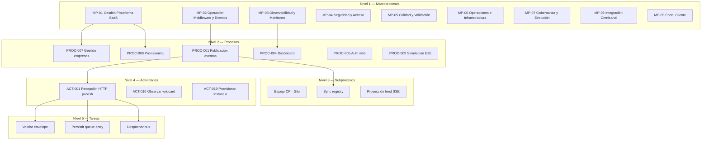
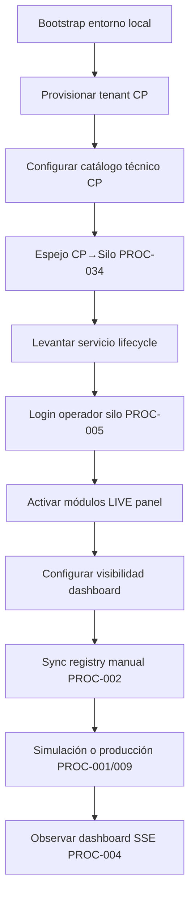
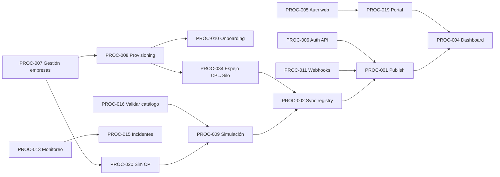

# Mapa General de Procesos — Plataforma Omnichannel DDD + EDA

**Versión:** 1.0  
**Fecha:** 2026-06-27  
**Alcance:** Todos los procesos documentados en `docs/` con trazabilidad a evidencia existente.

---

## Visión general

La plataforma es un **middleware de integración omnicanal** con arquitectura **DDD + EDA**, compuesta por:

- **Control Plane SaaS** (`:8000`): gobierno de empresas, provisioning, planes, catálogo técnico y simulaciones.
- **Silos por cliente** (`:8001+`): instancia Laravel dedicada con BD SQLite/MySQL, middleware, dashboard e integraciones.
- **Capas de soporte**: observabilidad, seguridad, calidad, operaciones e infraestructura.

El sistema **no implementa dominios retail** (Inventario, Pedidos, Clientes) en el core; estos existen como **contextos documentales de referencia** para integradores externos. El core se limita a middleware agnóstico, dashboard observacional y control plane.

**Evidencia base:** `docs/architecture/Architecture_Blueprint.md`, `docs/Patente/matriz_generada/procesos.csv`, `docs/refactorizacion_Informes/Certificacion_Flujo_Operativo_Oficial.md`.

---

## Jerarquía de procesos (5 niveles)

---

## Catálogo de macroprocesos

| ID | Macroproceso | Categorías | Procesos hijos | Criticidad | Prioridad |
|----|--------------|------------|----------------|------------|-----------|
| MP-01 | Gestión Plataforma SaaS | Estratégico, Administrativo, Operativo | PROC-007, 008, 010, 015, 020, 034 | Alta | P0 |
| MP-02 | Operación Middleware y Eventos | Operativo, Técnico, Funcional | PROC-001, 002, 003, 017 | Crítica | P0 |
| MP-03 | Observabilidad y Monitoreo | Observabilidad, Técnico | PROC-004, 013 | Alta | P0 |
| MP-04 | Seguridad y Acceso | Seguridad, Técnico | PROC-005, 006 | Crítica | P0 |
| MP-05 | Calidad y Validación | Calidad, Técnico | PROC-009, 016 | Alta | P1 |
| MP-06 | Operaciones e Infraestructura | Operación, Técnico, Apoyo | PROC-014, 030, 031, 032 | Alta | P1 |
| MP-07 | Gobernanza y Evolución | Gobernanza, Calidad, Evolución Continua, IA | PROC-033 | Media | P2 |
| MP-08 | Integración Omnicanal | Integración, Operativo | PROC-011, 012, 017 | Alta | P1 |
| MP-09 | Portal Cliente | Funcional, Operativo | PROC-019 | Alta | P0 |

---

## Catálogo completo de procesos (PROC-001 → PROC-034)

| ID | Proceso | Tipo | Categorías | Estado | Documento |
|----|---------|------|------------|--------|-----------|
| PROC-001 | Publicación de eventos al bus | Técnico | Operativo, Middleware, Funcional | Implementado | [10_Proceso_Publicacion_Eventos_Bus.md](10_Proceso_Publicacion_Eventos_Bus.md) |
| PROC-002 | Sincronización catálogo → registry | Técnico | Operativo, Middleware | Implementado | [11_Proceso_Sincronizacion_Catalogo_Registry.md](11_Proceso_Sincronizacion_Catalogo_Registry.md) |
| PROC-003 | Consulta operativa del bus | Técnico | Operativo, Middleware, Observabilidad | Implementado | [12_Proceso_Consulta_Operativa_Bus.md](12_Proceso_Consulta_Operativa_Bus.md) |
| PROC-004 | Observabilidad dashboard | Técnico | Observabilidad, Funcional | Implementado | [13_Proceso_Observabilidad_Dashboard.md](13_Proceso_Observabilidad_Dashboard.md) |
| PROC-005 | Autenticación operadores web | Técnico | Seguridad, Administrativo | Implementado | [14_Proceso_Autenticacion_Operadores_Web.md](14_Proceso_Autenticacion_Operadores_Web.md) |
| PROC-006 | Autenticación API integradores | Técnico | Seguridad, Integración | Implementado | [15_Proceso_Autenticacion_API_Integradores.md](15_Proceso_Autenticacion_API_Integradores.md) |
| PROC-007 | Gestión empresas control plane | Negocio | Estratégico, Administrativo | Implementado | [16_Proceso_Gestion_Empresas_Control_Plane.md](16_Proceso_Gestion_Empresas_Control_Plane.md) |
| PROC-008 | Provisioning nueva instancia | Negocio | Estratégico, Operativo | Parcial | [17_Proceso_Provisioning_Nueva_Instancia.md](17_Proceso_Provisioning_Nueva_Instancia.md) |
| PROC-009 | Simulación cliente E2E | Técnico | Calidad, Operativo | Implementado | [18_Proceso_Simulacion_Cliente_E2E.md](18_Proceso_Simulacion_Cliente_E2E.md) |
| PROC-010 | Onboarding instancia por cliente | Negocio | Operativo, Administrativo | Implementado | [19_Proceso_Onboarding_Instancia_Cliente.md](19_Proceso_Onboarding_Instancia_Cliente.md) |
| PROC-011 | Ingress webhooks integraciones | Técnico | Integración, Operativo | Parcial | [20_Proceso_Ingress_Webhooks_Integraciones.md](20_Proceso_Ingress_Webhooks_Integraciones.md) |
| PROC-012 | Gestión canales e integraciones | Técnico | Integración, Administrativo | Implementado | [21_Proceso_Gestion_Canales_Integraciones.md](21_Proceso_Gestion_Canales_Integraciones.md) |
| PROC-013 | Monitoreo y alertas plataforma | Técnico | Observabilidad, Operación | Implementado | [22_Proceso_Monitoreo_Alertas_Plataforma.md](22_Proceso_Monitoreo_Alertas_Plataforma.md) |
| PROC-014 | Retención y purga datos | Técnico | Operación, Apoyo | Implementado | [23_Proceso_Retencion_Purga_Datos.md](23_Proceso_Retencion_Purga_Datos.md) |
| PROC-015 | Gestión incidentes soporte | Negocio | Apoyo, Administrativo | Implementado | [24_Proceso_Gestion_Incidentes_Soporte.md](24_Proceso_Gestion_Incidentes_Soporte.md) |
| PROC-016 | Validación catálogo CI | Técnico | Calidad, Gobernanza | Implementado | [25_Proceso_Validacion_Catalogo_CI.md](25_Proceso_Validacion_Catalogo_CI.md) |
| PROC-017 | Flujo middleware 5 etapas (doc) | Documental | Funcional, Integración | No completo | [26_Proceso_Flujo_Middleware_5_Etapas.md](26_Proceso_Flujo_Middleware_5_Etapas.md) |
| PROC-018 | Multi-tenancy lógico Fase 3 | Documental | Estratégico, Gobernanza | Diferido | [27_Proceso_Multi_Tenancy_Logico_Fase3.md](27_Proceso_Multi_Tenancy_Logico_Fase3.md) |
| PROC-019 | Portal instancia cliente web | Negocio | Funcional, Operativo | Implementado | [28_Proceso_Portal_Instancia_Cliente.md](28_Proceso_Portal_Instancia_Cliente.md) |
| PROC-020 | Simulación desde control plane | Técnico | Calidad, Administrativo | Implementado | [29_Proceso_Simulacion_Desde_Control_Plane.md](29_Proceso_Simulacion_Desde_Control_Plane.md) |
| PROC-030 | Despliegue producción VM | Técnico | Operación, Apoyo | Documentado | [30_Proceso_Despliegue_Produccion_VM.md](30_Proceso_Despliegue_Produccion_VM.md) |
| PROC-031 | Backup y restauración | Técnico | Operación, Apoyo | Documentado | [31_Proceso_Backup_Restauracion.md](31_Proceso_Backup_Restauracion.md) |
| PROC-032 | DR Drill | Técnico | Operación, Gobernanza | Documentado | [32_Proceso_DR_Drill.md](32_Proceso_DR_Drill.md) |
| PROC-033 | Evaluación aceptación middleware | Gobernanza | Calidad, Gobernanza, Evolución | Documentado | [33_Proceso_Evaluacion_Aceptacion_Middleware.md](33_Proceso_Evaluacion_Aceptacion_Middleware.md) |
| PROC-034 | Espejo catálogo CP→Silo | Técnico | Operativo, Integración | Implementado | [34_Proceso_Espejo_Catalogo_CP_Silo.md](34_Proceso_Espejo_Catalogo_CP_Silo.md) |

---

## Clasificación por categoría

| Categoría | Procesos |
|-----------|----------|
| **Macroprocesos** | MP-01 … MP-09 |
| **Estratégicos** | PROC-007, 008, 018 |
| **Operativos** | PROC-001, 002, 003, 004, 008, 009, 010, 011, 019, 034 |
| **Funcionales** | PROC-001, 004, 017, 019 |
| **Apoyo** | PROC-014, 015, 030, 031, 032 |
| **Técnicos** | PROC-001–006, 009, 011–014, 016, 020, 030–034 |
| **Administrativos** | PROC-005, 007, 010, 012, 015, 020 |
| **Integración** | PROC-006, 011, 012, 017, 034 |
| **Gobernanza** | PROC-016, 018, 033 |
| **Calidad** | PROC-009, 016, 033 |
| **Seguridad** | PROC-005, 006 |
| **Observabilidad** | PROC-003, 004, 013 |
| **IA** | PROC-033 (matriz IA C21–C23) |
| **Evolución Continua** | PROC-033, brechas en `evaluation/11_Matriz_Evolucion.csv` |

---

## Flujo end-to-end operativo certificado

Flujo oficial validado en `docs/refactorizacion_Informes/Certificacion_Flujo_Operativo_Oficial.md`:

---

## Dependencias entre procesos

---

## Actores del sistema

| Actor | Rol | Procesos principales |
|-------|-----|---------------------|
| Admin SaaS | Gobierno plataforma | PROC-007, 008, 020 |
| Operador SaaS | Operación CP | PROC-005, 007 |
| Operador tenant / cliente | Portal instancia | PROC-005, 019, 004 |
| Integrador API / M2M | Publicación y consulta bus | PROC-001, 003, 006 |
| Canal externo | Webhooks POS/ERP/e-commerce | PROC-011 |
| Admin integraciones | CRUD canales | PROC-012 |
| Ops / Scheduler | Tareas programadas | PROC-013, 014, 030–032 |
| CI / Desarrollador | Validación y pruebas | PROC-009, 016, 033 |
| Soporte SaaS | Incidentes | PROC-015 |
| Arquitectura | Decisiones diferidas | PROC-017, 018 |

---

## Bounded contexts y módulos

| Contexto | Tipo | Módulo `app/` | Procesos |
|----------|------|---------------|----------|
| Middleware | Soporte | `Middleware/` | PROC-001, 002, 003, 017 |
| Dashboard | Soporte | `Dashboard/` | PROC-004 |
| Control | Administración | `Control/` | PROC-007, 008, 015, 020, 034 |
| Integration | Integración | `Integration/` | PROC-011, 012 |
| Observability | Soporte | `Observability/` | PROC-013 |
| Monitoring | Soporte | `Monitoring/` | PROC-013 |
| Shared/Http | Infraestructura | `Shared/`, `Http/` | PROC-005, 006 |
| Console | Ops | `Console/` | PROC-009, 010, 014, 016 |
| Inventario, Pedidos, Clientes… | Core (externo/doc) | No en core | PROC-017 (referencia) |

---

## Prioridad y criticidad

| Prioridad | Procesos | Justificación |
|-----------|----------|---------------|
| **P0 — Crítico** | PROC-001, 004, 005, 006, 007, 008, 019, 034 | Sin estos no opera la plataforma |
| **P1 — Alto** | PROC-002, 003, 009, 011, 012, 013, 016 | Operación diaria y calidad |
| **P2 — Medio** | PROC-014, 015, 020, 030–033 | Mantenimiento y gobernanza |
| **P3 — Bajo/Diferido** | PROC-017, 018 | Documental o Fase 3 |

---

## Brechas documentadas (sin proceso BPMN completo)

| Funcionalidad documentada | Estado | Brecha |
|---------------------------|--------|--------|
| Pipeline 5 etapas middleware retail | Documental | PROC-017; implementación real es 2 etapas (REQ-FLOW-01) |
| Multi-tenancy lógico con RLS | Diferido ADR-001 Fase 3 | PROC-018 |
| OAuth2/SSO enterprise | Diferido ADR-002/003 | Gateway ACT-029 en PROC-005 |
| Sagas y compensación | Diferido ADR-006 | Sin proceso propio |
| Config dinámica sin redeploy | No cumple REQ-DYN-01 | Sin proceso operativo |
| Dominios retail (Inventario, Pedidos…) | Solo referencia | Consumidores externos, no procesos internos |
| WebSockets tiempo real | No implementado | SSE cubre contrato (Certificación §Limitaciones) |
| Matriz control versiones BPMN | Referenciada HIST-024 | Archivo ausente en workspace |

Ver detalle en [99_Validacion_Brechas.md](99_Validacion_Brechas.md).

---

## Documentación relacionada

- [Matriz_Trazabilidad_BPMN.md](Matriz_Trazabilidad_BPMN.md)
- [docs/Patente/matriz_generada/procesos.csv](../Patente/matriz_generada/procesos.csv)
- [docs/architecture/Architecture_Blueprint.md](../architecture/Architecture_Blueprint.md)
- [docs/evaluation/README_Evaluacion.md](../evaluation/README_Evaluacion.md)
