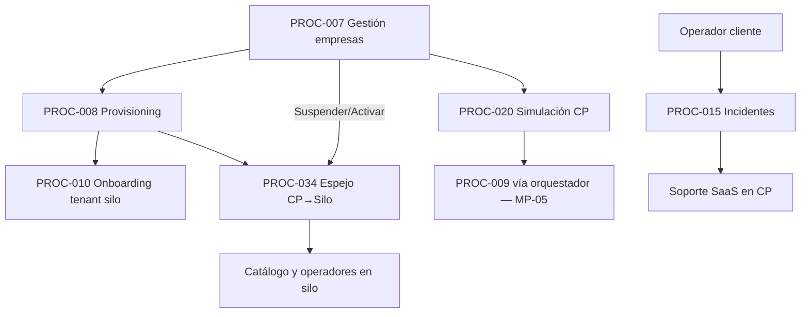
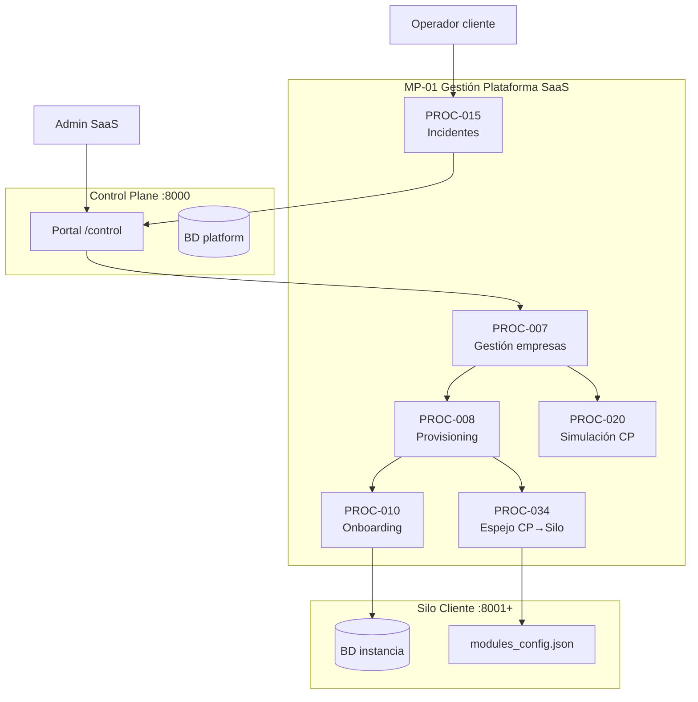

# MP-01 — Macroproceso: Gestión Plataforma SaaS

**ID:** MP-01  
**Versión:** 1.0  
**Fecha:** 2026-06-27  
**Criticidad:** Alta | **Prioridad:** P0

---

## Descripción

Macroproceso estratégico-administrativo que gobierna el **Control Plane** de la plataforma omnichannel. Agrupa la gestión comercial de empresas (tenants), el aprovisionamiento de instancias por cliente, el onboarding técnico, la sincronización de catálogo CP→Silo, el soporte de incidentes y la orquestación de simulaciones desde el portal de control.

Este macroproceso materializa la **Capa 1 — Control Plane** del blueprint arquitectónico: Portal Comercial, Control Plane y Tenant Management operan aquí como plano de administración y ciclo de vida de clientes.

**Evidencia:** `docs/architecture/Architecture_Blueprint.md` §4 Capa 1; `docs/Patente/matriz_generada/procesos.csv` (PROC-007, 008, 010, 015, 020); `docs/refactorizacion_Informes/Certificacion_Flujo_Operativo_Oficial.md`.

---

## Objetivo

Garantizar que cada empresa cliente tenga un tenant registrado, aprovisionado, configurado y operable en su silo dedicado, con trazabilidad comercial y técnica desde el portal de control (`:8000`).

---

## Alcance

| Incluido | Excluido |
|----------|----------|
| CRUD empresas, planes y módulos en CP | Lógica de negocio retail (Inventario, Pedidos) |
| Provisioning y onboarding de instancia | Multi-tenancy lógico Fase 3 (PROC-018) |
| Espejo catálogo CP→Silo | Publicación/consumo de eventos (MP-02) |
| Gestión incidentes cliente ↔ soporte SaaS | Autenticación detallada (MP-04) |
| Simulaciones orquestadas desde CP | Despliegue VM y DR (MP-06) |

**Instancias:** Control Plane (`:8000`) y silos cliente (`:8001+`).

---

## Procesos incluidos

| ID | Proceso | Tipo | Estado | Documento hijo |
|----|---------|------|--------|--------------|
| PROC-007 | Gestión empresas control plane | Negocio | Implementado | [16_Proceso_Gestion_Empresas_Control_Plane.md](16_Proceso_Gestion_Empresas_Control_Plane.md) |
| PROC-008 | Provisioning nueva instancia cliente | Negocio | Parcial | [17_Proceso_Provisioning_Nueva_Instancia.md](17_Proceso_Provisioning_Nueva_Instancia.md) |
| PROC-010 | Onboarding instancia por cliente | Negocio | Implementado | [19_Proceso_Onboarding_Instancia_Cliente.md](19_Proceso_Onboarding_Instancia_Cliente.md) |
| PROC-015 | Gestión incidentes soporte cliente | Negocio | Implementado | [24_Proceso_Gestion_Incidentes_Soporte.md](24_Proceso_Gestion_Incidentes_Soporte.md) |
| PROC-020 | Ejecución simulación desde control plane | Técnico | Implementado | [29_Proceso_Simulacion_Desde_Control_Plane.md](29_Proceso_Simulacion_Desde_Control_Plane.md) |
| PROC-034 | Espejo catálogo CP→Silo | Técnico | Implementado | [34_Proceso_Espejo_Catalogo_CP_Silo.md](34_Proceso_Espejo_Catalogo_CP_Silo.md) |

---

## Actores

| Actor | Rol en MP-01 | Procesos |
|-------|--------------|----------|
| Admin SaaS | Gobierno plataforma, provisioning, simulaciones CP | PROC-007, 008, 020 |
| Operador SaaS | Operación diaria del control plane | PROC-007 |
| Ops / Seeder | Onboarding técnico de tenant en silo | PROC-010 |
| Operador cliente | Reporte de incidentes desde portal | PROC-015 |
| Soporte SaaS | Respuesta y gestión de incidentes | PROC-015 |
| Sistema (mirror) | `LocalFleetTenantMirror` sincroniza CP→Silo | PROC-034 |

---

## Flujo entre procesos hijos

**Secuencia operativa certificada:** alta empresa (007) → provisioning (008) → espejo catálogo (034) → onboarding tenant (010) → simulación opcional desde CP (020).

---

## Diagrama Mermaid

---

## BPMN Mapping (nivel macro)

| Pool | Lane | Procesos / actividades | Eventos BPMN |
|------|------|-------------------------|--------------|
| **Plataforma SaaS** | Admin Comercial | PROC-007: CRUD empresas, planes, suspensión | Start: solicitud alta cliente; End: tenant activo |
| **Plataforma SaaS** | Provisioning Ops | PROC-008, PROC-010: alta instancia, seed tenant | Message: provisioning completado |
| **Plataforma SaaS** | Sincronización | PROC-034: mirror catálogo y operadores | Message: catálogo espejado |
| **Plataforma SaaS** | Calidad CP | PROC-020: orquestar simulation run | Timer/Start: solicitud simulación |
| **Cliente (Silo)** | Soporte | PROC-015: reporte incidente | Start: ticket cliente; End: incidente cerrado |
| **Soporte SaaS** | Mesa ayuda | PROC-015: respuesta y seguimiento | Message: incidente escalado |

**Gateways macro:** decisión post-provisioning (¿mirror exitoso? → continuar onboarding); decisión estado tenant (activo/suspendido) dispara re-mirror.

---

## Trazabilidad

| Dimensión | Referencia |
|-----------|------------|
| Blueprint | `Architecture_Blueprint.md` §4 Capa 1, §6.1 Registro cliente, §6.2 Provisioning, §6.3 Config módulos |
| Procesos CSV | `procesos.csv` filas PROC-007, 008, 010, 015, 020 |
| ADR | ADR-001 instancia por cliente; ADR-010 lifecycle tenant 2D |
| Código | `TenantAdminService`, `ProvisioningController`, `LocalFleetTenantMirror`, `SimulationRunOrchestrator` |
| Matriz evaluación | `06_Matriz_Operacion.csv` C17–C18 |
| BPMN | [00_Mapa_Procesos.md](00_Mapa_Procesos.md), [Matriz_Trazabilidad_BPMN.md](Matriz_Trazabilidad_BPMN.md) |
| Requisitos | REQ-CP-01, REQ-ADR001, REQ-SIM-01 (vía PROC-020) |
