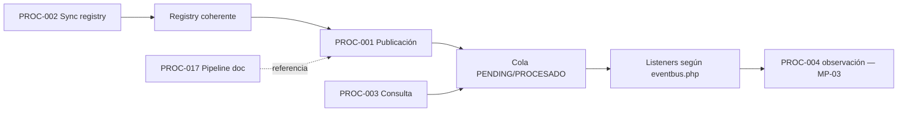
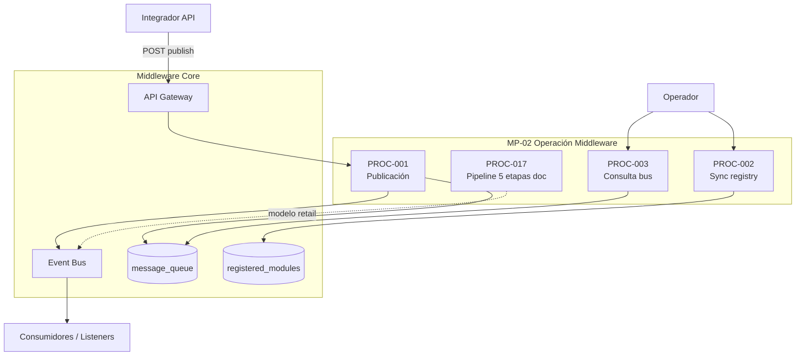

# MP-02 — Macroproceso: Operación Middleware y Eventos

**ID:** MP-02  
**Versión:** 1.0  
**Fecha:** 2026-06-27  
**Criticidad:** Crítica | **Prioridad:** P0

---

## Descripción

Macroproceso operativo-técnico que concentra el **núcleo del middleware**: publicación de eventos al bus, sincronización del catálogo declarativo al registry, consulta operativa (métricas, topología, DLQ) y el pipeline documental de cinco etapas (ingesta → procesamiento → enrutamiento → distribución → consumo).

Materializa la **Capa 2 — Middleware Core** del blueprint: Middleware Core, API Gateway y Event Bus como centro del diagrama arquitectónico.

**Evidencia:** `Architecture_Blueprint.md` §2.2 D–F, §6.4–6.5; `procesos.csv` PROC-001, 002, 003, 017; `Plan_Modulo_Control_Middleware.md`.

---

## Objetivo

Operar el bus de eventos interno de forma confiable: recibir, validar, persistir, enrutar y exponer el estado operativo del middleware en cada silo cliente.

---

## Alcance

| Incluido | Excluido |
|----------|----------|
| Publicación HTTP y facade Laravel | Dominios retail consumidores externos |
| Sync `eventbus.php` + `modules_config.json` → registry | Ingress webhooks (MP-08) |
| Consultas operativas del bus | Proyección dashboard (MP-03) |
| Pipeline 5 etapas (documental) | Implementación completa 5 etapas (brecha REQ-FLOW-01) |
| DLQ, cola, topología declarativa | Sagas/compensación (ADR-006 diferido) |

**Instancia:** Silo cliente (`:8001+`).

---

## Procesos incluidos

| ID | Proceso | Tipo | Estado | Documento hijo |
|----|---------|------|--------|--------------|
| PROC-001 | Publicación de eventos al bus | Técnico | Implementado | [10_Proceso_Publicacion_Eventos_Bus.md](10_Proceso_Publicacion_Eventos_Bus.md) |
| PROC-002 | Sincronización catálogo → registry | Técnico | Implementado | [11_Proceso_Sincronizacion_Catalogo_Registry.md](11_Proceso_Sincronizacion_Catalogo_Registry.md) |
| PROC-003 | Consulta operativa del bus | Técnico | Implementado | [12_Proceso_Consulta_Operativa_Bus.md](12_Proceso_Consulta_Operativa_Bus.md) |
| PROC-017 | Flujo middleware 5 etapas (documental) | Documental | No completo | [26_Proceso_Flujo_Middleware_5_Etapas.md](26_Proceso_Flujo_Middleware_5_Etapas.md) |

---

## Actores

| Actor | Rol en MP-02 | Procesos |
|-------|--------------|----------|
| Integrador API | Publica eventos vía HTTP | PROC-001 |
| Operador bus | Sync registry, consulta métricas | PROC-002, 003 |
| Operador middleware | Monitoreo cola y topología | PROC-003 |
| Arquitectura | Referencia pipeline retail 5 etapas | PROC-017 |
| Sistemas productores (doc) | ERP, POS, e-commerce | PROC-017 |

---

## Flujo entre procesos hijos

**Dependencia crítica:** PROC-002 debe ejecutarse tras cambios en catálogo (post espejo CP→Silo, MP-01) antes de publicación productiva.

---

## Diagrama Mermaid

---

## BPMN Mapping (nivel macro)

| Pool | Lane | Procesos / actividades | Eventos BPMN |
|------|------|-------------------------|--------------|
| **Middleware** | Ingesta | PROC-001: recepción envelope, validación | Start: evento recibido; End: en cola |
| **Middleware** | Registry | PROC-002: sync config declarativa | Start: POST sync-config; End: registry actualizado |
| **Middleware** | Operaciones | PROC-003: métricas, DLQ, búsqueda | Start: consulta operador; End: JSON respuesta |
| **Arquitectura (doc)** | Pipeline retail | PROC-017: 5 etapas conceptuales | Subproceso documental, no ejecutable completo |
| **Integrador externo** | Publicación | Trigger PROC-001 | Message: envelope válido |

**Gateways macro:** validación envelope (válido → cola / inválido → error); estado cola (PENDING → PROCESADO / DLQ).

---

## Trazabilidad

| Dimensión | Referencia |
|-----------|------------|
| Blueprint | `Architecture_Blueprint.md` §2.2 Middleware Core, Event Bus, API Gateway; §6.4–6.5 |
| Procesos CSV | `procesos.csv` PROC-001, 002, 003, 017 |
| Capacidades middleware | C1–C5 (`02_Matriz_Middleware.csv`) |
| Código | `EventPublisherService`, `SyncConfiguredModulesToRegistryUseCase`, `MiddlewareApiRoutes.php` |
| Brecha | REQ-FLOW-01: doc 5 etapas vs implementación 2 etapas |
| BPMN | [Matriz_Trazabilidad_BPMN.md](Matriz_Trazabilidad_BPMN.md) filas PROC-001–003, 017 |
| Requisitos | REQ-C1, REQ-C2, REQ-C3, REQ-C4 (parcial) |
