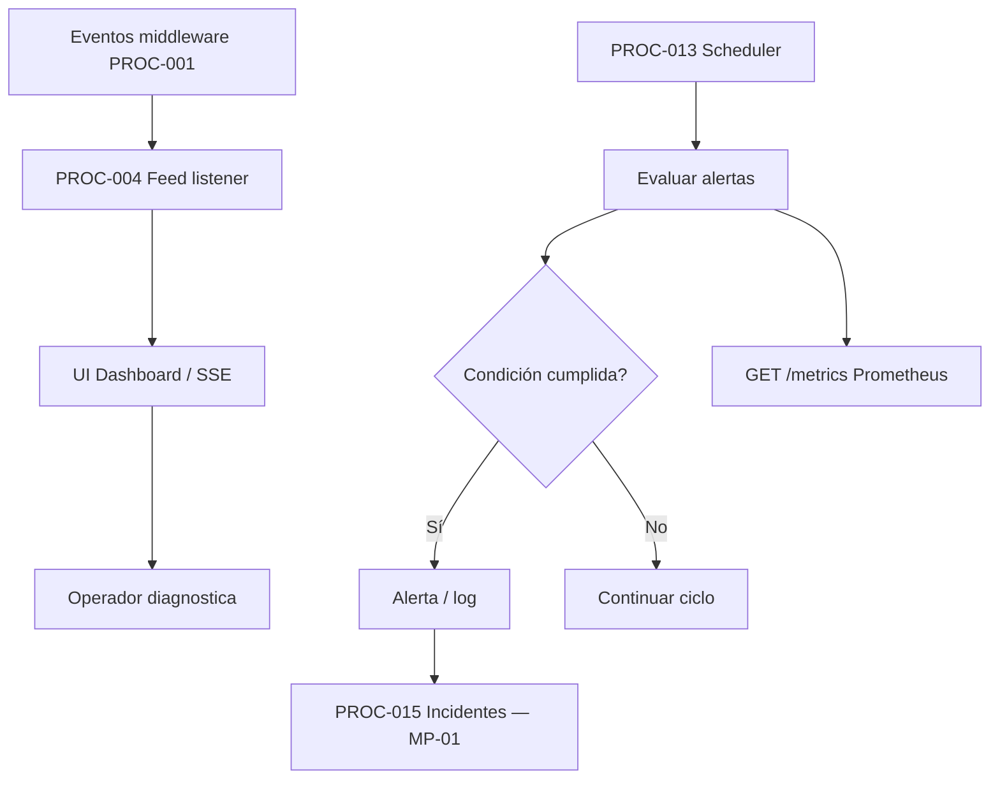
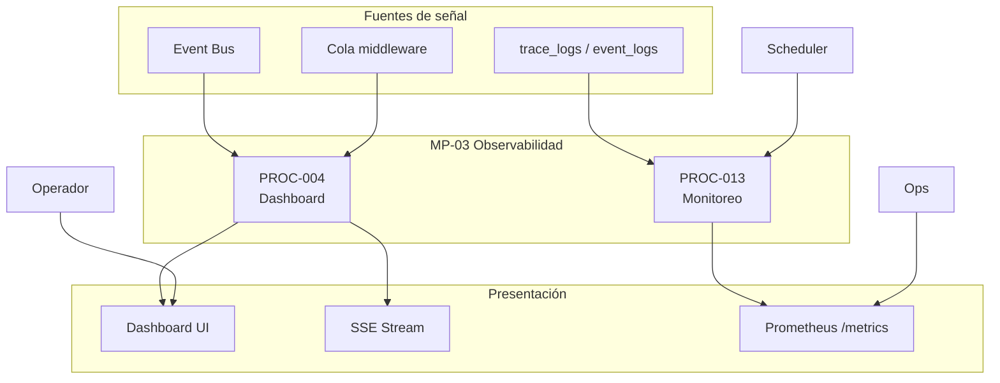

# MP-03 — Macroproceso: Observabilidad y Monitoreo

**ID:** MP-03  
**Versión:** 1.0  
**Fecha:** 2026-06-27  
**Criticidad:** Alta | **Prioridad:** P0

---

## Descripción

Macroproceso transversal que agrupa la **proyección observacional** del sistema (dashboard, feed SSE, KPIs, topología) y el **monitoreo proactivo** (alertas programadas, canary publish, exportación Prometheus).

Corresponde a la **Capa 5 — Observabilidad** del blueprint: Dashboard, Observability Platform, Monitoring y métricas como franja que observa todo el sistema sin ser flujo principal de negocio.

**Evidencia:** `Architecture_Blueprint.md` §2.2 H–I, §6.6; `procesos.csv` PROC-004, 013; `Plan_Modulo_Dashboard_General.md`; ADR-008, ADR-009.

---

## Objetivo

Ofrecer visibilidad operativa en tiempo casi real del bus, eventos y salud de plataforma, y detectar condiciones de alerta antes de que impacten al cliente.

---

## Alcance

| Incluido | Excluido |
|----------|----------|
| Feed eventos, KPIs, series, topología UI | Dominios retail como productores internos |
| Stream SSE `/api/dashboard/stream` | WebSockets (no implementado; SSE cubre contrato) |
| Evaluación alertas scheduler | Grafana/Prometheus despliegue externo (infra MP-06) |
| Métricas Prometheus `GET /metrics` | Autenticación (MP-04) |
| Correlación y trace_logs (ADR-009) | Incidentes formales (PROC-015 en MP-01) |

**Instancias:** Silo cliente (dashboard); CP + Silo (monitoreo).

---

## Procesos incluidos

| ID | Proceso | Tipo | Estado | Documento hijo |
|----|---------|------|--------|--------------|
| PROC-004 | Observabilidad dashboard | Técnico | Implementado | [13_Proceso_Observabilidad_Dashboard.md](13_Proceso_Observabilidad_Dashboard.md) |
| PROC-013 | Monitoreo y alertas plataforma | Técnico | Implementado | [22_Proceso_Monitoreo_Alertas_Plataforma.md](22_Proceso_Monitoreo_Alertas_Plataforma.md) |

---

## Actores

| Actor | Rol en MP-03 | Procesos |
|-------|--------------|----------|
| Operador cliente | Consulta dashboard instancia | PROC-004 |
| Operador observabilidad | Revisa alertas y métricas | PROC-013 |
| Scheduler | Ejecuta evaluación periódica | PROC-013 |
| Ops | Expone/consume Prometheus | PROC-013 |
| Sistema (listeners) | `UniversalDashboardFeedListener` | PROC-004 |

---

## Flujo entre procesos hijos

**Relación:** PROC-004 consume todos los eventos (wildcard); PROC-013 evalúa umbrales independientemente y puede escalar a gestión de incidentes.

---

## Diagrama Mermaid

---

## BPMN Mapping (nivel macro)

| Pool | Lane | Procesos / actividades | Eventos BPMN |
|------|------|-------------------------|--------------|
| **Observabilidad** | Dashboard | PROC-004: proyección feed, KPIs, topología | Start: evento observado; End: vista actualizada |
| **Observabilidad** | Stream | PROC-004: SSE live events | Timer: conexión cliente |
| **Monitoreo** | Evaluación | PROC-013: platform:monitoring-evaluate | Timer: ciclo scheduler |
| **Monitoreo** | Exportación | PROC-013: Prometheus scrape | Start: GET /metrics |
| **Operador** | Diagnóstico | Consulta dashboard y métricas | — |

**Gateways macro:** condición alerta (umbral superado → notificación); visibilidad módulo (config `dashboard_visible_modules`).

---

## Trazabilidad

| Dimensión | Referencia |
|-----------|------------|
| Blueprint | `Architecture_Blueprint.md` §4 Capa 5, §6.6 Flujo observabilidad |
| Procesos CSV | `procesos.csv` PROC-004, 013 |
| Objetivos dashboard | O1–O5 (`Plan_Modulo_Dashboard_General.md` §6) |
| Código | `UniversalDashboardFeedListener`, `PrometheusMetricsExporter`, `EvaluateMonitoringAlertsCommand` |
| ADR | ADR-008 logs JSON; ADR-009 tracing ligero |
| Matriz evaluación | `04_Matriz_Observabilidad.csv` C13–C15 |
| Requisitos | REQ-C5, REQ-O1–O5 |
| BPMN | [Matriz_Trazabilidad_BPMN.md](Matriz_Trazabilidad_BPMN.md) casos uso dashboard |
