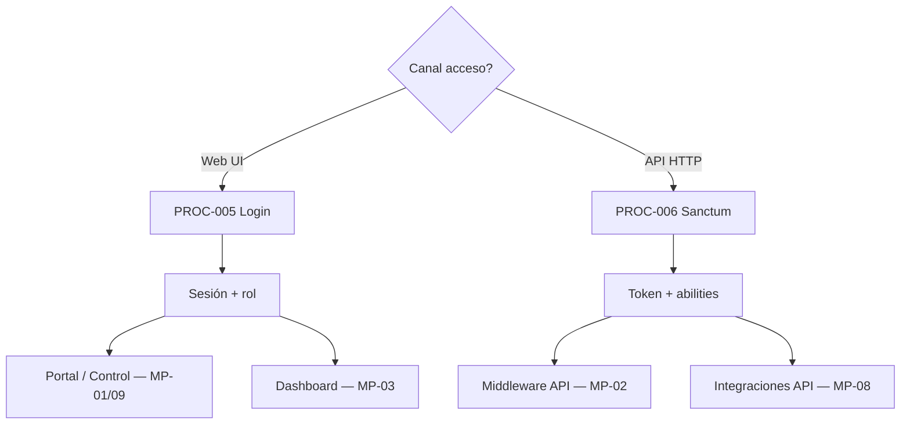

# MP-04 — Macroproceso: Seguridad y Acceso

**ID:** MP-04  
**Versión:** 1.0  
**Fecha:** 2026-06-27  
**Criticidad:** Crítica | **Prioridad:** P0

---

## Descripción

Macroproceso transversal que asegura el acceso a la plataforma mediante **autenticación web** (sesión operadores CP y portal instancia) y **autenticación API** (Sanctum, tokens M2M, abilities por ruta).

Materializa la **Capa 6 — Security** del blueprint: Security Layer, Authentication, Authorization como marco de protección alrededor del core.

**Evidencia:** `Architecture_Blueprint.md` §2.2 J–K; `procesos.csv` PROC-005, 006; `Flujo_M2M_Integradores.md`; ADR-002, ADR-003.

---

## Objetivo

Garantizar que solo actores autenticados y autorizados accedan a UI, APIs de middleware, dashboard e integraciones, según rol y abilities definidos.

---

## Alcance

| Incluido | Excluido |
|----------|----------|
| Login web CP y silo | OAuth2/SSO enterprise (ADR-002 Fase 3) |
| Sanctum tokens y abilities API | LDAP/SSO (ADR-003 diferido) |
| Middleware `auth`, `AuthenticatePlatformApi` | Audit trail detallado (componente separado) |
| Políticas `EnforcePlatformAbility` | Rate limiting infra (documentado en Plan_APIs) |
| Roles platform (`platform_roles.php`) | Gestión empresas (MP-01) |

**Instancias:** Control Plane y silos cliente.

---

## Procesos incluidos

| ID | Proceso | Tipo | Estado | Documento hijo |
|----|---------|------|--------|--------------|
| PROC-005 | Autenticación operadores web | Técnico | Implementado | [14_Proceso_Autenticacion_Operadores_Web.md](14_Proceso_Autenticacion_Operadores_Web.md) |
| PROC-006 | Autenticación API integradores | Técnico | Implementado | [15_Proceso_Autenticacion_API_Integradores.md](15_Proceso_Autenticacion_API_Integradores.md) |

---

## Actores

| Actor | Rol en MP-04 | Procesos |
|-------|--------------|----------|
| Operador SaaS | Login web control plane | PROC-005 |
| Operador tenant | Login web portal instancia | PROC-005 |
| Integrador M2M | Bearer token en API | PROC-006 |
| Operador seguridad | Emisión/revocación tokens | PROC-006 |
| Sistema | Middleware auth en rutas | PROC-005, 006 |

---

## Flujo entre procesos hijos



**Prerrequisito transversal:** PROC-005 habilita PROC-019 (portal); PROC-006 habilita PROC-001, 003, 011, 012.

---

## Diagrama Mermaid

```mermaid
flowchart TB
    subgraph MP04["MP-04 Seguridad y Acceso"]
        P005[PROC-005<br/>Auth web]
        P006[PROC-006<br/>Auth API]
    end

    subgraph Security["Security Layer"]
        Session[Session Auth]
        Sanctum[Sanctum Tokens]
        Abilities[Abilities bus:read bus:admin]
    end

    OperadorWeb[Operador web] -->|GET/POST /login| P005
    Integrador[Integrador M2M] -->|Bearer| P006
    P005 --> Session
    P006 --> Sanctum
    Sanctum --> Abilities
    Session --> CP[Control Plane UI]
    Session --> Portal[Portal Cliente]
    Abilities --> API[Rutas /api/middleware/*]
    Abilities --> IntAPI[/api/integrations/*]
```

---

## BPMN Mapping (nivel macro)

| Pool | Lane | Procesos / actividades | Eventos BPMN |
|------|------|-------------------------|--------------|
| **Seguridad** | Web Auth | PROC-005: login, sesión, logout | Start: credenciales; End: sesión activa / error |
| **Seguridad** | API Auth | PROC-006: validar token, abilities | Start: request Bearer; Gateway: ability check |
| **Operador** | Acceso UI | Post-login navegación | Message: sesión establecida |
| **Integrador** | Acceso M2M | Publicación/consulta API | Message: token válido |
| **Plataforma (doc)** | Gateway futuro | ACT-029 OAuth2 (diferido ADR-002) | — |

**Gateways macro:** credenciales válidas (sí → sesión / no → 401); ability requerida (cumple → ruta / no → 403).

---

## Trazabilidad

| Dimensión | Referencia |
|-----------|------------|
| Blueprint | `Architecture_Blueprint.md` §4 Capa 6, §5 Operador Seguridad |
| Procesos CSV | `procesos.csv` PROC-005, 006 |
| Config | `config/platform_auth.php`, `config/platform_roles.php` |
| Código | `LoginController`, `AuthenticatePlatformApi`, `EnforcePlatformAbility` |
| ADR | ADR-002 OAuth2 diferido; ADR-003 SSO/LDAP diferido |
| Matriz evaluación | `05_Matriz_Seguridad.csv` C11–C12, C16 |
| BPMN | [Matriz_Trazabilidad_BPMN.md](Matriz_Trazabilidad_BPMN.md) REQ-RST-01–04 |
| Dependencias | Prerrequisito de MP-01, MP-02, MP-03, MP-08, MP-09 |
