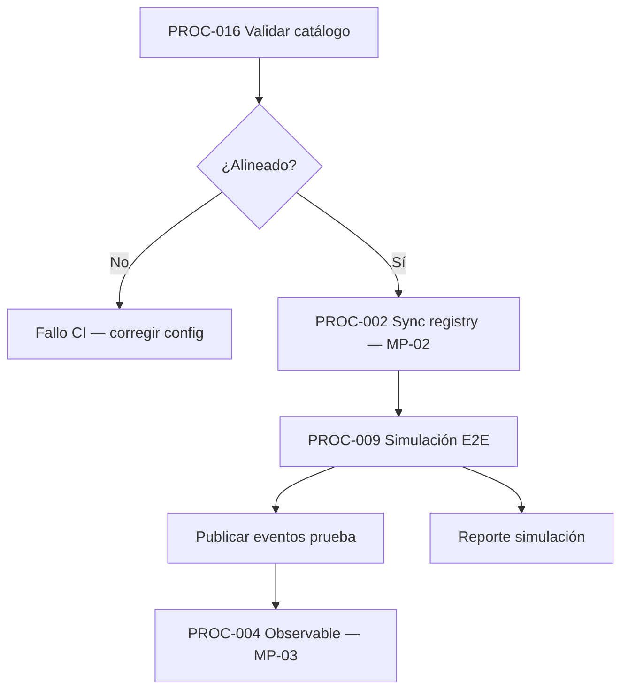
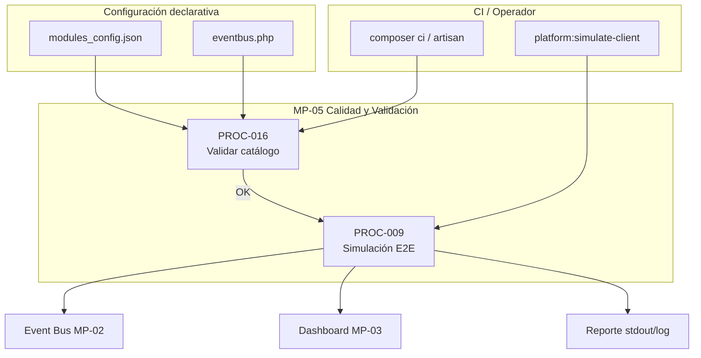

# MP-05 — Macroproceso: Calidad y Validación

**ID:** MP-05  
**Versión:** 1.0  
**Fecha:** 2026-06-27  
**Criticidad:** Alta | **Prioridad:** P1

---

## Descripción

Macroproceso de aseguramiento de calidad que valida la **coherencia del catálogo declarativo** (CI) y ejecuta **simulaciones end-to-end** del cliente para verificar tráfico observable en bus y dashboard antes o durante operación.

Complementa MP-02 (middleware) y MP-01 (simulación CP) con gates de calidad automatizados y rehearsals operativos.

**Evidencia:** `procesos.csv` PROC-009, 016; `Runbook_Simulacion_Cliente.md`; `Plan_de_implementacion.md` §B.3; `composer.json` scripts CI.

---

## Objetivo

Detectar desalineaciones entre `modules_config.json` y suscripciones `eventbus.php`, y certificar que un silo cliente puede publicar eventos de prueba con resultado observable.

---

## Alcance

| Incluido | Excluido |
|----------|----------|
| `platform:validate-catalog` en CI | Evaluación formal aceptación (PROC-033, MP-07) |
| `platform:simulate-client` E2E | Simulación orquestada CP (PROC-020, MP-01) |
| Fixtures `sample_events.json` | Tests unitarios PHPUnit (carpeta `tests/`) |
| Reporte simulación CLI | Pipeline retail 5 etapas (PROC-017) |
| Gate pre-deploy catálogo | Despliegue VM (PROC-030) |

**Instancia:** Silo cliente; CI en repositorio.

---

## Procesos incluidos

| ID | Proceso | Tipo | Estado | Documento hijo |
|----|---------|------|--------|--------------|
| PROC-009 | Simulación cliente end-to-end | Técnico | Implementado | [18_Proceso_Simulacion_Cliente_E2E.md](18_Proceso_Simulacion_Cliente_E2E.md) |
| PROC-016 | Validación catálogo CI | Técnico | Implementado | [25_Proceso_Validacion_Catalogo_CI.md](25_Proceso_Validacion_Catalogo_CI.md) |

---

## Actores

| Actor | Rol en MP-05 | Procesos |
|-------|--------------|----------|
| CI / Pipeline | Ejecuta validate-catalog | PROC-016 |
| Desarrollador | Corrección catálogo tras fallo | PROC-016 |
| Operador | Ejecuta simulación manual | PROC-009 |
| Ops | Rehearsal post-provisioning | PROC-009 |

---

## Flujo entre procesos hijos

**Orden recomendado certificado:** validación catálogo → sync registry → simulación → observación dashboard.

---

## Diagrama Mermaid

---

## BPMN Mapping (nivel macro)

| Pool | Lane | Procesos / actividades | Eventos BPMN |
|------|------|-------------------------|--------------|
| **Calidad** | Validación CI | PROC-016: alinear config vs subscriptions | Start: push/merge; End: pass/fail |
| **Calidad** | Simulación | PROC-009: rehearsal cliente | Start: comando simulate; End: reporte |
| **Middleware** | Tráfico prueba | Subproceso publicación (MP-02) | Message: eventos fixture |
| **Observabilidad** | Verificación | Consumo dashboard (MP-03) | End: eventos visibles |

**Gateways macro:** catálogo válido (sí → simulación permitida); simulación exitosa (eventos en feed → certificación local).

---

## Trazabilidad

| Dimensión | Referencia |
|-----------|------------|
| Procesos CSV | `procesos.csv` PROC-009, 016 |
| Runbooks | `Runbook_Simulacion_Cliente.md`; `Plan_de_implementacion.md` B.3 |
| Código | `ValidatePlatformCatalogCommand`, `SimulateClientCommand` |
| Matriz evaluación | `08_Matriz_Calidad.csv` C24–C26 |
| Requisitos | REQ-VAL-01, REQ-SIM-01 |
| BPMN | [00_Mapa_Procesos.md](00_Mapa_Procesos.md) flujo certificado pasos I–K |
| Relación MP-01 | PROC-020 orquesta PROC-009 remotamente desde CP |
