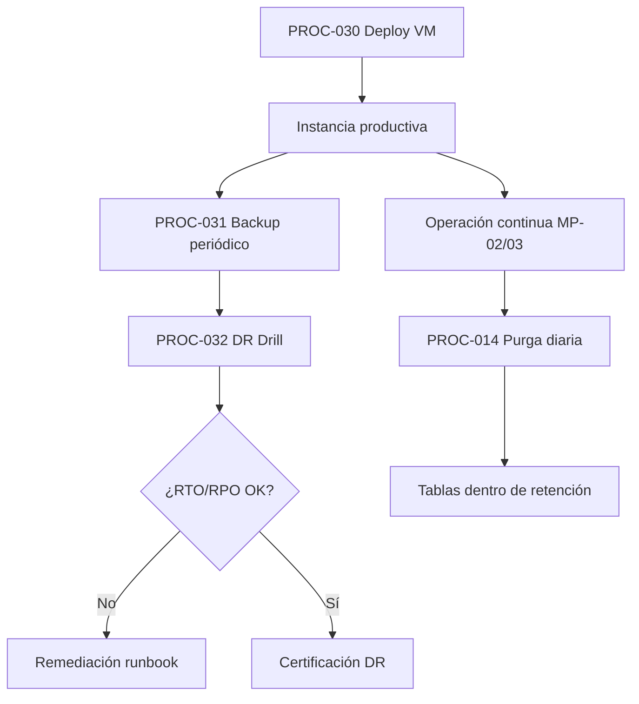
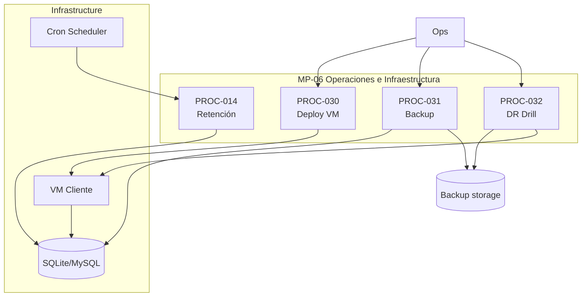

# MP-06 — Macroproceso: Operaciones e Infraestructura

**ID:** MP-06  
**Versión:** 1.0  
**Fecha:** 2026-06-27  
**Criticidad:** Alta | **Prioridad:** P1

---

## Descripción

Macroproceso de apoyo operativo que cubre **retención y purga** de datos operativos, **despliegue en VM**, **backup/restauración** y **ejercicios de recuperación ante desastres (DR Drill)**.

Materializa la **Capa 7 — Infrastructure** del blueprint: runtime, BD, scheduler, CI/CD y procedimientos de continuidad documentados en runbooks de producción.

**Evidencia:** `Architecture_Blueprint.md` §2.2 L, §4 Capa 7; `procesos.csv` PROC-014; `Matriz_Trazabilidad_BPMN.md` PROC-030–032; `config/platform_retention.php`; ADR-005.

---

## Objetivo

Mantener la plataforma operable, con datos acotados por políticas de retención y procedimientos documentados para despliegue, respaldo y recuperación.

---

## Alcance

| Incluido | Excluido |
|----------|----------|
| Purga programada tablas operativas | Provisioning lógico tenant (MP-01) |
| Runbook deploy VM producción | Orquestación cloud multi-región |
| Runbook backup y restore BD | Monitoreo alertas (MP-03) |
| Runbook DR Drill | Multi-tenancy Fase 3 |
| Scheduler `routes/console.php` | Evaluación madurez (MP-07) |

**Instancias:** CP + Silos; VM cliente en producción.

---

## Procesos incluidos

| ID | Proceso | Tipo | Estado | Documento hijo |
|----|---------|------|--------|--------------|
| PROC-014 | Retención y purga datos operativos | Técnico | Implementado | [23_Proceso_Retencion_Purga_Datos.md](23_Proceso_Retencion_Purga_Datos.md) |
| PROC-030 | Despliegue producción VM | Técnico | Documentado | [30_Proceso_Despliegue_Produccion_VM.md](30_Proceso_Despliegue_Produccion_VM.md) |
| PROC-031 | Backup y restauración | Técnico | Documentado | [31_Proceso_Backup_Restauracion.md](31_Proceso_Backup_Restauracion.md) |
| PROC-032 | DR Drill | Técnico | Documentado | [32_Proceso_DR_Drill.md](32_Proceso_DR_Drill.md) |

---

## Actores

| Actor | Rol en MP-06 | Procesos |
|-------|--------------|----------|
| Scheduler | Ejecuta purga diaria | PROC-014 |
| Ops | Deploy, backup, DR | PROC-030, 031, 032 |
| SRE / Infra | Validación post-DR | PROC-032 |
| Sistema | `PurgePlatformRetentionCommand` | PROC-014 |

---

## Flujo entre procesos hijos

**Cadena continuidad:** deploy → backup rutinario → drill periódico → ajuste procedimientos.

---

## Diagrama Mermaid

---

## BPMN Mapping (nivel macro)

| Pool | Lane | Procesos / actividades | Eventos BPMN |
|------|------|-------------------------|--------------|
| **Infraestructura** | Retención | PROC-014: purge tablas según config | Timer: diario |
| **Infraestructura** | Deploy | PROC-030: runbook VM manual | Start: release; End: health OK |
| **Infraestructura** | Backup | PROC-031: snapshot BD | Timer: política backup |
| **Infraestructura** | DR | PROC-032: simulación recuperación | Start: drill planificado; End: informe |
| **Ops** | Ejecución | Operador sigue runbooks | — |

**Tablas afectadas PROC-014:** `message_queue`, `event_logs`, `observability_metrics`, `trace_logs`, `event_store`, `audit_logs` (`platform_retention.php`).

---

## Trazabilidad

| Dimensión | Referencia |
|-----------|------------|
| Blueprint | `Architecture_Blueprint.md` §2.2 Infrastructure, §4 Capa 7 |
| Procesos CSV | `procesos.csv` PROC-014 |
| Runbooks | `Runbook_Deploy_VM.md`, `Runbook_Backup_Restore.md`, `Runbook_DR_Drill.md` |
| Código | `PurgePlatformRetentionCommand`, `routes/console.php` |
| ADR | ADR-005 particionamiento event_store → retención |
| Matriz evaluación | `06_Matriz_Operacion.csv` C19–C20 |
| BPMN | [Matriz_Trazabilidad_BPMN.md](Matriz_Trazabilidad_BPMN.md) PROC-030–032 |
