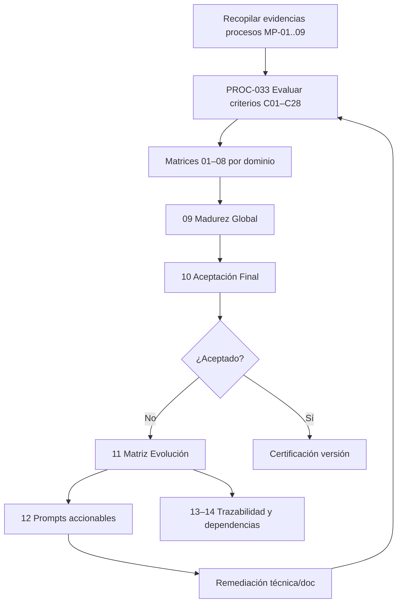
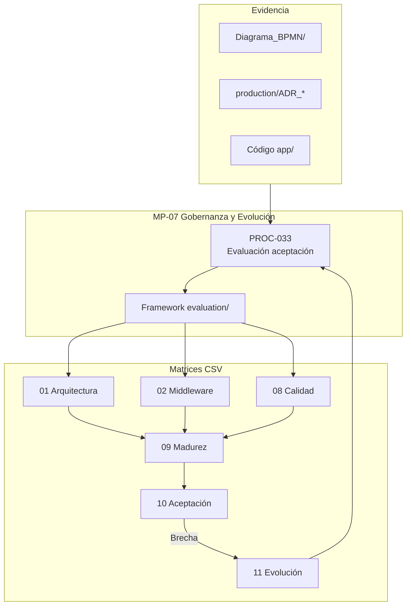

# MP-07 — Macroproceso: Gobernanza y Evolución

**ID:** MP-07  
**Versión:** 1.0  
**Fecha:** 2026-06-27  
**Criticidad:** Media | **Prioridad:** P2

---

## Descripción

Macroproceso de gobernanza que formaliza la **evaluación de aceptación del middleware** y la **evolución continua** mediante matrices CSV, guías metodológicas y trazabilidad entre arquitectura, pruebas y documentación.

Incluye el framework completo en `docs/evaluation/` y el proceso PROC-033 como instancia operativa del ciclo evaluar → priorizar → remediar → re-evaluar.

**Evidencia:** `Middleware_Acceptance_Evaluation_Framework.md`; `README_Evaluacion.md`; `procesos.csv` (PROC-033 implícito en evaluación); `Analisis_v0.2` (IA C21–C23).

---

## Objetivo

Sostener madurez medible de la plataforma, identificar brechas documentadas, derivar acciones de mejora y mantener trazabilidad ADR ↔ requisitos ↔ procesos BPMN.

---

## Alcance

| Incluido | Excluido |
|----------|----------|
| Matrices 01–14 evaluación | Implementación técnica de mejoras |
| Guías framework y puntuación global | Operación diaria middleware (MP-02) |
| PROC-033 evaluación aceptación | Patentes legales (carpeta `Patente/` aparte) |
| Matriz evolución y prompts | Multi-tenancy Fase 3 (PROC-018) |
| Matriz madurez y aceptación final | CI validate-catalog (MP-05) |

**Alcance documental:** repositorio `docs/evaluation/` y artefactos BPMN.

---

## Procesos incluidos

| ID | Proceso | Tipo | Estado | Documento hijo |
|----|---------|------|--------|--------------|
| PROC-033 | Evaluación aceptación middleware | Gobernanza | Documentado | [33_Proceso_Evaluacion_Aceptacion_Middleware.md](33_Proceso_Evaluacion_Aceptacion_Middleware.md) |
| — | Framework evaluación (artefacto transversal) | Gobernanza | Documentado | [../evaluation/README_Evaluacion.md](../evaluation/README_Evaluacion.md) |

**Artefactos del framework (no PROC individuales):**

- Matrices 01–08: dominios (Arquitectura, Middleware, Integración, Observabilidad, Seguridad, Operación, IA, Calidad)
- Matrices 09–10: madurez global y aceptación final
- Matrices 11–14: evolución, prompts, trazabilidad, dependencias

---

## Actores

| Actor | Rol en MP-07 | Procesos |
|-------|--------------|----------|
| Arquitecto / QA | Ejecuta evaluación por criterio | PROC-033 |
| Product Owner | Decisión aceptación final | Matriz 10 |
| Desarrollador | Remedia brechas identificadas | Matriz 11 |
| IA Support (doc) | Generación prompts y borradores | Matriz 12 |
| Auditor | Trazabilidad evidencias | Matriz 13–14 |

---

## Flujo entre procesos hijos

---

## Diagrama Mermaid

---

## BPMN Mapping (nivel macro)

| Pool | Lane | Procesos / actividades | Eventos BPMN |
|------|------|-------------------------|--------------|
| **Gobernanza** | Evaluación | PROC-033: puntuar criterios por dominio | Start: ciclo evaluación; End: informe |
| **Gobernanza** | Consolidación | Matrices 09–10: madurez y decisión | Gateway: umbral aceptación |
| **Gobernanza** | Evolución | Matriz 11: backlog mejoras | Message: brecha registrada |
| **Gobernanza** | Prompts IA | Matriz 12: artefactos reutilizables | — |
| **Arquitectura** | Trazabilidad | Matrices 13–14: REQ ↔ proceso | — |

**Criterios IA (C21–C23):** evaluados en PROC-033 con evidencia `Analisis_v0.2` y uso documental de IA Support.

---

## Trazabilidad

| Dimensión | Referencia |
|-----------|------------|
| Framework normativo | `Middleware_Acceptance_Evaluation_Framework.md` |
| README | `evaluation/README_Evaluacion.md` |
| Guías | `01_Guia_Framework_Evaluacion.md` … `06_Guia_Iteracion_Framework.md` |
| BPMN | [Matriz_Trazabilidad_BPMN.md](Matriz_Trazabilidad_BPMN.md) § Trazabilidad evaluación |
| Criterios → procesos | C01–C04 Arquitectura; C05–C08 Middleware; C09–C10 Integración; C11–C12 Seguridad; C13–C15 Observabilidad; C17–C20 Operación; C21–C23 IA; C24–C26 Calidad |
| Brechas | [00_Mapa_Procesos.md](00_Mapa_Procesos.md) § Brechas; `11_Matriz_Evolucion.csv` |
| Blueprint | `Architecture_Blueprint.md` §2.2 O AI Support (rol metodológico) |
