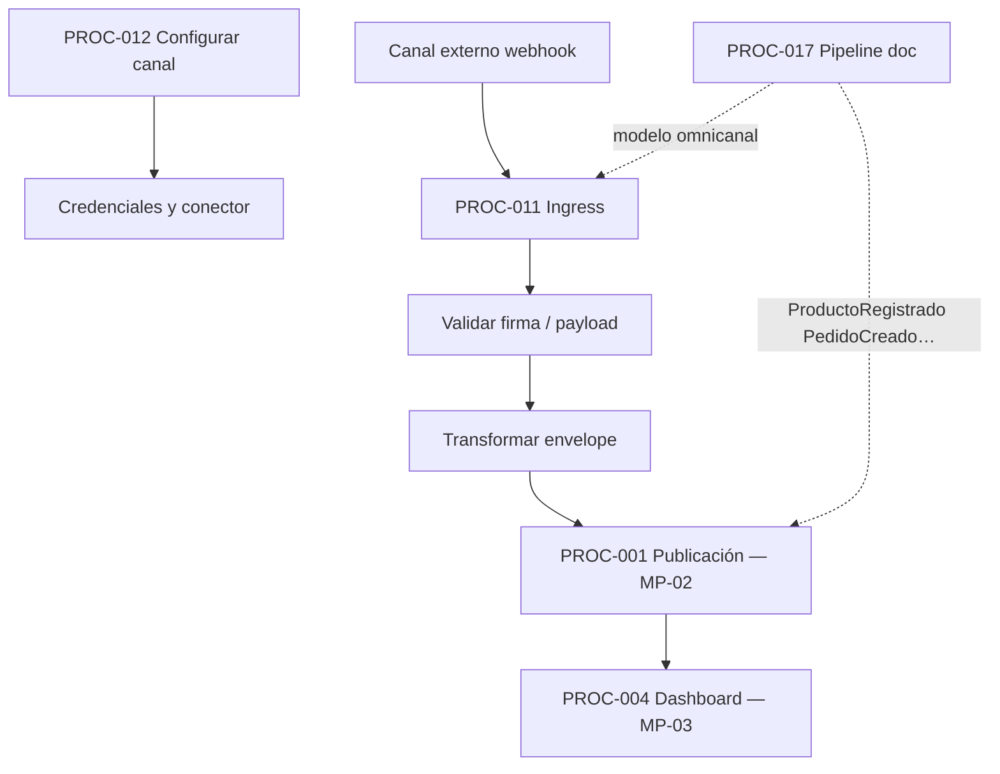
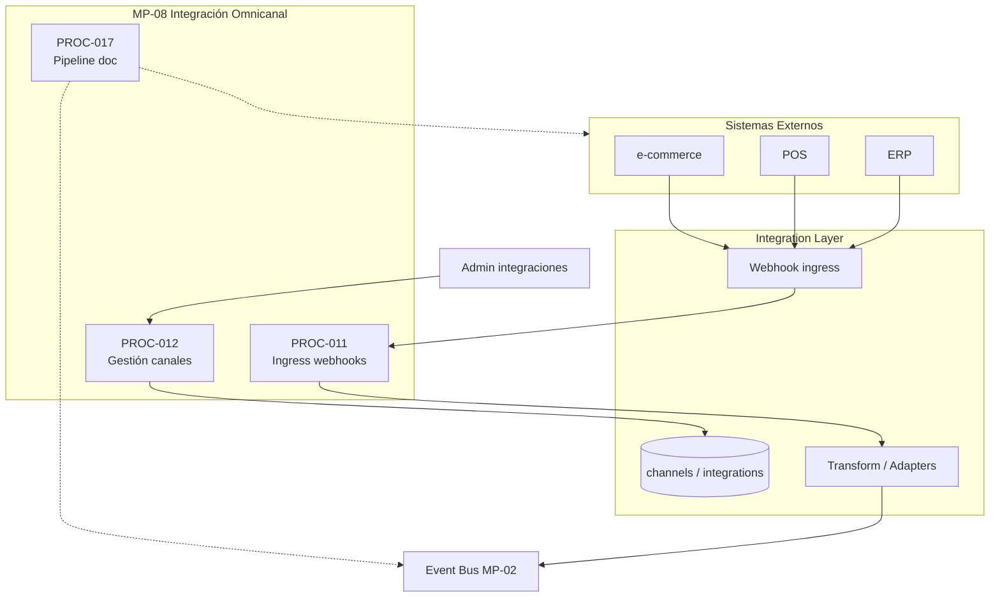

# MP-08 — Macroproceso: Integración Omnicanal

**ID:** MP-08  
**Versión:** 1.0  
**Fecha:** 2026-06-27  
**Criticidad:** Alta | **Prioridad:** P1

---

## Descripción

Macroproceso de integración que conecta **canales externos** (ERP, POS, e-commerce, webhooks) con el middleware interno: ingress de webhooks, gestión de canales/credenciales/conectores outbound y el **pipeline documental omnicanal** de cinco etapas hacia dominios retail de referencia.

Materializa la **Capa 3 — Integraciones** del blueprint y el flujo §6.8 Integraciones.

**Evidencia:** `Architecture_Blueprint.md` §2.2 G, M, N; §6.8; `procesos.csv` PROC-011, 012, 017; `Plan_Integraciones.md`.

---

## Objetivo

Recibir eventos y datos de sistemas externos, transformarlos al envelope de plataforma y publicarlos al bus; administrar configuración de canales e integraciones de forma declarativa y segura.

---

## Alcance

| Incluido | Excluido |
|----------|----------|
| Ingress webhooks con validación firma | Implementación conectores específicos por vendor |
| CRUD canales e integraciones API | Auth API (MP-04, prerrequisito) |
| Transformación a envelope estándar | Publicación interna post-transform (MP-02) |
| Pipeline retail documental (Inventario, Pedidos…) | Dominios retail en core (externos/doc) |
| Esquema BD webhooks | Config dinámica sin redeploy (brecha REQ-DYN-01) |

**Instancia:** Silo cliente.

---

## Procesos incluidos

| ID | Proceso | Tipo | Estado | Documento hijo |
|----|---------|------|--------|--------------|
| PROC-011 | Ingress webhooks integraciones | Técnico | Parcial | [20_Proceso_Ingress_Webhooks_Integraciones.md](20_Proceso_Ingress_Webhooks_Integraciones.md) |
| PROC-012 | Gestión canales e integraciones | Técnico | Implementado | [21_Proceso_Gestion_Canales_Integraciones.md](21_Proceso_Gestion_Canales_Integraciones.md) |
| PROC-017 | Flujo middleware 5 etapas (documental) | Documental | No completo | [26_Proceso_Flujo_Middleware_5_Etapas.md](26_Proceso_Flujo_Middleware_5_Etapas.md) |

---

## Actores

| Actor | Rol en MP-08 | Procesos |
|-------|--------------|----------|
| Canal externo | Emite webhooks POS/ERP/e-commerce | PROC-011 |
| Admin integraciones | CRUD canales y credenciales | PROC-012 |
| Integrador API | Configura integraciones vía API | PROC-012 |
| Sistemas productores (doc) | Origen eventos dominio retail | PROC-017 |
| Servicios integrados (doc) | Consumidores downstream | PROC-017 |

---

## Flujo entre procesos hijos

**Secuencia operativa:** configuración canal (012) → recepción webhook (011) → publicación bus (001, MP-02).

---

## Diagrama Mermaid

---

## BPMN Mapping (nivel macro)

| Pool | Lane | Procesos / actividades | Eventos BPMN |
|------|------|-------------------------|--------------|
| **Integración** | Administración | PROC-012: CRUD canales, credenciales | Start: config canal; End: persistido |
| **Canal externo** | Ingress | PROC-011: POST webhook | Start: request externo; Message: envelope |
| **Integración** | Transformación | Subproceso adaptación payload | Gateway: firma válida |
| **Middleware** | Publicación | Handoff a PROC-001 (MP-02) | Message: evento publicado |
| **Arquitectura (doc)** | Omnicanal | PROC-017: flujo 5 etapas retail | Subproceso referencia |

**Eventos documentales PROC-017:** `ProductoRegistrado`, `StockActualizado`, `PedidoCreado`, `PedidoConfirmado` (dominios externos).

---

## Trazabilidad

| Dimensión | Referencia |
|-----------|------------|
| Blueprint | `Architecture_Blueprint.md` §4 Capa 3, §6.8; §5 Sistemas Externos |
| Procesos CSV | `procesos.csv` PROC-011, 012, 017 |
| Plan | `Plan_Integraciones.md` §5 |
| Código | `ReceiveWebhookUseCase`, Integration Controllers, `WebhookIngressTest` |
| Matriz evaluación | `03_Matriz_Integracion.csv` C09–C10 |
| Requisitos | REQ-C1 (ingress), REQ-FLOW-01 (pipeline doc) |
| BPMN | [Matriz_Trazabilidad_BPMN.md](Matriz_Trazabilidad_BPMN.md) dominio Integration |
| Dependencias | PROC-006 auth → PROC-011/012; PROC-011 → PROC-001 |
