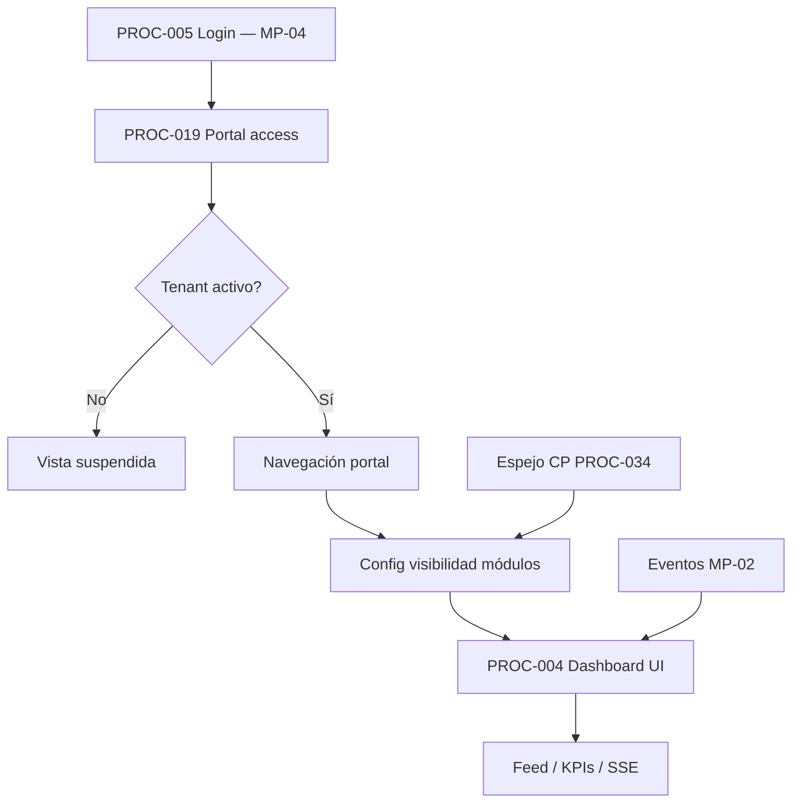
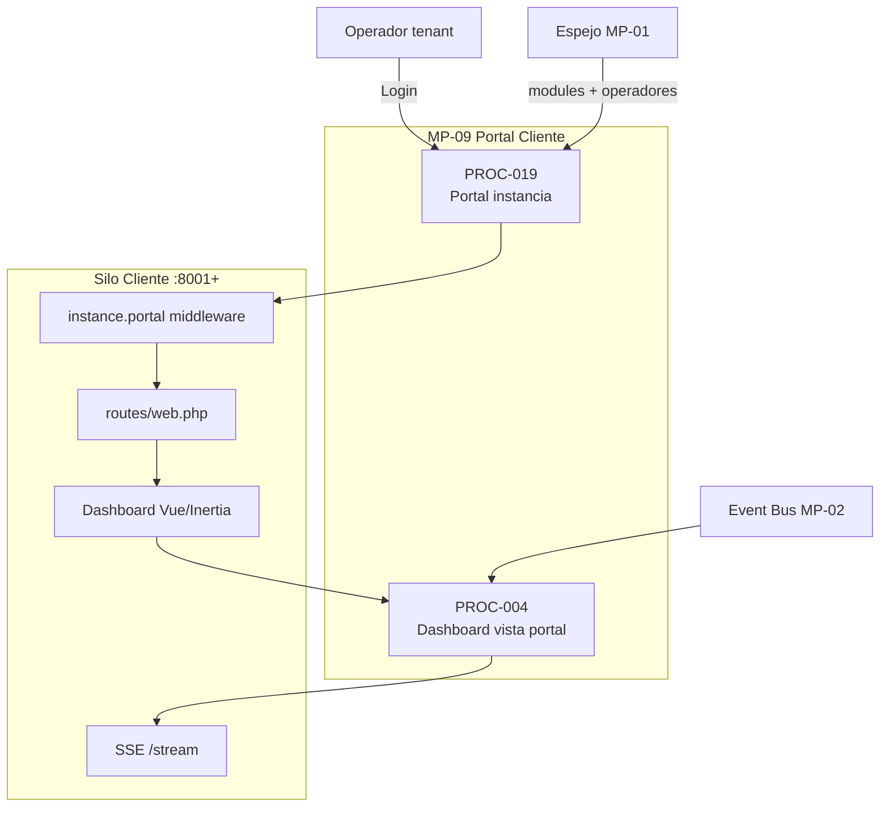

# MP-09 — Macroproceso: Portal Cliente

**ID:** MP-09  
**Versión:** 1.0  
**Fecha:** 2026-06-27  
**Criticidad:** Alta | **Prioridad:** P0

---

## Descripción

Macroproceso funcional-operativo que representa la **experiencia web del operador tenant** en su instancia dedicada: acceso autenticado al portal, binding de contexto instancia, navegación operacional y **vista observacional del dashboard** adaptada al tenant.

Agrupa PROC-019 (portal) y PROC-004 en perspectiva **portal cliente** (visibilidad módulos, feed SSE, KPIs desde UI instancia).

**Evidencia:** `Architecture_Blueprint.md` §6.1–6.2; ADR-001, ADR-011; `procesos.csv` PROC-019, 004; `routes/web.php`; `EnsureInstancePortalAccess`.

---

## Objetivo

Permitir al operador cliente operar su silo de forma autónoma: login, dashboard visible según configuración, acceso a middleware e integraciones autorizadas, sin exponer funciones del control plane SaaS.

---

## Alcance

| Incluido | Excluido |
|----------|----------|
| Middleware `instance.web`, `instance.portal` | Gestión empresas CP (MP-01) |
| Dashboard UI y APIs desde portal silo | Monitoreo Prometheus CP (MP-03 parcial) |
| Config `dashboard_visible_modules` | Simulación CP (PROC-020) |
| Estado operacional tenant (suspendido…) | Auth implementación (MP-04, prerrequisito) |
| Friendly routing ADR-011 | Incidentes formal CP (PROC-015 en MP-01) |

**Instancia:** Silo cliente (`:8001+`).

---

## Procesos incluidos

| ID | Proceso | Tipo | Estado | Documento hijo | Nota portal |
|----|---------|------|--------|--------------|-------------|
| PROC-019 | Portal instancia cliente web | Negocio | Implementado | [28_Proceso_Portal_Instancia_Cliente.md](28_Proceso_Portal_Instancia_Cliente.md) | Acceso y contexto |
| PROC-004 | Observabilidad dashboard | Técnico | Implementado | [13_Proceso_Observabilidad_Dashboard.md](13_Proceso_Observabilidad_Dashboard.md) | Vista portal cliente |

---

## Actores

| Actor | Rol en MP-09 | Procesos |
|-------|--------------|----------|
| Operador tenant / cliente | Usuario principal del portal | PROC-019, 004 |
| Sistema | Resolución instancia y tenant binding | PROC-019 |
| Middleware auth | Prerrequisito sesión web | PROC-005 → 019 |
| Control Plane (indirecto) | Espejo catálogo y operadores | PROC-034 → 019 |

---

## Flujo entre procesos hijos

**Flujo certificado:** login → portal → activar módulos LIVE → configurar visibilidad dashboard → observar SSE.

---

## Diagrama Mermaid

---

## BPMN Mapping (nivel macro)

| Pool | Lane | Procesos / actividades | Eventos BPMN |
|------|------|-------------------------|--------------|
| **Cliente (Silo)** | Acceso | PROC-019: binding instancia, portal gate | Start: request web; Gateway: tenant status |
| **Cliente (Silo)** | Navegación | Rutas dashboard, middleware UI | — |
| **Cliente (Silo)** | Observabilidad | PROC-004: feed, KPIs, topología portal | Timer: SSE stream |
| **Control Plane** | Sincronización | Input PROC-034 (operadores, catálogo) | Message: mirror completado |
| **Operador tenant** | Uso | Consulta dashboard operativo | End: diagnóstico local |

**Gateways macro:** tenant suspendido (bloqueo portal); módulo no visible (oculto en dashboard).

---

## Trazabilidad

| Dimensión | Referencia |
|-----------|------------|
| Blueprint | `Architecture_Blueprint.md` §5 Empresa Cliente; §6.2 Provisioning → instancia |
| Procesos CSV | `procesos.csv` PROC-019, 004 |
| ADR | ADR-001 instancia por cliente; ADR-011 friendly routing |
| Código | `EnsureInstancePortalAccess`, `routes/web.php`, Dashboard listeners |
| Certificación | `Certificacion_Flujo_Operativo_Oficial.md` (preservar `dashboard_visible_modules`) |
| Matriz evaluación | `06_Matriz_Operacion.csv` C17 |
| BPMN | [00_Mapa_Procesos.md](00_Mapa_Procesos.md) flujo E2E pasos F–K |
| Requisitos | REQ-ADR001, REQ-C5, REQ-O1–O5 (vista portal) |
| Relación MP-03 | PROC-004 compartido; MP-09 enfatiza consumo UI portal vs monitoreo PROC-013 |
