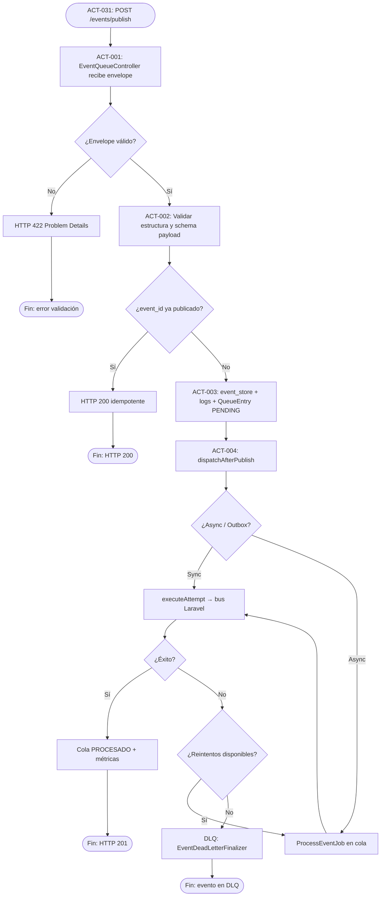

# PROC-001 — Publicación de eventos al bus

**ID:** PROC-001  
**Versión documento:** 1.0  
**Fecha:** 2026-06-27  
**Estado:** Implementado  
**Tipo:** Técnico — Operativo / Middleware / Funcional  
**Macroproceso:** MP-02 Operación Middleware y Eventos

---

## Descripción

Proceso que recibe eventos desde integradores API o llamadas internas al bus, valida el sobre mínimo, garantiza idempotencia por `event_id`, persiste trazabilidad operativa (event store, logs, cola) y despacha el evento hacia listeners/consumidores configurados. En caso de fallo transitorio o definitivo en el procesamiento asíncrono, el flujo puede derivar el evento a Dead Letter Queue (DLQ) según la política de reintentos documentada.

El pipeline documentado en código es: **validar → event_store → event_logs → message_queue → dispatch** (`EventPublisherService`).

---

## Objetivo

Permitir la publicación confiable y observable de eventos al bus de integración omnicanal, cumpliendo las capacidades C1 (recepción), C2 (tracking operativo) y C5 (observación wildcard) del plan de Middleware, sin embeber reglas de negocio vertical en el core.

---

## Alcance

**Incluye:**

- Recepción HTTP `POST /api/middleware/events/publish` (ACT-001).
- Validación estructural y de esquema de payload (ACT-002).
- Idempotencia por `event_id` y header opcional `Idempotency-Key`.
- Persistencia en event store, proyección de logs y registro `QueueEntry` PENDING (ACT-003).
- Despacho post-publicación vía `EventProcessingService` (ACT-004).
- Derivación a DLQ tras agotar reintentos (`EventDeadLetterFinalizer`).

**Excluye:**

- Transformación semántica del payload por tipo de evento (REQ-RST-02).
- Reglas de negocio retail u otros verticales (REQ-RST-01).
- Resolución manual de DLQ (PROC-003, ACT-009).
- Sincronización de registry (PROC-002).

---

## Actores

| Actor | Rol en el proceso |
|-------|---------------------|
| Integrador API / M2M | Publica eventos vía HTTP con ability `events:publish` |
| Operador bus | Supervisa cola, métricas y DLQ (lectura posterior) |
| `EventPublisherService` | Orquesta validación, persistencia y despacho |
| `EventProcessingService` | Ejecuta intentos, reintentos y finalización DLQ |
| Listeners wildcard (Dashboard) | Consumen tráfico observado (PROC-004) |
| Listeners de packs cliente | Procesamiento de negocio externo al core |

---

## Entradas

| Entrada | Formato | Origen |
|---------|---------|--------|
| Envelope JSON | `event_id`, `event_type`, `payload`, `occurred_at`, `origin` (opcional), metadatos de correlación | HTTP body o facade Laravel |
| Headers HTTP | `Idempotency-Key`, `X-Correlation-Id` | Integrador |
| Configuración eventbus | `config/eventbus.php` — suscripciones, colas, reintentos | Host / overlay runtime |
| Token / ability | `events:publish` | Autenticación plataforma |

---

## Salidas

| Salida | Descripción |
|--------|-------------|
| `PublishResult` | `entry_id`, flag `idempotent` |
| Respuesta HTTP 201 | Evento publicado (`success`, `entry_id`) |
| Respuesta HTTP 200 | Evento ya procesado (idempotente) |
| Respuesta HTTP 422 | Validación fallida (Problem Details si habilitado) |
| Fila `bus_queue_entries` | Estado PENDING → PROCESADO / FAILED / DEAD_LETTERED |
| Fila `event_store` | Append-only del evento |
| Evento en bus Laravel | Listeners invocados según `event_type` |
| Entrada DLQ | Tras agotar reintentos en `ProcessEventJob` |

---

## Reglas de negocio

| ID | Regla | Evidencia |
|----|-------|-----------|
| RN-001 | El core **no** aplica reglas de negocio vertical ni interpreta semántica del payload | REQ-RST-01 |
| RN-002 | El core **no** muta el payload por tipo de evento conocido | REQ-RST-02 |
| RN-003 | Campos mínimos del sobre: `event_id`, `event_type`, `occurred_at`, `payload` | `Plan_Modulo_Control_Middleware.md` §5.3 |
| RN-004 | Publicación duplicada por mismo `event_id` retorna resultado idempotente sin re-publicar | `EventPublishIdempotencyGuard` |
| RN-005 | Enrutamiento solo por `event_type` + registro de suscripciones, no por contenido del payload | `Plan_Modulo_Control_Middleware.md` §8 |
| RN-006 | Entrega at-least-once; consumidores deben ser idempotentes por `event_id` | `Plan_Modulo_Control_Middleware.md` §9.1 |
| RN-007 | Tras agotar reintentos, el evento se mueve a DLQ y la cola se marca dead-lettered | `EventDeadLetterFinalizer` |

---

## Precondiciones

1. Instancia silo cliente operativa con Middleware registrado (`MiddlewareServiceProvider`).
2. Integrador autenticado con ability `events:publish`.
3. Tablas operativas del bus disponibles (`bus_queue_entries`, event store, DLQ).
4. Suscripciones resueltas vía `SubscriptionRegistryService` (config fusionada).
5. Si procesamiento async: worker de cola `middleware` en ejecución.

---

## Postcondiciones

1. Evento persistido en event store y cola con estado coherente.
2. Listeners de dominio y observación invocados (salvo defer en simulación).
3. Métricas SLI/trazas registradas (`bus_events_published_total`, span `bus.publish`).
4. Si fallo definitivo: entrada DLQ creada y cola marcada DEAD_LETTERED.
5. Dashboard puede proyectar el evento si cumple contrato mínimo (PROC-004).

---

## Flujo principal (paso a paso)

| Paso | Actividad | Descripción |
|------|-----------|-------------|
| 1 | **ACT-031** Evento inicio | Integrador envía `POST /api/middleware/events/publish` |
| 2 | **ACT-001** Recepción HTTP | `EventQueueController::publish` autoriza, normaliza envelope y headers |
| 3 | Gateway validación | ¿Envelope estructuralmente válido? |
| 4 | **ACT-002** Validación | `PublishEnvelopeValidator`, `PublishPayloadSchemaValidator`, defaults de esquema |
| 5 | Gateway idempotencia | ¿`event_id` ya publicado? → retorno 200 idempotente |
| 6 | **ACT-003** Persistencia tracking | Append event store → proyección logs → `QueueEntry` PENDING |
| 7 | Resolución consumidores | `SubscriptionRegistryService::getConsumersFor(event_type)` |
| 8 | **ACT-004** Despacho bus | `EventProcessingService::dispatchAfterPublish` (sync, async job u outbox) |
| 9 | Ejecución intento | `EventProcessingAttemptExecutor::executeAttempt` → publish a bus Laravel |
| 10 | Actualización estado | Cola PROCESADO; métricas y logs estructurados |
| 11 | **Fin** | Respuesta HTTP 201 al integrador |

---

## Flujos alternativos

### FA-01 — Idempotencia por `event_id`

- **Condición:** `EventPublishIdempotencyGuard::isAlreadyPublished(event_id)` es true.
- **Acción:** Retorna `PublishResult` con `idempotent: true` y `entry_id` existente.
- **Respuesta:** HTTP 200 `already_processed`.

### FA-02 — Idempotencia por header HTTP

- **Condición:** Header `Idempotency-Key` presente y respuesta cacheada en `IdempotencyKeyStore`.
- **Acción:** Retorna body/status cacheado sin re-ejecutar pipeline.

### FA-03 — Procesamiento asíncrono

- **Condición:** `eventbus.resilience.async_processing = true`.
- **Acción:** Encola `ProcessEventJob` en cola `middleware`; ACT-004 continúa en worker.

### FA-04 — Outbox pattern

- **Condición:** `eventbus.outbox.enabled = true`.
- **Acción:** Encola en outbox y despacha `RelayOutboxJob`.

### FA-05 — Defer en simulación

- **Condición:** `SimulationPublishScope::shouldDeferProcessing()` activo.
- **Acción:** Persistencia completada; despacho diferido para orquestación de simulación.

### FA-06 — Publicación programática

- **Condición:** Llamada directa a `EventPublisherService::publish` (facade, jobs internos).
- **Acción:** Mismo pipeline sin pasar por ACT-001 HTTP.

---

## Excepciones

| Código / Escenario | Causa | Tratamiento |
|--------------------|-------|-------------|
| EX-001 Validación envelope | Campos obligatorios ausentes o inválidos | HTTP 422; no persiste |
| EX-002 Validación esquema payload | Payload no cumple schema del `event_type` | `InvalidArgumentException` → 422 |
| EX-003 Fallo transitorio procesamiento | Excepción en `executeAttempt` | Reintento según `RetryPolicy`; registro en event_logs |
| EX-004 Circuit breaker abierto | Demasiados fallos en conector | `RuntimeException`; reintento/backoff |
| EX-005 Agotamiento reintentos | `ProcessEventJob` falla definitivamente | `ProcessEventJobFailureListener` → DLQ (EX-006) |
| EX-006 Dead Letter | Reintentos agotados | `EventDeadLetterFinalizer::finalize`; warning estructurado |
| EX-007 No autorizado | Falta ability `events:publish` | HTTP 403 antes de ACT-001 |

---

## Eventos

| Evento BPMN | Tipo | Descripción |
|-------------|------|-------------|
| ACT-031 | Evento inicio | HTTP POST publish o dispatch interno |
| Evento Laravel host | Intermedio | Despacho a listeners por `event_type` |
| Wildcard observado | Intermedio | Capturado por listeners `*` (Dashboard) |
| DLQ created | Intermedio | Evento movido a dead letter |
| Fin publicación | Evento fin | Respuesta HTTP o `PublishResult` entregado |

---

## Dependencias

| Dependencia | Tipo | Proceso / componente |
|-------------|------|----------------------|
| Autenticación API | Previo | PROC-006 |
| Sync registry (topología coherente) | Recomendado | PROC-002 |
| Activación LIVE módulos | Condicional (simulación) | PROC-004 / `ModuleActivationGateService` |
| Workers cola Laravel | Infra | Cola `middleware` |
| Config eventbus | Config | `config/eventbus.php` |

---

## Riesgos

| ID | Riesgo | Mitigación documentada |
|----|--------|------------------------|
| R1 | Saturación bajo pico | Escalar workers, alertas profundidad cola (`Plan_Modulo_Control_Middleware.md` §10 R1) |
| R2 | DLQ sin proceso operativo | Panel visible + runbook (`Plan_Modulo_Control_Middleware.md` §10 R2) |
| R3 | Publicación no autenticada | Abilities + throttle publish (`MiddlewareApiRoutes.php`) |
| R4 | Duplicados por at-least-once | Idempotencia por `event_id` (RN-004) |
| R5 | Crecimiento tablas tracking | PROC-014 retención |

---

## Indicadores

| Indicador | Fuente |
|-----------|--------|
| `bus_events_published_total` | `SliMetricsRecorder` en `EventPublisherService` |
| Latencia publish (span `bus.publish`) | `TraceSpanService` |
| Profundidad cola / EPS / error rate | APIs métricas bus (PROC-003) |
| Conteo entradas DLQ | `GET /api/middleware/dead-letters` |
| Tasa idempotencia | Logs `already_processed` / métricas API |

---

## Relación con otros procesos

| Proceso | Relación |
|---------|----------|
| PROC-002 | Sync registry previo recomendado para metadatos consumidores en cola |
| PROC-003 | Consulta cola, búsqueda por `event_id`, resolución DLQ |
| PROC-004 | Observa tráfico wildcard post-despacho |
| PROC-006 | Autenticación previa del integrador |
| PROC-009 | Publicación de fixtures en simulación E2E |
| PROC-011 | Webhooks transformados a publish |
| PROC-013 | Alertas sobre profundidad cola / DLQ |

---

## Componentes involucrados

| Capa | Componente |
|------|------------|
| HTTP | `EventQueueController`, `MiddlewareApiRoutes` |
| Aplicación | `EventPublisherService`, `EventProcessingService`, `EventPublishIdempotencyGuard`, `PublishEnvelopeValidator`, `SubscriptionRegistryService` |
| Procesamiento | `EventProcessingDispatchPlanner`, `EventProcessingAttemptExecutor`, `EventDeadLetterFinalizer`, `ProcessEventJob`, `ProcessEventJobFailureListener` |
| Dominio | `QueueEntry`, `StoredEvent`, `DeadLetterEntry` |
| Infraestructura | `LaravelEventBusAdapter`, repositorios persistencia bus |
| Observabilidad | `TraceSpanService`, `SliMetricsRecorder`, `PlatformStructuredLogger` |

---

## Documentación relacionada

- `docs/Plan_Desarrollo_Modulos_v0.1/Plan_Modulo_Control_Middleware.md`
- `docs/production/Plan_Middleware.md`
- `docs/production/Plan_Resiliencia.md`
- `docs/testing/integration_flujo_eventos_bus.md`
- `docs/Diagrama_BPMN/00_Mapa_Procesos.md`
- `docs/Diagrama_BPMN/Matriz_Trazabilidad_BPMN.md`

---

## Trazabilidad

| Elemento | Evidencia |
|----------|-----------|
| PROC-001 | `docs/Patente/matriz_generada/procesos.csv` fila PROC-001 |
| ACT-001–004, ACT-031 | `docs/Patente/matriz_generada/actividades_bpmn.csv` |
| REQ-RST-01, REQ-RST-02 | `docs/Patente/matriz_generada/requerimientos.csv` |
| Pipeline publish | `app/Middleware/Application/Services/EventPublisherService.php` |
| Endpoint publish | `app/Shared/Api/Routes/MiddlewareApiRoutes.php` L45–46 |
| Controller publish | `app/Middleware/Interfaces/Http/Controllers/EventQueueController.php` |
| DLQ finalizer | `app/Middleware/Application/Services/Processing/EventDeadLetterFinalizer.php` |
| Job failure → DLQ | `app/Middleware/Listeners/ProcessEventJobFailureListener.php` |
| Capabilities C1, C2, C5 | `docs/Plan_Desarrollo_Modulos_v0.1/Plan_Modulo_Control_Middleware.md` §3 |
| Criterios evaluación C05–C08 | `docs/evaluation/02_Matriz_Middleware.csv` |

---

## Diagrama Mermaid

---

## BPMN Mapping

| Elemento BPMN | Identificador / descripción |
|---------------|----------------------------|
| **Evento Inicio** | ACT-031 — `POST /api/middleware/events/publish` o invocación interna `EventPublisherService::publish` |
| **Eventos Intermedios** | Despacho Laravel Event; job `ProcessEventJob` encolado; evento wildcard observado; creación entrada DLQ |
| **Evento Final** | HTTP 201/200 al integrador; o evento en DLQ tras agotar reintentos |
| **Actividades** | ACT-001 Recepción HTTP; ACT-002 Validación; ACT-003 Persistencia tracking; ACT-004 Despacho bus |
| **Subprocesos** | Validación envelope (validator + schema); pipeline persistencia (store + logs + queue); pipeline procesamiento (attempt + retry) |
| **Gateways** | GW-VAL: ¿envelope válido?; GW-IDEM: ¿event_id duplicado?; GW-MODE: sync vs async vs outbox; GW-OK: ¿intento exitoso?; GW-RETRY: ¿reintentos restantes? |
| **Pools** | Pool Integrador Externo; Pool Silo Middleware |
| **Lanes** | Lane API Gateway (`EventQueueController`); Lane Publicación (`EventPublisherService`); Lane Procesamiento (`EventProcessingService` / jobs); Lane Resiliencia (`EventDeadLetterFinalizer`) |
| **Mensajes** | Msg-Publish-Request (JSON envelope); Msg-Publish-Response (201/200/422); Msg-Bus-Dispatch (evento Laravel); Msg-DLQ-Record |
| **Objetos de datos** | Envelope JSON; `PublishResult`; `QueueEntry`; `StoredEvent`; `DeadLetterEntry` |
| **Almacenes** | Event store; `bus_queue_entries`; `event_logs`; `dead_letters`; `idempotency_keys` |
| **Artefactos** | OpenAPI publish; `config/eventbus.php`; Plan Middleware §6 |
| **Asociaciones** | Envelope → ACT-002; QueueEntry → ACT-004; ProcessEventJob → GW-RETRY; DLQ → PROC-003 consulta/resolución |

---

*Fin del documento PROC-001*
