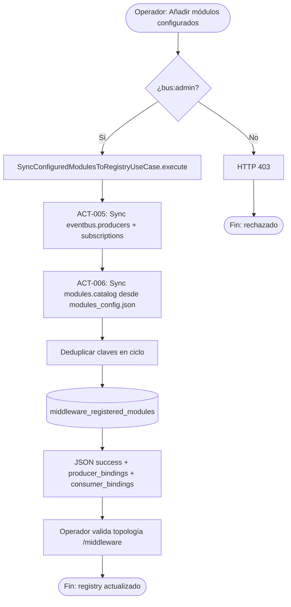

# PROC-002 — Sincronización catálogo declarativo al registry

**ID:** PROC-002  
**Versión documento:** 1.0  
**Fecha:** 2026-06-27  
**Estado:** Implementado  
**Tipo:** Técnico — Operativo / Middleware  
**Macroproceso:** MP-02 Operación Middleware y Eventos

---

## Descripción

Proceso **manual** ejecutado por el operador de middleware en la instancia silo (Etapa 8 del flujo certificado) para materializar en persistencia (`middleware_registered_modules`) las declaraciones provenientes de dos fuentes de configuración: el catálogo operativo del bus (`config/eventbus.php`) y el catálogo declarativo del cliente (`modules_config.json` vía `config/modules.catalog`). Unifica ambas fuentes en el registry sin fusionar archivos en disco.

---

## Objetivo

Garantizar coherencia entre la topología declarada (Dashboard + JSON) y el registro persistente del Middleware (capability C4), permitiendo que operadores reflejen cambios de configuración con un único endpoint tras editar archivos locales o recibir espejo desde Control Plane.

---

## Alcance

**Incluye:**

- Trigger manual del operador: botón «Añadir módulos configurados» o `POST /api/middleware/registry/sync-config`.
- ACT-005: sincronización de productores y suscripciones desde `eventbus.*`.
- ACT-006: sincronización de productores y suscriptores desde `modules.catalog` / `modules_config.json`.
- Upsert idempotente en `middleware_registered_modules`.

**Excluye:**

- Edición de archivos de configuración (actividad previa del operador o PROC-034).
- Validación CI de alineación (PROC-016).
- Publicación de eventos (PROC-001).
- Sync automático en boot del silo (overlay eventbus documentado en certificación, distinto de este proceso).

---

## Actores

| Actor | Rol |
|-------|-----|
| Operador middleware / bus | Dispara sync manual en portal `/middleware` |
| Operador tenant (Etapa 8) | Ejecuta acción tras configurar catálogo y activar módulos |
| `SyncConfiguredModulesToRegistryUseCase` | Orquesta sync |
| `ConfiguredModuleRegistrySyncService` | Implementa upsert en registry |
| Admin SaaS (indirecto) | Configura catálogo en CP que se espeja al silo (PROC-034) |

---

## Entradas

| Entrada | Origen |
|---------|--------|
| `config('eventbus.producers')` | `config/eventbus.php` |
| `config('eventbus.subscriptions')` | `config/eventbus.php` |
| `config('modules.catalog')` | `config/modules/modules_config.json` (instancia) |
| Token con ability `bus:admin` | Autenticación plataforma |
| Catálogo espejado desde CP | PROC-034 → `modules_config.json` |

---

## Salidas

| Salida | Descripción |
|--------|-------------|
| JSON `{ success, producer_bindings, consumer_bindings }` | Contadores de vínculos únicos aplicados |
| Filas `middleware_registered_modules` | Registry actualizado (merge `event_types`) |
| Topología coherente en UI Middleware | `GET /api/middleware/topology` post-sync |

---

## Reglas de negocio

| ID | Regla |
|----|-------|
| RN-001 | Sync es **intencionalmente manual** en Etapa 8 del flujo operativo certificado |
| RN-002 | No se fusionan archivos en disco; solo se unifica persistencia del registry |
| RN-003 | Vínculos duplicados (mismo `logical_id`, `type`, `event_type`) se omiten en el mismo ciclo |
| RN-004 | Ejecutar sync múltiples veces con misma config es idempotente (unique constraint + merge) |
| RN-005 | Productores JSON requieren `id`, `name`, `event_types_emitted` |
| RN-006 | Suscriptores JSON requieren `id`, `name`, `event_types_consumed` |
| RN-007 | Tras editar catálogo en CP, el cliente debe ejecutar sync-config (mensaje en `CompanyController`) |

---

## Precondiciones

1. Operador autenticado con ability `bus:admin`.
2. Archivos de configuración presentes y legibles (`eventbus.php`, `modules_config.json` si aplica).
3. Instancia silo con tablas middleware provisionadas.
4. En flujo certificado: catálogo técnico configurado en CP y espejado (PROC-034); módulos activados en panel LIVE (Etapa 6).

---

## Postcondiciones

1. Registry persistente refleja declaraciones de eventbus y modules.catalog.
2. Contadores de bindings expuestos en respuesta HTTP.
3. Topología Middleware alineada con catálogo declarativo del Dashboard (capa registry).
4. Sin filas duplicadas por restricción `(logical_id, type)`.

---

## Flujo principal (paso a paso)

| Paso | Actividad | Descripción |
|------|-----------|-------------|
| 1 | Evento inicio | Operador pulsa «Añadir módulos configurados» en `/middleware` |
| 2 | Autorización | Middleware verifica `bus:admin` |
| 3 | **ACT-005** Sync eventbus | Recorre `eventbus.producers` y `eventbus.subscriptions`; upsert registry |
| 4 | **ACT-006** Sync modules.catalog | Recorre catálogo declarativo JSON; upsert productores y suscriptores |
| 5 | Deduplicación | Claves ya aplicadas omitidas en memoria durante el ciclo |
| 6 | Persistencia | `DatabaseModuleRegistry` merge de `event_types` por módulo |
| 7 | Respuesta | Retorna contadores `producer_bindings`, `consumer_bindings` |
| 8 | Fin | Operador valida topología y puede proceder a simulación/producción (PROC-001) |

---

## Flujos alternativos

### FA-01 — Solo eventbus configurado

- **Condición:** `modules_config.json` vacío o ausente.
- **Acción:** ACT-005 ejecuta; ACT-006 no genera bindings adicionales.

### FA-02 — Solo catálogo JSON

- **Condición:** `eventbus.subscriptions` vacío pero JSON con módulos.
- **Acción:** ACT-006 pobla registry; routing runtime depende de overlay/boot documentado aparte.

### FA-03 — Sync vía API directa (sin UI)

- **Condición:** `POST /api/middleware/registry/sync-config` desde cliente HTTP/CLI.
- **Acción:** Mismo caso de uso; contrato HTTP sin cambios.

### FA-04 — Post-espejo CP→Silo

- **Condición:** PROC-034 escribió `modules_config.json`; operador aún debe sync manual.
- **Acción:** ACT-006 materializa JSON recién espejado; mensaje CP recuerda sync en cliente.

### FA-05 — Simulación E2E

- **Condición:** `platform:simulate-client` incluye paso sync en runbook.
- **Acción:** Mismo endpoint antes de publicar fixtures (PROC-009).

---

## Excepciones

| Escenario | Tratamiento |
|-----------|-------------|
| EX-001 No autorizado | HTTP 403 — falta `bus:admin` |
| EX-002 Config ilegible | Error runtime al cargar config/modules |
| EX-003 Entrada JSON inválida en catálogo | Entradas sin `id`/`name`/tipos omitidas o error según validación interna |
| EX-004 BD registry no disponible | Fallo persistencia; operador reintenta |

---

## Eventos

| Evento | Tipo |
|--------|------|
| Click operador / POST sync-config | Inicio |
| Upsert registry completado | Intermedio |
| Respuesta success con contadores | Fin |

---

## Dependencias

| Dependencia | Proceso |
|-------------|---------|
| Catálogo espejado en silo | PROC-034 |
| Overlay eventbus en boot | `TenantCatalogRuntimeBootstrapper` (complementario) |
| Validación alineación CI | PROC-016 (opcional previo) |
| Publicación eventos | PROC-001 (posterior) |

---

## Riesgos

| Riesgo | Mitigación |
|--------|------------|
| Operador olvida sync tras editar JSON | Etapa 8 manual documentada; mensajes CP y runbooks |
| Divergencia eventbus vs JSON | B.2 unifica en registry; `platform:validate-catalog` |
| Registry vacío en demos | Checklist simulación exige sync previo |

---

## Indicadores

| Indicador | Fuente |
|-----------|--------|
| `producer_bindings` / `consumer_bindings` por sync | Respuesta HTTP sync-config |
| Conteo filas `middleware_registered_modules` | BD silo |
| Gap config vs observed en topología | `GET /api/middleware/topology` |

---

## Relación con otros procesos

| Proceso | Relación |
|---------|----------|
| PROC-034 | Provee `modules_config.json` espejado desde CP |
| PROC-001 | Consume registry para metadatos consumidores en cola |
| PROC-003 | Expone topología post-sync |
| PROC-009 | Sync como paso previo en simulación |
| PROC-016 | Validación CI de coherencia catálogos |
| PROC-004 | Dashboard lee catálogo JSON; registry coherente tras sync |

---

## Componentes involucrados

| Componente | Ruta |
|------------|------|
| `ModuleRegistrySyncController` | `app/Middleware/Interfaces/Http/Controllers/ModuleRegistrySyncController.php` |
| `SyncConfiguredModulesToRegistryUseCase` | `app/Middleware/Application/UseCases/SyncConfiguredModulesToRegistryUseCase.php` |
| `ConfiguredModuleRegistrySyncService` | Registry sync implementation |
| `DatabaseModuleRegistry` | Persistencia `middleware_registered_modules` |
| `MiddlewareApiRoutes` | Ruta `POST /registry/sync-config` |
| UI Middleware | Botón «Añadir módulos configurados» |

---

## Documentación relacionada

- `docs/production/Plan_de_implementacion.md` §B.2
- `docs/personal_notes/B2_sync_ampliado.md`
- `docs/refactorizacion_Informes/Certificacion_Flujo_Operativo_Oficial.md` §Etapa 8
- `docs/Plan_Desarrollo_Modulos_v0.1/Plan_Modulo_Control_Middleware.md` §4.1
- `config/control_module_manual.php`

---

## Trazabilidad

| Elemento | Evidencia |
|----------|-----------|
| PROC-002 | `docs/Patente/matriz_generada/procesos.csv` |
| ACT-005, ACT-006 | `docs/Patente/matriz_generada/actividades_bpmn.csv` |
| Endpoint sync-config | `app/Shared/Api/Routes/MiddlewareApiRoutes.php` L34 |
| Use case | `app/Middleware/Application/UseCases/SyncConfiguredModulesToRegistryUseCase.php` |
| B.2 implementado | `docs/production/Plan_de_implementacion.md` §1.1, §B.2 |
| Etapa 8 manual | `docs/refactorizacion_Informes/Certificacion_Flujo_Operativo_Oficial.md` L106–112, L181 |
| Flujo ampliado sync | `docs/personal_notes/B2_sync_ampliado.md` |
| Capability C4 | `docs/Plan_Desarrollo_Modulos_v0.1/Plan_Modulo_Control_Middleware.md` §3 |
| Matriz evaluación C05 | `docs/evaluation/02_Matriz_Middleware.csv` |

---

## Diagrama Mermaid

---

## BPMN Mapping

| Elemento BPMN | Identificador / descripción |
|---------------|----------------------------|
| **Evento Inicio** | Click operador en UI Middleware o `POST /api/middleware/registry/sync-config` |
| **Eventos Intermedios** | Lectura configs; upsert parcial eventbus; upsert parcial modules.catalog |
| **Evento Final** | Respuesta HTTP success con contadores; registry persistido |
| **Actividades** | ACT-005 Sincronizar eventbus al registry; ACT-006 Sincronizar modules_config al registry |
| **Subprocesos** | SP-UPSERT-EB: upsert desde eventbus; SP-UPSERT-MC: upsert desde modules.catalog |
| **Gateways** | GW-AUTH: ¿ability bus:admin?; GW-SOURCE: ¿hay catálogo JSON? |
| **Pools** | Pool Operador Tenant; Pool Middleware Silo |
| **Lanes** | Lane UI (`/middleware`); Lane API (`ModuleRegistrySyncController`); Lane Registry (`ConfiguredModuleRegistrySyncService`) |
| **Mensajes** | Msg-Sync-Request (POST vacío/authenticated); Msg-Sync-Response (bindings counts) |
| **Objetos de datos** | Config eventbus; modules_config.json; filas registry |
| **Almacenes** | `middleware_registered_modules`; filesystem `config/modules/instances/{slug}/` |
| **Artefactos** | Plan_de_implementacion B.2; Certificación Etapa 8 |
| **Asociaciones** | modules_config.json → ACT-006; eventbus.php → ACT-005; registry → PROC-003 topology |

---

*Fin del documento PROC-002*
