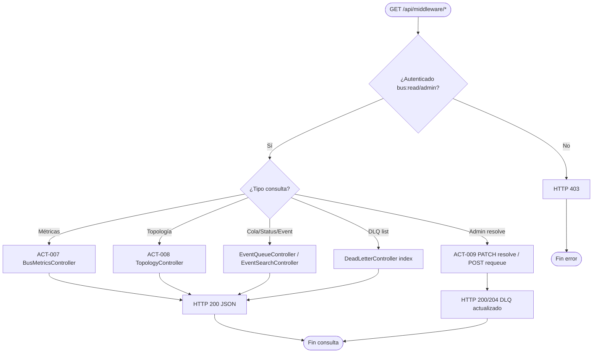

# PROC-003 — Consulta operativa del bus

**ID:** PROC-003  
**Versión documento:** 1.0  
**Fecha:** 2026-06-27  
**Estado:** Implementado  
**Tipo:** Técnico — Operativo / Middleware / Observabilidad  
**Macroproceso:** MP-02 Operación Middleware y Eventos

---

## Descripción

Proceso de lectura operativa del bus de integración que expone métricas, estado de cola, topología declarativa y observada, búsqueda por `event_id`, listado de dead letters y resolución manual de entradas DLQ. Cubre la capability C3 del plan Middleware y complementa PROC-001 (publicación) con visibilidad para operadores e integradores autorizados.

---

## Objetivo

Permitir consultas operativas confiables sobre el estado del bus (cola, métricas, topología, DLQ) sin mutar el tráfico de eventos, cumpliendo REQ-C3 y habilitando operación, diagnóstico y resolución manual documentada en PROC-001.

---

## Alcance

**Incluye:**

- ACT-007: consulta métricas bus (`GET /metrics`).
- ACT-008: consulta topología (`GET /topology`).
- ACT-009: resolución y requeue de dead letters (`PATCH/POST /dead-letters/*`).
- Consulta cola (`GET /queue`), estado bus (`GET /status`), búsqueda evento (`GET /events/{eventId}`).
- Listado DLQ (`GET /dead-letters`) con ability `bus:read`.
- Operaciones administrativas con ability `bus:admin`: sync registry, refresh métricas, resolve/requeue DLQ.
- Pulse de simulación (`GET /simulation-pulse`).

**Excluye:**

- Publicación de eventos (PROC-001).
- Sincronización registry (PROC-002) — aunque expone endpoint admin relacionado.
- Proyección dashboard UI (PROC-004).
- Transformación semántica de payloads (REQ-RST-02).

---

## Actores

| Actor | Rol en el proceso |
|-------|---------------------|
| Operador bus / middleware | Consulta cola, métricas, topología y DLQ |
| Integrador API / M2M | Consulta estado y búsqueda por `event_id` con `bus:read` |
| Admin bus | Resuelve o reencola DLQ con `bus:admin` |
| `BusMetricsController` | Expone métricas agregadas |
| `TopologyController` | Expone topología config + observada |
| `EventSearchController` | Búsqueda por `event_id` y estado general |
| `DeadLetterController` | Listado, resolución y requeue DLQ |
| `EventQueueController` | Listado cola (`index`) |

---

## Entradas

| Entrada | Formato | Origen |
|---------|---------|--------|
| Token / ability | `bus:read` o `bus:admin` | Autenticación plataforma (PROC-006) |
| Parámetros query | Filtros paginación, IDs DLQ | Request HTTP |
| Config eventbus | `config/eventbus.php` | Host / overlay runtime |
| Persistencia bus | `bus_queue_entries`, DLQ, event store | BD silo cliente |
| Headers HTTP | `Accept: application/json`, Bearer/API key | Cliente API |

---

## Salidas

| Salida | Descripción |
|--------|-------------|
| JSON métricas | EPS, latencia, profundidad cola, contadores |
| JSON topología | Config declarativa + nodos observados |
| JSON cola | Entradas `QueueEntry` con estados |
| JSON evento | Detalle por `event_id` |
| JSON dead letters | Listado entradas DLQ |
| HTTP 200/204 | Resolución o requeue DLQ exitoso |
| HTTP 403 | Ability insuficiente |
| Audit log | Acciones admin (`platform.audit`) |

---

## Reglas de negocio

| ID | Regla | Evidencia |
|----|-------|-----------|
| RN-003-01 | Lectura requiere ability `bus:read` | `MiddlewareApiRoutes.php` L23–31 |
| RN-003-02 | Mutaciones admin (DLQ, sync, refresh) requieren `bus:admin` | `MiddlewareApiRoutes.php` L33–43 |
| RN-003-03 | Throttle `platform-api` en lecturas; `platform-sync` en sync | `MiddlewareApiRoutes.php` |
| RN-003-04 | Resolución DLQ es operación manual según política | `actividades_bpmn.csv` ACT-009 |
| RN-003-05 | Core no interpreta semántica del payload en consultas | REQ-RST-01 |
| RN-003-06 | Capability C3: consultas cola, topología, búsqueda `event_id` | REQ-C3 |

---

## Precondiciones

1. Instancia silo operativa con Middleware registrado.
2. Cliente autenticado con ability `bus:read` (consulta) o `bus:admin` (mutación).
3. Tablas operativas del bus disponibles.
4. Para métricas actualizadas: opcional `POST /metrics/refresh` (admin).

---

## Postcondiciones

1. Operador/integrador recibe respuesta JSON operativa coherente con persistencia.
2. Tras resolve/requeue DLQ: estado actualizado en BD; audit registrado.
3. Métricas disponibles para PROC-004 y PROC-013.
4. Sin alteración del pipeline de publicación (PROC-001).

---

## Flujo principal (paso a paso)

| Paso | Actividad | Descripción |
|------|-----------|-------------|
| 1 | Evento inicio | Cliente envía `GET /api/middleware/*` autenticado |
| 2 | Autorización | Middleware `auth.platform` + `platform.ability:bus:read` |
| 3 | **ACT-007** Consultar métricas | `BusMetricsController::index` — agregados SLI |
| 4 | **ACT-008** Consultar topología | `TopologyController::index` — config + observed |
| 5 | Consulta cola | `EventQueueController::index` — entradas PENDING/PROCESADO/FAILED |
| 6 | Búsqueda evento | `EventSearchController::show` por `eventId` |
| 7 | Listado DLQ | `DeadLetterController::index` |
| 8 | **Fin consulta** | HTTP 200 JSON |

---

## Flujos alternativos

### FA-01 — Refresh métricas (admin)

- **Condición:** `POST /metrics/refresh` con `bus:admin`.
- **Acción:** Recalcula/agrega métricas antes de consulta.
- **Audit:** `platform.audit:metrics.refresh,bus_metrics`.

### FA-02 — Resolución DLQ (admin)

- **Condición:** Operador resuelve entrada DLQ manualmente.
- **Acción:** `PATCH /dead-letters/{id}/resolve` (ACT-009).
- **Resultado:** Entrada marcada resuelta; warning estructurado cerrado.

### FA-03 — Requeue DLQ (admin)

- **Condición:** Evento debe reintentarse tras corrección.
- **Acción:** `POST /dead-letters/{id}/requeue`.
- **Resultado:** Reencolado según política; vinculado a PROC-001.

### FA-04 — Pulse simulación

- **Condición:** Simulación activa en instancia.
- **Acción:** `GET /simulation-pulse` expone estado run.
- **Relación:** PROC-009 / PROC-020.

### FA-05 — Sync registry desde consulta admin

- **Condición:** Admin invoca `POST /registry/sync-config` (ability `bus:admin`).
- **Acción:** Deriva a PROC-002; no es lectura pura.

---

## Excepciones

| Código / Escenario | Causa | Tratamiento |
|--------------------|-------|-------------|
| EX-003-01 | No autorizado — falta `bus:read` | HTTP 403 |
| EX-003-02 | No autorizado — falta `bus:admin` en mutación | HTTP 403 |
| EX-003-03 | `event_id` no encontrado | HTTP 404 |
| EX-003-04 | DLQ id inválido o ya resuelto | HTTP 422/404 |
| EX-003-05 | Throttle excedido | HTTP 429 |
| EX-003-06 | BD no disponible | HTTP 503 |

---

## Eventos

| Evento BPMN | Tipo | Descripción |
|-------------|------|-------------|
| GET middleware | Evento inicio | Request consulta operativa |
| Métricas entregadas | Intermedio | ACT-007 completado |
| Topología entregada | Intermedio | ACT-008 completado |
| DLQ resuelto | Intermedio | ACT-009 completado |
| Fin consulta | Evento fin | Respuesta JSON al cliente |

---

## Dependencias

| Dependencia | Tipo | Proceso / componente |
|-------------|------|----------------------|
| Autenticación API | Previo | PROC-006 |
| Publicación previa | Datos | PROC-001 genera cola/DLQ |
| Config eventbus | Config | `config/eventbus.php` |
| Sync registry | Recomendado | PROC-002 para topología coherente |
| Dashboard | Consumidor | PROC-004 lee métricas paralelas |

---

## Riesgos

| ID | Riesgo | Mitigación documentada |
|----|--------|------------------------|
| R1 | DLQ sin proceso operativo | Panel visible + ACT-009 resolve/requeue |
| R2 | Métricas desactualizadas | Endpoint refresh admin |
| R3 | Exposición datos sensibles en payload | Consulta operativa; RBAC `bus:read` |
| R4 | Saturación consultas bajo pico | Throttle `platform-api` |

---

## Indicadores

| Indicador | Fuente |
|-----------|--------|
| Profundidad cola | `GET /api/middleware/queue` |
| EPS / latencia | `GET /api/middleware/metrics` |
| Conteo DLQ | `GET /api/middleware/dead-letters` |
| Tasa resolución DLQ | Audit logs + estado DLQ |
| Criterios C06–C08 | `docs/evaluation/02_Matriz_Middleware.csv` |

---

## Relación con otros procesos

| Proceso | Relación |
|---------|----------|
| PROC-001 | Genera datos consultados (cola, DLQ) |
| PROC-002 | Topología registry coherente |
| PROC-004 | Dashboard proyecta mismas señales |
| PROC-006 | Autenticación previa |
| PROC-013 | Alertas sobre profundidad cola / DLQ |
| PROC-014 | Retención purga datos históricos consultados |

---

## Componentes involucrados

| Capa | Componente |
|------|------------|
| HTTP | `BusMetricsController`, `TopologyController`, `EventSearchController`, `DeadLetterController`, `EventQueueController` |
| Rutas | `MiddlewareApiRoutes` |
| Aplicación | Servicios métricas, topología, búsqueda, DLQ |
| Dominio | `QueueEntry`, `DeadLetterEntry`, `StoredEvent` |
| Infraestructura | Repositorios persistencia bus |
| Seguridad | `auth.platform`, `platform.ability`, `platform.audit` |

---

## Documentación relacionada

- `docs/Plan_Desarrollo_Modulos_v0.1/Plan_Modulo_Control_Middleware.md` §3 C3, §6
- `docs/production/Plan_Middleware.md`
- `docs/Diagrama_BPMN/10_Proceso_Publicacion_Eventos_Bus.md`
- `docs/Diagrama_BPMN/00_Mapa_Procesos.md`

---

## Trazabilidad

| Elemento | Evidencia |
|----------|-----------|
| PROC-003 | `docs/Patente/matriz_generada/procesos.csv` fila PROC-003 |
| ACT-007–009 | `docs/Patente/matriz_generada/actividades_bpmn.csv` |
| REQ-C3 | `docs/Patente/matriz_generada/requerimientos.csv` |
| Rutas API | `app/Shared/Api/Routes/MiddlewareApiRoutes.php` |
| Abilities | `config/platform_roles.php` — `bus:read`, `bus:admin` |

---

## Diagrama Mermaid

---

## BPMN Mapping

| Elemento BPMN | Identificador / descripción |
|---------------|----------------------------|
| **Evento Inicio** | GET request autenticado bajo `/api/middleware/*` |
| **Eventos Intermedios** | Métricas calculadas; topología ensamblada; DLQ mutado |
| **Evento Final** | HTTP 200 JSON; o HTTP 403/404 |
| **Actividades** | ACT-007 Consultar métricas; ACT-008 Consultar topología; ACT-009 Resolver dead letter |
| **Subprocesos** | Agregación métricas; ensamblaje topología; resolución DLQ |
| **Gateways** | GW-AUTH: ¿ability válida?; GW-TYPE: tipo de consulta; GW-ADMIN: ¿mutación admin? |
| **Pools** | Pool Operador/Integrador; Pool Silo Middleware |
| **Lanes** | Lane API Gateway; Lane Consulta (`*Controller`); Lane Admin DLQ |
| **Mensajes** | Msg-Metrics-Response; Msg-Topology-Response; Msg-DLQ-Resolve |
| **Objetos de datos** | JSON métricas; JSON topología; `QueueEntry`; `DeadLetterEntry` |
| **Almacenes** | `bus_queue_entries`; `dead_letters`; `event_store`; `event_logs` |
| **Artefactos** | OpenAPI middleware; `config/eventbus.php` |
| **Asociaciones** | DLQ → PROC-001 origen; métricas → PROC-004 dashboard |

---

*Fin del documento PROC-003*
