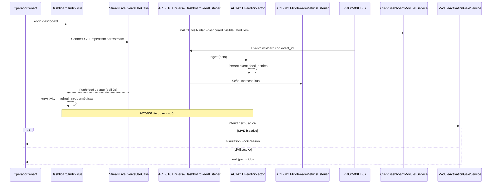

# PROC-004 — Observabilidad dashboard

**ID:** PROC-004  
**Versión documento:** 1.0  
**Fecha:** 2026-06-27  
**Estado:** Implementado  
**Tipo:** Técnico — Observabilidad / Funcional  
**Macroproceso:** MP-03 Observabilidad y Monitoreo

---

## Descripción

Proceso de observación pasiva que proyecta tráfico del bus hacia read models del Dashboard: feed de eventos, métricas del motor, KPIs configurables, topología declarativa y actualización en tiempo real vía SSE. Consume eventos wildcard sin catálogo fijo en el core. Aplica reglas de visibilidad (`dashboard_visible_modules`) y activación operativa (`ModuleActivationGate` / panel LIVE) documentadas en la certificación operativa.

---

## Objetivo

Cumplir objetivos O1–O5 del plan Dashboard: feed observable, KPIs desde config, métricas bus, topología declarativa y stream SSE opcional (capability C5 middleware + REQ-O1–O5).

---

## Alcance

**Incluye:**

- ACT-010: observación wildcard (`UniversalDashboardFeedListener`).
- ACT-011: proyección feed entries (`EventFeedProjector` / `DashboardBusEventIngestionService`).
- ACT-012: actualización métricas middleware (`MiddlewareMetricsListener`).
- ACT-013: render KPIs/series (`GetDynamicMetricSeriesUseCase`).
- ACT-032: evento fin observación — feed/métricas actualizados.
- SSE `GET /api/dashboard/stream` + frontend `useDashboardEventStream`.
- Filtrado topología por `dashboard_visible_modules` ∩ `modules_catalog`.
- Gate activación LIVE para simulación (`ModuleActivationGateService`).

**Excluye:**

- Validación reglas negocio sobre payload.
- Escritura en sistemas externos.
- WebSockets (limitación documentada; SSE + polling cubren contrato).
- Activación remota de módulos desde CP.

---

## Actores

| Actor | Rol |
|-------|-----|
| Operador tenant / dashboard viewer | Accede `/dashboard`, configura visibilidad módulos |
| Operador middleware | Panel LIVE — toggles activación |
| `UniversalDashboardFeedListener` | Ingesta wildcard |
| `ClientDashboardModulesService` | Gobierna visibilidad dashboard |
| `ModuleActivationGateService` | Bloquea simulación si módulos inactivos |
| `StreamLiveEventsUseCase` | Push SSE feed |
| Frontend Vue | `Dashboard/Index.vue`, composable SSE |

---

## Entradas

| Entrada | Origen |
|---------|--------|
| Eventos bus con `event_id` | PROC-001 despacho |
| `dashboard_config.json` | KPIs y series configurables |
| `modules_config.json` / catálogo tenant | Topología declarativa |
| `tenant.settings.dashboard_visible_modules` | Preferencia operador silo |
| `channel_status_snapshots.events_enabled` | Estado LIVE panel |
| Polling/SSE requests | Cliente web autenticado |

---

## Salidas

| Salida | Descripción |
|--------|-------------|
| Filas `event_feed_entries` | Feed proyectado |
| Snapshots métricas middleware | Paneles engine |
| JSON APIs `/api/dashboard/*` | Feed, métricas, series, nodos |
| Stream SSE eventos | Actualización tiempo real feed |
| Topología filtrada | Solo módulos visibles configurados |
| Bloqueo simulación | Mensaje funcional si LIVE inactivo |

---

## Reglas de negocio

| ID | Regla | Evidencia |
|----|-------|-----------|
| RN-001 | Feed requiere `event_id` válido | `Plan_Modulo_Dashboard_General.md` §5 |
| RN-002 | Dashboard **no** valida reglas negocio SKU/stock/etc. | Plan Dashboard §5 |
| RN-003 | Sin `dashboard_visible_modules` explícito → topología **vacía** (Etapa 7) | Certificación §Hallazgo 6 |
| RN-004 | Visibilidad = intersección IDs configurados ∩ catálogo SaaS autorizado | `ClientDashboardModulesService` |
| RN-005 | `dashboard_visible_modules` es SoT **local silo**; no se sobrescribe en mirror CP | Certificación §SoT |
| RN-006 | Simulación bloqueada si middleware o todos productores inactivos en LIVE | `ModuleActivationGateService` |
| RN-007 | SSE poll backend 2s; frontend polling adaptativo 2s/30s | Certificación §Observabilidad |
| RN-008 | Métricas/nodos refrescan en cada actividad SSE (`onActivity`) | Certificación Etapa 10–12 |

---

## Precondiciones

1. Middleware operativo con tráfico observable (PROC-001).
2. Operador autenticado web (PROC-005) en portal instancia (PROC-019).
3. Catálogo técnico autorizado espejado (PROC-034).
4. Para topología visible: configuración explícita `dashboard_visible_modules` (Etapa 7).
5. Para simulación: módulos activados en panel LIVE (Etapa 6).
6. Frontend build con composable SSE (`npm run build` validado en certificación).

---

## Postcondiciones

1. Feed y métricas eventualmente consistentes con tráfico observado.
2. UI refleja solo módulos autorizados y visibles.
3. Cliente SSE conectado recibe actualizaciones de feed.
4. ACT-032: ciclo observación completado para evento dado.
5. Simulación permitida solo si gate activación retorna null.

---

## Flujo principal (paso a paso)

| Paso | Actividad | Descripción |
|------|-----------|-------------|
| 1 | Inicio | Operador abre `/dashboard` o cliente conecta SSE |
| 2 | Config visibilidad | Operador PATCH visibilidad → `dashboard_visible_modules` en silo |
| 3 | Tráfico bus | PROC-001 publica evento con `event_id` |
| 4 | **ACT-010** Observar wildcard | `UniversalDashboardFeedListener` filtra y delega ingestión |
| 5 | **ACT-011** Proyectar feed | `DashboardBusEventIngestionService` → `event_feed_entries` |
| 6 | **ACT-012** Métricas bus | `MiddlewareMetricsListener` actualiza snapshots |
| 7 | **ACT-013** KPIs/series | `GetDynamicMetricSeriesUseCase` lee `dashboard_config.json` |
| 8 | SSE push | `StreamLiveEventsUseCase` emite delta feed (poll 2s) |
| 9 | Frontend | `useDashboardEventStream` actualiza UI; refresh nodos/métricas |
| 10 | **ACT-032** Fin observación | Feed/métricas/topología actualizados en UI |

---

## Flujos alternativos

### FA-01 — Solo polling HTTP (sin SSE)

- **Condición:** Cliente no soporta SSE o conexión fallida.
- **Acción:** APIs REST periódicas; polling adaptativo 30s idle.

### FA-02 — Dashboard sin configuración visibilidad

- **Condición:** `dashboard_visible_modules` ausente o vacío.
- **Acción:** Topología muestra listas vacías; `dashboard_configured: false`.

### FA-03 — Contexto CP admin sin tenant instancia

- **Condición:** `ClientDashboardModulesService::resolveTenant()` null.
- **Acción:** Expone catálogo completo sin restricción per-tenant.

### FA-04 — Gate simulación

- **Condición:** Operador intenta simular con LIVE off.
- **Acción:** `ModuleActivationGateService::simulationBlockReason` retorna mensaje; simulación abortada.

### FA-05 — Evento sin observación wildcard

- **Condición:** `PlatformWildcardPayload::shouldObserveWildcardEvent` false.
- **Acción:** ACT-010 no proyecta; fin silencioso.

### FA-06 — Activación panel LIVE

- **Condición:** Toggle en panel → `PATCH /dashboard/nodes/{key}/middleware-events`.
- **Acción:** Actualiza `channel_status_snapshots`; habilita PROC-001/simulación.

---

## Excepciones

| Escenario | Tratamiento |
|-----------|-------------|
| EX-001 Evento sin `event_id` | No aparece en feed |
| EX-002 ID visibilidad inválido | `InvalidArgumentException` al PATCH visibilidad |
| EX-003 SSE sin auth | HTTP 401 (`Plan_Seguridad.md`) |
| EX-004 DI incompleta SSE (histórico) | Corregido en `DashboardServiceProvider` (certificación) |

---

## Eventos

| Evento | Tipo |
|--------|------|
| Apertura dashboard / connect SSE | Inicio |
| Evento bus observado | Intermedio |
| Proyección feed completada | Intermedio |
| Push SSE `onActivity` | Intermedio |
| **ACT-032** Feed actualizado | Fin |

---

## Dependencias

| Dependencia | Proceso / componente |
|-------------|------------------------|
| Publicación eventos | PROC-001 |
| Auth web | PROC-005 |
| Portal instancia | PROC-019 |
| Espejo catálogo | PROC-034 |
| Sync registry (topología middleware) | PROC-002 |
| Config visibilidad manual | Etapa 7 certificación |

---

## Riesgos

| Riesgo | Mitigación |
|--------|------------|
| Feed muestra todos módulos sin config | Corregido: dashboard vacío hasta config explícita |
| SSE no conectado en frontend | Composable integrado en certificación |
| Consistencia eventual confundida con tiempo real | Documentación O1–O5; SSE + polling |
| Activación LIVE solo en silo | CP no bloquea dispatch remoto (documentado) |

---

## Indicadores

| Indicador | Fuente |
|-----------|--------|
| Entradas feed por minuto | Tabla `event_feed_entries` |
| Conexiones SSE activas | `StreamConnectionTracker` |
| Latencia proyección | Trazas ADR-009 |
| Módulos visibles vs autorizados | API presentation catalog |
| Bloqueos simulación por gate | Logs / tests `ModuleActivationGateServiceTest` |

---

## Relación con otros procesos

| Proceso | Relación |
|---------|----------|
| PROC-001 | Fuente de tráfico observado |
| PROC-002 | Topología middleware alineada post sync |
| PROC-003 | Métricas bus complementarias vía API middleware |
| PROC-005 | Autenticación operador |
| PROC-009 | Simulación observable en dashboard |
| PROC-013 | Alertas plataforma complementarias |
| PROC-034 | Catálogo autorizado espejado |

---

## Componentes involucrados

| Componente | Ruta |
|------------|------|
| `UniversalDashboardFeedListener` | `app/Dashboard/Listeners/UniversalDashboardFeedListener.php` |
| `DashboardBusEventIngestionService` | Ingestión feed |
| `MiddlewareMetricsListener` | `app/Dashboard/Listeners/MiddlewareMetricsListener.php` |
| `GetDynamicMetricSeriesUseCase` | Casos de uso métricas |
| `StreamLiveEventsUseCase` | SSE backend |
| `ClientDashboardModulesService` | `app/Control/Application/Services/ClientDashboardModulesService.php` |
| `ModuleActivationGateService` | `app/Dashboard/Application/Services/ModuleActivationGateService.php` |
| `useDashboardEventStream` | `resources/js/composables/useDashboardEventStream.js` |
| `Dashboard/Index.vue` | Frontend principal |

---

## Documentación relacionada

- `docs/Plan_Desarrollo_Modulos_v0.1/Plan_Modulo_Dashboard_General.md`
- `docs/refactorizacion_Informes/Certificacion_Flujo_Operativo_Oficial.md`
- `docs/production/Plan_Seguridad.md` (SSE auth)
- `docs/Diagrama_BPMN/Matriz_Trazabilidad_BPMN.md` §Casos uso Dashboard

---

## Trazabilidad

| Elemento | Evidencia |
|----------|-----------|
| PROC-004 | `docs/Patente/matriz_generada/procesos.csv` |
| ACT-010–013, ACT-032 | `docs/Patente/matriz_generada/actividades_bpmn.csv` |
| O1–O5 | `docs/Plan_Desarrollo_Modulos_v0.1/Plan_Modulo_Dashboard_General.md` §3 |
| REQ-O1–O5 | `docs/Diagrama_BPMN/Matriz_Trazabilidad_BPMN.md` |
| SSE certificado | `docs/refactorizacion_Informes/Certificacion_Flujo_Operativo_Oficial.md` §Observabilidad |
| dashboard_visible_modules | Certificación §SoT L22–26; `ClientDashboardModulesService.php` |
| ModuleActivationGate | `app/Dashboard/Application/Services/ModuleActivationGateService.php` |
| Tests | `ModuleActivationGateServiceTest`; `ClientDashboardModulesConfigurationTest` |
| Criterios C13–C15 | `docs/evaluation/04_Matriz_Observabilidad.csv` |

---

## Diagrama Mermaid

---

## BPMN Mapping

| Elemento BPMN | Identificador / descripción |
|---------------|----------------------------|
| **Evento Inicio** | Operador accede `/dashboard` o conecta SSE; o evento bus publicado (PROC-001) |
| **Eventos Intermedios** | Wildcard capturado; proyección feed; snapshot métricas; push SSE; toggle LIVE |
| **Evento Final** | ACT-032 — Feed/KPIs/topología actualizados en UI |
| **Actividades** | ACT-010 Observar wildcard; ACT-011 Proyectar feed; ACT-012 Métricas middleware; ACT-013 KPIs configurables |
| **Subprocesos** | SP-VIS: configuración visibilidad módulos; SP-SSE: stream live events; SP-GATE: verificación activación LIVE |
| **Gateways** | GW-OBS: ¿evento observable?; GW-VIS: ¿dashboard_visible_modules configurado?; GW-LIVE: ¿módulo activo?; GW-SSE: ¿conexión SSE activa? |
| **Pools** | Pool Operador Tenant; Pool Dashboard Silo; Pool Middleware (fuente eventos) |
| **Lanes** | Lane Ingesta (listeners); Lane Read API (use cases); Lane UI (Vue/SSE); Lane Config (`ClientDashboardModulesService`) |
| **Mensajes** | Msg-SSE-Event; Msg-Feed-API; Msg-Visibility-PATCH; Msg-Gate-Block |
| **Objetos de datos** | Envelope observado; `EventFeedEntry`; `dashboard_config.json`; `dashboard_visible_modules` |
| **Almacenes** | `event_feed_entries`; tablas métricas bus; `channel_status_snapshots`; settings tenant silo |
| **Artefactos** | Plan Dashboard §6; Certificación Etapas 6–7, 10–12 |
| **Asociaciones** | PROC-001 → ACT-010; visibility config → topología UI; LIVE panel → GATE → PROC-009 |

---

*Fin del documento PROC-004*
