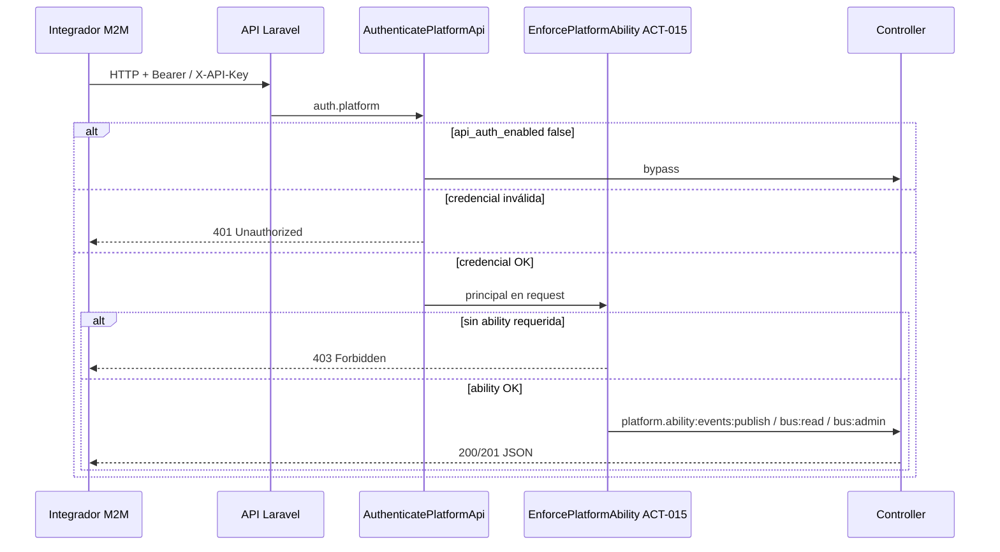

# PROC-006 — Autenticación API integradores

**ID:** PROC-006  
**Versión documento:** 1.0  
**Fecha:** 2026-06-27  
**Estado:** Implementado  
**Tipo:** Técnico — Seguridad / Integración  
**Macroproceso:** MP-04 Seguridad y Acceso

---

## Descripción

Proceso de autenticación y autorización para integradores máquina (M2M): POS, ERP, ETL y smoke CI. Cada request API al silo cliente debe presentar credencial válida (Bearer Sanctum PAT o `X-API-Key` estática) y cumplir abilities requeridas por ruta (`events:publish`, `bus:read`, `bus:admin`, etc.). La verificación ocurre en middleware HTTP antes de ejecutar controladores de Middleware, Dashboard o Integraciones.

Modelo alineado con ADR-001: credenciales **por instancia cliente**, no compartidas entre tenants.

---

## Objetivo

Proteger endpoints API del bus y dashboard con autenticación dual (token/key) y RBAC por scopes/abilities, permitiendo publicación y consulta operativa sin sesión web humana.

---

## Alcance

**Incluye:**

- Middleware `auth.platform` → `AuthenticatePlatformApi`.
- Middleware `platform.ability:*` → `EnforcePlatformAbility` (ACT-015).
- Abilities documentadas: `events:publish`, `bus:read`, `bus:admin` (y `dashboard:read`, `integrations:admin` en rutas relacionadas).
- Emisión/rotación tokens CLI (`platform:issue-api-token`, etc.) según `Flujo_M2M_Integradores.md`.
- Respuestas 401/403 JSON o Problem Details.

**Excluye:**

- Login web operadores (PROC-005).
- OAuth2 client credentials (ADR-002 diferido).
- Autenticación en ingress webhooks sin token estándar (PROC-011).

---

## Actores

| Actor | Rol en el proceso |
|-------|---------------------|
| Integrador M2M | ERP, POS, ETL, script CI |
| `AuthenticatePlatformApi` | Resuelve principal API desde Bearer o API key |
| `PlatformApiAuthenticatorInterface` | Implementación Sanctum / keys estáticas |
| `EnforcePlatformAbility` | Verifica scopes del principal (ACT-015) |
| Operador DevOps | Emite y rota tokens vía Artisan |

---

## Entradas

| Entrada | Formato | Origen |
|---------|---------|--------|
| Header `Authorization` | `Bearer {sanctum_token}` | Integrador |
| Header `X-API-Key` | API key estática | Integrador legacy |
| Query `token` | Token en SSE stream | EventSource dashboard |
| Config abilities | `config/platform_roles.php` | Host instancia |
| Flag auth | `security.api_auth_enabled` | `.env` |

---

## Salidas

| Salida | Descripción |
|--------|-------------|
| Principal API | `PlatformApiPrincipal` en atributos request |
| Continuación pipeline | Request pasa a controller |
| HTTP 401 | Token/key ausente o inválido |
| HTTP 403 | Principal sin ability requerida |
| Token emitido (CLI) | PAT mostrado una vez al operador |

---

## Reglas de negocio

| ID | Regla | Evidencia |
|----|-------|-----------|
| RN-006-01 | Publicar eventos requiere ability `events:publish` | `MiddlewareApiRoutes.php` L45 |
| RN-006-02 | Consulta cola/métricas/topología requiere `bus:read` | `MiddlewareApiRoutes.php` L23–31 |
| RN-006-03 | Sync registry, DLQ, refresh métricas requiere `bus:admin` | `MiddlewareApiRoutes.php` L33–43 |
| RN-006-04 | Roles UI mapean abilities en `platform_roles.php`; tokens M2M usan mismos scopes | `config/platform_roles.php` |
| RN-006-05 | Cada instancia cliente tiene credenciales propias (ADR-001) | `Flujo_M2M_Integradores.md` §Modelo instancia |
| RN-006-06 | Si `api_auth_enabled=false`, middleware bypass (tests/CI) | `AuthenticatePlatformApi` L24–26 |

---

## Precondiciones

1. Instancia silo operativa con Sanctum configurado.
2. Token o API key emitida con scopes necesarios.
3. Rutas API registradas vía service providers (`MiddlewareApiRoutes`, etc.).
4. Throttle `platform-api` / `platform-publish` activo según entorno.

---

## Postcondiciones

1. Request autenticado con principal trazable (`actorId`).
2. Solo endpoints con ability suficiente ejecutados.
3. Auditoría opcional vía `platform.audit` en rutas sensibles.
4. En rechazo: sin ejecución de lógica de negocio del endpoint.

---

## Flujo principal (paso a paso)

1. Integrador envía request HTTP a `/api/middleware/*`, `/api/dashboard/*` o `/api/integrations/*`.
2. Middleware `auth.platform` (`AuthenticatePlatformApi`):
   - Si `api_auth_enabled=false` → continúa sin auth.
   - Invoca `PlatformApiAuthenticatorInterface::authenticate`.
   - Si null → HTTP 401 (Problem Details si habilitado).
   - Almacena `PlatformApiPrincipal` en request.
3. Middleware `platform.ability:{scopes}` (`EnforcePlatformAbility`, ACT-015):
   - Obtiene principal del request.
   - Evalúa `hasAnyAbility` contra scopes de ruta.
   - Si falla → HTTP 403 JSON.
4. Request llega al controller (ej. `EventQueueController::publish`, `BusMetricsController::index`).
5. Procesos downstream: PROC-001 (publish), PROC-003 (consulta), PROC-004 (dashboard API).

---

## Flujos alternativos

| ID | Condición | Resultado |
|----|-----------|-----------|
| FA-01 | API key estática en `PLATFORM_API_KEYS` | Auth vía `X-API-Key` según `Flujo_M2M_Integradores.md` |
| FA-02 | SSE `/api/dashboard/stream?token=` | Token en query por limitación EventSource |
| FA-03 | Token con subset abilities | Acceso solo a rutas con scopes incluidos |
| FA-04 | Rotación token | `platform:rotate-api-token` — nuevo PAT; revocación explícita |

---

## Excepciones

| Excepción | HTTP | Causa documentada |
|-----------|------|-------------------|
| Sin credencial | 401 | Bearer/key ausente |
| Credencial inválida | 401 | Token revocado o key incorrecta |
| Scope insuficiente | 403 | Token sin `events:publish` en publish |
| Rate limit | 429 | Throttle publish/API |
| Envelope inválido post-auth | 422 | PROC-001 validación (no auth) |

---

## Eventos

| Evento | Tipo BPMN | Descripción |
|--------|-----------|-------------|
| EVT-API-REQUEST | Inicio | HTTP request a API protegida |
| EVT-PRINCIPAL-RESOLVED | Intermedio | Principal autenticado |
| EVT-ABILITY-DENIED | Intermedio | 403 abilities |
| EVT-API-AUTHORIZED | Fin OK | Controller ejecutado |
| EVT-API-REJECTED | Fin error | 401/403 |

---

## Dependencias

| Dependencia | Tipo | Proceso / componente |
|-------------|------|----------------------|
| Onboarding instancia | Previo | PROC-008, PROC-010 — tenant y env |
| Emisión tokens | Operación | CLI `platform:issue-api-token` |
| Publicación eventos | Posterior | PROC-001 |
| Consulta bus | Posterior | PROC-003 |

---

## Riesgos

| ID | Riesgo | Mitigación |
|----|--------|------------|
| R1 | Token con scopes excesivos | Emisión granular `--abilities=` |
| R2 | Compartir token entre clientes | ADR-001 + documentación M2M |
| R3 | API key estática en repos | Secret store / env, no commit |
| R4 | Auth deshabilitado en prod | `PLATFORM_API_AUTH_ENABLED` |

---

## Indicadores

| Indicador | Fuente |
|-----------|--------|
| Conteo 401/403 API | Logs HTTP / métricas |
| Tokens activos por integrador | `platform:list-api-tokens` |
| Rate limit 429 | Throttle middleware |
| Auditoría publish/sync | `platform.audit` logs |

---

## Relación con otros procesos

| Proceso | Relación |
|---------|----------|
| PROC-001 | Requiere `events:publish` previo a publish |
| PROC-003 | Consultas con `bus:read` / admin ops con `bus:admin` |
| PROC-004 | Dashboard API `dashboard:read` |
| PROC-005 | Canal alternativo sesión web |
| PROC-012 | Integraciones `integrations:admin` |

---

## Componentes involucrados

| Capa | Componente |
|------|------------|
| Middleware | `AuthenticatePlatformApi`, `EnforcePlatformAbility` |
| Registro | `SecurityServiceProvider` — aliases `auth.platform`, `platform.ability` |
| Rutas | `MiddlewareApiRoutes`, `DashboardApiRoutes`, `IntegrationApiRoutes` |
| Seguridad | `PlatformApiAuthenticatorInterface`, `PlatformApiPrincipal`, `ProblemDetailsFactory` |
| Config | `config/platform_roles.php`, `config/security.php`, `config/sanctum.php` |
| CLI | Comandos issue/rotate/revoke token |

---

## Documentación relacionada

- `docs/production/Flujo_M2M_Integradores.md`
- `docs/production/Plan_Seguridad.md`
- `docs/production/Plan_Autenticacion.md`
- `docs/production/ADR_001_instancia_por_cliente.md`
- `docs/Diagrama_BPMN/Matriz_Trazabilidad_BPMN.md`

---

## Trazabilidad

| Elemento | Evidencia |
|----------|-----------|
| PROC-006 | `docs/Patente/matriz_generada/procesos.csv` fila PROC-006 |
| ACT-015 | `docs/Patente/matriz_generada/actividades_bpmn.csv` L16 |
| Flujo M2M completo | `docs/production/Flujo_M2M_Integradores.md` |
| Auth middleware | `app/Http/Middleware/AuthenticatePlatformApi.php` |
| Ability middleware | `app/Http/Middleware/EnforcePlatformAbility.php` |
| Rutas abilities publish/read/admin | `app/Shared/Api/Routes/MiddlewareApiRoutes.php` L23–46 |
| Matriz roles → abilities | `config/platform_roles.php` L21–37 |
| Ejemplo emisión token | `Flujo_M2M_Integradores.md` L9–14 (`events:publish,bus:read`) |
| Criterios C11–C12 | `docs/evaluation/05_Matriz_Seguridad.csv`; `Matriz_Trazabilidad_BPMN.md` |

---

## Diagrama Mermaid

---

## BPMN Mapping

| Elemento BPMN | Identificador / descripción |
|---------------|----------------------------|
| **Evento Inicio** | EVT-API-REQUEST — integrador invoca endpoint REST protegido |
| **Eventos Intermedios** | EVT-PRINCIPAL-RESOLVED; EVT-ABILITY-DENIED; throttle 429 |
| **Evento Final** | EVT-API-AUTHORIZED (controller OK) o EVT-API-REJECTED (401/403) |
| **Actividades** | Autenticar principal (`AuthenticatePlatformApi`); ACT-015 Verificar ability (`EnforcePlatformAbility`) |
| **Subprocesos** | Resolución Sanctum PAT; resolución API key estática; auditoría `platform.audit` en rutas admin |
| **Gateways** | GW-AUTH: ¿principal válido?; GW-ABILITY: ¿tiene `events:publish` / `bus:read` / `bus:admin`?; GW-BYPASS: ¿api_auth deshabilitado? |
| **Pools** | Pool Integrador Externo; Pool Silo API |
| **Lanes** | Lane Autenticación (`AuthenticatePlatformApi`); Lane Autorización (`EnforcePlatformAbility`); Lane Endpoint (`EventQueueController`, etc.) |
| **Mensajes** | Msg-API-Request; Msg-401-Unauthorized; Msg-403-Forbidden; Msg-API-Response |
| **Objetos de datos** | Bearer token; API key; `PlatformApiPrincipal`; lista abilities |
| **Almacenes** | Tabla `personal_access_tokens`; config `PLATFORM_API_KEYS` |
| **Artefactos** | `Flujo_M2M_Integradores.md`; `config/platform_roles.php`; OpenAPI middleware |
| **Asociaciones** | Token scopes → GW-ABILITY; ruta publish → `events:publish`; sync/DLQ → `bus:admin` |

---

*Fin del documento PROC-006*
