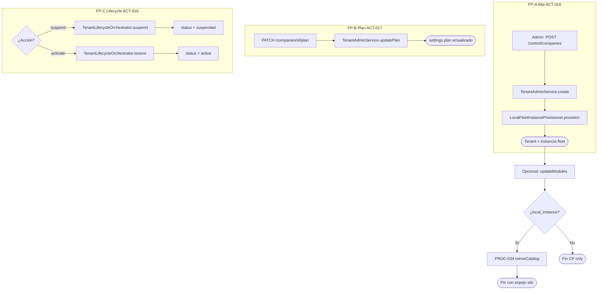

# PROC-007 — Gestión empresas control plane

**ID:** PROC-007  
**Versión documento:** 1.0  
**Fecha:** 2026-06-27  
**Estado:** Implementado  
**Tipo:** Negocio — Estratégico / Administrativo  
**Macroproceso:** MP-01 Gestión Plataforma SaaS

---

## Descripción

Proceso administrativo del Control Plane SaaS (`:8000`) para el ciclo de vida comercial de empresas (tenants): alta, asignación de plan comercial, configuración de módulos contratados, suspensión y activación/restauración del servicio. Orquesta cambios en `tenants` del CP y, cuando existe despliegue local fleet, dispara espejo parcial de catálogo hacia el silo cliente.

---

## Objetivo

Gobernar el parque de clientes SaaS desde el portal `/control/companies`, manteniendo coherencia entre estado comercial (`tenants.status`), plan (`settings.plan`), módulos contratados (`settings.modules`) y operación del silo dedicado (ADR-010, REQ-CP-01).

---

## Alcance

**Incluye:**

- ACT-016: crear empresa/tenant (`CompanyController::store` → `TenantAdminService::create`).
- ACT-017: actualizar plan comercial (`updatePlan`).
- ACT-018: suspender / activar tenant (`suspend` / `activate` vía lifecycle orchestrator).
- Provisioning fleet local en alta (`LocalFleetInstanceProvisioner`).
- Espejo catálogo tras `updateModules` si hay `local_instance`.

**Excluye:**

- Provisioning completo de infraestructura remota (PROC-008 parcial).
- Configuración catálogo técnico detallado (UI modules — servicio separado `TenantModuleCatalogService`).
- Activación LIVE en silo (responsabilidad operador instancia, PROC-004).
- Gestión operadores detallada (`TenantOperatorService` — actividad relacionada no ACT-016–018).

---

## Actores

| Actor | Rol |
|-------|-----|
| Admin SaaS | CRUD empresas, planes, suspensión |
| Operador SaaS | Consulta portal control |
| `TenantAdminService` | Lógica dominio tenant comercial |
| `CompanyController` | HTTP Inertia control plane |
| `TenantLifecycleOrchestrator` | Suspender/restaurar servicio + infra |
| `LocalFleetInstanceProvisioner` | Alta instancia SQLite local |
| `LocalFleetTenantMirror` | Espejo post `updateModules` |

---

## Entradas

| Entrada | Formato |
|---------|---------|
| Formulario alta empresa | `name`, `slug`, `plan` (validado contra `saas_catalog`) |
| PATCH plan | `plan` ∈ planes disponibles |
| PATCH modules | Lista módulos comerciales |
| Acción lifecycle | POST suspend / activate |
| Catálogo comercial | `config/saas_catalog.php` |

---

## Salidas

| Salida | Descripción |
|--------|-------------|
| Fila `tenants` CP | Tenant con UUID, status, settings JSON |
| Instancia fleet local | SQLite + URL app si provisioning exitoso |
| Mensaje flash UI | Confirmación operación |
| Espejo silo (condicional) | `mirrorCatalog()` tras update modules |
| Estado lifecycle JSON | `lifecycleStatus` endpoint |

---

## Reglas de negocio

| ID | Regla | Evidencia |
|----|-------|-----------|
| RN-001 | Plan debe existir en catálogo SaaS (`starter`, `growth`, `enterprise`) | `config/saas_catalog.php`; validación `Rule::in` |
| RN-002 | Slug único, formato `alpha_dash` | `CompanyController::store` validation |
| RN-003 | Alta tenant default status `active`, modules default `['middleware']` | `TenantAdminService::create` |
| RN-004 | `tenants.status` autoritativo para bloqueo acceso silo (active/suspended) | ADR-010 |
| RN-005 | `deployment.lifecycle` determina si proceso silo existe (running/stopped) | ADR-010 dimensión 2 |
| RN-006 | Suspensión comercial no elimina tenant; restauración reactiva acceso | ADR-010 |
| RN-007 | `updateModules` espeja catálogo al silo solo si `deployment.local_instance.db_path` presente | `TenantAdminService::updateModules` |
| RN-008 | CP no activa módulos LIVE remotamente | Certificación limitación #2 |

---

## Precondiciones

1. Control Plane operativo (`control.plane` middleware).
2. Operador autenticado web con rol SaaS (`auth.platform.web`).
3. Para fleet local: bootstrap entorno (`npm run instances:bootstrap` en runbook certificación).
4. Catálogo planes cargado en `config/saas_catalog.php`.

---

## Postcondiciones

1. Tenant persistido o actualizado en BD CP.
2. Tras alta con fleet: instancia SQLite provisionada.
3. Tras suspend: `status = suspended`; acceso silo bloqueado según ADR-010.
4. Tras activate/restore: `status = active`; servicio restaurado vía orchestrator.
5. Tras update modules con local instance: silo recibe espejo catálogo (PROC-034 parcial).

---

## Flujo principal (paso a paso)

### FP-A — Alta empresa (ACT-016)

| Paso | Descripción |
|------|-------------|
| 1 | Admin accede `/control/companies` → formulario alta |
| 2 | Validación name, slug único, plan permitido |
| 3 | **ACT-016** `TenantAdminService::create` — UUID, settings iniciales |
| 4 | `LocalFleetInstanceProvisioner::provision` — instancia aislada si aplica |
| 5 | Redirect con mensaje confirmación |
| 6 | Fin — empresa lista para catálogo técnico y lifecycle (PROC-008/010/034) |

### FP-B — Actualizar plan (ACT-017)

| Paso | Descripción |
|------|-------------|
| 1 | Admin PATCH `/control/companies/{tenant}/plan` |
| 2 | **ACT-017** `TenantAdminService::updatePlan` |
| 3 | `settings.plan` actualizado |
| 4 | Fin |

### FP-C — Suspender / activar (ACT-018)

| Paso | Descripción |
|------|-------------|
| 1 | Admin POST suspend o activate |
| 2 | **ACT-018** `TenantLifecycleOrchestrator::suspend` o `restore` |
| 3 | Actualiza `tenants.status` y lifecycle deployment |
| 4 | Fin — operador silo ve estado coherente tras mirror/lifecycle |

---

## Flujos alternativos

### FA-01 — Alta sin fleet local

- **Condición:** Provisioning no disponible o fallido.
- **Acción:** Tenant CP creado; mensaje «Empresa (tenant) creada» sin URL instancia.

### FA-02 — Update modules comerciales

- **Condición:** PATCH modules (no ACT-017 pero relacionado).
- **Acción:** `updateModules` + `mirrorCatalog` si local_instance.

### FA-03 — Restore duplicado

- **Condición:** Rutas `activate` y `restore` equivalentes.
- **Acción:** Ambas llaman `orchestrator->restore`.

### FA-04 — Lifecycle status consulta

- **Condición:** GET JSON lifecycle status.
- **Acción:** Solo lectura; no muta estado.

---

## Excepciones

| Escenario | Tratamiento |
|-----------|-------------|
| EX-001 Slug duplicado | Validación 422 en store |
| EX-002 Plan inválido | Validación 422 |
| EX-003 Tenant silo no encontrado en mirror | `RuntimeException` en PROC-034 |
| EX-004 Operación no autorizada | Gate policies control plane |

---

## Eventos

| Evento | Tipo |
|--------|------|
| Submit formulario alta | Inicio ACT-016 |
| PATCH plan | Inicio ACT-017 |
| POST suspend/activate | Inicio ACT-018 |
| Tenant persistido / lifecycle aplicado | Fin |

---

## Dependencias

| Dependencia | Proceso |
|-------------|---------|
| Auth web CP | PROC-005 |
| Provisioning instancia | PROC-008 |
| Espejo catálogo | PROC-034 |
| Onboarding tenant silo | PROC-010 |
| Simulación desde CP | PROC-020 |

---

## Riesgos

| Riesgo | Mitigación |
|--------|------------|
| Desincronía CP vs silo settings | Mirror tras updateModules; certificación PROC-034 |
| Suspensión silo running pero bloqueado | ADR-010 matriz lifecycle × status |
| Plan cambiado sin límites enforced | Límites documentados en saas_catalog; enforcement futuro |

---

## Indicadores

| Indicador | Fuente |
|-----------|--------|
| Tenants activos vs suspended | Query `tenants.status` |
| Distribución por plan | `settings.plan` |
| Tiempo provisioning fleet | Logs `LocalFleetInstanceProvisioner` |
| Tenants con local_instance | `settings.deployment.local_instance` |

---

## Relación con otros procesos

| Proceso | Relación |
|---------|----------|
| PROC-008 | Provisioning posterior a alta |
| PROC-010 | Ensure tenant en silo |
| PROC-034 | Espejo settings/catálogo CP→silo |
| PROC-020 | Simulaciones orquestadas desde CP |
| PROC-015 | Incidentes soporte por tenant |
| PROC-005 | Autenticación admin CP |

---

## Componentes involucrados

| Componente | Ruta |
|------------|------|
| `CompanyController` | `app/Control/Interfaces/Http/Controllers/CompanyController.php` |
| `TenantAdminService` | `app/Control/Application/Services/Tenants/TenantAdminService.php` |
| `TenantLifecycleOrchestrator` | Control lifecycle |
| `LocalFleetInstanceProvisioner` | Fleet provisioning |
| `TenantPresentationService` | Planes disponibles UI |
| `routes/control.php` | Rutas `control.companies.*` |
| `config/saas_catalog.php` | Catálogo comercial |

---

## Documentación relacionada

- `docs/production/ADR_010_tenant_lifecycle_management.md`
- `docs/Plan_Desarrollo_Serviciov1.5/Runbook_v1.5_Gestion_Ciclo_Vida_Tenants.md`
- `docs/refactorizacion_Informes/Certificacion_Flujo_Operativo_Oficial.md`
- `config/saas_catalog.php`

---

## Trazabilidad

| Elemento | Evidencia |
|----------|-----------|
| PROC-007 | `docs/Patente/matriz_generada/procesos.csv` |
| ACT-016–018 | `docs/Patente/matriz_generada/actividades_bpmn.csv` |
| REQ-CP-01 | `docs/Diagrama_BPMN/Matriz_Trazabilidad_BPMN.md` |
| TenantAdminService | `app/Control/Application/Services/Tenants/TenantAdminService.php` |
| CompanyController | `app/Control/Interfaces/Http/Controllers/CompanyController.php` |
| Rutas | `routes/control.php` L28–42 |
| ADR-010 | `docs/production/ADR_010_tenant_lifecycle_management.md` |
| Tests | `tests/Feature/Control/TenantLifecycleEndpointsTest.php`; `tests/Feature/TenantLifecycleTest.php` |
| Criterio C17 | `docs/evaluation/06_Matriz_Operacion.csv` |

---

## Diagrama Mermaid

---

## BPMN Mapping

| Elemento BPMN | Identificador / descripción |
|---------------|----------------------------|
| **Evento Inicio** | Submit alta empresa; PATCH plan; POST suspend/activate |
| **Eventos Intermedios** | Tenant UUID generado; fleet provisioned; lifecycle transition |
| **Evento Final** | Tenant persistido/actualizado; mensaje UI confirmación |
| **Actividades** | ACT-016 Crear empresa; ACT-017 Actualizar plan; ACT-018 Activar/suspender tenant |
| **Subprocesos** | SP-FLEET: provisioning local instance; SP-MIRROR: mirrorCatalog condicional |
| **Gateways** | GW-PLAN: ¿plan válido?; GW-FLEET: ¿provisioning local?; GW-ACTION: suspend vs activate |
| **Pools** | Pool Admin SaaS; Pool Control Plane; Pool Silo Cliente (efectos mirror/lifecycle) |
| **Lanes** | Lane Portal (`CompanyController`); Lane Dominio (`TenantAdminService`); Lane Infra (`TenantLifecycleOrchestrator`, `LocalFleetInstanceProvisioner`) |
| **Mensajes** | Msg-Create-Tenant; Msg-Lifecycle-Command; Msg-Mirror-Trigger |
| **Objetos de datos** | Formulario empresa; `TenantModel`; `settings` JSON; deployment lifecycle |
| **Almacenes** | BD CP `tenants`; fleet registry; silo SQLite (vía PROC-034) |
| **Artefactos** | saas_catalog.php; ADR-010; rutas control.php |
| **Asociaciones** | ACT-016 → PROC-008; updateModules → PROC-034; suspend → portal silo bloqueado |

---

*Fin del documento PROC-007*
