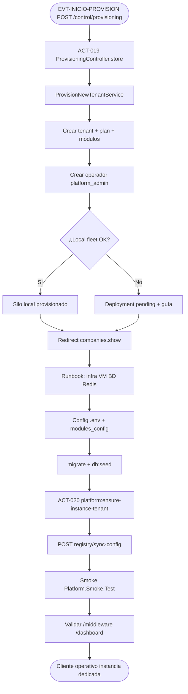

# PROC-008 — Provisioning nueva instancia cliente

**ID:** PROC-008  
**Versión documento:** 1.0  
**Fecha:** 2026-06-27  
**Estado:** Implementado parcial  
**Tipo:** Negocio — Estratégico / Operativo  
**Macroproceso:** MP-01 Gestión Plataforma SaaS

---

## Descripción

Proceso de alta comercial y aprovisionamiento técnico de un nuevo cliente desde el control plane SaaS: registro de empresa (tenant), plan y módulos contratados, creación del operador admin inicial y — cuando la flota local está habilitada — materialización del silo dedicado. Complementa el runbook operativo de onboarding en infraestructura (VM, BD, migraciones) y el comando `platform:ensure-instance-tenant` (ACT-020) en cada despliegue silo.

El modelo operativo es **instancia por cliente** (ADR-001): el provisioning CP no sustituye el despliegue físico del silo, pero prepara metadatos, catálogo y guía de despliegue.

**Estado parcial:** la provisión automática de flota local puede quedar en fallback “pending deployment” si `LocalFleetInstanceProvisioner` no completa el silo.

---

## Objetivo

Registrar un nuevo cliente en el control plane con plan/módulos, operador admin y — idealmente — silo Laravel dedicado listo para migraciones, sync registry y smoke test según `Runbook_Onboarding_Cliente.md`.

---

## Alcance

**Incluye:**

- UI y API CP: `GET/POST /control/provisioning` (ACT-019).
- `ProvisionNewTenantService` — tenant, operador, intento flota local.
- Pasos runbook alineados: config instancia, migrate/seed, ACT-020, sync, smoke.
- ADR-001 — decisión instancia por cliente.

**Excluye:**

- Provisioning infra completo automatizado en cloud (runbook manual paso 1).
- Multi-tenant lógico en una sola app (PROC-018 diferido).
- Simulación E2E post-onboarding (PROC-009) — proceso separado recomendado.

---

## Actores

| Actor | Rol en el proceso |
|-------|---------------------|
| Admin SaaS | Ejecuta provisioning desde CP |
| `ProvisioningController` | HTTP ACT-019 |
| `ProvisionNewTenantService` | Orquesta tenant + operador + flota |
| `TenantAdminService` | Crea fila tenant y settings |
| `LocalFleetInstanceProvisioner` | Provisiona silo local/registry |
| Operador DevOps | Ejecuta runbook infra y ACT-020 en silo |

---

## Entradas

| Entrada | Formato | Origen |
|---------|---------|--------|
| Formulario provisioning | `company_name`, `slug`, `plan`, `modules[]`, datos empresa, `admin_*` | POST `/control/provisioning` |
| Catálogo venta | planes y módulos | `ControlCatalogService` |
| Artefacto release | imagen/commit homogéneo | Runbook prerrequisitos |
| Env silo | `PLATFORM_CLIENT_SLUG`, BD, `APP_URL` | `templates/env.client.example` |

---

## Salidas

| Salida | Descripción |
|--------|-------------|
| Fila `tenants` | Tenant activo con plan y módulos en settings |
| Usuario `platform_admin` | Operador inicial instancia |
| Silo local (opcional) | Entrada fleet + `local_instance.app_url` |
| Redirect CP | `control.companies.show` + mensaje + guía despliegue |
| Tenant instancia (ACT-020) | Fila tenant upsert en BD silo |

---

## Reglas de negocio

| ID | Regla | Evidencia |
|----|-------|-----------|
| RN-008-01 | `slug` único en tabla tenants (`alpha_dash`) | `ProvisioningController::store` validación |
| RN-008-02 | Plan y módulos deben existir en catálogo venta | `Rule::in` catálogo |
| RN-008-03 | Admin email único en users | validación `unique:users,email` |
| RN-008-04 | Modelo producción: silo dedicado por cliente (ADR-001) | `ADR_001_instancia_por_cliente.md` |
| RN-008-05 | ACT-020 asegura fila tenant en BD del silo según `PLATFORM_CLIENT_SLUG` | `EnsureInstanceTenantCommand` |
| RN-008-06 | Si flota no provisiona, CP marca deployment pendiente | `ProvisionNewTenantFleetFallbackHandler` |

---

## Precondiciones

1. Control plane operativo (`PLATFORM_CONTROL_PLANE=true`).
2. Admin SaaS autenticado (PROC-005).
3. Para silo: infra BD/Redis/DNS según runbook paso 1.
4. Slug acordado y único.

---

## Postcondiciones

1. Tenant registrado en CP con plan/módulos.
2. Operador admin creado con rol `platform_admin`.
3. Silo desplegado o guía de despliegue mostrada (`show_deployment_guide`).
4. En silo: migraciones, seed, ACT-020, sync registry y smoke según runbook.
5. Inventario instancias actualizado (runbook cierre).

---

## Flujo principal (paso a paso)

### Fase A — Control Plane (ACT-019)

1. **EVT-INICIO-PROVISION:** Admin SaaS abre `GET /control/provisioning`.
2. `ProvisioningController::index` muestra planes, módulos, checklist y contexto despliegue.
3. Admin envía `POST /control/provisioning` con datos empresa y admin.
4. **ACT-019:** `ProvisionNewTenantService::provision`:
   - `TenantAdminService::create` — tenant + profile + modules.
   - `TenantOperatorService::createOperator` — admin `platform_admin`.
   - `LocalFleetInstanceProvisioner::provision` — intento silo local.
   - Si falla flota → `ProvisionNewTenantFleetFallbackHandler`.
5. Redirect a detalle empresa con mensaje y guía despliegue si aplica.

### Fase B — Runbook silo (`Runbook_Onboarding_Cliente.md`)

6. **Paso 1 Runbook:** Provisionar VM/namespace + BD + Redis; registrar inventario.
7. **Paso 2:** Copiar `env.client.example` → `.env`; configurar slug, URL, catálogo `modules_config.json`, eventbus overlay.
8. **Paso 3:** `php artisan migrate --force`; `db:seed --force`.
9. **ACT-020:** `php artisan platform:ensure-instance-tenant` — upsert tenant instancia (ADR-001).
10. `config:cache`, `route:cache`; verificar fila `tenants`.
11. **Paso 4 Runbook:** `POST /api/middleware/registry/sync-config`.
12. **Paso 5:** Smoke `Platform.Smoke.Test` publish + consulta cola/feed.
13. **Pasos 6–7:** Validación UI `/middleware`, `/dashboard`; checklist cierre.

---

## Flujos alternativos

| ID | Condición | Resultado |
|----|-----------|-----------|
| FA-01 | Local fleet deshabilitado | Solo metadatos CP + runbook manual silo |
| FA-02 | Error en `provision()` | `back()->withErrors(['provisioning' => ...])` |
| FA-03 | Fleet fallback | Tenant con deployment pending en settings |
| FA-04 | Alta empresa sin provisioning UI | PROC-007 `POST /control/companies` (flujo relacionado) |

---

## Excepciones

| Excepción | Manejo |
|-----------|--------|
| Slug duplicado | Validación 422 en formulario |
| Email admin duplicado | Validación unique users |
| Excepción flota local | Catch en `ProvisioningController::store` |
| Migrate fallido en silo | Rollback runbook — detener tráfico, restaurar BD |

---

## Eventos

| Evento | Tipo BPMN | Descripción |
|--------|-----------|-------------|
| EVT-INICIO-PROVISION | Inicio | POST `/control/provisioning` |
| EVT-TENANT-CREATED | Intermedio | Tenant CP persistido |
| EVT-FLEET-OK / EVT-FLEET-PENDING | Intermedio | Silo local provisionado o pendiente |
| EVT-INSTANCE-TENANT-OK | Intermedio | ACT-020 completado en silo |
| EVT-SMOKE-OK | Fin operativo | Smoke test onboarding exitoso |

---

## Dependencias

| Dependencia | Tipo | Proceso / componente |
|-------------|------|----------------------|
| Auth SaaS | Previo | PROC-005 |
| Gestión empresas | Relacionado | PROC-007 |
| Ensure tenant silo | Posterior ops | PROC-010 (ACT-020) |
| Sync catálogo | Posterior | PROC-002 |
| Simulación validación | Recomendado | PROC-009 |
| Espejo CP→Silo | Relacionado | PROC-034 |

---

## Riesgos

| ID | Riesgo | Mitigación |
|----|--------|------------|
| R1 | CP y silo desincronizados | Fleet registry + PROC-034 |
| R2 | Provisioning parcial sin silo | `show_deployment_guide` + runbook |
| R3 | Coste N instancias | ADR-001 aceptado — inventario fleet |
| R4 | Sync sin auth en prod | Nota runbook — activar auth PROC-006 |

---

## Indicadores

| Indicador | Fuente |
|-----------|--------|
| Tenants creados / pending deployment | CP `tenants.settings` |
| Tiempo onboarding E2E | Ticket release + inventario |
| Smoke test resultado | Runbook paso 5 curls |
| Fleet provision success rate | `LocalFleetInstanceProvisioner` logs |

---

## Relación con otros procesos

| Proceso | Relación |
|---------|----------|
| PROC-007 | CRUD empresas sin flujo provisioning completo |
| PROC-010 | ACT-020 comando ensure-instance-tenant |
| PROC-005 | Login operador admin creado |
| PROC-019 | Portal instancia tras onboarding |
| PROC-009 | Validación rehearsal post-alta |
| PROC-018 | Multi-tenant lógico rechazado (ADR-001) |

---

## Componentes involucrados

| Capa | Componente |
|------|------------|
| HTTP CP | `ProvisioningController`, `routes/control.php` L56–57 |
| Aplicación | `ProvisionNewTenantService`, `TenantAdminService`, `TenantOperatorService` |
| Flota | `LocalFleetInstanceProvisioner`, `ProvisionNewTenantFleetFallbackHandler` |
| Console silo | `EnsureInstanceTenantCommand` (ACT-020), `InstanceTenantSeeder` |
| Infra doc | `Runbook_Onboarding_Cliente.md`, `Inventario_Instancias.md` |

---

## Documentación relacionada

- `docs/production/Runbook_Onboarding_Cliente.md`
- `docs/production/ADR_001_instancia_por_cliente.md`
- `docs/production/templates/env.client.example`
- `docs/Diagrama_BPMN/00_Mapa_Procesos.md`
- `docs/Diagrama_BPMN/Matriz_Trazabilidad_BPMN.md`

---

## Trazabilidad

| Elemento | Evidencia |
|----------|-----------|
| PROC-008 parcial | `docs/Patente/matriz_generada/procesos.csv` fila PROC-008 |
| ACT-019 | `actividades_bpmn.csv` L20; `ProvisioningController.php` |
| ACT-020 | `actividades_bpmn.csv` L21; `EnsureInstanceTenantCommand.php` |
| FLU-017–018 | `flujo_bpmn.csv` — provision → ensure tenant (orden runbook) |
| ADR-001 | `docs/production/ADR_001_instancia_por_cliente.md` |
| Runbook pasos 1–7 | `docs/production/Runbook_Onboarding_Cliente.md` |
| Provision service | `app/Control/Application/Services/Tenants/ProvisionNewTenantService.php` |
| REQ-ADR001 | `Matriz_Trazabilidad_BPMN.md` — PROC-008, 010, 018, 019 |
| Criterios C17–C18 | `docs/evaluation/06_Matriz_Operacion.csv` |

---

## Diagrama Mermaid

---

## BPMN Mapping

| Elemento BPMN | Identificador / descripción |
|---------------|----------------------------|
| **Evento Inicio** | EVT-INICIO-PROVISION — admin SaaS envía formulario provisioning CP |
| **Eventos Intermedios** | EVT-TENANT-CREATED; EVT-FLEET-OK/PENDING; migrate/seed; EVT-INSTANCE-TENANT-OK (ACT-020); sync registry; smoke publish |
| **Evento Final** | Cliente con silo operativo y smoke OK; o tenant CP con despliegue pendiente documentado |
| **Actividades** | ACT-019 Provisionar instancia (`ProvisioningController`); ACT-020 Ensure instance tenant (`EnsureInstanceTenantCommand`); pasos runbook 1–7 |
| **Subprocesos** | Alta tenant CP; provisión flota local; despliegue silo manual; smoke onboarding |
| **Gateways** | GW-FLEET: ¿`LocalFleetInstanceProvisioner` exitoso?; GW-SMOKE: ¿evento y feed visibles? |
| **Pools** | Pool Control Plane SaaS; Pool Operaciones / Infra; Pool Silo Cliente |
| **Lanes** | Lane Comercial CP (`ProvisioningController`); Lane Flota (`LocalFleetInstanceProvisioner`); Lane Ops (`Runbook_Onboarding_Cliente.md`); Lane Instancia (`EnsureInstanceTenantCommand`) |
| **Mensajes** | Msg-Provision-Form; Msg-Deployment-Guide; Msg-Smoke-Publish |
| **Objetos de datos** | Form provisioning; fila `tenants`; `.env` cliente; `modules_config.json` |
| **Almacenes** | BD CP `tenants`, `users`; BD silo SQLite/MySQL; `Inventario_Instancias.md` |
| **Artefactos** | ADR-001; Runbook onboarding; `env.client.example` |
| **Asociaciones** | ADR-001 → modelo silo dedicado; ACT-019 → ACT-020 vía runbook paso 3; slug → `PLATFORM_CLIENT_SLUG` |

---

*Fin del documento PROC-008*
