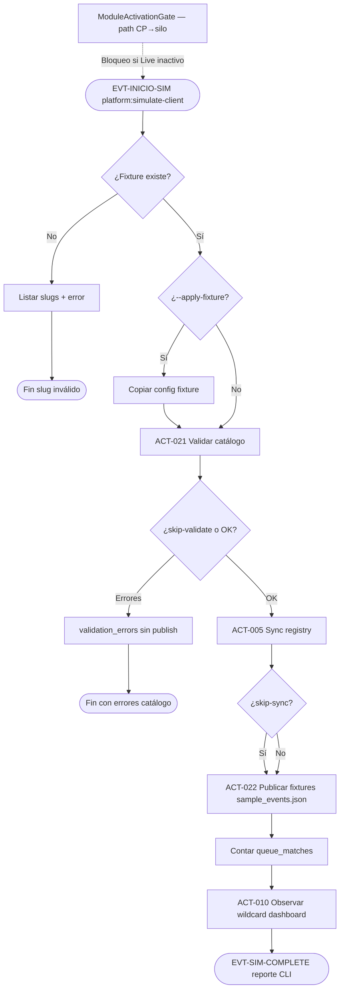

# PROC-009 — Simulación cliente end-to-end

**ID:** PROC-009  
**Versión documento:** 1.0  
**Fecha:** 2026-06-27  
**Estado:** Implementado  
**Tipo:** Técnico — Calidad / Operativo  
**Macroproceso:** MP-05 Calidad y Validación

---

## Descripción

Proceso automatizado de **rehearsal** de un cliente omnicanal antes de GO: validar alineación catálogo (`modules_config` ↔ `eventbus`), sincronizar registry, publicar eventos fixture desde `sample_events.json` y verificar tráfico observable en cola y dashboard. Se ejecuta principalmente vía `php artisan platform:simulate-client {slug}` (ACT-021, ACT-022).

`ModuleActivationGateService` entra en el ecosistema de simulación cuando la elegibilidad se evalúa **desde silo** (automatización CP → silo): exige bus y productores activos en panel Live antes de simular. El comando CLI directo en silo **no invoca** el gate; la validación CLI es catálogo + sync + publish vía `ClientSimulationService`.

---

## Objetivo

Repetir de forma automatizada la simulación de un cliente (fixtures versionados) para certificar middleware C1–C5, dashboard observacional y coherencia config antes de producción, según `Runbook_Simulacion_Cliente.md` y Plan de implementación §1.1.

---

## Alcance

**Incluye:**

- Comando `platform:simulate-client` (`SimulateClientCommand`).
- ACT-021 validación catálogo (`PlatformCatalogValidator`).
- ACT-005 sync registry (`SyncConfiguredModulesToRegistryUseCase`) si no `--skip-sync`.
- ACT-022 publicación fixtures (`EventPublisherService` vía `ClientSimulationService`).
- Verificación cola (`queue_matches`) y observación dashboard (ACT-010 vía listeners).
- `ModuleActivationGateService` en `SimulationTenantEligibilityChecker` (simulación orquestada CP/silo).
- Fixtures: `retailco`, `acmepos` (`tests/fixtures/clients/`).

**Excluye:**

- Orquestación UI CP completa (PROC-020 `SimulationRunOrchestrator`).
- Dominios retail documentales (PROC-017).
- Despliegue infra nuevo cliente (PROC-008).

---

## Actores

| Actor | Rol en el proceso |
|-------|---------------------|
| Operador QA / DevOps | Ejecuta Artisan o script smoke |
| CI pipeline | Ejecuta simulación en staging |
| `SimulateClientCommand` | Entrypoint CLI |
| `ClientSimulationService` | Orquesta validate → sync → publish |
| `ModuleActivationGateService` | Bloquea simulación si Live panel inactivo (path CP→silo) |
| Dashboard listeners | ACT-010 observación wildcard |

---

## Entradas

| Entrada | Formato | Origen |
|---------|---------|--------|
| Slug fixture | `retailco`, `acmepos`, etc. | Argumento comando |
| Opciones CLI | `--events`, `--per-minute`, `--duration-minutes`, `--apply-fixture`, `--skip-sync`, `--skip-validate` | `SimulateClientCommand` signature |
| Fixture files | `modules_config.json`, `eventbus_overlay.json`, `sample_events.json` | `tests/fixtures/clients/{slug}/` |
| Estado Live panel | nodos middleware/productores activos | BD node status (gate) |
| `PLATFORM_CLIENT_SLUG` | Identidad instancia | `.env` silo |

---

## Salidas

| Salida | Descripción |
|--------|-------------|
| Resultado simulación | `published`, `event_ids`, `queue_matches`, `sync` stats |
| Errores validación | `validation_errors` — aborta antes de publish |
| Eventos en cola | Entradas `bus_queue_entries` |
| Feed dashboard | Proyección ACT-010/ACT-011 |
| Reporte consola | `SimulateClientConsoleReporter` |
| Sign-off ticket | Slug, commit, conteo eventos (runbook) |

---

## Reglas de negocio

| ID | Regla | Evidencia |
|----|-------|-----------|
| RN-009-01 | Validación catálogo es primer paso salvo `--skip-validate` (ACT-021) | `ClientSimulationService::simulate` L99–110 |
| RN-009-02 | Sync registry antes de publish salvo `--skip-sync` (ACT-005) | `ClientSimulationService` L114–116 |
| RN-009-03 | Eventos desde `sample_events.json` o templates runtime | `fixtures->loadSampleEvents` |
| RN-009-04 | Publicación vía `EventPublisherService` — mismo pipeline PROC-001 | `ClientSimulationService` L146–152 |
| RN-009-05 | Gate simulación: middleware Live debe estar activo; productores no todos inactivos | `ModuleActivationGateService::simulationBlockReason` |
| RN-009-06 | Gate aplicado en silo cuando simulación no es desde CP | `SimulationTenantEligibilityChecker` L48–52 |
| RN-009-07 | Instancia dedicada solo simula slug propio | `SimulationTenantEligibilityChecker` L67–71 |
| RN-009-08 | Coherencia B.3: `platform:validate-catalog` detecta drift config | `Runbook_Simulacion_Cliente.md` §Coherencia |

---

## Precondiciones

1. Instancia silo con middleware registrado y workers si async.
2. Fixture slug existente en `tests/fixtures/clients/`.
3. Para simulación con gate (automation CP): tenant activo, catálogo con productores, nodos Live activos.
4. Para `--apply-fixture`: permisos escritura en `config/`.

---

## Postcondiciones

1. Catálogo validado (o errores reportados sin publish).
2. Registry sincronizado si no skipped.
3. N eventos publicados con `event_ids` trazables.
4. `queue_matches` ≥ eventos publicados (verificación operativa).
5. Dashboard/middleware UI muestran tráfico (validación manual runbook).

---

## Flujo principal (paso a paso)

1. **EVT-INICIO-SIM:** Operador ejecuta `php artisan platform:simulate-client {slug}`.
2. `SimulateClientCommandOptions::fromCommand` parsea opciones.
3. `SimulateClientOrchestrator::missingFixtureSlugs` — si slug inválido, lista slugs disponibles y termina.
4. Opcional: `--apply-fixture` copia archivos fixture a `config/`.
5. `SimulateClientOrchestrator::simulate` → `ClientSimulationService::simulate`:
6. **ACT-021:** Si no `skipValidate`, `PlatformCatalogValidator::validate()` — si errores, retorna sin publish.
7. **ACT-005:** Si no `skipSync`, `SyncConfiguredModulesToRegistryUseCase::execute()`.
8. Carga templates `sample_events.json`; calcula plan publish (rate/duration).
9. **ACT-022:** Loop publish — `EventPublisherService::publish` por cada evento fixture.
10. Cuenta `queue_matches` consultando cola operativa.
11. Reporter imprime resultado en consola.
12. **ACT-010 (downstream):** Listeners wildcard proyectan feed dashboard.
13. Validación manual: `/middleware`, `/dashboard` (runbook §Flujo manual UI).

### Flujo gate (simulación elegibilidad silo)

14. Antes de automatización CP, `SimulationTenantEligibilityChecker` puede invocar `ModuleActivationGateService::simulationBlockReason`:
    - Middleware node inactivo → bloqueo.
    - Todos productores inactivos en Live → bloqueo con nombres.

---

## Flujos alternativos

| ID | Condición | Resultado |
|----|-----------|-----------|
| FA-01 | `--skip-validate` | Salta ACT-021 |
| FA-02 | `--skip-sync` | Salta ACT-005 |
| FA-03 | `--apply-fixture` + `--events=0` | Solo materializa config |
| FA-04 | Rate `--per-minute` + `--duration-minutes` | Total = rate × minutes |
| FA-05 | `platform:simulation:prepare --slug=` | Preparación Acme según runbook |
| FA-06 | Script smoke | `scripts/ops/simulate-client-smoke.ps1` |

---

## Excepciones

| Excepción | Manejo |
|-----------|--------|
| Fixture no encontrado | Reporter `reportFixtureNotFound` |
| Validación catálogo fallida | Retorno con `validation_errors`, `published=0` |
| Sin sample events | `RuntimeException` |
| Throwable en simulate | Reporter `reportSimulationFailed` |
| Gate bloqueo | Mensaje human-readable en eligibility checker |

---

## Eventos

| Evento | Tipo BPMN | Descripción |
|--------|-----------|-------------|
| EVT-INICIO-SIM | Inicio | CLI `platform:simulate-client` |
| EVT-CATALOG-OK / FAIL | Intermedio | ACT-021 |
| EVT-SYNC-OK | Intermedio | ACT-005 |
| EVT-EVENT-PUBLISHED | Intermedio | Cada publish ACT-022 |
| EVT-OBSERVED | Intermedio | ACT-010 wildcard listener |
| EVT-SIM-COMPLETE | Fin | Reporter éxito con métricas |

---

## Dependencias

| Dependencia | Tipo | Proceso / componente |
|-------------|------|----------------------|
| Publicación bus | Core | PROC-001 |
| Sync registry | Previo/recomendado | PROC-002 |
| Validación catálogo CI | Relacionado | PROC-016 |
| Onboarding | Previo típico | PROC-008 |
| Dashboard observación | Posterior | PROC-004 |
| Activación Live | Condicional | PROC-004 / panel nodos |

---

## Riesgos

| ID | Riesgo | Mitigación |
|----|--------|------------|
| R1 | Drift modules_config vs eventbus | `platform:validate-catalog` |
| R2 | Simular con nodos inactivos | ModuleActivationGate |
| R3 | Partial publish bajo rate | `ClientSimulationService` deadline logic |
| R4 | DEMO_PACK en prod | Runbook — solo laboratorio |

---

## Indicadores

| Indicador | Fuente |
|-----------|--------|
| `published` vs `events` solicitados | Resultado CLI |
| `queue_matches` | `ClientSimulationService::countQueueMatchesForEventIds` |
| `validation_errors` count | Resultado CLI |
| Tests E2E | `ClientProductionLikeSimulationTest.php` |
| Sign-off release | Runbook §Sign-off |

---

## Relación con otros procesos

| Proceso | Relación |
|---------|----------|
| PROC-001 | Pipeline publish de cada fixture |
| PROC-002 | Sync registry en simulación |
| PROC-004 | Observación feed y KPIs |
| PROC-008 | Onboarding previo recomendado |
| PROC-016 | `platform:validate-catalog` equivalente |
| PROC-020 | Orquestación simulación desde CP UI |
| PROC-006 | Smoke API con token en scripts ops |

---

## Componentes involucrados

| Capa | Componente |
|------|------------|
| Console | `SimulateClientCommand`, `SimulateClientOrchestrator`, `SimulateClientCommandOptions` |
| Simulación | `ClientSimulationService`, `ClientFixtureLoader`, `PlatformCatalogValidator` |
| Middleware | `SyncConfiguredModulesToRegistryUseCase`, `EventPublisherService`, `GetEventQueueUseCase` |
| Gate | `ModuleActivationGateService`, `SimulationTenantEligibilityChecker` |
| Dashboard | `UniversalDashboardFeedListener`, `NodeStatusRepositoryInterface` |
| Fixtures | `tests/fixtures/clients/{slug}/sample_events.json` |
| Ops scripts | `scripts/ops/simulate-client-smoke.ps1` |

---

## Documentación relacionada

- `docs/production/Runbook_Simulacion_Cliente.md`
- `docs/production/Simulacion_Acme_Retail.md`
- `docs/production/Plan_SimulacionClientes.md`
- `docs/refactorizacion_Informes/Certificacion_Flujo_Operativo_Oficial.md`
- `docs/Diagrama_BPMN/Matriz_Trazabilidad_BPMN.md`

---

## Trazabilidad

| Elemento | Evidencia |
|----------|-----------|
| PROC-009 | `docs/Patente/matriz_generada/procesos.csv` fila PROC-009 |
| ACT-021, ACT-022 | `actividades_bpmn.csv` L22–23 |
| ACT-005, ACT-010 en cadena sim | `flujo_bpmn.csv` FLU-019–022 |
| EVT-INICIO-SIM | `flujo_bpmn.csv` FLU-019 |
| Comando CLI | `app/Console/Commands/Simulation/SimulateClientCommand.php` |
| Orquestación | `app/Shared/Platform/Services/ClientSimulationService.php` |
| ModuleActivationGate | `app/Dashboard/Application/Services/ModuleActivationGateService.php` |
| Eligibility + gate | `app/Simulation/Application/Services/Execution/SimulationTenantEligibilityChecker.php` L48–52 |
| Fixture acmepos | `tests/fixtures/clients/acmepos/sample_events.json` |
| E2E test | `tests/E2E/Middleware/ClientProductionLikeSimulationTest.php` |
| REQ-SIM-01 | `Matriz_Trazabilidad_BPMN.md` |
| Criterios C24–C26 | `docs/evaluation/08_Matriz_Calidad.csv` |

---

## Diagrama Mermaid

---

## BPMN Mapping

| Elemento BPMN | Identificador / descripción |
|---------------|----------------------------|
| **Evento Inicio** | EVT-INICIO-SIM — `php artisan platform:simulate-client {slug}` |
| **Eventos Intermedios** | EVT-CATALOG-OK/FAIL; EVT-SYNC-OK; EVT-EVENT-PUBLISHED (loop); EVT-OBSERVED (dashboard) |
| **Evento Final** | EVT-SIM-COMPLETE con métricas; o fin error validación/fixture |
| **Actividades** | ACT-021 Validar catálogo; ACT-005 Sync registry; ACT-022 Publicar fixtures; ACT-010 Observar wildcard |
| **Subprocesos** | Apply fixture a filesystem; plan publish rate/duration; verificación cola |
| **Gateways** | GW-FIXTURE: ¿slug existe?; GW-VALID: ¿catálogo OK?; GW-SYNC: ¿skip sync?; GW-GATE: `ModuleActivationGateService` (elegibilidad silo) |
| **Pools** | Pool Operador/CI; Pool Silo Cliente; Pool Dashboard observación |
| **Lanes** | Lane CLI (`SimulateClientCommand`); Lane Simulación (`ClientSimulationService`); Lane Bus (`EventPublisherService`); Lane Gate (`ModuleActivationGateService`) |
| **Mensajes** | Msg-CLI-Result; Msg-Bus-Event (publish); Msg-Feed-Projection |
| **Objetos de datos** | `sample_events.json`; resultado `{published, queue_matches, validation_errors}`; catálogo módulos |
| **Almacenes** | Fixtures `tests/fixtures/clients/`; cola `bus_queue_entries`; feed dashboard |
| **Artefactos** | `Runbook_Simulacion_Cliente.md`; `Checklist_Staging_PreGO.md` |
| **Asociaciones** | Fixture → ACT-022; validation_errors → fin sin publish; gate → bloqueo simulación CP→silo |

---

*Fin del documento PROC-009*
