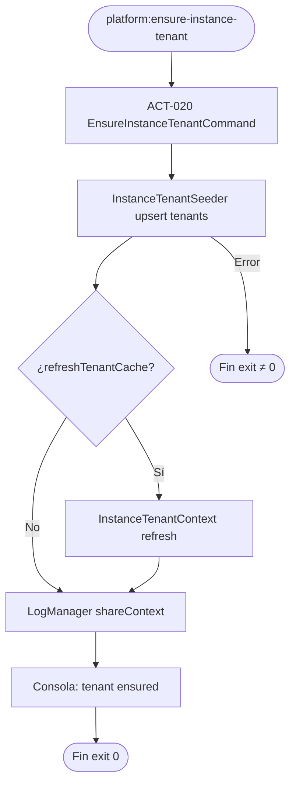

# PROC-010 — Onboarding instancia por cliente

**ID:** PROC-010  
**Versión documento:** 1.0  
**Fecha:** 2026-06-27  
**Estado:** Implementado  
**Tipo:** Negocio — Operativo / Administrativo  
**Macroproceso:** MP-01 Gestión Plataforma SaaS

---

## Descripción

Proceso operativo que asegura la existencia de la fila tenant de instancia y el contexto runtime (`tenant_id`) en cada despliegue silo dedicado, conforme al modelo **instancia por cliente** (ADR-001). Se ejecuta vía comando `platform:ensure-instance-tenant` o seed equivalente, poblando metadatos de instancia según ADR-004 sin activar multi-tenancy lógico (PROC-018 diferido).

---

## Objetivo

Garantizar que cada despliegue de silo cliente tenga un registro coherente en tabla `tenants` y contexto de logging/repositorios con `tenant_id`, cumpliendo ADR-001 y ADR-004 antes de operación middleware, dashboard o integraciones.

---

## Alcance

**Incluye:**

- ACT-020: comando `EnsureInstanceTenantCommand`.
- Seed `InstanceTenantSeeder` según `PLATFORM_CLIENT_SLUG` / `PLATFORM_CLIENT_NAME`.
- Refresh cache de `InstanceTenantContext`.
- Propagación contexto a logs estructurados (`LogManager::shareContext`).
- Ejecución post-deploy documentada en runbooks.

**Excluye:**

- Provisioning comercial completo desde CP (PROC-008).
- Espejo catálogo CP→Silo (PROC-034).
- Multi-tenancy lógico con RLS (PROC-018 — Fase 3).
- Creación de operadores admin (PROC-007/008).

---

## Actores

| Actor | Rol |
|-------|-----|
| Ops / DevOps | Ejecuta comando post-deploy |
| Seeder / CI | Automatiza en pipeline despliegue |
| `EnsureInstanceTenantCommand` | Orquesta seed + refresh context |
| `InstanceTenantSeeder` | Upsert fila `tenants` |
| `InstanceTenantContext` | Resuelve tenant de instancia |
| Admin SaaS | Supervisa onboarding vía PROC-008 |

---

## Entradas

| Entrada | Origen |
|---------|--------|
| `PLATFORM_CLIENT_SLUG` | `.env` instancia |
| `PLATFORM_CLIENT_NAME` | `.env` instancia |
| Config `platform.php` | Modo `instance_per_client` |
| BD migrada | Tabla `tenants` disponible |
| Comando CLI | `platform:ensure-instance-tenant` o `db:seed` |

---

## Salidas

| Salida | Descripción |
|--------|-------------|
| Fila `tenants` upserted | Metadatos instancia |
| Contexto runtime | `tenant_id` en repos y logs |
| Exit code 0 | Comando exitoso |
| Mensaje consola | Verificación SQL sugerida |

---

## Reglas de negocio

| ID | Regla | Evidencia |
|----|-------|-----------|
| RN-010-01 | Modelo operativo: instancia por cliente (ADR-001) | `procesos.csv` PROC-010; ADR-001 Aceptado |
| RN-010-02 | `tenant_id` se pobla vía seeder/comando (ADR-004) | `requerimientos.csv` REQ-ADR004 |
| RN-010-03 | Fila tenant representa metadatos instancia, no partición multi-tenant | ADR-001 §Decisión |
| RN-010-04 | Producción debe ejecutar seed o ensure-instance-tenant | ADR-004; `Runbook_Deploy_VM.md` §4 |
| RN-010-05 | Gateway ACT-030: decisión `instance_per_client` vs multi-tenant | `actividades_bpmn.csv` ACT-030 |

---

## Precondiciones

1. Migraciones ejecutadas; tabla `tenants` existe.
2. Variables `PLATFORM_CLIENT_SLUG` configuradas en `.env`.
3. Modo despliegue `instance_per_client` en `config/platform.php`.
4. Instancia silo desplegada (VM/contenedor/local).

---

## Postcondiciones

1. Fila tenant existe para slug de instancia.
2. `InstanceTenantContext` resuelve tenant correctamente.
3. Logs incluyen contexto tenant en operaciones subsecuentes.
4. Repositorios con columna `tenant_id` pueden persistir con valor no nulo.

---

## Flujo principal (paso a paso)

| Paso | Actividad | Descripción |
|------|-----------|-------------|
| 1 | Evento inicio | Ops ejecuta `php artisan platform:ensure-instance-tenant` |
| 2 | **ACT-020** Ensure instance tenant | `EnsureInstanceTenantCommand::handle` |
| 3 | Seed tenant | `db:seed --class=InstanceTenantSeeder --force` |
| 4 | Refresh context | `InstanceTenantContext::refreshTenantCache()` si disponible |
| 5 | Log context | `LogManager::shareContext($context->logContext())` |
| 6 | Verificación | Mensaje consola con query SQL sugerida |
| 7 | **Fin** | Exit code 0 |

---

## Flujos alternativos

### FA-01 — Seed completo en deploy

- **Condición:** Runbook deploy ejecuta `db:seed --force` antes o en lugar de comando dedicado.
- **Acción:** `InstanceTenantSeeder` incluido en seed general.
- **Evidencia:** `Runbook_Deploy_VM.md` §4.

### FA-02 — Onboarding tras provisioning CP

- **Condición:** PROC-008 alta comercial completada; silo materializado.
- **Acción:** FLU-018 ACT-019 → ACT-020 (orden inferido runbook).
- **Nota:** `flujo_bpmn.csv` FLU-018 — PENDIENTE_VALIDACION orden exacto código.

### FA-03 — Desarrollo local sin seed

- **Condición:** Tests sin seed; `tenant_id` nullable.
- **Riesgo:** Documentado en `Reporte_Implementacion.md` — producción debe seed.

---

## Excepciones

| Escenario | Causa | Tratamiento |
|-----------|-------|-------------|
| EX-010-01 | Migraciones pendientes | Fallo seed; ejecutar `migrate` |
| EX-010-02 | `PLATFORM_CLIENT_SLUG` ausente | Seed falla o tenant incorrecto |
| EX-010-03 | BD no accesible | Exit code ≠ 0 |
| EX-010-04 | Deploy sin seed en producción | `tenant_id` null — riesgo operativo |

---

## Eventos

| Evento BPMN | Tipo | Descripción |
|-------------|------|-------------|
| Comando ensure | Evento inicio | CLI `platform:ensure-instance-tenant` |
| Tenant upserted | Intermedio | Fila `tenants` persistida |
| Context refreshed | Intermedio | Runtime context actualizado |
| Fin onboarding | Evento fin | Instancia lista para operación |

---

## Dependencias

| Dependencia | Tipo | Proceso / componente |
|-------------|------|----------------------|
| ADR-001 | Decisión | Instancia por cliente |
| ADR-004 | Decisión | Población tenant_id |
| PROC-008 | Previo recomendado | Provisioning comercial |
| PROC-034 | Paralelo | Espejo catálogo CP→Silo |
| Migraciones BD | Infra | `tenants` table |

---

## Riesgos

| ID | Riesgo | Mitigación |
|----|--------|------------|
| R1 | Deploy sin seed → tenant_id null | Runbook exige ensure-instance-tenant |
| R2 | Confusión multi-tenant vs instancia | ADR-001 documenta modelo |
| R3 | Slug duplicado entre instancias | Un slug por despliegue dedicado |

---

## Indicadores

| Indicador | Fuente |
|-----------|--------|
| Tenant row presente | `SELECT id, slug FROM tenants` |
| Contexto en logs | Structured logs con tenant_slug |
| Criterio C17 | `docs/evaluation/06_Matriz_Operacion.csv` |

---

## Relación con otros procesos

| Proceso | Relación |
|---------|----------|
| PROC-008 | Provisioning previo; invoca ACT-020 |
| PROC-018 | Alternativa diferida (multi-tenant Fase 3) |
| PROC-019 | Portal requiere tenant context |
| PROC-030 | Post-deploy VM incluye ACT-020 |
| PROC-007 | Gestión empresas en CP (metadatos comercial) |

---

## Componentes involucrados

| Capa | Componente |
|------|------------|
| Console | `EnsureInstanceTenantCommand` |
| Seed | `InstanceTenantSeeder` |
| Platform | `InstanceTenantContext`, `InstanceTenantContextInterface` |
| Infra | `TenantModel`, migración `tenants` |
| Config | `config/platform.php` |

---

## Documentación relacionada

- `docs/production/ADR_001_instancia_por_cliente.md`
- `docs/production/ADR_004_tenant_id_activation.md`
- `docs/production/Runbook_Onboarding_Cliente.md`
- `docs/production/Runbook_Deploy_VM.md`
- `docs/production/Guia_Despliegue_Instancia_Cliente.md`

---

## Trazabilidad

| Elemento | Evidencia |
|----------|-----------|
| PROC-010 | `docs/Patente/matriz_generada/procesos.csv` |
| ACT-020 | `docs/Patente/matriz_generada/actividades_bpmn.csv` |
| REQ-ADR001, REQ-ADR004 | `docs/Patente/matriz_generada/requerimientos.csv` |
| FLU-018, FLU-028 | `docs/Patente/matriz_generada/flujo_bpmn.csv` |
| Comando | `app/Console/Commands/Platform/EnsureInstanceTenantCommand.php` |
| ADR-004 | `docs/production/ADR_004_tenant_id_activation.md` |

---

## Diagrama Mermaid

---

## BPMN Mapping

| Elemento BPMN | Identificador / descripción |
|---------------|----------------------------|
| **Evento Inicio** | CLI `platform:ensure-instance-tenant` o `db:seed` |
| **Eventos Intermedios** | Tenant upserted; context refreshed |
| **Evento Final** | Instancia con tenant row y contexto runtime |
| **Actividades** | ACT-020 Ensure instance tenant |
| **Gateways** | ACT-030 GW-MULTITENANT: `instance_per_client` (decidido) vs multi-tenant (diferido PROC-018) |
| **Pools** | Pool Ops; Pool Silo Instancia |
| **Lanes** | Lane Console; Lane Platform Context |
| **Objetos de datos** | Fila `tenants`; `PLATFORM_CLIENT_SLUG` |
| **Almacenes** | Tabla `tenants` |
| **Artefactos** | ADR-001; ADR-004; Runbook onboarding |

---

*Fin del documento PROC-010*
