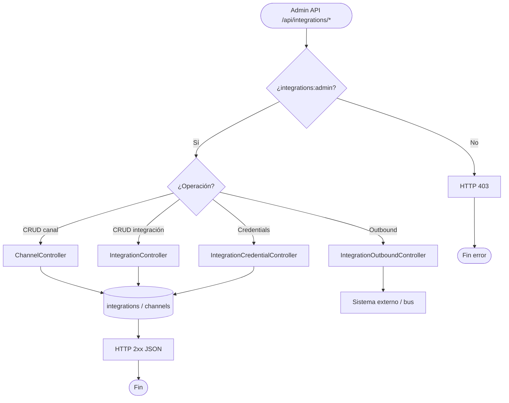

# PROC-012 — Gestión canales e integraciones

**ID:** PROC-012  
**Versión documento:** 1.0  
**Fecha:** 2026-06-27  
**Estado:** Implementado  
**Tipo:** Técnico — Integración / Administrativo  
**Macroproceso:** MP-08 Integración Omnicanal

---

## Descripción

Proceso administrativo de CRUD de canales, integraciones, credenciales cifradas y dispatch de conectores outbound bajo el prefijo `/api/integrations/*`. Habilita configuración persistente requerida por PROC-011 (webhooks ingress) y conectores salientes. Autorización vía ability `integrations:admin`.

---

## Objetivo

Permitir a administradores de integraciones gestionar el catálogo operativo de canales y conexiones omnicanal, cumpliendo REQ-INT-01 y preparando secrets HMAC para ingress webhook.

---

## Alcance

**Incluye:**

- CRUD canales: `GET/POST/PATCH/DELETE /channels`.
- CRUD integraciones: `GET/POST/PATCH/DELETE /`.
- Credenciales: `POST /{id}/credentials`.
- Outbound dispatch: `POST /{id}/connectors/{connectorId}/dispatch`.
- Autorización `integrations:admin` + `auth.platform`.
- Tests `IntegrationAdminApiTest`.

**Excluye:**

- Recepción webhooks (PROC-011).
- Publicación directa al bus sin config (PROC-001).
- UI dedicada analytics/security_audit (PMV-005/006 — parcial).

---

## Actores

| Actor | Rol |
|-------|-----|
| Admin integraciones | CRUD canales e integraciones |
| `IntegrationController` | CRUD integraciones |
| `ChannelController` | CRUD canales |
| `IntegrationCredentialController` | Almacena secrets cifrados |
| `IntegrationOutboundController` | Dispatch conectores |
| `IntegrationManagementAuthorizer` | Gate `platform.manage-integrations` |

---

## Entradas

| Entrada | Origen |
|---------|--------|
| JSON body CRUD | Admin API |
| Token ability `integrations:admin` | PROC-006 |
| Datos canal/integración | Formulario API |
| Credenciales webhook | POST credentials |
| Connector ID | Outbound dispatch |

---

## Salidas

| Salida | Descripción |
|--------|-------------|
| JSON integración/canal | Recurso creado/actualizado |
| HTTP 201/200/204 | Operación CRUD exitosa |
| Credencial persistida | Secret para HMAC PROC-011 |
| Evento outbound | Dispatch conector → bus externo |
| HTTP 403 | Sin ability admin |

---

## Reglas de negocio

| ID | Regla | Evidencia |
|----|-------|-----------|
| RN-012-01 | Rutas admin requieren `integrations:admin` | `IntegrationApiRoutes.php` L23 |
| RN-012-02 | Credenciales cifradas en persistencia | Plan_Integraciones.md |
| RN-012-03 | Integración activa requerida para ingress | PROC-011 resolver |
| RN-012-04 | Soft delete integraciones | `EloquentIntegrationRepository` deleted_at |
| RN-012-05 | Throttle `platform-api` en rutas autenticadas | `IntegrationApiRoutes.php` |

---

## Precondiciones

1. Autenticación API plataforma (PROC-006).
2. Ability `integrations:admin` asignada al token/usuario.
3. Tablas `integrations`, channels migradas.
4. Módulo Integration registrado (`IntegrationServiceProvider`).

---

## Postcondiciones

1. Configuración integración persistida en BD.
2. PROC-011 puede resolver integración por código.
3. Credenciales disponibles para verificación HMAC.
4. Audit operaciones sensibles si habilitado.

---

## Flujo principal (paso a paso)

| Paso | Actividad | Descripción |
|------|-----------|-------------|
| 1 | Evento inicio | Admin `POST /api/integrations/` o `/channels` |
| 2 | Autorización | `auth.platform` + `integrations:admin` |
| 3 | Authorize gate | `IntegrationManagementAuthorizer` |
| 4 | Crear integración | `CreateIntegrationUseCase` → repository |
| 5 | Configurar credenciales | `POST /{id}/credentials` |
| 6 | Activar integración | PATCH status active |
| 7 | **Fin** | HTTP 201 JSON recurso |

---

## Flujos alternativos

### FA-01 — Actualización integración

- **Acción:** `PATCH /api/integrations/{id}` vía `UpdateIntegrationUseCase`.

### FA-02 — Eliminación lógica

- **Acción:** `DELETE /{id}` — soft delete; ingress deja de resolver.

### FA-03 — Dispatch outbound

- **Acción:** `POST /{id}/connectors/{connectorId}/dispatch`.
- **Servicio:** `DispatchOutboundConnectorUseCase`.

### FA-04 — Listado y consulta

- **Acción:** `GET /` y `GET /{id}` — `ListIntegrationsUseCase`, `GetIntegrationUseCase`.

---

## Excepciones

| Escenario | Causa | Tratamiento |
|-----------|-------|-------------|
| EX-012-01 | Sin ability admin | HTTP 403 |
| EX-012-02 | Integración no encontrada | HTTP 404 |
| EX-012-03 | Validación payload | HTTP 422 |
| EX-012-04 | Código integración duplicado | HTTP 422 |

---

## Eventos

| Evento BPMN | Tipo | Descripción |
|-------------|------|-------------|
| API CRUD request | Evento inicio | Admin integraciones |
| Recurso persistido | Intermedio | BD actualizada |
| Fin gestión | Evento fin | HTTP 2xx |

---

## Dependencias

| Dependencia | Tipo | Proceso |
|-------------|------|---------|
| PROC-006 | Previo | Auth API |
| PROC-011 | Consumidor | Usa config y secrets |
| DEP-006 | Arquitectura | Integration → Middleware |
| Plan_Integraciones | Doc | Requisitos módulo |

---

## Riesgos

| ID | Riesgo | Mitigación |
|----|--------|------------|
| R1 | Secret expuesto en logs | Cifrado credenciales |
| R2 | PMV-004 implementado parcial | Tests IntegrationAdminApiTest |
| R3 | Config sin UI dedicada | API-first admin |

---

## Indicadores

| Indicador | Fuente |
|-----------|--------|
| Integraciones activas | `GET /api/integrations/` |
| Criterio C09 | `docs/evaluation/03_Matriz_Integracion.csv` |

---

## Relación con otros procesos

| Proceso | Relación |
|---------|----------|
| PROC-011 | Consume config ingress |
| PROC-001 | Destino eventos transformados |
| PROC-006 | Autenticación admin |
| PROC-017 | Conectores documentales referencia |

---

## Componentes involucrados

| Capa | Componente |
|------|------------|
| HTTP | `IntegrationController`, `ChannelController`, `IntegrationCredentialController`, `IntegrationOutboundController` |
| Aplicación | `CreateIntegrationUseCase`, `UpdateIntegrationUseCase`, `DeleteIntegrationUseCase`, `ListIntegrationsUseCase`, `GetIntegrationUseCase`, `DispatchOutboundConnectorUseCase` |
| Infra | `EloquentIntegrationRepository` |
| Rutas | `IntegrationApiRoutes` |

---

## Documentación relacionada

- `docs/production/Plan_Integraciones.md`
- `tests/Feature/Integration/IntegrationAdminApiTest.php`
- `docs/Diagrama_BPMN/20_Proceso_Ingress_Webhooks_Integraciones.md`

---

## Trazabilidad

| Elemento | Evidencia |
|----------|-----------|
| PROC-012 | `docs/Patente/matriz_generada/procesos.csv` |
| REQ-INT-01 | `docs/Patente/matriz_generada/requerimientos.csv` |
| PMV-004 | `docs/Patente/matriz_generada/pmv.csv` |
| Rutas | `app/Shared/Api/Routes/IntegrationApiRoutes.php` |
| Controllers | `app/Integration/Interfaces/Http/Controllers/` |

---

## Diagrama Mermaid

---

## BPMN Mapping

| Elemento BPMN | Identificador / descripción |
|---------------|----------------------------|
| **Evento Inicio** | Request CRUD autenticado `/api/integrations/*` |
| **Evento Final** | Recurso persistido HTTP 2xx |
| **Actividades** | Create/Update/Delete/List/Get integration; CRUD channel; store credentials; dispatch outbound |
| **Gateways** | GW-AUTH: ability admin; GW-OP: tipo operación |
| **Pools** | Pool Admin Integraciones; Pool Silo Integration |
| **Lanes** | Lane API; Lane Use Cases; Lane Repository |
| **Objetos de datos** | Integration entity; Channel entity; encrypted credentials |
| **Almacenes** | Tabla `integrations`; tablas channels |
| **Artefactos** | Plan_Integraciones.md; IntegrationAdminApiTest |

---

*Fin del documento PROC-012*
