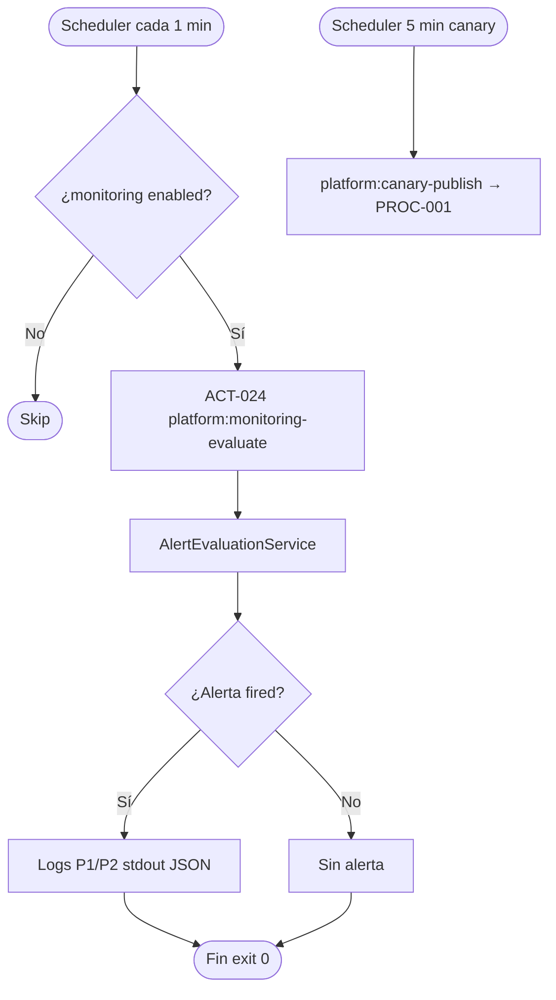

# PROC-013 — Monitoreo y alertas plataforma

**ID:** PROC-013  
**Versión documento:** 1.0  
**Fecha:** 2026-06-27  
**Estado:** Implementado  
**Tipo:** Técnico — Observabilidad / Operación  
**Macroproceso:** MP-03 Observabilidad y Monitoreo

---

## Descripción

Proceso de evaluación periódica de reglas de alerta, canary publish y exposición de métricas Prometheus. El scheduler ejecuta `platform:monitoring-evaluate` cada minuto (si habilitado) y `platform:canary-publish` cada cinco minutos. Complementa observabilidad dashboard (PROC-004) con señales operativas accionables documentadas en runbook de alertas.

---

## Objetivo

Detectar condiciones anómalas (umbrales cola, errores, canary) y registrar alertas accionables para Ops, cumpliendo planes de monitoreo y ADR-008/009 de logs/tracing.

---

## Alcance

**Incluye:**

- ACT-024: evaluación alertas (`EvaluateMonitoringAlertsCommand`).
- Schedule cada minuto en `routes/console.php` (condicional `platform_monitoring.enabled`).
- Canary publish schedule cada 5 min (`platform:canary-publish`).
- Export Prometheus `GET /metrics` (`PrometheusMetricsExporter`).
- Reporter consola JSON (`--json`).
- Config alertas `config/platform_monitoring.php`.
- Runbook respuesta `docs/monitoring/Runbook_Alertas.md`.

**Excluye:**

- Dashboard UI feed (PROC-004).
- Resolución incidentes cliente (PROC-015) — puede derivar.
- Deploy Grafana/Prometheus (DEP-026 — documentación referencia).

---

## Actores

| Actor | Rol |
|-------|-----|
| Scheduler Laravel | Dispara evaluación periódica |
| Ops / SRE | Responde alertas según runbook |
| `EvaluateMonitoringAlertsCommand` | CLI evaluación |
| `AlertEvaluationService` | Evalúa reglas |
| `MonitoringAlertsConsoleReporter` | Output logs P1/P2 |
| Prometheus scraper | Consume `/metrics` |

---

## Entradas

| Entrada | Origen |
|---------|--------|
| Umbrales alerta | `config/platform_monitoring.php` |
| Métricas runtime | Observability + Middleware |
| Schedule timer | `routes/console.php` |
| Flag enabled | `platform_monitoring.enabled` |
| Canary config | `platform_monitoring.canary.enabled` |

---

## Salidas

| Salida | Descripción |
|--------|-------------|
| Logs alerta P1/P2 | Consola / stdout JSON (ADR-008) |
| JSON alertas (`--json`) | Integración externa |
| Métricas Prometheus | Endpoint `/metrics` |
| Exit code 0 | Evaluación completada |
| Canary event | Tráfico prueba cada 5 min |

---

## Reglas de negocio

| ID | Regla | Evidencia |
|----|-------|-----------|
| RN-013-01 | Evaluación cada minuto si monitoring enabled | FLU-030; `routes/console.php` |
| RN-013-02 | Canary cada 5 min si canary enabled | `routes/console.php` L13–15 |
| RN-013-03 | Alertas accionables en logs estructurados | ADR-008 |
| RN-013-04 | DEP-010: alertas usan métricas + canary | `dependencias.csv` |
| RN-013-05 | Respuesta según Runbook_Alertas.md | ART-030 artefactos.csv |

---

## Precondiciones

1. Scheduler/cron Laravel en ejecución.
2. `platform_monitoring.enabled = true` (default).
3. Métricas observability disponibles.
4. Instancia silo o CP operativa.

---

## Postcondiciones

1. Reglas evaluadas en ciclo scheduler.
2. Alertas fired registradas en logs.
3. Métricas Prometheus actualizadas para scrape.
4. Ops puede correlacionar con PROC-003 y PROC-004.

---

## Flujo principal (paso a paso)

| Paso | Actividad | Descripción |
|------|-----------|-------------|
| 1 | Evento inicio | Scheduler dispara cada minuto |
| 2 | **ACT-024** Evaluar alertas | `platform:monitoring-evaluate` |
| 3 | Cargar reglas | `AlertEvaluationService` + config |
| 4 | Evaluar umbrales | Cola, errores, métricas ops |
| 5 | Reportar | `MonitoringAlertsConsoleReporter::report` |
| 6 | Logs P1/P2 | Stdout JSON sidecar (ADR-008) |
| 7 | **Fin** | Exit code 0 |

---

## Flujos alternativos

### FA-01 — Salida JSON

- **Condición:** `--json` flag.
- **Acción:** Alertas fired como JSON en stdout.

### FA-02 — Canary publish

- **Condición:** Canary enabled; schedule 5 min.
- **Acción:** `platform:canary-publish` — evento prueba al bus.
- **Relación:** Valida PROC-001 pipeline end-to-end.

### FA-03 — Monitoring disabled

- **Condición:** `platform_monitoring.enabled = false`.
- **Acción:** Schedule no ejecuta (when callback false).

### FA-04 — Escalado a incidente

- **Condición:** Alerta crítica persistente.
- **Acción:** Ops abre PROC-015 o ticket externo.

---

## Excepciones

| Escenario | Causa | Tratamiento |
|-----------|-------|-------------|
| EX-013-01 | BD métricas no disponible | Log error; retry siguiente ciclo |
| EX-013-02 | Config reglas inválida | Skip regla; log warning |
| EX-013-03 | Canary publish falla | Alerta canary; PROC-001 diagnóstico |

---

## Eventos

| Evento BPMN | Tipo | Descripción |
|-------------|------|-------------|
| Timer scheduler | Evento inicio | Cada minuto |
| Alerta evaluada | Intermedio | Regla fired o OK |
| Fin ciclo | Evento fin | Exit 0 |

---

## Dependencias

| Dependencia | Tipo | Componente |
|-------------|------|------------|
| DEP-010 | Servicio | Monitoring → Observability |
| PROC-001 | Datos | Métricas bus |
| PROC-004 | Paralelo | Dashboard observación |
| ADR-008, ADR-009 | Decisión | Logs y tracing |
| Prometheus docs | Referencia | `docs/monitoring/prometheus/` |

---

## Riesgos

| ID | Riesgo | Mitigación |
|----|--------|------------|
| R1 | DEP-026: deploy Grafana no evidenciado | Runbook manual |
| R2 | Alert fatigue | Umbrales config |
| R3 | Scheduler no running | Health check ops |

---

## Indicadores

| Indicador | Fuente |
|-----------|--------|
| Alertas fired / ciclo | Logs P1/P2 |
| Métricas Prometheus | `GET /metrics` |
| Canary success rate | Logs canary publish |
| C14–C15 | `docs/evaluation/04_Matriz_Observabilidad.csv` |

---

## Relación con otros procesos

| Proceso | Relación |
|---------|----------|
| PROC-003 | Métricas cola consultables |
| PROC-004 | Observabilidad UI |
| PROC-001 | Canary publish tráfico |
| PROC-015 | Escalado incidentes |
| PROC-014 | Purga trace_logs incluida schedule relacionado |

---

## Componentes involucrados

| Capa | Componente |
|------|------------|
| Console | `EvaluateMonitoringAlertsCommand`, canary command |
| Aplicación | `AlertEvaluationService`, `MonitoringAlertsConsoleReporter` |
| Observability | `PrometheusMetricsExporter` |
| Config | `config/platform_monitoring.php` |
| Schedule | `routes/console.php` |

---

## Documentación relacionada

- `docs/monitoring/Runbook_Alertas.md`
- `docs/monitoring/prometheus/alert_rules.yml`
- `docs/production/Monitoreo.md`
- `docs/monitoring/Alertas_Manual_Checklist.md`

---

## Trazabilidad

| Elemento | Evidencia |
|----------|-----------|
| PROC-013 | `docs/Patente/matriz_generada/procesos.csv` |
| ACT-024 | `docs/Patente/matriz_generada/actividades_bpmn.csv` |
| FLU-030 | `docs/Patente/matriz_generada/flujo_bpmn.csv` |
| DEP-010 | `docs/Patente/matriz_generada/dependencias.csv` |
| ART-030, ART-046, ART-047 | `docs/Patente/matriz_generada/artefactos.csv` |
| Comando | `app/Monitoring/Interfaces/Commands/EvaluateMonitoringAlertsCommand.php` |

---

## Diagrama Mermaid

---

## BPMN Mapping

| Elemento BPMN | Identificador / descripción |
|---------------|----------------------------|
| **Evento Inicio** | Timer scheduler (1 min / 5 min canary) |
| **Eventos Intermedios** | Alerta fired; canary publicado |
| **Evento Final** | Ciclo evaluación completado |
| **Actividades** | ACT-024 Evaluar alertas monitoreo |
| **Gateways** | GW-ENABLED: monitoring enabled; GW-FIRE: umbral excedido |
| **Pools** | Pool Scheduler; Pool Monitoring |
| **Lanes** | Lane Console Command; Lane Alert Service |
| **Artefactos** | Runbook_Alertas.md; alert_rules.yml; prometheus.yml |

---

*Fin del documento PROC-013*
