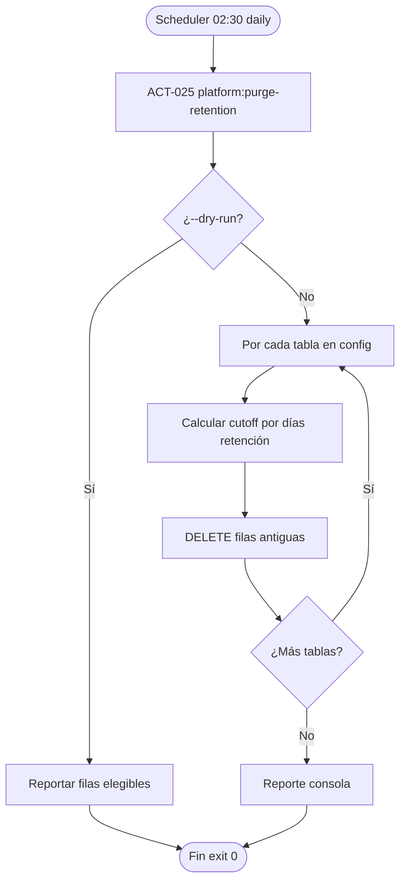

# PROC-014 — Retención y purga datos operativos

**ID:** PROC-014  
**Versión documento:** 1.0  
**Fecha:** 2026-06-27  
**Estado:** Implementado  
**Tipo:** Técnico — Operación / Apoyo  
**Macroproceso:** MP-06 Operaciones e Infraestructura

---

## Descripción

Proceso automatizado de purga de filas antiguas en tablas operativas según políticas de retención configuradas en `config/platform_retention.php`. Ejecutado diariamente a las 02:30 vía scheduler (`platform:purge-retention`). Mitiga crecimiento de tablas tracking documentado como riesgo en PROC-001 y alinea con REQ-OPS-01 y ADR-005.

---

## Objetivo

Mantener tamaño controlado de tablas operativas (cola, logs, métricas, traces, event store, audit) sin intervención manual, preservando ventanas de retención configurables por entorno.

---

## Alcance

**Incluye:**

- ACT-025: comando `PurgePlatformRetentionCommand`.
- Schedule diario 02:30 (`routes/console.php` FLU-031).
- Tablas: `message_queue`, `event_logs`, `observability_metrics`, `trace_logs`, `event_store`, `audit_logs`.
- Opciones `--dry-run` y `--table=` para purga selectiva.
- Override runtime vía `system_configurations` (prefijo `retention.`).
- Servicio `PlatformRetentionService`.

**Excluye:**

- Backup/restauración BD (PROC-031).
- Particionamiento event_store (ADR-005 — diferido).
- Retención logs agregador cloud (ADR-008 — separada).

---

## Actores

| Actor | Rol |
|-------|-----|
| Scheduler Laravel | Dispara purga diaria 02:30 |
| Ops | Ejecuta manual dry-run o purga selectiva |
| `PurgePlatformRetentionCommand` | CLI entrada |
| `PlatformRetentionService` | Lógica purga por tabla |
| `PurgePlatformRetentionTableValidator` | Valida nombre tabla |

---

## Entradas

| Entrada | Origen |
|---------|--------|
| Config retención días | `config/platform_retention.php` |
| ENV overrides | `RETENTION_*_DAYS` |
| Schedule timer | Diario 02:30 |
| Opciones CLI | `--dry-run`, `--table=` |

---

## Salidas

| Salida | Descripción |
|--------|-------------|
| Filas eliminadas | Por tabla según cutoff fecha |
| Reporte consola | Conteo filas purgadas |
| Exit code 0 | Purga exitosa |
| Dry-run report | Filas que se eliminarían |

---

## Reglas de negocio

| ID | Regla | Evidencia |
|----|-------|-----------|
| RN-014-01 | Schedule diario 02:30 | FLU-031; `routes/console.php` |
| RN-014-02 | Defaults: message_queue 30d, event_store 90d, audit 2555d | `platform_retention.php` |
| RN-014-03 | `--dry-run` no elimina filas | `PurgePlatformRetentionCommand` |
| RN-014-04 | Solo tablas whitelist en validator | `PurgePlatformRetentionTableValidator` |
| RN-014-05 | REQ-OPS-01 retención automatizada | `requerimientos.csv` |

---

## Precondiciones

1. Scheduler/cron activo en instancia.
2. Migraciones tablas operativas aplicadas.
3. Config retención cargada.
4. Ventana mantenimiento aceptada (02:30).

---

## Postcondiciones

1. Filas anteriores a cutoff eliminadas (salvo dry-run).
2. Tablas operativas dentro de política retención.
3. Consultas PROC-003 no muestran datos fuera de ventana.
4. Audit logs conservados según política más larga.

---

## Flujo principal (paso a paso)

| Paso | Actividad | Descripción |
|------|-----------|-------------|
| 1 | Evento inicio | Scheduler 02:30 → `platform:purge-retention` |
| 2 | **ACT-025** Purgar retención | `PurgePlatformRetentionCommand::handle` |
| 3 | Validar tabla opcional | `PurgePlatformRetentionTableValidator` |
| 4 | Iterar tablas config | `PlatformRetentionService::purge` |
| 5 | Calcular cutoff | Días retención por tabla |
| 6 | DELETE aged rows | Por cada tabla |
| 7 | Reportar resultados | `PurgePlatformRetentionConsoleReporter` |
| 8 | **Fin** | Exit code 0 |

---

## Flujos alternativos

### FA-01 — Dry run manual

- **Condición:** Ops ejecuta `--dry-run`.
- **Acción:** Reporta filas elegibles sin DELETE.

### FA-02 — Purga tabla única

- **Condición:** `--table=message_queue`.
- **Acción:** Solo purga cola especificada.

### FA-03 — Override system_configurations

- **Condición:** Valores runtime en BD seed.
- **Acción:** Prefijo `retention.` override config file.

---

## Excepciones

| Escenario | Causa | Tratamiento |
|-----------|-------|-------------|
| EX-014-01 | Tabla inválida en `--table` | Exit error; mensaje consola |
| EX-014-02 | BD lock timeout | Log error; retry día siguiente |
| EX-014-03 | Purga agresiva accidental | Backups PROC-031; dry-run previo |

---

## Eventos

| Evento BPMN | Tipo | Descripción |
|-------------|------|-------------|
| Timer 02:30 | Evento inicio | Schedule diario |
| Filas purgadas | Intermedio | Por tabla |
| Fin purga | Evento fin | Exit 0 |

---

## Dependencias

| Dependencia | Tipo | Proceso |
|-------------|------|---------|
| ADR-005 | Relacionado | Particionamiento diferido |
| PROC-001 | Datos | Genera filas purgables |
| PROC-003 | Impacto | Datos históricos no consultables |
| Plan_Resiliencia | Doc | REQ-OPS-01 |

---

## Riesgos

| ID | Riesgo | Mitigación |
|----|--------|------------|
| R1 | Pérdida datos forense | Ventana audit 2555d; backup PROC-031 |
| R2 | Purga event_store antes investigación DLQ | Coordinar con PROC-003 |
| R3 | Scheduler no running | Monitoreo PROC-013 |

---

## Indicadores

| Indicador | Fuente |
|-----------|--------|
| Filas purgadas / tabla / día | Logs comando |
| Tamaño tablas BD | Métricas ops |
| C19 | `docs/evaluation/06_Matriz_Operacion.csv` |

---

## Relación con otros procesos

| Proceso | Relación |
|---------|----------|
| PROC-001 | Genera message_queue, event_logs |
| PROC-004 | event_feed puede tener retención propia |
| PROC-013 | Monitoreo tamaño BD |
| PROC-031 | Backup previo a purga agresiva |

---

## Componentes involucrados

| Capa | Componente |
|------|------------|
| Console | `PurgePlatformRetentionCommand` |
| Aplicación | `PlatformRetentionService`, validators, reporters |
| Config | `config/platform_retention.php` |
| Schedule | `routes/console.php` |

---

## Documentación relacionada

- `docs/production/Plan_Resiliencia.md`
- `docs/production/Plan_BaseDeDatos.md`
- `docs/production/BaseDeDatos.md`
- `docs/production/ADR_005_event_store_partitioning.md`

---

## Trazabilidad

| Elemento | Evidencia |
|----------|-----------|
| PROC-014 | `docs/Patente/matriz_generada/procesos.csv` |
| ACT-025 | `docs/Patente/matriz_generada/actividades_bpmn.csv` |
| FLU-031 | `docs/Patente/matriz_generada/flujo_bpmn.csv` |
| REQ-OPS-01 | `docs/Patente/matriz_generada/requerimientos.csv` |
| Comando | `app/Console/Commands/Ops/PurgePlatformRetentionCommand.php` |
| Config | `config/platform_retention.php` |

---

## Diagrama Mermaid

---

## BPMN Mapping

| Elemento BPMN | Identificador / descripción |
|---------------|----------------------------|
| **Evento Inicio** | Timer scheduler 02:30 o CLI manual |
| **Evento Final** | Purga completada exit 0 |
| **Actividades** | ACT-025 Purgar retención tablas |
| **Gateways** | GW-DRY: dry-run vs delete; GW-TABLE: tabla específica vs todas |
| **Pools** | Pool Scheduler/Ops; Pool Console |
| **Objetos de datos** | Config retention days; filas eliminadas count |
| **Almacenes** | message_queue; event_logs; observability_metrics; trace_logs; event_store; audit_logs |
| **Artefactos** | platform_retention.php; Plan_BaseDeDatos.md |

---

*Fin del documento PROC-014*
