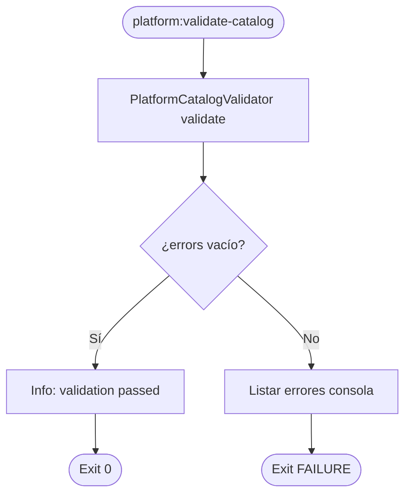

# PROC-016 — Validación catálogo CI

**ID:** PROC-016  
**Versión documento:** 1.0  
**Fecha:** 2026-06-27  
**Estado:** Implementado  
**Tipo:** Técnico — Calidad / Gobernanza  
**Macroproceso:** MP-05 Calidad y Validación

---

## Descripción

Proceso de validación de alineación entre catálogo declarativo `modules_config.json` y suscripciones/routing en `eventbus.php` (y packs fusionados). Ejecutado vía `php artisan platform:validate-catalog` como gate CI (B.3 Plan de implementación). Falla el pipeline si detecta drift entre declarado y suscrito.

---

## Objetivo

Prevenir despliegues con configuración incoherente que rompa topología, simulación o publicación, cumpliendo REQ-VAL-01 y cerrando brecha documentada en Plan_de_implementacion.md §B.3.

---

## Alcance

**Incluye:**

- Comando `ValidatePlatformCatalogCommand`.
- Servicio `PlatformCatalogValidator`.
- Integración CI: `composer.json` scripts `ci` / `validate-config`.
- Validación pre-simulación recomendada (Runbook_Simulacion_Cliente.md).
- Exit code 0 (OK) o FAILURE (errores listados).

**Excluye:**

- Sync registry automático (PROC-002) — complementario.
- Validación runtime dinámica (REQ-DYN-01 — no cumple).
- Validación esquema payload por event_type (PROC-001 ACT-002).

---

## Actores

| Actor | Rol |
|-------|-----|
| CI / Pipeline | Ejecuta en cada build |
| Desarrollador | Ejecuta local pre-commit |
| `ValidatePlatformCatalogCommand` | CLI |
| `PlatformCatalogValidator` | Reglas alineación |
| SimulateClientCommand | Consumidor pre-sim (ACT-021 relacionado) |

---

## Entradas

| Entrada | Origen |
|---------|--------|
| `config/modules/modules_config.json` | Catálogo declarativo UI |
| `config/eventbus.php` | Suscripciones producers |
| Packs fusionados | `EventBusIntegrationServiceProvider` |
| Invocación CLI/CI | Manual o composer script |

---

## Salidas

| Salida | Descripción |
|--------|-------------|
| Exit 0 | Validación passed |
| Exit FAILURE | Lista errores en consola |
| Mensaje éxito | "Platform catalog validation passed." |
| Bloqueo CI | Pipeline detenido si falla |

---

## Reglas de negocio

| ID | Regla | Evidencia |
|----|-------|-----------|
| RN-016-01 | Falla CI si declarado ≠ suscrito | REQ-VAL-01; Plan B.3 |
| RN-016-02 | Mitiga divergencia eventbus vs JSON | DEP-003 riesgo; reporte_generacion R1 |
| RN-016-03 | Pre-requisito simulación recomendado | Runbook_Simulacion_Cliente.md |
| RN-016-04 | Complementa sync-config PROC-002 | No reemplaza registry sync |

---

## Precondiciones

1. Archivos config presentes en workspace.
2. PHP/Laravel bootstrappable en CI.
3. Reglas validator implementadas en `PlatformCatalogValidator`.

---

## Postcondiciones

1. Si OK: config coherente para deploy/simulación.
2. Si FAIL: errores documentados en stdout; CI bloqueado.
3. PROC-009 puede continuar si validación previa OK.

---

## Flujo principal (paso a paso)

| Paso | Actividad | Descripción |
|------|-----------|-------------|
| 1 | Evento inicio | CI o dev ejecuta `platform:validate-catalog` |
| 2 | Bootstrap validator | `PlatformCatalogValidator` inyectado |
| 3 | Cargar configs | modules_config + eventbus + packs |
| 4 | Ejecutar reglas | Comparar declarado vs suscrito |
| 5 | Gateway resultado | ¿errors === []? |
| 6a | Éxito | Info "validation passed"; exit 0 |
| 6b | Fallo | Listar errores; exit FAILURE |
| 7 | **Fin** | Gate CI determinado |

---

## Flujos alternativos

### FA-01 — validate-config composer

- **Condición:** `composer validate-config`.
- **Acción:** JSON lint + platform:validate-catalog encadenados.

### FA-02 — Pre-simulación manual

- **Condición:** Operador antes de `platform:simulate-client`.
- **Acción:** Mismo comando; Runbook recomienda.

### FA-03 — Post espejo CP→Silo

- **Condición:** Tras PROC-034 mirror catálogo.
- **Acción:** Validar coherencia en silo destino.

---

## Excepciones

| Escenario | Causa | Tratamiento |
|-----------|-------|-------------|
| EX-016-01 | JSON inválido modules_config | Fallo lint previo |
| EX-016-02 | Módulo declarado sin suscripción | Error validator listado |
| EX-016-03 | Suscripción huérfana | Error según reglas B.3 |

---

## Eventos

| Evento BPMN | Tipo | Descripción |
|-------------|------|-------------|
| CI trigger / CLI | Evento inicio | validate-catalog |
| Validación OK/FAIL | Evento fin | Exit code |

---

## Dependencias

| Dependencia | Tipo | Proceso |
|-------------|------|---------|
| DEP-003, DEP-004 | Config | Fuentes verdad |
| PROC-002 | Complemento | Sync registry |
| PROC-009 | Consumidor | Pre-simulación |
| PROC-034 | Origen datos | Espejo catálogo |
| composer ci | Infra | Pipeline |

---

## Riesgos

| ID | Riesgo | Mitigación |
|----|--------|------------|
| R1 | Drift no detectado si CI omitido | Gate obligatorio |
| R2 | Reglas incompletas vs B.3 | Evolucionar validator |
| R3 | REQ-DYN-01 no cumple | Brecha separada 99_Validacion_Brechas |

---

## Indicadores

| Indicador | Fuente |
|-----------|--------|
| Tasa fallos CI validate-catalog | Pipeline logs |
| C24–C26 | `docs/evaluation/08_Matriz_Calidad.csv` |

---

## Relación con otros procesos

| Proceso | Relación |
|---------|----------|
| PROC-002 | Sync corrige drift post-validación |
| PROC-009 | ACT-021 validación pre-sim |
| PROC-033 | Evidencia dominio Calidad |

---

## Componentes involucrados

| Capa | Componente |
|------|------------|
| Console | `ValidatePlatformCatalogCommand` |
| Platform | `PlatformCatalogValidator` |
| Config | `modules_config.json`, `eventbus.php` |
| CI | `composer.json` scripts |

---

## Documentación relacionada

- `docs/production/Plan_de_implementacion.md` §B.3, §6
- `docs/production/CI_CD.md`
- `docs/production/Calidad.md`
- `docs/production/Runbook_Simulacion_Cliente.md`

---

## Trazabilidad

| Elemento | Evidencia |
|----------|-----------|
| PROC-016 | `docs/Patente/matriz_generada/procesos.csv` |
| REQ-VAL-01 | `docs/Patente/matriz_generada/requerimientos.csv` |
| Comando | `app/Console/Commands/Platform/ValidatePlatformCatalogCommand.php` |
| B.3 | `docs/production/Plan_de_implementacion.md` |
| composer ci | `composer.json` scripts |

---

## Diagrama Mermaid

---

## BPMN Mapping

| Elemento BPMN | Identificador / descripción |
|---------------|----------------------------|
| **Evento Inicio** | CI job o CLI validate-catalog |
| **Evento Final** | Exit 0 o FAILURE |
| **Actividades** | Cargar configs; ejecutar reglas; reportar |
| **Gateways** | GW-OK: ¿errors === []? |
| **Pools** | Pool CI; Pool Silo Config |
| **Objetos de datos** | modules_config.json; eventbus.php |
| **Artefactos** | Plan_de_implementacion B.3; composer ci scripts |

---

*Fin del documento PROC-016*
