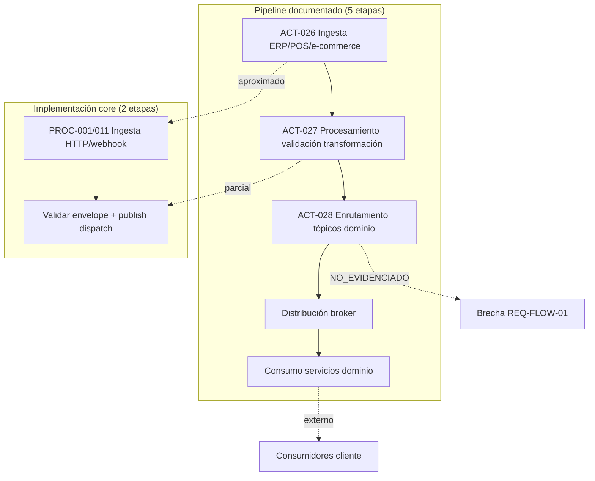

# PROC-017 — Flujo middleware documentado 5 etapas

**ID:** PROC-017  
**Versión documento:** 1.0  
**Fecha:** 2026-06-27  
**Estado:** Documentado — no implementado completo  
**Tipo:** Documental — Funcional / Integración  
**Macroproceso:** MP-02 Operación Middleware y Eventos / MP-08 Integración Omnicanal

---

## Descripción

Proceso **documental** que describe el pipeline conceptual de middleware retail en cinco etapas: ingesta → procesamiento/validación → enrutamiento a tópicos dominio → distribución broker → consumo por servicios de dominio (Inventario, Pedidos, Clientes, etc.). La implementación real del core agnóstico opera en **dos etapas** (validar + publish/dispatch), documentando brecha REQ-FLOW-01 y Plan_Middleware.md problema #5.

---

## Objetivo

Preservar referencia arquitectónica del flujo omnicanal retail documentado en `Flujo_Middleware.md` para integradores y evaluación, explicitando gap vs implementación PROC-001 sin embeber dominios verticales en el core (REQ-RST-01).

---

## Alcance

**Incluye (documental):**

- ACT-026: ingesta documentada etapa 1 (ERP/POS/e-commerce).
- ACT-027: procesamiento y validación documentado etapa 2.
- ACT-028: enrutamiento tópicos dominio — **NO_EVIDENCIADO en código**.
- ACT-DOC-029/030: distribución broker y consumo dominio (flujo_bpmn FLU-023–026).
- Referencia bounded contexts externos (Inventario, Pedidos, Clientes…).
- Tópicos documentales: `Inventario.Events`, `Pedido.Events`, etc.

**Excluye (implementación core):**

- Servicios dominio retail en `app/` (no existen — REQ-RST-01).
- Transformación semántica por tipo evento en core (REQ-RST-02).
- Kafka topics retail dedicados en producción default.
- Implementación completa 5 etapas — **brecha activa**.

---

## Actores

| Actor | Rol |
|-------|-----|
| Arquitectura | Mantiene documento referencia |
| Sistemas fuente | ERP, POS, e-commerce (externos) |
| Conectores doc | Adaptadores etapa 1 |
| Middleware implementado | PROC-001, PROC-011 (2 etapas reales) |
| Servicios dominio (externos) | Consumidores etapa 5 — documentales |
| Integrador | Implementa dominios fuera del core |

---

## Entradas

| Entrada | Origen |
|---------|--------|
| Eventos ERP/POS/e-commerce | Sistemas fuente |
| Conectores/adaptadores | Integración externa |
| Webhooks HTTP | PROC-011 (aproximación etapa 1) |
| HTTP publish API | PROC-001 ACT-001 |

---

## Salidas

| Salida | Descripción |
|--------|-------------|
| Eventos en tópicos dominio (doc) | Inventario, Pedido, Cliente… |
| Eventos en bus Laravel (real) | Por `event_type` declarativo |
| Servicios dominio actualizados (doc) | BD independiente por BC |

---

## Reglas de negocio

| ID | Regla | Evidencia |
|----|-------|-----------|
| RN-017-01 | Core agnóstico no implementa dominios retail | REQ-RST-01; procesos.csv PROC-017 notas |
| RN-017-02 | Pipeline doc 5 etapas vs impl 2 etapas | REQ-FLOW-01; Plan_Middleware.md #5 |
| RN-017-03 | ACT-028 tópicos retail NO_EVIDENCIADO | actividades_bpmn.csv |
| RN-017-04 | Enrutamiento real solo por event_type config | Plan_Modulo_Control_Middleware.md §8 |
| RN-017-05 | Consumidores son packs/cliente externos | DDD_en_la_arquitectura.md |

---

## Precondiciones

1. Documentación Flujo_Middleware.md disponible.
2. Para tráfico real: PROC-001 o PROC-011 operativos.
3. Consumidores dominio desplegados externamente al core (doc).

---

## Postcondiciones

1. **Documental:** flujo 5 etapas comprendido por stakeholders.
2. **Real:** evento publicado y despachado según PROC-001 (2 etapas).
3. Brecha REQ-FLOW-01 registrada en evaluación y 99_Validacion_Brechas.

---

## Flujo principal (paso a paso) — DOCUMENTAL

| Paso | Actividad | Descripción |
|------|-----------|-------------|
| 1 | **ACT-026** Ingesta | Recepción desde ERP/POS/e-commerce vía conectores |
| 2 | **ACT-027** Procesamiento | Validación, transformación, enriquecimiento, normalización |
| 3 | **ACT-028** Enrutamiento | Clasificación a tópicos Inventario/Pedido/Cliente… |
| 4 | ACT-DOC-029 Distribución | Broker mensajes, colas y tópicos |
| 5 | ACT-DOC-030 Consumo | Servicios dominio procesan eventos |
| 6 | **Fin doc** | Estado dominio actualizado (externo al core) |

---

## Flujo implementado (gap mapping)

| Etapa doc | Implementación real | Proceso |
|-----------|---------------------|---------|
| 3.1 Ingesta | HTTP publish / webhooks | PROC-001, PROC-011 |
| 3.2 Procesamiento | Validación envelope mínima (no transform semántica) | PROC-001 ACT-002 |
| 3.3 Enrutamiento topics | Suscripción por event_type (no topics retail) | PROC-001 ACT-004 |
| 3.4 Distribución | Laravel Event bus / Kafka adapter opcional | EventBusPort |
| 3.5 Consumo dominio | Listeners packs cliente / externos | Fuera del core |

---

## Flujos alternativos

### FA-01 — Ingress webhook como ingesta

- **Condición:** Canal usa webhook en lugar de conector batch.
- **Implementación:** PROC-011 → PROC-001.

### FA-02 — Kafka driver

- **Condición:** `eventbus.driver = kafka`.
- **Implementación:** `KafkaEventBusAdapter` — DEP-021 baja prioridad.

### FA-03 — Simulación fixtures

- **Condición:** Tráfico prueba sin ERP real.
- **Implementación:** PROC-009 sample_events.json.

---

## Excepciones

| Escenario | Nota |
|-----------|------|
| Interpretar PROC-017 como implementado | **Error:** gap documentado |
| Expectativa transformación retail en core | Violación REQ-RST-02 |
| Tópicos Inventario.Events en core | NO_EVIDENCIADO |

---

## Eventos

| Evento (doc) | Tipo | Implementación |
|--------------|------|----------------|
| Evento fuente ERP/POS | Inicio doc | PROC-011/001 |
| ProductoRegistrado, PedidoCreado… | Dominio doc | Matriz_Trazabilidad — externos |
| Fin consumo dominio | Fin doc | N/A en core |

---

## Dependencias

| Dependencia | Tipo |
|-------------|------|
| Flujo_Middleware.md | Fuente primaria ART-017 |
| PROC-001 | Implementación parcial |
| Analisis_v0.1 | Contexto referencia |
| REQ-FLOW-01 | Requisito parcial |

---

## Riesgos

| ID | Riesgo | Mitigación |
|----|--------|------------|
| R1 | Scope creep retail en core | REQ-RST-01; ADRs |
| R2 | Confusión doc vs código | Este proceso + 99_Validacion_Brechas |
| R3 | Legacy mockups obsoletos | DC_Mockups_obsoletos marcados NOusar |

---

## Indicadores

| Indicador | Fuente |
|-----------|--------|
| Brecha REQ-FLOW-01 | evaluation matrices |
| C01–C04, C27 | Arquitectura |
| C05–C08 | Middleware |

---

## Relación con otros procesos

| Proceso | Relación |
|---------|----------|
| PROC-001 | Implementación real 2 etapas |
| PROC-011 | Ingesta canal externo |
| PROC-018 | No aplica (multi-tenant diferido) |
| PROC-033 | Evaluación documenta brecha |

---

## Componentes involucrados

| Capa | Documental | Implementado |
|------|------------|--------------|
| Ingesta | Conectores ERP/POS | PROC-001, PROC-011 |
| Procesamiento | Transform/enrich | PublishEnvelopeValidator |
| Enrutamiento | Topics retail | SubscriptionRegistryService |
| Distribución | Broker genérico | LaravelEventBusAdapter |
| Consumo | BC Inventario/Pedidos… | Externo al repositorio |

---

## Documentación relacionada

- `docs/Plan_Desarrollo_Servicio_v0.1/Flujo_Middleware.md` §3.1–3.5
- `docs/production/Plan_Middleware.md` — gap 5 vs 2 etapas
- `docs/Plan_Desarrollo_Servicio_v0.1/DDD_en_la_arquitectura.md`
- `docs/Plan_Desarrollo_Servicio_v0.1/Arquitectura_EDA.md`

---

## Trazabilidad

| Elemento | Evidencia |
|----------|-----------|
| PROC-017 | `docs/Patente/matriz_generada/procesos.csv` |
| ACT-026–028 | `docs/Patente/matriz_generada/actividades_bpmn.csv` |
| FLU-023–026 | `docs/Patente/matriz_generada/flujo_bpmn.csv` |
| REQ-FLOW-01 | `docs/Patente/matriz_generada/requerimientos.csv` |
| ART-017 | `docs/Patente/matriz_generada/artefactos.csv` |
| reporte_generacion R2 | Brecha 5 vs 2 etapas |

---

## Diagrama Mermaid

---

## BPMN Mapping

| Elemento BPMN | Identificador / descripción |
|---------------|----------------------------|
| **Evento Inicio** | Evento sistema fuente (documental) |
| **Actividades doc** | ACT-026 Ingesta; ACT-027 Procesamiento; ACT-028 Enrutamiento |
| **Actividades impl** | PROC-001 ACT-001–004 (sustituto parcial) |
| **Evento Final doc** | Consumo servicio dominio |
| **Gateways** | GW-GAP: ¿5 etapas vs 2 etapas? → brecha documentada |
| **Pools** | Pool Sistemas Fuente; Pool Middleware Core; Pool Dominios Externos |
| **Artefactos** | Flujo_Middleware.md; Plan_Middleware.md |
| **Nota BPMN** | Proceso marcado **documental** — no confundir con runtime |

---

*Fin del documento PROC-017*
