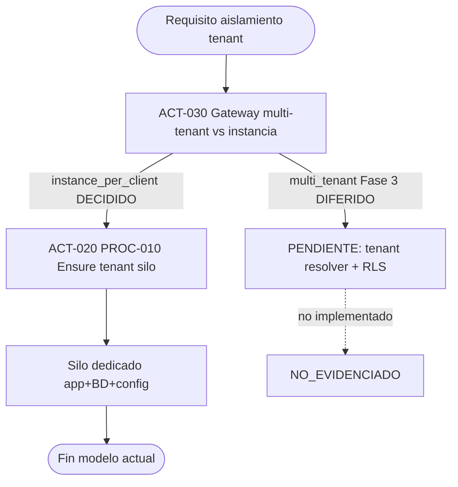

# PROC-018 — Multi-tenancy lógico Fase 3

**ID:** PROC-018  
**Versión documento:** 1.0  
**Fecha:** 2026-06-27  
**Estado:** Diferido  
**Tipo:** Documental — Estratégico / Gobernanza  
**Macroproceso:** MP-07 Gobernanza y Evolución

---

## Descripción

Proceso **diferido** que describe la evolución futura hacia multi-tenancy lógico (una aplicación compartida con `tenant_id`, tenant resolver y RLS) como alternativa al modelo actual **instancia por cliente** (ADR-001). Fase 3 documentada en ADR-001 no implementada; runtime operativo usa `instance_per_client` en `config/platform.php`.

---

## Objetivo

Documentar la decisión arquitectónica diferida y el gateway de elección de modelo de aislamiento (ACT-030), evitando interpretación errónea de columnas `tenant_id` existentes como multi-tenancy activo hoy.

---

## Alcance

**Incluye (documentación/decisión):**

- Gateway ACT-030: `instance_per_client` vs multi-tenant lógico.
- ADR-001 §Fase 3 — evolución futura.
- REQ-MT-01 — tenant resolver RLS (diferido).
- Preparación esquema: tabla `tenants`, columnas `tenant_id` en repos.
- Contraste con PROC-010 (ensure tenant metadatos instancia).

**Excluye (no implementado):**

- Tenant resolver runtime multi-tenant.
- Row Level Security (RLS) en BD.
- Particionamiento lógico en una sola app.
- ACL runtime por tenant_id dentro mismo proceso.

---

## Actores

| Actor | Rol |
|-------|-----|
| Arquitectura | Decisor evolución Fase 3 |
| Admin SaaS | Evalúa requisito consolidación instancias |
| `InstanceTenantContext` | Hoy: metadatos instancia única |
| Ops | Gestiona N silos (modelo actual) |

---

## Entradas

| Entrada | Origen |
|---------|--------|
| Requisito negocio consolidación | Decisión enterprise |
| ADR-001 evaluación | Documentación |
| Esquema BD preparado | Migraciones tenants |
| Gateway ACT-030 | actividades_bpmn.csv |

---

## Salidas

| Salida | Estado |
|--------|--------|
| PENDIENTE_VALIDACION | Fase 3 no implementada |
| Modelo actual | instance_per_client operativo |
| PROC-010 | tenant row metadatos por silo |

---

## Reglas de negocio

| ID | Regla | Evidencia |
|----|-------|-----------|
| RN-018-01 | Decisión actual: instancia por cliente (Aceptado) | ADR-001; ACT-030 decidido |
| RN-018-02 | Fase 3 multi-tenant lógico diferida | procesos.csv PROC-018 |
| RN-018-03 | tenant_id hoy = metadatos instancia, no ACL | ADR-001 §Consecuencias |
| RN-018-04 | REQ-MT-01 estado diferido | requerimientos.csv |
| RN-018-05 | FLU-028: gateway → ACT-020 instance_per_client | flujo_bpmn.csv |

---

## Precondiciones

1. Requisito negocio validado para cambiar modelo (no cumplido hoy).
2. ADR-001 Fase 3 aprobada formalmente (pendiente).
3. Análisis coste N instancias vs consolidación completado.

---

## Postcondiciones

**Estado actual (Fase D):**

1. Cada cliente en silo dedicado (PROC-008, PROC-010).
2. PROC-018 permanece documental/diferido.
3. Sin RLS ni tenant resolver multi-tenant.

**Estado futuro (Fase 3 — hipotético):**

1. Una app; tenant_id discrimina datos.
2. Migración fleet instancias → multi-tenant — NO_EVIDENCIADO.

---

## Flujo principal (paso a paso) — GATEWAY DECISIÓN

| Paso | Actividad | Descripción |
|------|-----------|-------------|
| 1 | Evento inicio | Requisito aislamiento evaluado |
| 2 | **ACT-030** Gateway multi-tenant vs instancia | Decisión arquitectura |
| 3 | Rama A (actual) | `instance_per_client` → PROC-010 ACT-020 |
| 4 | Rama B (diferida) | Multi-tenant lógico Fase 3 — PENDIENTE |
| 5 | **Fin actual** | Silo dedicado operativo |

---

## Flujos alternativos

### FA-01 — Modelo actual (implementado)

- **Decisión:** instance_per_client.
- **Flujo:** PROC-008 → PROC-010 → PROC-019.
- **Evidencia:** FLU-028 → ACT-020.

### FA-02 — Fase 3 (diferido)

- **Condición:** Requisito consolidación costes/ops.
- **Estado:** PENDIENTE_VALIDACION — sin código evidenciado.

---

## Excepciones

| Escenario | Nota |
|-----------|------|
| Asumir multi-tenant activo por columna tenant_id | **Incorrecto** — ADR-001 |
| Implementar RLS sin ADR Fase 3 | Fuera de alcance actual |

---

## Eventos

| Evento | Tipo | Estado |
|--------|------|--------|
| Evaluación requisito aislamiento | Inicio | Documental |
| Decisión instance_per_client | Fin rama A | Implementado |
| Activación Fase 3 | Fin rama B | Diferido |

---

## Dependencias

| Dependencia | Tipo |
|-------------|------|
| ADR-001 | Decisión primaria |
| PROC-010 | Implementación actual |
| PROC-008, PROC-019 | Fleet instancias |
| REQ-ADR001 | Implementado |

---

## Riesgos

| ID | Riesgo | Mitigación |
|----|--------|------------|
| R1 | Confusión tenant_id vs multi-tenant | ADR-001 explícito |
| R2 | Coste N instancias | Fleet management PROC-008/034 |
| R3 | Migración Fase 3 compleja | Diferir hasta requisito |

---

## Indicadores

| Indicador | Fuente |
|-----------|--------|
| Instancias activas fleet | deploy/local-instances |
| C17 | Matriz Operación |
| Brecha REQ-MT-01 | 99_Validacion_Brechas |

---

## Relación con otros procesos

| Proceso | Relación |
|---------|----------|
| PROC-010 | Alternativa actual (ensure tenant) |
| PROC-008 | Provisioning silo |
| PROC-019 | Portal por instancia |
| PROC-007 | Tenants comerciales CP |

---

## Componentes involucrados

| Componente | Rol actual | Fase 3 |
|------------|------------|--------|
| `config/platform.php` | instance_per_client | PENDIENTE |
| `InstanceTenantContext` | Metadatos silo | Tenant resolver |
| `TenantModel` | Metadatos | Multi-tenant ACL |
| Migraciones tenant_id | Preparación esquema | RLS |

---

## Documentación relacionada

- `docs/production/ADR_001_instancia_por_cliente.md` §Fase 3
- `docs/production/Plan_Tenants.md`
- `docs/Diagrama_BPMN/19_Proceso_Onboarding_Instancia_Cliente.md`

---

## Trazabilidad

| Elemento | Evidencia |
|----------|-----------|
| PROC-018 | `docs/Patente/matriz_generada/procesos.csv` |
| ACT-030 | `docs/Patente/matriz_generada/actividades_bpmn.csv` |
| FLU-028 | `docs/Patente/matriz_generada/flujo_bpmn.csv` |
| REQ-MT-01, REQ-ADR001 | `docs/Patente/matriz_generada/requerimientos.csv` |
| ART-001 | `docs/Patente/matriz_generada/artefactos.csv` |

---

## Diagrama Mermaid

---

## BPMN Mapping

| Elemento BPMN | Identificador / descripción |
|---------------|----------------------------|
| **Evento Inicio** | Evaluación requisito aislamiento |
| **Gateway** | ACT-030 GW-MULTITENANT |
| **Rama implementada** | instance_per_client → PROC-010 |
| **Rama diferida** | Multi-tenant lógico Fase 3 |
| **Evento Final** | Silo operativo (rama A) |
| **Pools** | Pool Arquitectura; Pool Instancias Cliente |
| **Artefactos** | ADR-001 |

---

*Fin del documento PROC-018*
