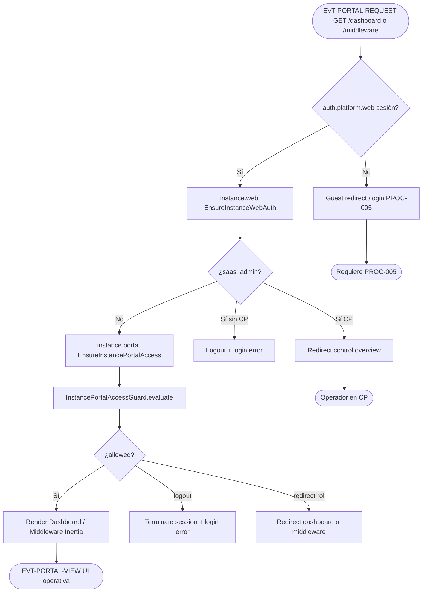

# PROC-019 — Portal instancia cliente web

**ID:** PROC-019  
**Versión documento:** 1.0  
**Fecha:** 2026-06-27  
**Estado:** Implementado  
**Tipo:** Negocio — Funcional / Operativo  
**Macroproceso:** MP-09 Portal Cliente

---

## Descripción

Proceso de acceso web al **portal de instancia cliente**: rutas `/dashboard`, `/middleware` y soporte en el silo Laravel dedicado (ADR-001). Tras autenticación web (PROC-005), el stack middleware `auth.platform.web` → `instance.web` → `instance.portal` garantiza que solo operadores de instancia (no SaaS admin) accedan al portal, con membership tenant correcta y rutas acotadas por rol (`dashboard_viewer` vs `bus_operator`).

`EnsureInstancePortalAccess` delega reglas a `InstancePortalAccessGuard`.

---

## Objetivo

Ofrecer UI operacional del cliente (dashboard observacional y consola middleware) con aislamiento por instancia y RBAC web, coherente con el modelo instancia-por-cliente y friendly routing (ADR-011).

---

## Alcance

**Incluye:**

- Rutas `routes/web.php` grupo middleware `instance.portal`.
- `EnsureInstancePortalAccess` + `InstancePortalAccessGuard`.
- `EnsureInstanceWebAuth` (capa previa `instance.web`).
- Redirecciones rol: dashboard ↔ middleware.
- Rutas soporte `/support/*` en mismo grupo.
- Redirect raíz `/` → `/dashboard`.

**Excluye:**

- Control plane `/control/*` (PROC-007).
- APIs JSON (PROC-004 API, PROC-003).
- Tenant portal proxy friendly URLs (`routes/tenant_portal.php`) — routing alternativo ADR-011.

---

## Actores

| Actor | Rol en el proceso |
|-------|---------------------|
| Operador tenant | `platform_admin`, `bus_operator`, `dashboard_viewer` |
| `EnsureInstancePortalAccess` | Middleware HTTP portal |
| `InstancePortalAccessGuard` | Evalúa tenant + rol + path |
| `EnsureInstanceWebAuth` | Rechaza SaaS admin en silo |
| `InstanceTenantContextInterface` | Contexto tenant instancia / multi-portal login |

---

## Entradas

| Entrada | Formato | Origen |
|---------|---------|--------|
| Sesión autenticada | User + `platform_role`, `tenant_id` | PROC-005 |
| Path solicitado | `/dashboard`, `/middleware`, `/dashboard/*`, `/support/*` | HTTP request |
| Config instancia | `platform.control_plane`, `allowsMultiTenantPortalLogin`, tenant configurado | `config/platform.php` |
| Estado tenant activo | `tenants` en BD silo | ADR-001 metadatos |

---

## Salidas

| Salida | Descripción |
|--------|-------------|
| Vista Inertia | Dashboard o Middleware UI |
| Redirect autorizado | Cambio dashboard ↔ middleware por rol |
| Redirect login | Guest o logout forzado |
| Redirect CP | SaaS admin → `control.overview` |
| Error sesión | Mensaje cuenta sin empresa / otra instancia |

---

## Reglas de negocio

| ID | Regla | Evidencia |
|----|-------|-----------|
| RN-019-01 | SaaS admin no accede portal instancia; redirige a CP | `InstancePortalAccessGuard` L26–28 |
| RN-019-02 | Usuario sin `tenant_id` → logout + error | `InstancePortalAccessGuard` L31–37 |
| RN-019-03 | `tenant_id` usuario debe coincidir con tenant instancia activa | `InstancePortalAccessGuard` L44–51 |
| RN-019-04 | `dashboard_viewer` no accede `/middleware` → redirect dashboard | `InstancePortalAccessGuard` L58–59 |
| RN-019-05 | Rol sin `canAccessDashboardWeb` en path dashboard → redirect middleware | L54–55 |
| RN-019-06 | Multi-tenant portal login: bind tenant desde sesión si habilitado | L40–42 |
| RN-019-07 | SaaS admin en silo: `EnsureInstanceWebAuth` logout con mensaje CP | `EnsureInstanceWebAuth` L35–44 |

---

## Precondiciones

1. Operador autenticado vía PROC-005 en URL silo cliente.
2. Proceso **no** desplegado como control plane (o operador no es SaaS admin).
3. Usuario con `tenant_id` alineado a instancia (ADR-001).
4. Instancia operacional (no suspendida — validación lifecycle en otros flujos).

---

## Postcondiciones

1. Operador visualiza panel web autorizado por rol.
2. Rutas no permitidas redirigen sin exponer datos.
3. Cross-tenant o cuentas inválidas terminan sesión cuando `logout=true`.
4. APIs y SSE del portal disponibles bajo misma sesión/cookies (rutas API paralelas).

---

## Flujo principal (paso a paso)

1. Operador autenticado navega a `/dashboard` o `/middleware` (o redirect desde `/`).
2. Middleware `auth.platform.web` — sesión válida; si no → guest login.
3. Middleware `instance.web` (`EnsureInstanceWebAuth`):
   - Si SaaS admin en silo sin CP → logout/login error.
   - Si SaaS admin con CP config en silo → redirect `control.overview`.
4. Middleware `instance.portal` (`EnsureInstancePortalAccess`):
   - Obtiene `User` y `path`.
   - `InstancePortalAccessGuard::evaluate`.
5. Si `allowed` → controller Inertia (`DashboardWebController`, `MiddlewareWebController`).
6. Si no allowed:
   - `logout` → `OperatorSessionTerminator` + redirect login con error.
   - Solo redirect → `dashboard` o `middleware` según rol.
7. Operador interactúa con UI: métricas, feed, cola, soporte (PROC-004, PROC-003 UI).

---

## Flujos alternativos

| ID | Condición | Resultado |
|----|-----------|-----------|
| FA-01 | `bus_operator` abre `/dashboard` sin permiso dashboard web | Redirect `/middleware` |
| FA-02 | `dashboard_viewer` abre `/middleware` | Redirect `/dashboard` |
| FA-03 | Friendly tenant URL | `routes/tenant_portal.php` proxy (ADR-011) |
| FA-04 | `web_auth_enabled=false` | `instance.web` bypass auth check parcial |

---

## Excepciones

| Excepción | Manejo |
|-----------|--------|
| Guest sin sesión | `redirect()->guest(route('login'))` |
| Cuenta sin empresa | Logout + error email |
| Cuenta otra instancia | Logout + error pertenencia |
| SaaS admin en silo | Logout o redirect CP |

---

## Eventos

| Evento | Tipo BPMN | Descripción |
|--------|-----------|-------------|
| EVT-PORTAL-REQUEST | Inicio | GET ruta portal instancia |
| EVT-PORTAL-ALLOWED | Intermedio | Guard allowed=true |
| EVT-PORTAL-DENIED | Intermedio | Redirect o logout |
| EVT-PORTAL-VIEW | Fin | Render Inertia UI |

---

## Dependencias

| Dependencia | Tipo | Proceso / componente |
|-------------|------|----------------------|
| Login web | Previo | PROC-005 |
| Onboarding / provisioning | Previo | PROC-008, PROC-010 |
| Dashboard datos | Posterior | PROC-004 |
| Middleware UI datos | Posterior | PROC-003 |
| ADR instancia cliente | Arquitectura | ADR-001 |

---

## Riesgos

| ID | Riesgo | Mitigación |
|----|--------|------------|
| R1 | Cross-tenant URL sharing | Guard tenant_id vs instance context |
| R2 | SaaS admin mezclado en silo | Doble capa instance.web + portal |
| R3 | Rol mal configurado | `PlatformRole` capabilities |
| R4 | Portal en instancia suspendida | Lifecycle PROC-007 (CP) |

---

## Indicadores

| Indicador | Fuente |
|-----------|--------|
| Accesos dashboard vs middleware | Logs HTTP / analytics |
| Logouts forzados portal | Mensajes error guard |
| Redirects rol | Patrones 302 dashboard↔middleware |
| Sesiones operadores tenant | Tabla sessions |

---

## Relación con otros procesos

| Proceso | Relación |
|---------|----------|
| PROC-005 | Autenticación previa |
| PROC-004 | Contenido dashboard |
| PROC-003 | Datos middleware UI |
| PROC-008 | Alta cliente y operador inicial |
| PROC-015 | Reportes soporte `/support/reports` |
| PROC-009 | Validación UI post-simulación |

---

## Componentes involucrados

| Capa | Componente |
|------|------------|
| Rutas | `routes/web.php` L21–44 |
| Middleware | `EnsureInstancePortalAccess`, `EnsureInstanceWebAuth` |
| Guard | `InstancePortalAccessGuard` |
| Contexto | `InstanceTenantContextInterface`, `DatabaseInstanceTenantContext` |
| Controllers | `DashboardWebController`, `MiddlewareWebController`, soporte web |
| Dominio | `PlatformRole` — `canAccessDashboardWeb`, `canAccessMiddlewareWeb` |
| Registro | `SecurityServiceProvider` aliases `instance.web`, `instance.portal` |

---

## Documentación relacionada

- `docs/production/ADR_001_instancia_por_cliente.md`
- `docs/production/ADR_011_friendly_routing_multitenant.md`
- `docs/Plan_Desarrollo_Modulos_v0.1/Plan_Modulo_Dashboard_General.md`
- `docs/Diagrama_BPMN/00_Mapa_Procesos.md`
- `docs/Diagrama_BPMN/Matriz_Trazabilidad_BPMN.md`

---

## Trazabilidad

| Elemento | Evidencia |
|----------|-----------|
| PROC-019 | `docs/Patente/matriz_generada/procesos.csv` fila PROC-019 |
| Middleware stack | `routes/web.php` L21 — `auth.platform.web`, `instance.web`, `instance.portal` |
| EnsureInstancePortalAccess | `app/Http/Middleware/EnsureInstancePortalAccess.php` |
| InstancePortalAccessGuard | `app/Shared/Platform/Services/InstancePortalAccessGuard.php` |
| EnsureInstanceWebAuth | `app/Http/Middleware/EnsureInstanceWebAuth.php` |
| SecurityServiceProvider | `app/Providers/SecurityServiceProvider.php` L50–51 |
| ADR-001 | `docs/production/ADR_001_instancia_por_cliente.md` |
| ADR-011 friendly routing | `Matriz_Trazabilidad_BPMN.md` — ADR-011 → PROC-019 |
| REQ-ADR001 | `Matriz_Trazabilidad_BPMN.md` |
| Criterio C17 | `docs/evaluation/06_Matriz_Operacion.csv` |

---

## Diagrama Mermaid

---

## BPMN Mapping

| Elemento BPMN | Identificador / descripción |
|---------------|----------------------------|
| **Evento Inicio** | EVT-PORTAL-REQUEST — operador solicita ruta web instancia (`/dashboard`, `/middleware`, `/support/*`) |
| **Eventos Intermedios** | Paso `instance.web`; evaluación guard; redirect rol; logout forzado |
| **Evento Final** | EVT-PORTAL-VIEW — UI Inertia renderizada; o redirect login/CP |
| **Actividades** | Verificar sesión web; filtrar SaaS admin (`EnsureInstanceWebAuth`); evaluar acceso portal (`EnsureInstancePortalAccess` + `InstancePortalAccessGuard`); render controllers web |
| **Subprocesos** | Autenticación PROC-005; binding tenant portal; terminación sesión (`OperatorSessionTerminator`) |
| **Gateways** | GW-AUTH: ¿sesión válida?; GW-SAAS: ¿saas_admin?; GW-TENANT: ¿tenant_id coherente?; GW-ROLE: ¿path permitido para rol? |
| **Pools** | Pool Operador Tenant; Pool Silo Portal Web |
| **Lanes** | Lane Auth web; Lane Portal guard; Lane UI (`DashboardWebController`, `MiddlewareWebController`) |
| **Mensajes** | Msg-HTTP-GET; Msg-Redirect; Msg-Error-Session |
| **Objetos de datos** | User; `platform_role`; `tenant_id`; path URL |
| **Almacenes** | Sesión Laravel; tabla `users`; contexto tenant instancia |
| **Artefactos** | `routes/web.php`; ADR-001; ADR-011 |
| **Asociaciones** | tenant_id → GW-TENANT; rol → GW-ROLE; middleware alias `instance.portal` → `EnsureInstancePortalAccess` |

---

*Fin del documento PROC-019*
