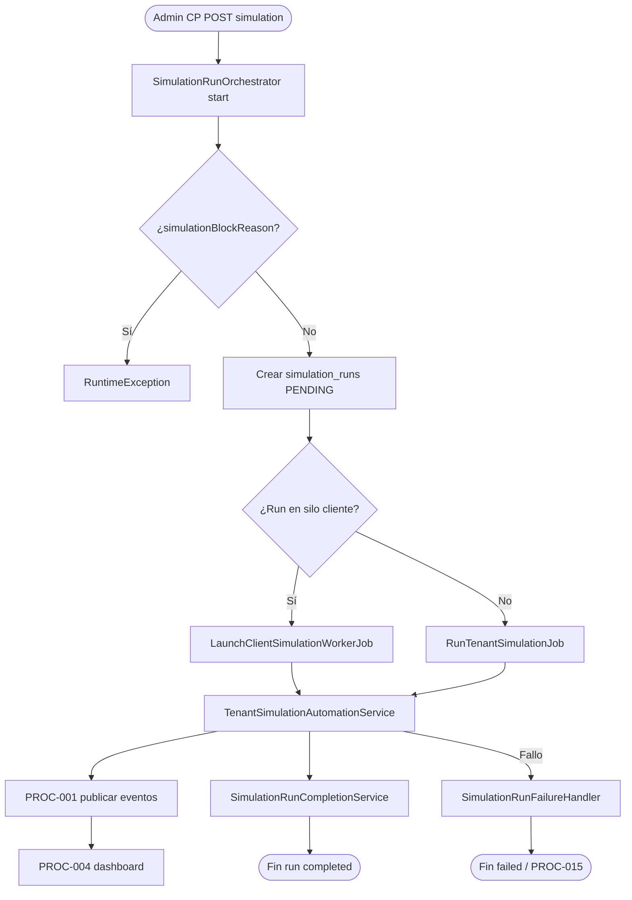

# PROC-020 — Ejecución simulación desde control plane

**ID:** PROC-020  
**Versión documento:** 1.0  
**Fecha:** 2026-06-27  
**Estado:** Implementado  
**Tipo:** Técnico — Calidad / Administrativo  
**Macroproceso:** MP-01 Gestión Plataforma SaaS / MP-05 Calidad

---

## Descripción

Proceso de orquestación de runs de simulación por tenant desde el control plane SaaS. Admin SaaS inicia simulaciones vía `/control/simulations` o acciones en companies; `SimulationRunOrchestrator` crea registro en `simulation_runs`, valida elegibilidad tenant, despacha worker en silo cliente o job in-process, y coordina progreso/métricas/fallos.

---

## Objetivo

Permitir rehearsal operativo de clientes desde CP con trazabilidad por run, reporte y tráfico observable en dashboard, cumpliendo REQ-SIM-01 y complementando PROC-009 (CLI silo).

---

## Alcance

**Incluye:**

- Rutas `control.simulations.*` en `routes/control.php`.
- `SimulationRunOrchestrator::start` — creación run, validación bloqueo.
- Tabla `simulation_runs` (migration 2026_05_28).
- Jobs: `RunTenantSimulationJob`, `LaunchClientSimulationWorkerJob`.
- Fleet local: `LocalFleetSimulationRunner` — sim en silo cliente.
- Métricas: `SimulationRunMetricsCollector`.
- Fallos: `SimulationRunFailureHandler` → PROC-015 opcional.
- UI: `Control/Companies/Index.vue` — `can_simulate`.

**Excluye:**

- Simulación CLI directa silo (PROC-009).
- Validación catálogo (PROC-016) — recomendada previa.
- Activación LIVE módulos (panel silo — PROC-004).

---

## Actores

| Actor | Rol |
|-------|-----|
| Admin SaaS | Inicia simulación desde CP |
| `SimulationRunOrchestrator` | Orquesta run |
| `TenantSimulationAutomationService` | Elegibilidad, fixtures |
| `LocalFleetSimulationRunner` | Despacho silo vs CP |
| Operador tenant | Observa dashboard PROC-004 |
| Worker queue | Ejecuta jobs simulación |

---

## Entradas

| Entrada | Origen |
|---------|--------|
| Tenant seleccionado | CP companies |
| Parámetros run | events_per_minute, duration_minutes, prepare_first |
| Usuario admin | started_by_user_id |
| Fixture slug | tenant-catalog o resolveFixtureSlug |
| Fleet config | local fleet registry |

---

## Salidas

| Salida | Descripción |
|--------|-------------|
| `simulation_runs` row | run_id, status PENDING→… |
| JSON `{run_id, status}` | Respuesta start |
| Tráfico eventos | PROC-001 publicaciones |
| Reporte progreso | UI CP simulations |
| Incidente auto | PROC-015 si fallo crítico |

---

## Reglas de negocio

| ID | Regla | Evidencia |
|----|-------|-----------|
| RN-020-01 | simulationBlockReason rechaza tenant no elegible | `SimulationRunOrchestrator::start` |
| RN-020-02 | Reemplaza run stale activo por tenant | `SimulationStaleRunReplacer` |
| RN-020-03 | Fleet silo: LaunchClientSimulationWorkerJob | LocalFleetSimulationRunner |
| RN-020-04 | CP in-process: RunTenantSimulationJob | Orchestrator |
| RN-020-05 | DEP-012 Control→Simulation | dependencias.csv |
| RN-020-06 | UI can_simulate + backend validación | Runbook v1.7 certificación |

---

## Precondiciones

1. Tenant existe en CP (PROC-007).
2. Tenant elegible para simulación (plan, estado, mirror catálogo).
3. Silo levantado si fleet local (PROC-034, lifecycle).
4. Módulos LIVE si prepare_first (certificación operativa).

---

## Postcondiciones

1. Run registrado con métricas progreso.
2. Eventos publicados observables PROC-004.
3. Run completado o failed con handler.
4. Reporte disponible en CP.

---

## Flujo principal (paso a paso)

| Paso | Actividad | Descripción |
|------|-----------|-------------|
| 1 | Evento inicio | Admin POST simulation desde CP |
| 2 | Validar elegibilidad | `simulationBlockReason($tenant)` |
| 3 | Reemplazar stale run | `SimulationStaleRunReplacer` |
| 4 | Crear SimulationRunModel | UUID, planned_total, fixture_slug |
| 5 | Decidir destino | LocalFleet → silo vs CP job |
| 6 | Dispatch job | LaunchClientSimulationWorker o RunTenantSimulation |
| 7 | Ejecutar simulación | TenantSimulationAutomationService |
| 8 | Publicar eventos | PROC-001 pipeline |
| 9 | Completar run | SimulationRunCompletionService |
| 10 | **Fin** | Status completed; dashboard observable |

---

## Flujos alternativos

### FA-01 — Simulación en silo cliente

- **Condición:** `shouldRunOnClientSilo($tenant)`.
- **Acción:** prepareClientSiloRun + worker job.

### FA-02 — Fallo run

- **Condición:** Excepción en ejecución.
- **Acción:** `SimulationRunFailureHandler`; posible PROC-015.

### FA-03 — Cancelación

- **Servicio:** `SimulationRunCancellationService`.

### FA-04 — CLI silo directo

- **Alternativa:** PROC-009 `platform:simulate-client` sin CP.

---

## Excepciones

| Escenario | Causa | Tratamiento |
|-----------|-------|-------------|
| EX-020-01 | Tenant no elegible | RuntimeException reason |
| EX-020-02 | Silo no disponible fleet | Fallo run |
| EX-020-03 | Módulos inactivos | Block prepare/sim |

---

## Eventos

| Evento BPMN | Tipo | Descripción |
|-------------|------|-------------|
| POST simulation CP | Inicio | Admin SaaS |
| Run created | Intermedio | simulation_runs |
| Events published | Intermedio | PROC-001 |
| Run completed/failed | Fin | Status final |

---

## Dependencias

| Dependencia | Tipo | Proceso |
|-------------|------|---------|
| DEP-012 | Servicio | Control→Simulation |
| PROC-007 | Previo | Tenant CP |
| PROC-009 | Paralelo | CLI alternativo |
| PROC-001 | Posterior | Publish eventos |
| PROC-004 | Observación | Dashboard |
| PROC-016 | Recomendado | validate-catalog |

---

## Riesgos

| ID | Riesgo | Mitigación |
|----|--------|------------|
| R1 | Sim sin catálogo espejado | PROC-034 |
| R2 | Drift config | PROC-016 |
| R3 | Worker silo no running | Fleet lifecycle |

---

## Indicadores

| Indicador | Fuente |
|-----------|--------|
| Runs completed/failed | simulation_runs |
| Events planned vs actual | SimulationRunMetricsCollector |
| REQ-SIM-01 | requerimientos.csv |

---

## Relación con otros procesos

| Proceso | Relación |
|---------|----------|
| PROC-009 | Simulación E2E CLI |
| PROC-007 | Gestión tenant origen |
| PROC-015 | Auto-incidente fallo |
| PROC-034 | Catálogo espejado silo |

---

## Componentes involucrados

| Capa | Componente |
|------|------------|
| Orquestación | `SimulationRunOrchestrator` |
| Jobs | `RunTenantSimulationJob`, `LaunchClientSimulationWorkerJob` |
| Model | `SimulationRunModel` |
| Rutas | `routes/control.php` simulations group |
| UI | `resources/js/Pages/Control/` |

---

## Documentación relacionada

- `database/migrations/2026_05_28_100000_create_simulation_runs_table.php`
- `docs/production/Plan_SimulacionClientes.md`
- `docs/production/Runbook_Simulacion_Cliente.md`
- `docs/Diagrama_BPMN/18_Proceso_Simulacion_Cliente_E2E.md`

---

## Trazabilidad

| Elemento | Evidencia |
|----------|-----------|
| PROC-020 | `docs/Patente/matriz_generada/procesos.csv` |
| DEP-012 | `docs/Patente/matriz_generada/dependencias.csv` |
| REQ-SIM-01 | `docs/Patente/matriz_generada/requerimientos.csv` |
| Orchestrator | `app/Simulation/Application/Services/Orchestration/SimulationRunOrchestrator.php` |
| Rutas | `routes/control.php` |

---

## Diagrama Mermaid

---

## BPMN Mapping

| Elemento BPMN | Identificador / descripción |
|---------------|----------------------------|
| **Evento Inicio** | POST /control/simulations o companies simulation |
| **Eventos Intermedios** | Run created; events published |
| **Evento Final** | Run completed o failed |
| **Actividades** | Validar elegibilidad; crear run; dispatch job; ejecutar sim; completar |
| **Gateways** | GW-BLOCK: tenant elegible; GW-FLEET: silo vs CP |
| **Pools** | Pool Control Plane; Pool Silo Cliente |
| **Almacenes** | simulation_runs |
| **Artefactos** | Plan_SimulacionClientes.md |

---

*Fin del documento PROC-020*
