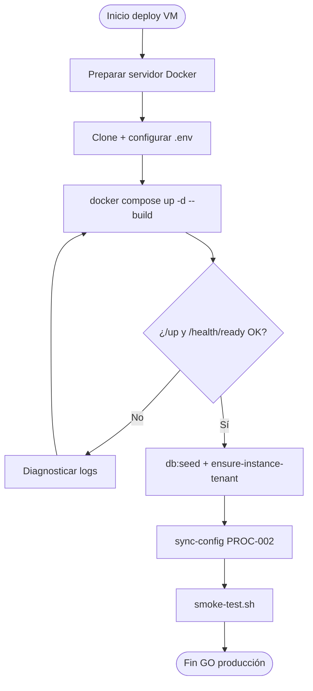

# PROC-030 — Despliegue producción VM

**ID:** PROC-030  
**Versión documento:** 1.0  
**Fecha:** 2026-06-27  
**Estado:** Documentado (runbook operativo)  
**Tipo:** Técnico — Operación / Apoyo  
**Macroproceso:** MP-06 Operaciones e Infraestructura

---

## Descripción

Proceso operativo manual de despliegue de instancia middleware en VM (Ubuntu/RHEL) usando Docker Compose, documentado en `Runbook_Deploy_VM.md` (ART-028). Incluye preparación servidor, clonado repositorio, configuración `.env`, build, post-deploy (seed, ensure-instance-tenant, sync-config) y smoke test.

**Nota:** PROC-030 no aparece en `procesos.csv` (catálogo hasta PROC-020); se deriva de artefactos runbook y `00_Mapa_Procesos.md`.

---

## Objetivo

Desplegar instancia producción por cliente (ADR-001) en VM con procedimiento repetible, health checks y pasos post-deploy que habiliten PROC-010, PROC-002 y operación middleware.

---

## Alcance

**Incluye:**

- Prerrequisitos: Docker 24+, Compose v2, puertos 80/443/3306/6379.
- Clone repo `/opt/platform-middleware`.
- Config `.env` producción: APP_*, PLATFORM_CLIENT_SLUG, credentials.
- `docker compose up -d --build`.
- Health: `/up`, `/health/ready`.
- Post-deploy: `db:seed`, `platform:ensure-instance-tenant`, sync-config.
- Smoke: `scripts/ci/smoke-test.sh`.
- TLS reverse proxy (Caddy/nginx) — documentado.

**Excluye:**

- Provisioning comercial CP (PROC-008).
- Kubernetes deploy — referencia DR Drill escenario C.
- CI/CD automatizado completo — Plan_CI_CD parcial.

---

## Actores

| Actor | Rol |
|-------|-----|
| DevOps / Ops | Ejecuta runbook |
| Docker Compose | Orquesta contenedores |
| Admin plataforma | Configura secrets .env |
| Scripts smoke | Validación post-deploy |

---

## Entradas

| Entrada | Origen |
|---------|--------|
| Servidor VM | Ubuntu 22.04+ / RHEL 8+ |
| Repo git | Clone URL |
| `.env` producción | Template .env.example |
| DNS | Apuntando al host |
| API keys | PLATFORM_API_KEYS post-deploy |

---

## Salidas

| Salida | Descripción |
|--------|-------------|
| Stack Docker running | app, nginx, worker, BD, Redis |
| Health OK | /up, /health/ready 200 |
| Tenant ensured | PROC-010 |
| Registry synced | PROC-002 |
| Smoke passed | scripts/ci/smoke-test.sh |

---

## Reglas de negocio

| ID | Regla | Evidencia |
|----|-------|-----------|
| RN-030-01 | APP_ENV=production, APP_DEBUG=false | Runbook_Deploy_VM.md |
| RN-030-02 | Post-deploy obligatorio ensure-instance-tenant | Runbook §4; ADR-004 |
| RN-030-03 | Instancia por cliente — PLATFORM_CLIENT_SLUG único | ADR-001 |
| RN-030-04 | Smoke test antes GO operativo | Runbook §4 |

---

## Precondiciones

1. VM provisionada con Docker instalado.
2. DNS configurado.
3. Secrets y credenciales BD/Redis disponibles.
4. Imagen/repo accesible.

---

## Postcondiciones

1. Instancia responde health checks.
2. Tenant row presente (PROC-010).
3. Registry sincronizado (PROC-002 recomendado).
4. Lista para login PROC-005 y operación PROC-001.

---

## Flujo principal (paso a paso)

| Paso | Actividad | Descripción |
|------|-----------|-------------|
| 1 | Preparar servidor | apt install docker, usermod docker group |
| 2 | Clonar y configurar | git clone; cp .env.example .env; editar vars |
| 3 | Build y arranque | docker compose up -d --build |
| 4 | Verificar health | curl /up; curl /health/ready |
| 5 | Post-deploy seed | db:seed --force |
| 6 | Ensure tenant | platform:ensure-instance-tenant |
| 7 | Sync registry | POST sync-config con API key |
| 8 | Smoke test | bash scripts/ci/smoke-test.sh |
| 9 | TLS (opcional) | Reverse proxy Caddy/nginx |
| 10 | **Fin** | Instancia producción operativa |

---

## Flujos alternativos

### FA-01 — Guía despliegue instancia

- **Fuente:** `Guia_Despliegue_Instancia_Cliente.md` — complemento por cliente.

### FA-02 — Deploy sin seed

- **Riesgo:** tenant_id null — Reporte_Implementacion.md.
- **Mitigación:** Paso 5–6 obligatorio.

### FA-03 — Staging pre-GO

- **Checklist:** `Checklist_Staging_PreGO.md` — validate-catalog incluido.

---

## Excepciones

| Escenario | Tratamiento |
|-----------|-------------|
| Health fail | Revisar logs contenedor; no GO |
| Seed fail | Migraciones pendientes |
| Smoke fail | Rollback o fix antes producción |

---

## Eventos

| Evento | Tipo |
|--------|------|
| Inicio deploy manual | Inicio |
| Health OK | Intermedio |
| Smoke passed | Fin éxito |

---

## Dependencias

| Dependencia | Proceso |
|-------------|---------|
| PROC-010 | Post-deploy ensure tenant |
| PROC-002 | Sync registry |
| PROC-016 | validate-catalog pre-GO recomendado |
| ART-028 | Runbook fuente |

---

## Riesgos

| ID | Riesgo | Mitigación |
|----|--------|------------|
| R1 | Deploy sin seed | Runbook explícito |
| R2 | Secrets en .env | Rotación; no commit |
| R3 | DEP-026 deploy observability | Documentación referencia |

---

## Indicadores

| Indicador | Fuente |
|-----------|--------|
| Health uptime | /health/ready |
| Smoke pass rate | CI script |
| C20 | Matriz Operación |

---

## Relación con otros procesos

| Proceso | Relación |
|---------|----------|
| PROC-010 | Post-deploy |
| PROC-008 | Provisioning comercial previo |
| PROC-031 | Backup post-estabilización |
| PROC-032 | DR drill valida deploy |

---

## Componentes involucrados

| Componente | Rol |
|------------|-----|
| docker-compose | Orquestación |
| Laravel app container | Runtime |
| scripts/ci/smoke-test.sh | Validación |
| .env | Config instancia |

---

## Documentación relacionada

- `docs/production/Runbook_Deploy_VM.md` (ART-028)
- `docs/production/Guia_Despliegue_Instancia_Cliente.md` (ART-038)
- `docs/production/Checklist_Staging_PreGO.md`

---

## Trazabilidad

| Elemento | Evidencia |
|----------|-----------|
| PROC-030 | `docs/Diagrama_BPMN/00_Mapa_Procesos.md`; Matriz_Trazabilidad_BPMN.md |
| ART-028 | `docs/Patente/matriz_generada/artefactos.csv` |
| Runbook | `docs/production/Runbook_Deploy_VM.md` |
| PMV-008 | Control + deploy instancia — pmv.csv |

---

## Diagrama Mermaid

---

## BPMN Mapping

| Elemento BPMN | Descripción |
|---------------|-------------|
| **Evento Inicio** | Ops inicia deploy manual |
| **Actividades** | Preparar; clonar; build; health; seed; sync; smoke |
| **Gateway** | Health OK |
| **Evento Final** | Instancia operativa |
| **Pools** | Pool DevOps; Pool VM Cliente |
| **Artefactos** | Runbook_Deploy_VM.md |

---

*Fin del documento PROC-030*
