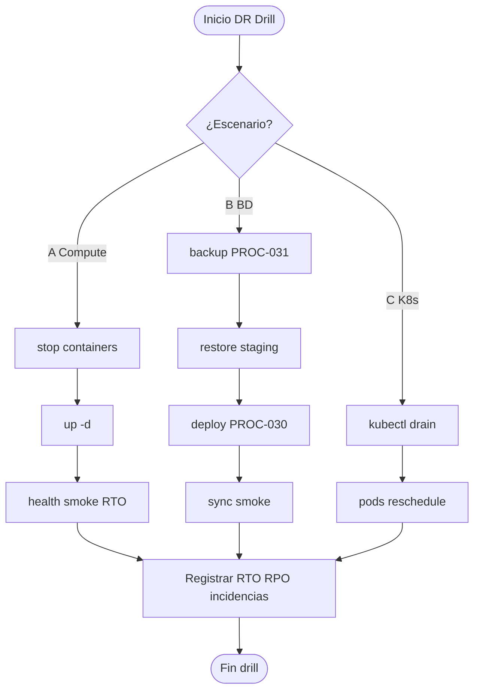

# PROC-032 — DR Drill (disaster recovery)

**ID:** PROC-032  
**Versión documento:** 1.0  
**Fecha:** 2026-06-27  
**Estado:** Documentado (runbook operativo)  
**Tipo:** Técnico — Operación / Gobernanza  
**Macroproceso:** MP-06 Operaciones e Infraestructura

---

## Descripción

Proceso de ejercicio trimestral de recuperación ante desastre para instancia middleware (instancia-por-cliente), documentado en `Runbook_DR_Drill.md` (ART-029). Tres escenarios: pérdida compute sin BD (A), restore desde backup (B), multi-AZ K8s (C). Registra RTO/RPO medidos y acciones correctivas.

---

## Objetivo

Validar procedimientos de recuperación documentados (PROC-030, PROC-031) y cumplir checklist enterprise multi-AZ, reduciendo riesgo operativo no detectado hasta incidente real.

---

## Alcance

**Incluye:**

- Escenario A: stop/start containers — RTO < 15 min sin restore BD.
- Escenario B: backup → restore staging → deploy imagen → migrate/seed/sync → smoke.
- Escenario C: kubectl drain nodo — K8s enterprise.
- Registro drill: fecha, slug, escenario, RTO, RPO, incidencias.
- Multi-AZ checklist: RDS multi-AZ, Redis réplica, HPA minReplicas=2.

**Excluye:**

- Simulación corrupción BD intencional en producción.
- Failover automático — no evidenciado en código.
- PROC-015 gestión incidentes post-drill (opcional).

---

## Actores

| Actor | Rol |
|-------|-----|
| Ops / SRE | Ejecuta drill |
| DevOps K8s | Escenario C |
| Runbook DR | Procedimiento guía |
| Stakeholder cliente | Aprueba ventana drill |

---

## Entradas

| Entrada | Origen |
|---------|--------|
| Instancia PLATFORM_CLIENT_SLUG | .env |
| Backup reciente | PROC-031 |
| Imagen/tag conocido | git tag — NO_EVIDENCIADO tags |
| Checklist multi-AZ | Runbook §final |

---

## Salidas

| Salida | Descripción |
|--------|-------------|
| Registro drill completado | Tabla runbook |
| RTO/RPO medidos | Métricas ejercicio |
| Acciones correctivas | Backlog ops |
| Criterio éxito A/B/C | Según escenario |

---

## Reglas de negocio

| ID | Regla | Evidencia |
|----|-------|-----------|
| RN-032-01 | Frecuencia recomendada trimestral | Runbook_DR_Drill.md |
| RN-032-02 | Escenario A: RTO < 15 min sin restore BD | Runbook Escenario A |
| RN-032-03 | Escenario B: sigue Runbook_Backup_Restore | ART-027 |
| RN-032-04 | Backups probados últimos 90 días — checklist | Runbook multi-AZ |
| RN-032-05 | ADR-001: drill por instancia cliente | Runbook objetivo |

---

## Precondiciones

1. Runbooks PROC-030/031 actualizados.
2. Ventana mantenimiento acordada (escenario B/C).
3. Backup reciente disponible (escenario B).
4. Staging o ambiente aislado para restore destructivo.

---

## Postcondiciones

1. Registro drill archivado.
2. Gaps identificados con plan remediación.
3. Confianza RPO/RTO actualizada.
4. PROC-033 evaluación operación puede citar evidencia drill.

---

## Flujo principal — Escenario A

| Paso | Actividad | Descripción |
|------|-----------|-------------|
| 1 | Simular caída | docker compose stop app nginx worker |
| 2 | Restaurar | docker compose up -d |
| 3 | Verificar | /up, /health/ready, smoke |
| 4 | Medir RTO | Registrar tiempo |
| 5 | **Fin A** | Criterio: RTO < 15 min |

---

## Flujo principal — Escenario B

| Paso | Actividad | Descripción |
|------|-----------|-------------|
| 1 | Crear backup | PROC-031 |
| 2 | BD vacía/staging | Provisionar |
| 3 | Restore | Runbook_Backup_Restore |
| 4 | Deploy imagen | PROC-030 |
| 5 | migrate:status, seed, sync-config | Post-restore |
| 6 | Smoke + dashboard | Validación |
| 7 | **Fin B** | RPO verificado |

---

## Flujos alternativos

### FA-01 — Escenario C K8s

- Drain nodo; verificar reschedule HPA; Ingress routing.

### FA-02 — Drill fallido

- Documentar incidencias; crear PROC-015 si impacto cliente.

---

## Excepciones

| Escenario | Tratamiento |
|-----------|-------------|
| RTO excedido escenario A | Revisar dependencias startup |
| Restore fail escenario B | Escalar DBA; repetir drill |
| Sin tags git | Usar commit hash conocido — reporte_generacion |

---

## Eventos

| Evento | Tipo |
|--------|------|
| Inicio drill planificado | Inicio |
| Recuperación verificada | Intermedio |
| Registro completado | Fin |

---

## Dependencias

| Dependencia | Proceso |
|-------------|---------|
| PROC-031 | Backup/restore |
| PROC-030 | Redeploy |
| PROC-002 | sync-config post-restore |
| ART-029 | Runbook DR |

---

## Riesgos

| ID | Riesgo | Mitigación |
|----|--------|------------|
| R1 | Drill nunca ejecutado | Calendario trimestral |
| R2 | Backups no probados | Escenario B obligatorio |
| R3 | Sin tags release | git tag recomendado — historial HIST |

---

## Indicadores

| Indicador | Fuente |
|-----------|--------|
| RTO medido | Registro drill |
| RPO verificado | Escenario B |
| C19 | Matriz Operación |

---

## Relación con otros procesos

| Proceso | Relación |
|---------|----------|
| PROC-031 | Restore escenario B |
| PROC-030 | Redeploy compute |
| PROC-013 | Monitoreo post-recuperación |
| PROC-033 | Evidencia evaluación |

---

## Documentación relacionada

- `docs/production/Runbook_DR_Drill.md` (ART-029)
- `docs/production/Runbook_Backup_Restore.md`
- `docs/production/Runbook_Deploy_VM.md`

---

## Trazabilidad

| Elemento | Evidencia |
|----------|-----------|
| PROC-032 | 00_Mapa_Procesos.md; Matriz_Trazabilidad_BPMN.md |
| ART-029 | artefactos.csv |
| Plan_Cloud Fase 3 | Runbook header |

---

## Diagrama Mermaid

---

## BPMN Mapping

| Elemento BPMN | Descripción |
|---------------|-------------|
| **Gateway** | Selección escenario A/B/C |
| **Subprocesos** | Recuperación compute; restore BD; K8s reschedule |
| **Evento Final** | Registro drill + criterio éxito |
| **Artefactos** | Runbook_DR_Drill.md |

---

*Fin del documento PROC-032*
