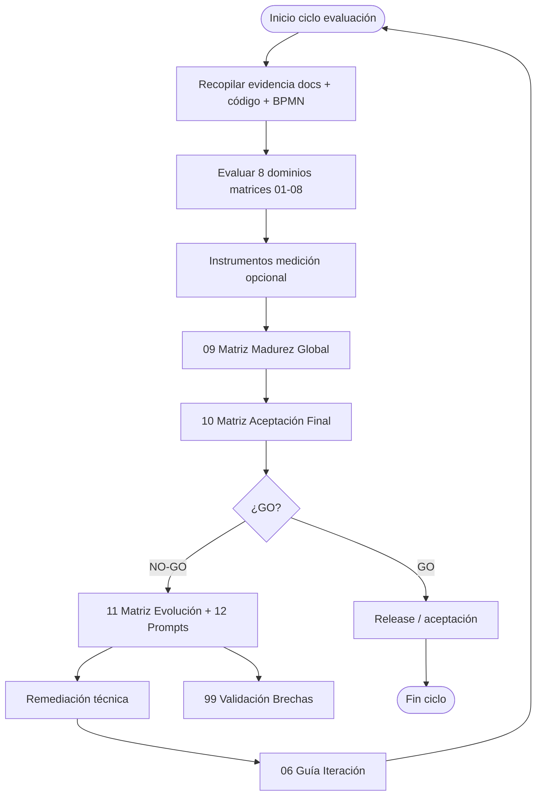

# PROC-033 — Evaluación aceptación middleware

**ID:** PROC-033  
**Versión documento:** 1.0  
**Fecha:** 2026-06-27  
**Estado:** Documentado (framework gobernanza)  
**Tipo:** Gobernanza — Calidad / Evolución Continua  
**Macroproceso:** MP-07 Gobernanza y Evolución

---

## Descripción

Proceso de gobernanza para evaluar, priorizar y evolucionar el middleware y arquitectura de soporte mediante el **Middleware Acceptance Evaluation Framework** y 14 matrices CSV en `docs/evaluation/`. Cubre 8 dominios principales, consolidación de madurez, aceptación final y matrices transversales (evolución, prompts, trazabilidad, dependencias).

**Nota:** PROC-033 no está en `procesos.csv`; se deriva de `00_Mapa_Procesos.md`, Matriz_Trazabilidad y framework evaluación.

---

## Objetivo

Transformar evidencia documental y código en evaluación estructurada con brechas, prioridades, prompts accionables y decisión GO/NO-GO de aceptación, sin inventar capacidades contradictorias con `docs/`.

---

## Alcance

**Incluye:**

- 8 dominios evaluación: Arquitectura, Middleware, Integración, Observabilidad, Seguridad, Operación, IA, Calidad.
- Matrices 01–08: criterios C01–C28 con evidencia, brecha, impacto, prioridad.
- Consolidación: `09_Matriz_Madurez_Global.csv`, `10_Matriz_Aceptacion_Final.csv`.
- Transversales: 11_Evolución, 12_Prompts, 13_Trazabilidad, 14_Dependencias.
- 6 guías metodológicas (01–06_Guia_*.md).
- Trazabilidad criterios → procesos BPMN (Matriz_Trazabilidad_BPMN.md).
- Iteración framework (`06_Guia_Iteracion_Framework.md`).

**Excluye:**

- Ejecución automática evaluación en CI — manual/documental.
- Certificación legal/patente — documentos Patente separados.
- Implementación remediaciones — derivadas vía matrices evolución.

---

## Actores

| Actor | Rol |
|-------|-----|
| Arquitectura / QA | Ejecuta evaluación |
| Product Owner | Decisión aceptación final |
| Desarrollador | Provee evidencia código/tests |
| Cursor / IA | Consume 12_Matriz_Prompts |
| Auditor | Revisa trazabilidad |

---

## Entradas

| Entrada | Origen |
|---------|--------|
| Matrices CSV evaluation/ | Framework |
| Documentación docs/ | Fuentes autorizadas framework §2 |
| Procesos BPMN PROC-* | Evidencia operativa |
| matriz_generada/ | Trazabilidad patent |
| Mediciones runtime | 04_Guia_Instrumentos_Medicion.md |

---

## Salidas

| Salida | Descripción |
|--------|-------------|
| Puntaje por dominio | 09_Matriz_Madurez_Global |
| Decisión aceptación | 10_Matriz_Aceptacion_Final |
| Brechas priorizadas | 11_Matriz_Evolucion |
| Prompts reutilizables | 12_Matriz_Prompts |
| Plan remediación | Mejora + Impacto columnas |
| 99_Validacion_Brechas | Consolidado brechas BPMN |

---

## Reglas de negocio

| ID | Regla | Evidencia |
|----|-------|-----------|
| RN-033-01 | No inventar capacidades vs docs existentes | Framework regla central |
| RN-033-02 | 8 dominios obligatorios evaluación | README_Evaluacion.md |
| RN-033-03 | Criterios mapeados a procesos evidencia | Matriz_Trazabilidad_BPMN §Evaluación |
| RN-033-04 | Brechas → 11_Matriz_Evolucion accionables | 06_Guia_Iteracion |
| RN-033-05 | PENDIENTE_VALIDACION / NO_EVIDENCIADO explícitos | reporte_generacion metodología |

---

## Precondiciones

1. Framework y matrices presentes en `docs/evaluation/`.
2. Documentación BPMN procesos actualizada.
3. Acceso evidencia código y tests citados en matrices.

---

## Postcondiciones

1. Madurez global calculada por dominio.
2. Decisión aceptación o remediación documentada.
3. Brechas enlazadas a procesos y 99_Validacion_Brechas.
4. Prompts generados para iteración siguiente.

---

## Flujo principal (paso a paso)

| Paso | Actividad | Descripción |
|------|-----------|-------------|
| 1 | Inicio ciclo evaluación | Trigger release / trimestral |
| 2 | Recopilar evidencia | docs/, código, tests, matriz_generada |
| 3 | Evaluar dominios 01–08 | Por criterio: evidencia, brecha, impacto |
| 4 | Instrumentar medición | 04_Guia_Instrumentos si aplica |
| 5 | Consolidar madurez | 09_Matriz_Madurez_Global |
| 6 | Decisión aceptación | 10_Matriz_Aceptacion_Final GO/NO-GO |
| 7 | Derivar evolución | 11_Matriz_Evolucion + 12_Prompts |
| 8 | Actualizar trazabilidad | 13_Matriz + BPMN Matriz_Trazabilidad |
| 9 | Publicar brechas | 99_Validacion_Brechas |
| 10 | **Fin** | Plan iteración siguiente |

---

## Flujos alternativos

### FA-01 — Evaluación parcial pre-release

- **Alcance:** Dominios Middleware + Calidad + Seguridad únicamente.
- **Uso:** Release_decision_QA.md.

### FA-02 — Iteración post-remediación

- **Acción:** 06_Guia_Iteracion_Framework — re-evaluar criterios cerrados.

### FA-03 — Evaluación IA (C21–C23)

- **Matriz:** 07_Matriz_IA.csv — dominio IA separado.

---

## Excepciones

| Escenario | Tratamiento |
|-----------|-------------|
| Evidencia contradictoria doc vs código | Prevalece código — reporte_generacion |
| Criterio sin proceso BPMN | Registrar en 99_Validacion_Brechas |
| Matriz desactualizada | Actualizar CSV + control versiones |

---

## Eventos

| Evento | Tipo |
|--------|------|
| Trigger evaluación | Inicio |
| Madurez calculada | Intermedio |
| Decisión GO/NO-GO | Fin |

---

## Dependencias

| Dependencia | Tipo |
|-------------|------|
| Todos PROC-001–034 | Evidencia |
| matriz_generada/ | Trazabilidad patent |
| docs/architecture/ | Dominio Arquitectura |
| docs/production/ | Planes operativos |

---

## Riesgos

| ID | Riesgo | Mitigación |
|----|--------|------------|
| R1 | Evaluación desincronizada código | Iteración periódica |
| R2 | Brechas no remediadas | 11_Matriz_Evolucion prioridad |
| R3 | Subjetividad puntuación | 05_Guia_Puntuacion_Global |

---

## Indicadores

| Indicador | Fuente |
|-----------|--------|
| Madurez global | 09_Matriz |
| % criterios cumplidos | 01–08 matrices |
| Brechas abiertas | 11_Matriz_Evolucion |
| C21–C23 IA | 07_Matriz_IA |

---

## Relación con otros procesos

| Proceso | Dominio evaluación |
|---------|-------------------|
| PROC-001–003 | Middleware C05–C08 |
| PROC-004, 013 | Observabilidad C13–C15 |
| PROC-005, 006 | Seguridad C11–C12 |
| PROC-011, 012 | Integración C09–C10 |
| PROC-016, 009, 020 | Calidad C24–C26 |
| PROC-030–032 | Operación C17–C20 |
| PROC-017, 018 | Arquitectura C01–C04, C27 |

---

## Componentes involucrados

| Componente | Rol |
|------------|-----|
| Middleware_Acceptance_Evaluation_Framework.md | Normativa |
| 01–14 matrices CSV | Instrumentos |
| 01–06 guías | Metodología |
| Matriz_Trazabilidad_BPMN.md | Enlace procesos |
| 99_Validacion_Brechas.md | Consolidado gaps |

---

## Documentación relacionada

- `docs/evaluation/Middleware_Acceptance_Evaluation_Framework.md`
- `docs/evaluation/README_Evaluacion.md`
- `docs/evaluation/01_Guia_Framework_Evaluacion.md` … `06_Guia_Iteracion_Framework.md`
- `docs/Diagrama_BPMN/Matriz_Trazabilidad_BPMN.md`

---

## Trazabilidad

| Elemento | Evidencia |
|----------|-----------|
| PROC-033 | 00_Mapa_Procesos.md MP-07; Matriz_Trazabilidad |
| 8 dominios | README_Evaluacion.md §Estructura |
| C01–C28 | Matrices 01–08 evaluation/ |
| reporte_generacion | Riesgos y confianza tablas |

---

## Diagrama Mermaid

---

## BPMN Mapping

| Elemento BPMN | Descripción |
|---------------|-------------|
| **Evento Inicio** | Trigger evaluación release/trimestral |
| **Actividades** | Evaluar dominios; consolidar; decidir; derivar evolución |
| **Gateway** | GO vs NO-GO aceptación |
| **Evento Final** | Decisión documentada + plan iteración |
| **Artefactos** | Framework; matrices 01–14; guías 01–06 |

---

*Fin del documento PROC-033*
