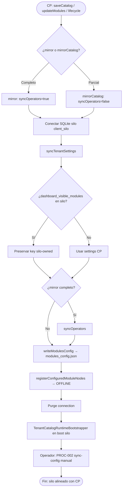

# PROC-034 — Espejo catálogo Control Plane → Silo

**ID:** PROC-034  
**Versión documento:** 1.0  
**Fecha:** 2026-06-27  
**Estado:** Implementado  
**Tipo:** Técnico — Operativo / Integración  
**Macroproceso:** MP-01 Gestión Plataforma SaaS (subproceso de sincronización CP→Silo)

---

## Descripción

Proceso de sincronización unidireccional **Control Plane → silo cliente** que materializa en la instancia dedicada la configuración autorizada del tenant: settings comerciales/técnicos, operadores (mirror completo), archivo `modules_config.json`, y nodos de catálogo en `channel_status_snapshots` (OFFLINE por defecto). Preserva settings **propiedad del silo**, especialmente `dashboard_visible_modules`, conforme a las reglas de fuente única de verdad de la certificación operativa.

---

## Objetivo

Eliminar inconsistencias entre CP y silo tras provisioning o cambios de catálogo/módulos, garantizando que el runtime del cliente refleje lo autorizado en CP (`modules_catalog`, `modules`) sin sobrescribir preferencias locales del operador de instancia.

---

## Alcance

**Incluye:**

- `LocalFleetTenantMirror::mirror()` — sync completo (settings + operadores + catálogo + nodos).
- `LocalFleetTenantMirror::mirrorCatalog()` — sync parcial (settings + catálogo + nodos, sin operadores).
- Preservación `dashboard_visible_modules` en `syncTenantSettings`.
- Escritura `config/modules/instances/{slug}/modules_config.json`.
- Registro nodos vía `ConfiguredModuleNodeRegistrar` → `channel_status_snapshots`.
- Trigger desde guardado catálogo CP, `updateModules`, lifecycle mirror.

**Excluye:**

- Sync inverso silo → CP.
- Sync registry middleware (PROC-002 — manual en silo).
- Activación LIVE (operador silo).
- Configuración visibilidad dashboard (SoT silo, solo preservada).

---

## Actores

| Actor | Rol |
|-------|-----|
| Admin SaaS | Guarda catálogo técnico en CP UI |
| `TenantModuleCatalogService` | Persiste `settings.modules_catalog` en CP |
| `TenantAdminService` | Dispara `mirrorCatalog` tras update modules |
| `LocalFleetTenantMirror` | Ejecuta espejo |
| `ConfiguredModuleNodeRegistrar` | Seed nodos OFFLINE |
| Operador silo | Configura visibilidad post-espejo (no sobrescrita) |

---

## Entradas

| Entrada | SoT | Ubicación |
|---------|-----|-----------|
| `modules_catalog` | **CP** `tenant.settings.modules_catalog` | BD Control Plane |
| `modules` comerciales | **CP** `tenant.settings.modules` | BD Control Plane |
| `name`, `status`, settings CP | TenantModel CP | Excluye `deployment` |
| Settings silo existentes | Silo | Para merge keys preservadas |
| Slug tenant | Ambos | Resolución path instancia |

---

## Salidas

| Salida | Descripción |
|--------|-------------|
| Fila `tenants` silo actualizada | name, status, settings merged |
| `modules_config.json` | Read model espejado en filesystem silo |
| `channel_status_snapshots` | Nodos productores/suscriptores OFFLINE |
| Operadores espejados | Solo en `mirror()` completo |
| Runtime overlay | `TenantCatalogRuntimeBootstrapper` en boot (complementario) |

---

## Reglas de negocio

| ID | Regla | Evidencia |
|----|-------|-----------|
| RN-001 | **SoT catálogo técnico:** `tenant.settings.modules_catalog` en CP | Certificación §SoT |
| RN-002 | **SoT módulos comerciales:** `tenant.settings.modules` en CP | Certificación §SoT |
| RN-003 | **SoT runtime silo:** `modules_config.json` es read model espejado | Certificación L21 |
| RN-004 | **SoT visibilidad dashboard:** `dashboard_visible_modules` en **silo** — nunca sobrescrito | `SILO_OWNED_SETTINGS_KEYS`; Certificación L22–26 |
| RN-005 | CP autoriza *qué* módulos existen; silo decide *visibles* y *activados* | Certificación L26 |
| RN-006 | Keys silo-owned preservadas en merge: solo `dashboard_visible_modules` documentado | `LocalFleetTenantMirror.php` L23–25 |
| RN-007 | `deployment` excluido del espejo settings | `syncTenantSettings` unset deployment |
| RN-008 | Catálogo vacío → no escribe JSON ni registra nodos | `writeModulesConfig`, `registerConfiguredModuleNodes` guards |
| RN-009 | CP lee catálogo solo desde BD (`storedCatalog`), sin fallback archivos | Certificación hallazgo #3 |
| RN-010 | Post-espejo, operador silo debe ejecutar PROC-002 sync-config | Certificación Etapa 8 |

---

## Precondiciones

1. Instancia silo provisionada con fila tenant (`EnsureInstanceTenant` / bootstrap).
2. Archivo SQLite silo existente (`LocalFleetEnvBuilder::ensureSqliteFile`).
3. Tenant CP con `deployment.local_instance.db_path` configurado.
4. Para catálogo: `modules_catalog` no vacío en settings CP.

---

## Postcondiciones

1. Settings silo reflejan CP excepto keys silo-owned preservadas.
2. `dashboard_visible_modules` intacto si existía previamente.
3. `modules_config.json` escrito bajo `config/modules/instances/{slug}/`.
4. Nodos catálogo registrados OFFLINE en silo.
5. Operadores sincronizados si `mirror()` completo.
6. Overlay eventbus aplicable en próximo boot silo.

---

## Flujo principal (paso a paso)

| Paso | Descripción |
|------|-------------|
| 1 | **Inicio** — Guardar catálogo CP (`TenantModuleCatalogService::saveCatalog`) o `updateModules` / lifecycle |
| 2 | Selección modo | `mirror()` vs `mirrorCatalog()` |
| 3 | Resolver conexión SQLite silo | `clientConnection(slug, dbPath)` |
| 4 | Resolver `instanceTenantId` en silo | Query tenants by slug |
| 5 | **syncTenantSettings** | Merge settings CP + preservar `dashboard_visible_modules` silo |
| 6 | **syncOperators** (solo mirror completo) | Upsert operadores roles mirrored |
| 7 | **writeModulesConfig** | JSON desde `modules_catalog` CP |
| 8 | **registerConfiguredModuleNodes** | `ConfiguredModuleNodeRegistrar` → snapshots OFFLINE |
| 9 | Purge connection `client_silo` | Cleanup |
| 10 | **Fin** — Silo listo para login, visibilidad dashboard, LIVE panel, PROC-002 |

---

## Flujos alternativos

### FA-01 — mirrorCatalog (sin operadores)

- **Trigger:** `TenantAdminService::updateModules` con local_instance.
- **Acción:** Pasos 5, 7, 8 sin syncOperators.

### FA-02 — mirror completo

- **Trigger:** Lifecycle provisioning / start tenant.
- **Acción:** Incluye syncOperators + catálogo.

### FA-03 — Catálogo vacío

- **Condición:** `modules_catalog` null o [].
- **Acción:** syncTenantSettings ejecuta; skip writeModulesConfig y register nodes.

### FA-04 — Primera vez sin dashboard_visible_modules

- **Condición:** Silo sin key previa.
- **Acción:** No se inyecta valor; dashboard permanece sin config (Etapa 7).

### FA-05 — Operador configura visibilidad post-espejo

- **Condición:** PATCH `/dashboard/modules/visibility`.
- **Acción:** Escribe silo-owned key; mirrors futuros la preservan (RN-004).

---

## Excepciones

| Escenario | Tratamiento |
|-----------|-------------|
| EX-001 SQLite missing | `RuntimeException` client database missing |
| EX-002 Tenant silo not found | RuntimeException — run bootstrap first |
| EX-003 JSON encode error | `JSON_THROW_ON_ERROR` |
| EX-004 CP tenant sin local_instance | Mirror no ejecutado (`hasLocalInstanceDeployment` false) |

---

## Eventos

| Evento | Tipo |
|--------|------|
| saveCatalog / updateModules / lifecycle | Inicio |
| Settings merged | Intermedio |
| modules_config.json written | Intermedio |
| Nodos OFFLINE registered | Intermedio |
| Fin espejo | Fin |

---

## Dependencias

| Dependencia | Proceso |
|-------------|---------|
| Alta empresa CP | PROC-007 ACT-016 |
| Provisioning fleet | PROC-008 |
| Bootstrap silo | PROC-010 |
| Sync registry manual | PROC-002 (posterior) |
| Dashboard visibilidad | PROC-004 (settings preservados) |

---

## Riesgos

| Riesgo | Mitigación implementada |
|--------|-------------------------|
| Mirror borraba dashboard_visible_modules | Preservación SILO_OWNED_SETTINGS_KEYS (certificación #1) |
| modules comerciales no espejados | mirrorCatalog en updateModules (certificación #2) |
| CP leía archivos locales | storedCatalog only (certificación #3) |
| Nodos ausentes tras espejo | ConfiguredModuleNodeRegistrar (certificación #8) |

---

## Indicadores

| Indicador | Fuente |
|-----------|--------|
| Éxito mirror (sin exception) | Logs / tests integración |
| Presencia modules_config.json | Filesystem instancia |
| Conteo channel_status_snapshots post-espejo | BD silo |
| Tests regresión visibilidad | `ClientDashboardModulesConfigurationTest` |

---

## Relación con otros procesos

| Proceso | Relación |
|---------|----------|
| PROC-007 | Trigger desde alta/update modules |
| PROC-008 | Provisioning previo instancia |
| PROC-002 | Sync registry manual post-espejo |
| PROC-004 | Preserva y consume dashboard_visible_modules |
| PROC-005 | Operadores espejados para login silo |
| PROC-010 | Tenant row requerida en silo |

---

## Componentes involucrados

| Componente | Ruta |
|------------|------|
| `LocalFleetTenantMirror` | `app/Shared/Platform/LocalFleet/LocalFleetTenantMirror.php` |
| `LocalFleetTenantMirrorInterface` | Contract |
| `ConfiguredModuleNodeRegistrar` | `app/Dashboard/Application/Services/ConfiguredModuleNodeRegistrar.php` |
| `TenantModuleCatalogService` | CP catálogo persistencia |
| `TenantAdminService` | Trigger mirrorCatalog |
| `LocalFleetBindingsRegistrar` | DI mirror en fleet |
| `TenantCatalogRuntimeBootstrapper` | Overlay eventbus boot |
| `LocalFleetEnvBuilder` | Paths SQLite |

---

## Documentación relacionada

- `docs/refactorizacion_Informes/Certificacion_Flujo_Operativo_Oficial.md` (documento primario)
- `docs/Diagrama_BPMN/00_Mapa_Procesos.md` §Flujo end-to-end
- `docs/Plan_Desarrollo_Serviciov1.7/Informe_Remediacion_Bug_Configuracion_Modulos_Tenant.md`
- `docs/production/ADR_001_instancia_por_cliente.md`

---

## Trazabilidad

| Elemento | Evidencia |
|----------|-----------|
| PROC-034 | `docs/Diagrama_BPMN/00_Mapa_Procesos.md`; `Matriz_Trazabilidad_BPMN.md` |
| Flujo CP→Silo | `docs/refactorizacion_Informes/Certificacion_Flujo_Operativo_Oficial.md` L87–96 |
| SoT rules | Certificación §Fuente única de verdad L15–26 |
| Corrección preserve visibility | Certificación L32–34, L72 |
| LocalFleetTenantMirror | `app/Shared/Platform/LocalFleet/LocalFleetTenantMirror.php` |
| SILO_OWNED_SETTINGS_KEYS | Mismo archivo L23–25, L98–101 |
| updateModules mirror | `app/Control/Application/Services/Tenants/TenantAdminService.php` L67–75 |
| Tests | `tests/Feature/Control/TenantModuleCatalogTest.php`; `TenantLifecycleIntegrationFlowTest` |
| Criterio C17 | `docs/evaluation/06_Matriz_Operacion.csv` |

---

## Diagrama Mermaid

---

## BPMN Mapping

| Elemento BPMN | Identificador / descripción |
|---------------|----------------------------|
| **Evento Inicio** | `saveCatalog` CP; `updateModules`; lifecycle mirror trigger |
| **Eventos Intermedios** | Conexión SQLite; merge settings; JSON escrito; nodos registrados |
| **Evento Final** | Silo sincronizado; listo para operación local |
| **Actividades** | syncTenantSettings; syncOperators (cond); writeModulesConfig; registerConfiguredModuleNodes |
| **Subprocesos** | SP-PRESERVE: merge silo-owned keys; SP-NODES: seed OFFLINE snapshots |
| **Gateways** | GW-MODE: mirror vs mirrorCatalog; GW-PRES: ¿dashboard_visible_modules exists?; GW-CAT: ¿modules_catalog non-empty? |
| **Pools** | Pool Control Plane; Pool Silo Cliente (SQLite) |
| **Lanes** | Lane CP Catalog (`TenantModuleCatalogService`); Lane Mirror (`LocalFleetTenantMirror`); Lane Silo Runtime (JSON + snapshots) |
| **Mensajes** | Msg-Catalog-Saved; Msg-Settings-Merged; Msg-ModulesConfig-Written |
| **Objetos de datos** | `TenantModel` CP; settings JSON; modules_catalog; modules_config.json |
| **Almacenes** | BD CP tenants; BD silo tenants; filesystem config/modules/instances/; channel_status_snapshots |
| **Artefactos** | Certificación Flujo Operativo; ADR-001 instance per client |
| **Asociaciones** | modules_catalog CP → modules_config.json silo; dashboard_visible_modules silo ⊄ overwrite; espejo → PROC-002 manual |

---

*Fin del documento PROC-034*
