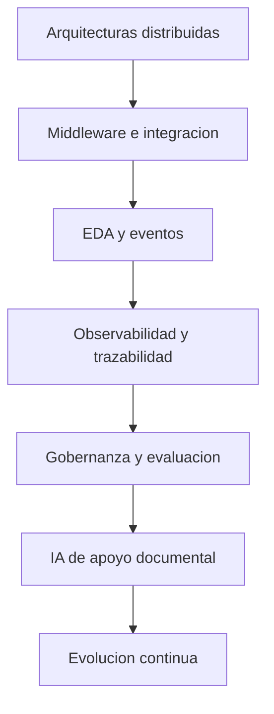
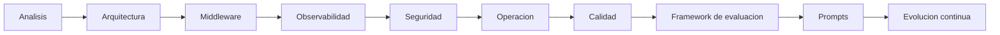

# Estado del Arte

**Proyecto:** `omnichannel-ddd-eda` / `platform/event-bus-core`  
**Documento:** `01_Estado_del_Arte.md`  
**Propósito:** servir como base técnica para la solicitud de patente, delimitando el problema técnico, el estado actual de las tecnologías relacionadas, sus limitaciones y el espacio de innovación disponible.

---

## 1. Introducción

La transformación digital de organizaciones con operaciones distribuidas ha impulsado arquitecturas orientadas a servicios, eventos, integración empresarial y observabilidad operacional. En este contexto, las soluciones modernas deben coordinar múltiples canales, mantener trazabilidad técnica, soportar resiliencia ante fallos y preservar coherencia entre documentación, arquitectura e implementación.

La documentación del proyecto evidencia que el sistema se concibe como una plataforma de integración omnicanal basada en DDD, EDA y un middleware central de eventos, con componentes para observabilidad, seguridad, administración de tenants, calidad documental y soporte metodológico asistido por IA. Esta convergencia refleja una evolución técnica desde modelos monolíticos o centrados en estado de negocio hacia plataformas de integración y gobierno operativo.

Sin embargo, el estado actual de la tecnología todavía presenta limitaciones recurrentes: persistencia fragmentada, trazabilidad parcial, dependencia de procedimientos manuales, dificultades para mantener sincronizados arquitectura, implementación y documentación, y ausencia de mecanismos suficientemente integrados para convertir brechas técnicas en acciones sistemáticas de evolución.

La evidencia documental analizada en `docs/` muestra que estas limitaciones no son aisladas. Se repiten en distintos niveles: arquitectura, middleware, integraciones, observabilidad, seguridad, operación, calidad e incluso en el uso de IA para soporte técnico y documental.

---

## 2. Contexto Tecnológico

### 2.1 Arquitecturas empresariales distribuidas

Las arquitecturas empresariales modernas enfrentan el problema de coordinar dominios heterogéneos, sistemas heredados, integraciones multicanal y operaciones continuas. El proyecto documenta esta necesidad mediante una arquitectura de middleware, event bus, control plane, dashboard y bounded contexts especializados. Esta estructura coincide con enfoques contemporáneos donde la integración ya no se resuelve con enlaces directos entre sistemas, sino con capas de mediación, contratos y eventos.

### 2.2 Integración entre sistemas

La documentación de `docs/production/Plan_Integraciones.md` y `docs/architecture/middleware_database_architecture.md` muestra que la integración empresarial sigue siendo un problema técnico abierto cuando los canales, proveedores, adapters, connectors y credenciales no están gobernados por un catálogo declarativo consistente. Incluso cuando existen componentes de integración, persisten dificultades para evitar la configuración manual, la duplicidad de esquemas y la falta de trazabilidad operativa.

### 2.3 Comunicación distribuida

La comunicación basada en eventos resuelve parte del acoplamiento entre productores y consumidores, pero introduce retos adicionales: orden, reintentos, DLQ, consistencia eventual, correlación de eventos y persistencia canónica. El material del repositorio indica que estos elementos están reconocidos como necesarios, aunque no siempre consolidados de forma uniforme en el runtime.

### 2.4 Gobernanza y automatización

El proyecto también sitúa la gobernanza como necesidad técnica. No basta con que exista una arquitectura; se requiere que pueda evaluarse, justificarse, versionarse y evolucionarse de forma controlada. La documentación de evaluación y las matrices del framework formalizan esa idea: convertir la revisión técnica en un proceso gobernado, trazable y repetible.

### 2.5 Observabilidad

En entornos distribuidos, la observabilidad deja de ser un añadido y pasa a ser un requisito técnico. Los planes de observabilidad, logs y monitoreo del repositorio muestran que la falta de correlación y de exportación de métricas dificulta el diagnóstico y aumenta el tiempo medio de recuperación. Esto confirma que cualquier plataforma de integración moderna requiere trazabilidad end to end y capacidad de inspección operacional.

---

## 3. Estado Actual de la Tecnología

### 3.1 Middleware tradicionales

Los middleware tradicionales suelen concentrarse en transporte, mensajería o integración básica. Aunque resuelven parte del desacoplamiento, no siempre ofrecen persistencia operacional rica, correlación completa, gobierno de configuraciones, trazabilidad de decisiones ni vínculo directo con la documentación de arquitectura y evaluación.

En el proyecto, la persistencia de middleware se redefine como una plataforma que debe almacenar eventos, colas, DLQ, logs, métricas y proyecciones de lectura. La documentación de persistencia muestra precisamente que el modelo anterior de datos orientado a retail no era adecuado para este propósito.

### 3.2 Plataformas de integración

Las plataformas de integración modernas tienden a soportar conectores, adapters, webhooks, transformación y orquestación básica. No obstante, la documentación del proyecto evidencia un punto importante: la existencia de un catálogo o de archivos de configuración no garantiza una integración gobernada. La integración se vuelve técnicamente completa solo cuando incluye:

- contratos explícitos;
- validación de envelope;
- persistencia operativa;
- trazabilidad;
- seguridad de acceso;
- automatización de pruebas;
- sincronización documental.

### 3.3 Arquitecturas Event Driven

EDA aporta desacoplamiento y escalabilidad, pero no resuelve por sí misma la gobernanza de eventos. El corpus documental muestra que un bus de eventos sin `event_store`, sin correlación y sin observabilidad suficiente sigue dejando vacíos técnicos relevantes. La simple publicación asíncrona no equivale a trazabilidad end to end ni a recuperación fiable.

### 3.4 DDD y bounded contexts

DDD ayuda a delimitar dominios y evitar que la lógica de integración invada los dominios de negocio. La documentación del proyecto separa middleware, dashboard, administración de tenants e integraciones como contextos de soporte. Sin embargo, la evidencia también muestra que estas separaciones requieren disciplina editorial y arquitectónica continua para evitar contradicciones de nomenclatura, mezclar capas o introducir dependencias accidentales.

### 3.5 Arquitecturas híbridas

El estado actual de la tecnología también incluye arquitecturas híbridas donde coexisten API REST, eventos, colas, tareas síncronas, proyecciones y componentes de observabilidad. El repositorio documenta ese tipo de coexistencia. La limitación técnica de estos modelos es que pueden crecer de forma orgánica sin una capa de gobierno suficientemente estricta, generando fragmentación y deuda técnica.

### 3.6 Frameworks modernos y automatización documental

La documentación del proyecto muestra un uso creciente de frameworks de evaluación, matrices de madurez y estructuras de trazabilidad. Esto indica una tendencia moderna: no solo construir software, sino documentar y medir su evolución. Sin embargo, las tecnologías disponibles todavía no resuelven por sí solas la transición entre evaluación, mejora, implementación y nueva evaluación. Esa secuencia sigue dependiendo de procesos humanos bien definidos.

### 3.7 IA aplicada al desarrollo

El material de `docs/Analisis_v0.2` muestra que la IA puede apoyar síntesis documental, exploración arquitectónica, clasificación de evidencia y generación de prompts. Aun así, la misma documentación subraya la necesidad de validación humana, trazabilidad y gobernanza. En otras palabras, la IA amplía la capacidad de análisis, pero no sustituye la consistencia técnica ni la responsabilidad arquitectónica.

---

## 4. Limitaciones Identificadas

La evidencia analizada permite identificar limitaciones persistentes en el estado actual de las soluciones relacionadas.

### 4.1 Persistencia fragmentada

La documentación de persistencia indica que el sistema anterior no representaba un middleware real, sino un modelo de negocio de retail. Aunque el nuevo enfoque ya está definido, el cambio no elimina por sí mismo la necesidad de cerrar todos los componentes de persistencia operacional.

### 4.2 Trazabilidad parcial

La documentación de middleware y observabilidad reconoce que la correlación `event_id` / `correlation_id` / `trace_id` no está consolidada de forma uniforme. Esto limita la reconstrucción completa de flujos y dificulta la auditoría técnica.

### 4.3 Operación distribuida en múltiples documentos

La operación del sistema está repartida entre planes de tenants, cloud, resiliencia, monitoreo y runbooks. Esta distribución es útil para especialización, pero también genera un vacío metodológico: no existe un único plan operativo unificado que consolide toda la disciplina de operación.

### 4.4 Automatización incompleta

El proyecto documenta CI/CD, pruebas, observabilidad y seguridad, pero parte del flujo sigue siendo manual o depende de intervención humana. Esto es especialmente visible en reintentos, recuperación, hardening, revisión documental y validación de trazabilidad.

### 4.5 Sincronización imperfecta entre arquitectura, documentación, implementación y evaluación

El conjunto de documentos demuestra que existe una necesidad recurrente de alinear:

- lo que la arquitectura propone;
- lo que la implementación efectivamente realiza;
- lo que la evaluación mide;
- lo que la documentación declara.

Cuando estas cuatro capas divergen, la organización pierde consistencia técnica y aumenta el costo de mantenimiento.

### 4.6 Gobernanza de IA no completamente automatizada

La documentación de IA aplicada muestra que la IA es útil como apoyo, pero aún requiere supervisión humana. Falta una estructura totalmente integrada que permita evaluar, trazar y controlar cada salida de IA con el mismo rigor que se aplica al resto del sistema.

### 4.7 Contratos y versiones

La documentación de APIs y calidad confirma que la estabilidad de contratos y el versionado siguen siendo un punto crítico. Sin una disciplina estricta de versionado, la evolución técnica puede romper integraciones o introducir ambigüedad documental.

---

## 5. Brechas Tecnológicas

Las brechas tecnológicas no son solamente fallas de implementación. También incluyen vacíos metodológicos, documentales y de gobierno.

### 5.1 Vacíos tecnológicos

- falta de persistencia canónica plenamente consolidada en todo el flujo;
- falta de correlación universal en todo el recorrido del evento;
- falta de observabilidad homogénea en todos los puntos críticos;
- falta de automatización completa del ciclo de recuperación;
- falta de mecanismos uniformes de versionado y compatibilidad.

### 5.2 Vacíos metodológicos

- ausencia de un único método operativo que conecte evaluación, mejora e implementación;
- necesidad de convertir el análisis documental en acciones reproducibles;
- dependencia de la interpretación humana para enlazar matrices, guías, ADR y runbooks.

### 5.3 Vacíos documentales

- documentos especializados dispersos por dominio;
- ausencia de un plan operativo único que unifique toda la gobernanza;
- coexistencia de referencias históricas y referencias actuales que requieren lectura crítica;
- falta de una fuente única para todas las métricas de madurez.

### 5.4 Vacíos arquitectónicos

- persistencia de componentes de soporte que todavía requieren consolidación;
- necesidad de reforzar boundaries y contracts;
- necesidad de convertir el middleware en un activo de plataforma con trazabilidad completa.

### 5.5 Vacíos de gobernanza

- gobernanza de IA todavía dependiente de revisión humana explícita;
- control editorial y documental distribuido entre varias áreas;
- necesidad de conectar evaluación, trazabilidad y mejora continua en un solo flujo formal.

### 5.6 Vacíos de automatización

- generación de prompts todavía requiere una base metodológica clara;
- actualización documental y reevaluación no están completamente automatizadas;
- parte de los instrumentos de medición aún operan como propuesta estructural más que como medición instrumentada.

### 5.7 Vacíos de evolución continua

- no toda mejora tiene aún un camino documentado hacia la re-evaluación;
- la iteración técnica necesita una secuencia más explícita entre detección de brecha y cierre.

---

## 6. Necesidad Técnica

La necesidad técnica que emerge del estado del arte es la de una solución que unifique, sin contradicción, los siguientes elementos:

- integración empresarial multicanal;
- comunicación orientada a eventos;
- persistencia operacional adecuada al middleware;
- trazabilidad end to end;
- observabilidad útil para diagnóstico y operación;
- seguridad de la superficie de acceso;
- gobierno de tenants y despliegue;
- calidad documental y de contratos;
- uso gobernado de IA como soporte metodológico.

La revisión de la documentación muestra que cada uno de estos elementos existe como necesidad, pero no siempre como una capa integrada y sistemática. Por tanto, la brecha no es solo tecnológica; es también de ensamblaje metodológico entre componentes ya identificados.

Desde una perspectiva técnica, esto justifica la creación de un enfoque nuevo que:

1. no trate al middleware como un simple canal de mensajes;
2. no trate la documentación como un subproducto;
3. no trate la evaluación como una acción aislada;
4. no trate la IA como sustituto del criterio técnico;
5. no dependa de configuraciones o procedimientos manuales para cerrar brechas recurrentes.

---

## 7. Relación con el Proyecto

La documentación del proyecto demuestra de forma consistente la necesidad técnica descrita.

### 7.1 Análisis

Los documentos de `docs/Analisis_v0.1` y `docs/Analisis_v0.2` respaldan la convergencia entre DDD, EDA, middleware, observabilidad, gobernanza y apoyo de IA. No describen la invención completa, pero sí el contexto técnico que la hace razonable.

### 7.2 Arquitectura

`docs/architecture/Architecture_Blueprint.md` y `docs/architecture/middleware_database_architecture.md` muestran que el proyecto ya no se organiza como un sistema de retail clásico, sino como una plataforma de integración orientada a eventos.

### 7.3 DDD

La separación en bounded contexts permite justificar técnicamente el desacoplamiento y la especialización del middleware, dashboard, control plane e integraciones.

### 7.4 Middleware

Los planes de middleware y resiliencia demuestran que el núcleo del sistema necesita persistencia canónica, reintentos, DLQ y orquestación de soporte.

### 7.5 Matrices

El framework de evaluación convierte el estado documental en capacidad medible. Las matrices no son inventario pasivo; son instrumentos de gobernanza y evolución continua.

### 7.6 Observabilidad

Los planes de observabilidad, logs y monitoreo confirman que sin trazabilidad no hay operación diagnóstica robusta.

### 7.7 Seguridad

La documentación de seguridad y autenticación evidencia que la plataforma requiere control de acceso, hardening y auditoría como parte de su postura técnica.

### 7.8 Calidad

Los planes de calidad, APIs y testing muestran que la evolución del sistema necesita estabilidad de contratos, idempotencia y disciplina de pruebas.

### 7.9 Operación

Los planes de tenants, cloud, resiliencia y despliegue evidencian que la solución está pensada para operación real, pero que esa operación todavía requiere consolidación sistemática.

### 7.10 IA

La documentación de análisis de IA confirma que la asistencia por IA es útil para sintetizar y estructurar, pero su uso exige control humano y trazabilidad.

### 7.11 Framework de evaluación

El framework de evaluación ya existente es una pieza clave: convierte necesidades dispersas en un sistema formal de medición, brechas, prioridad y evolución.

---

## 8. Conclusiones del Estado del Arte

El estado del arte revisado muestra que:

1. las arquitecturas distribuidas modernas resuelven parte del desacoplamiento, pero no eliminan la necesidad de gobierno técnico;
2. los middleware y plataformas de integración resuelven transporte y mediación, pero no garantizan por sí mismos trazabilidad, persistencia canónica ni coherencia documental;
3. EDA y DDD aportan estructura, pero requieren disciplina operativa y metodológica para evitar fragmentación;
4. la observabilidad es indispensable, aunque sigue siendo frecuentemente parcial si no se integra desde el diseño;
5. la seguridad, el versionado y la calidad siguen siendo puntos críticos en sistemas evolucionados;
6. la IA mejora la productividad documental y analítica, pero no sustituye la validación técnica;
7. la sincronización entre arquitectura, documentación, implementación, evaluación y gobernanza sigue siendo un problema técnico abierto;
8. existe un espacio tecnológico claro para una solución que formalice esa sincronización y la convierta en proceso continuo.

En consecuencia, el espacio de innovación disponible no está en repetir tecnologías ya conocidas de forma aislada, sino en articularlas de manera gobernada, trazable y evolutiva dentro de una memoria técnica coherente. La documentación existente del proyecto confirma que esta necesidad es real, persistente y técnicamente justificable.

---

## 9. Observaciones sobre evidencia insuficiente o contradictoria

La revisión documental permite señalar las siguientes condiciones:

- existe evidencia suficiente para justificar la integración, la observabilidad, la seguridad, la operación y la evaluación del sistema;
- existe evidencia suficiente para sostener el uso de DDD, EDA y middleware como base técnica;
- existe evidencia suficiente para justificar la asistencia de IA en análisis y documentación;
- no existe evidencia de un plan operativo único que concentre toda la operación en un solo documento;
- la documentación histórica y la documentación actual deben leerse de forma crítica para evitar interpretar como vigente aquello que ya fue reemplazado por la nueva arquitectura;
- algunos instrumentos de medición y parte del ciclo de automatización continúan como propuesta metodológica o estructura documental, no como medición completamente instrumentada.

Estas observaciones no invalidan el estado del arte; al contrario, delimitan de forma honesta el espacio técnico que permanece abierto.

---

## 10. Fuentes documentales principales

- [docs/architecture/Architecture_Blueprint.md](../architecture/Architecture_Blueprint.md)
- [docs/architecture/middleware_database_architecture.md](../architecture/middleware_database_architecture.md)
- [docs/production/Plan_Middleware.md](../production/Plan_Middleware.md)
- [docs/production/Plan_Integraciones.md](../production/Plan_Integraciones.md)
- [docs/production/Plan_Observabilidad.md](../production/Plan_Observabilidad.md)
- [docs/production/Plan_Seguridad.md](../production/Plan_Seguridad.md)
- [docs/production/Plan_Tenants.md](../production/Plan_Tenants.md)
- [docs/production/Plan_Resiliencia.md](../production/Plan_Resiliencia.md)
- [docs/production/Plan_CI_CD.md](../production/Plan_CI_CD.md)
- [docs/production/Plan_Cloud.md](../production/Plan_Cloud.md)
- [docs/production/Plan_APIs.md](../production/Plan_APIs.md)
- [docs/production/Plan_Calidad.md](../production/Plan_Calidad.md)
- [docs/production/Plan_Logs.md](../production/Plan_Logs.md)
- [docs/production/Plan_Monitoreo.md](../production/Plan_Monitoreo.md)
- [docs/production/ADR_001_instancia_por_cliente.md](../production/ADR_001_instancia_por_cliente.md)
- [docs/production/ADR_004_tenant_id_activation.md](../production/ADR_004_tenant_id_activation.md)
- [docs/production/ADR_005_event_store_partitioning.md](../production/ADR_005_event_store_partitioning.md)
- [docs/production/ADR_006_saga_transactions.md](../production/ADR_006_saga_transactions.md)
- [docs/production/ADR_009_opentelemetry_distributed_tracing.md](../production/ADR_009_opentelemetry_distributed_tracing.md)
- [docs/production/ADR_010_tenant_lifecycle_management.md](../production/ADR_010_tenant_lifecycle_management.md)
- [docs/production/ADR_011_friendly_routing_multitenant.md](../production/ADR_011_friendly_routing_multitenant.md)
- [docs/evaluation/Middleware_Acceptance_Evaluation_Framework.md](../evaluation/Middleware_Acceptance_Evaluation_Framework.md)
- [docs/evaluation/01_Guia_Framework_Evaluacion.md](../evaluation/01_Guia_Framework_Evaluacion.md)
- [docs/evaluation/03_Guia_Evaluacion_Software.md](../evaluation/03_Guia_Evaluacion_Software.md)
- [docs/Patente/Patente_Resumen_Evidencias.md](Patente_Resumen_Evidencias.md)

