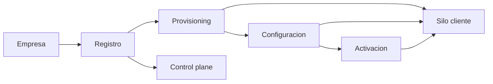
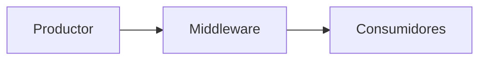
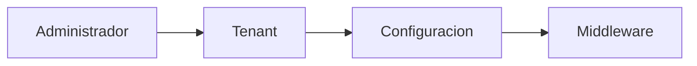

# Arquitectura Metodologia Integral

**Proyecto:** Arquitectura de Software Orientada a Dominios y Eventos con Middleware de Integracion para la Optimizacion Omnicanal y la Visibilidad de Inventario en Tiempo Real

**Alcance documental:** consolidacion arquitectonica integral a partir de toda la documentacion disponible en `docs/`, con enfasis en arquitectura vigente, decisiones de diseno, metodologia, observabilidad, seguridad, integracion omnicanal y uso de IA.

**Nota de control documental:** tras revisar el corpus textual disponible en `docs/` no identifique duplicados exactos por comparacion de textos normalizados. Si encontre documentacion legada o deprecada de forma explicita, que se conserva como evidencia historica y no como referencia de arquitectura vigente. Se detallan al final de este documento.

## 1. Introduccion

El proyecto aborda una necesidad empresarial y tecnologica tipica de entornos retail omnicanal: sincronizar canales de venta, proveedores, inventario, pedidos, auditoria y observabilidad en tiempo casi real, evitando el acoplamiento punto a punto. La documentacion vigente describe una plataforma de integracion basada en middleware, eventos y contextos acotados que sirve como nucleo operativo para distintos clientes o instancias.

En terminos de negocio, la problematica principal es la inconsistencia de inventario y la dificultad para mantener una vista unica del estado operativo cuando conviven POS, e-commerce, integraciones ERP/CRM, colas internas y paneles operativos. La documentacion historica y vigente converge en que el negocio requiere un modelo omnicanal con trazabilidad y sincronizacion de eventos, no un monolito de retail con persistencia de estado de negocio dentro del bus.

En terminos tecnologicos, la arquitectura resuelve tres tensiones:

- desacoplar productores y consumidores para evitar dependencias rigidas;
- representar eventos como ciudadanos de primera clase para trazabilidad, reprocesamiento y auditoria;
- exponer observabilidad, seguridad y contratos de API como capacidades de plataforma, no como complementos tardios.

La necesidad de integracion surge porque el middleware actua como canal comun entre sistemas fuente y dominios consumidores, mientras que la necesidad de sincronizacion omnicanal responde a la necesidad de mantener coherencia entre canales fisicos y digitales sin depender de procesos batch o reconciliacion manual.

**Fuentes:** [docs/architecture/middleware_database_architecture.md](middleware_database_architecture.md), [docs/production/Plan_Middleware.md](../production/Plan_Middleware.md), [docs/production/Plan_Integraciones.md](../production/Plan_Integraciones.md), [docs/Plan_Desarrollo_Servicio_v0.1/Flujo_Middleware.md](../Plan_Desarrollo_Servicio_v0.1/Flujo_Middleware.md), [docs/Plan_Desarrollo_Servicio_v0.1/DDD_en_la_arquitectura.md](../Plan_Desarrollo_Servicio_v0.1/DDD_en_la_arquitectura.md), [docs/personal_notes/Analisis_General.md](../personal_notes/Analisis_General.md).

## 2. Problema identificado

La documentacion identifica un conjunto consistente de problemas:

- comunicacion deficiente entre modulos y sistemas fuente;
- inconsistencia de inventarios por sincronizacion tardia;
- procesos desacoplados solo parcialmente o por lotes;
- falta de trazabilidad end-to-end;
- limitaciones de arquitecturas tradicionales centradas en estado de negocio en lugar de eventos.

La evidencia aparece en varias capas de la documentacion:

- los documentos historicos de 2026-05 y 2026-05-21 describen un bus in-process con colas, feed, dead letters y metrics, pero sin un `event_store` canonical plenamente cableado;
- los ADR y runbooks muestran que el modelo de despliegue evoluciono hacia instancia por cliente, porque un multi-tenant logico en una sola app aun no era consistente con la operacion real;
- los planes de middleware, observabilidad, logs, integraciones y base de datos remarcan repetidamente que la arquitectura tradicional no cubre auditabilidad, trazas distribuidas, integracion por canal y retencion.

En el caso del inventario, el problema se formula de forma recurrente como sobreventa, desfase entre canales y baja visibilidad en tiempo real. En el caso tecnologico, el problema se formula como duplicacion de payloads, tablas de tracking sin fuente canonica unica, ausencia de regimen de seguridad maduro y falta de pipeline cloud reproducible.

La conclusion documental es clara: el sistema necesitaba dejar de parecer una aplicacion de retail con eventos anexos y pasar a comportarse como una plataforma de integracion y observabilidad orientada a eventos.

**Fuentes:** [docs/architecture/middleware_database_architecture.md](middleware_database_architecture.md), [docs/architecture/data_dictionary.md](data_dictionary.md), [docs/production/Auditoria_Produccion.md](../production/Auditoria_Produccion.md), [docs/production/Plan_de_implementacion.md](../production/Plan_de_implementacion.md), [docs/production/Plan_Middleware.md](../production/Plan_Middleware.md), [docs/production/Plan_Observabilidad.md](../production/Plan_Observabilidad.md), [docs/Plan_Desarrollo_Servicio_v0.1/Flujo_Middleware.md](../Plan_Desarrollo_Servicio_v0.1/Flujo_Middleware.md).

## 3. Fundamentacion cientifica

### 3.1 Middleware

La documentacion define middleware como la capa intermedia que centraliza ingesta, validacion, transformacion, distribucion y trazabilidad de eventos. En la version madura del proyecto, el middleware no es una logica de negocio de retail, sino un servicio de integracion EDA que expone APIs de control y opera como nucleo del bus.

Los beneficios que la documentacion atribuye al middleware son:

- desacoplamiento entre sistemas fuente y consumidores;
- capacidad de observacion tecnica del trafico;
- posibilidad de operar por APIs y no solo por interfaz;
- flexibilidad para integrar canales distintos sin redisenar dominios de negocio;
- soporte a reintentos, DLQ, registro y topologia.

La evolucion cientifica del concepto en el corpus pasa de una descripcion general de broker y colas a una formulacion de plataforma con persistencia, observabilidad y configuracion declarativa.

**Fuentes:** [docs/Plan_Desarrollo_Servicio_v0.1/Flujo_Middleware.md](../Plan_Desarrollo_Servicio_v0.1/Flujo_Middleware.md), [docs/Plan_Desarrollo_Modulos_v0.1/Plan_Modulo_Control_Middleware.md](../Plan_Desarrollo_Modulos_v0.1/Plan_Modulo_Control_Middleware.md), [docs/production/Plan_Middleware.md](../production/Plan_Middleware.md), [docs/architecture/middleware_database_architecture.md](middleware_database_architecture.md), [docs/production/Reporte_Implementacion.md](../production/Reporte_Implementacion.md).

### 3.2 Event Driven Architecture

La EDA es el patron rector del sistema. La documentacion la describe como comunicacion asincrona mediante eventos desde su generacion hasta su consumo, con beneficios directos en escalabilidad, resiliencia y desacoplamiento.

En la version consolidada, la EDA ya no se limita a "emitir eventos", sino que incluye:

- sobre de evento con `event_id`, `event_type`, `occurred_at` y `payload`;
- persistencia canonical en `event_store`;
- cola de mensajes para estado de procesamiento;
- dead letter queue;
- listeners y proyecciones;
- soporte para replay, idempotencia y correlacion.

La ventaja arquitectonica es que el estado de negocio deja de viajar por llamadas sincronas entre sistemas y pasa a viajar por contratos de evento, con control de calidad, reintentos y observabilidad.

**Fuentes:** [docs/Plan_Desarrollo_Servicio_v0.1/Arquitectura_EDA.md](../Plan_Desarrollo_Servicio_v0.1/Arquitectura_EDA.md), [docs/Plan_Desarrollo_Servicio_v0.1/Flujo_Middleware.md](../Plan_Desarrollo_Servicio_v0.1/Flujo_Middleware.md), [docs/production/Plan_Middleware.md](../production/Plan_Middleware.md), [docs/architecture/middleware_database_architecture.md](middleware_database_architecture.md), [docs/production/ADR_006_saga_transactions.md](../production/ADR_006_saga_transactions.md), [docs/production/ADR_007_workflow_orchestration.md](../production/ADR_007_workflow_orchestration.md).

### 3.3 Domain Driven Design

La aplicacion de DDD aparece en la documentacion como separacion de responsabilidades por bounded contexts, con autonomia de cada contexto y con una frontera clara entre dominio de negocio y plataforma de integracion. El middleware y el dashboard se clasifican consistentemente como supporting/generic infrastructure, mientras que los dominios de negocio reales viven fuera del core.

Los fundamentos recurrentes son:

- bounded contexts con responsabilidades explicitas;
- modelos y persistencia separada por dominio;
- lenguaje ubicuo orientado al contexto;
- consistencia eventual entre contextos;
- evitacion de dependencias directas entre bases de datos.

El valor empresarial del DDD en este proyecto es doble: reduce el acoplamiento entre canales y permite que cada cliente o instancia evolucione sin reescribir el bus central.

**Fuentes:** [docs/Plan_Desarrollo_Servicio_v0.1/DDD_en_la_arquitectura.md](../Plan_Desarrollo_Servicio_v0.1/DDD_en_la_arquitectura.md), [docs/Plan_Desarrollo_Modulos_v0.1/Plan_Modulo_Control_Middleware.md](../Plan_Desarrollo_Modulos_v0.1/Plan_Modulo_Control_Middleware.md), [docs/Plan_Desarrollo_Modulos_v0.1/Plan_Modulo_Dashboard_General.md](../Plan_Desarrollo_Modulos_v0.1/Plan_Modulo_Dashboard_General.md), [docs/architecture/middleware_database_architecture.md](middleware_database_architecture.md), [docs/production/ADR_001_instancia_por_cliente.md](../production/ADR_001_instancia_por_cliente.md).

### 3.4 Observabilidad

La observabilidad se construye sobre tres pilares: metricas, logs y trazas. La documentacion madura introduce `observability_metrics`, `trace_logs`, `audit_logs`, `correlation_id`, `trace_id`, `span_id`, dashboards Grafana y exportacion Prometheus, ademas de runbooks y alertas.

El valor cientifico del enfoque esta en que no se trata solo de monitoreo, sino de capacidad de explicar el comportamiento del sistema en produccion. El corpus insiste en:

- monitoreo del bus y de la cola;
- trazabilidad por `event_id` y `correlation_id`;
- logging estructurado y retencion;
- auditoria de acciones administrativas;
- SLOs y alertamiento operativo;
- posibilidad de evolucionar hacia OpenTelemetry con sidecar.

**Fuentes:** [docs/production/Plan_Observabilidad.md](../production/Plan_Observabilidad.md), [docs/production/Plan_Logs.md](../production/Plan_Logs.md), [docs/production/Plan_Monitoreo.md](../production/Plan_Monitoreo.md), [docs/production/ADR_008_cloud_log_shipping.md](../production/ADR_008_cloud_log_shipping.md), [docs/production/ADR_009_opentelemetry_distributed_tracing.md](../production/ADR_009_opentelemetry_distributed_tracing.md), [docs/architecture/middleware_database_dictionary.md](middleware_database_dictionary.md), [docs/personal_notes/Observabilidad_pruebas_produccion_local.md](../personal_notes/Observabilidad_pruebas_produccion_local.md).

### 3.5 Integracion omnicanal

La integracion omnicanal en la documentacion se define como la capacidad de conectar POS, e-commerce, ERP, CRM, WMS, mobile, webhooks y APIs bajo un modelo coherente de canales, proveedores, adapters y connectors. El valor de negocio es que el middleware deja de ser una pieza tecnica aislada y pasa a ser el hub de integracion del ecosistema.

Los retos documentados son:

- multiples fuentes de verdad declarativas;
- configuracion que antes exigia editar JSON y redeploy;
- ausencia de CRUD runtime para integraciones en fases tempranas;
- necesidad de signature verification, credenciales seguras y trazabilidad por canal;
- riesgo de que la promesa de "hub de integracion" no se materialice si solo existen archivos de configuracion.

**Fuentes:** [docs/production/Plan_Integraciones.md](../production/Plan_Integraciones.md), [docs/architecture/middleware_database_architecture.md](middleware_database_architecture.md), [docs/architecture/middleware_database_dictionary.md](middleware_database_dictionary.md), [docs/Analisis_v0.1/Composable Commerce Architectures_ Building Agile Retail Systems.md](../Analisis_v0.1/Composable Commerce Architectures_ Building Agile Retail Systems.md), [docs/Analisis_v0.1/Multi-Cloud Headless Commerce_ A Reference Architecture for Enterprise Retail Systems Integration.md](../Analisis_v0.1/Multi-Cloud Headless Commerce_ A Reference Architecture for Enterprise Retail Systems Integration.md), [docs/Analisis_v0.1/Exploring the Role of Omnichannel Retailing Technologies_ Future Research Directions.md](../Analisis_v0.1/Exploring%20the%20Role%20of%20Omnichannel%20Retailing%20Technologies_%20Future%20Research%20Directions.md).

## 4. Fundamentacion del uso de Inteligencia Artificial

La documentacion de la carpeta `Analisis_v0.2` muestra un segundo eje de investigacion: el uso de IA como soporte a ingenieria de software, generacion de codigo, code review automatizado, confianza, gobernanza y gestion de riesgos. El corpus no romantiza la IA; la trata como una capacidad util pero controlada.

### 4.1 Por que se utilizo IA

La motivacion documental es acelerar tareas de alto volumen y baja diferenciacion:

- generacion de codigo y scaffolding;
- completado y refactor asistido;
- validacion de calidad de datos y pruebas;
- apoyo a la documentacion tecnica;
- apoyo a la experimentacion arquitectonica;
- analisis de riesgos y gobernanza.

En la literatura recopilada, la IA se presenta como multiplicador de productividad, pero con beneficios desiguales segun experiencia, contexto, complejidad y calidad de supervision humana.

### 4.2 Como se utilizo IA

La documentacion sugiere un uso responsable y distribuido en el ciclo de vida:

- como copiloto para tareas repetitivas;
- como asistente para generar borradores de codigo y pruebas;
- como apoyo al analisis de arquitecturas y pipelines;
- como herramienta de revision automatizada;
- como acelerador de documentacion y clasificacion de evidencias.

La metodologia inferida de la corpus es la de "IA asistida con validacion humana": la IA produce propuestas y la persona revisa, integra, corrige y aprueba.

### 4.3 Beneficios obtenidos

El conjunto de documentos apunta a beneficios recurrentes:

- reduccion de tiempo en tareas mecanicas;
- aumento de productividad percibida y, en algunos casos, real;
- apoyo al razonamiento arquitectonico y al prototipado;
- aceleracion de documentacion tecnica;
- ayuda en revisiones de calidad y deteccion temprana de errores;
- mayor cobertura en tareas de boilerplate y pruebas.

### 4.4 Reduccion de tiempo

La evidencia del corpus no permite afirmar una cifra unica ni universal. Lo que si queda sustentado es que la aceleracion existe principalmente en tareas repetitivas y bien delimitadas, mientras que en tareas complejas o ambiguas el ahorro se reduce o incluso puede invertirse por costo de verificacion.

### 4.5 Apoyo a la ingenieria de software

La literatura reunida cubre:

- productividad de desarrolladores con copilotos;
- code completion;
- code review asistido;
- pipelines automatizados;
- SDLC asistido por IA;
- generation de mensajes de commit y de codigo con recuperacion contextual.

### 4.6 Apoyo al diseno arquitectonico

El corpus de segunda fase tambien indica que la IA puede ayudar a:

- sintetizar decisiones arquitectonicas;
- comparar patrones y frameworks;
- proponer prompts y estructuras de trabajo;
- organizar evidencia cientifica y operativa;
- soportar metodologias AI-SDLC y arquitecturas de contexto amplio.

### 4.7 Apoyo documental

La carpeta de analisis muestra que la IA es especialmente util para consolidar literatura heterogenea, extraer patrones repetidos, construir taxonomias y mantener trazabilidad entre conceptos. Esto es particularmente valioso para un expediente arquitectonico largo como el de este proyecto.

### 4.8 Apoyo en generacion de codigo

La IA aparece como apoyo para:

- generar codigo repetitivo;
- producir borradores iniciales;
- acelerar iteracion en pruebas y utilidades;
- completar fragmentos de configuracion y scripts.

No obstante, la documentacion no la trata como fuente de verdad, sino como un instrumento de asistencia.

### 4.9 Riesgos identificados en la literatura

Los riesgos que se repiten en el corpus son:

- dependencia cognitiva y erosion de habilidades;
- deuda tecnica asistida por IA;
- codigo inseguro o alucinaciones;
- confianza mal calibrada;
- necesidad de oversight humano;
- problemas de gobernanza, seguridad y trazabilidad;
- riesgo de autonomia excesiva en sistemas AI-driven.

### 4.10 Metodologia sustentada

La metodologia derivada es la siguiente:

1. usar IA para explorar, resumir, proponer y clasificar;
2. validar manualmente todo resultado con evidencia documental o tecnica;
3. congelar contratos y decisiones en documentos versionados;
4. mantener supervisiones humanas para seguridad, arquitectura y calidad;
5. aplicar governance y trazabilidad a cualquier salida asistida por IA.

**Fuentes:** `docs/Analisis_v0.2/primera fase/`, `docs/Analisis_v0.2/segunda fase/`, especialmente [AI-Powered Code Completion Tools and Their Impact on Developer Productivity](../Analisis_v0.2/primera%20fase/AI-Powered%20Code%20Completion%20Tools%20and%20Their%20Impact%20on%20Developer%20Productivity_.docx), [The Impact of AI on Developer Productivity: Evidence from GitHub Copilot](../Analisis_v0.2/primera%20fase/The%20Impact%20of%20AI%20on%20Developer%20Productivity_%20Evidence%20from%20GitHub%20Copilot_.docx), [Do Users Write More Insecure Code with AI Assistants?](../Analisis_v0.2/primera%20fase/Do%20Users%20Write%20More%20Insecure%20Code%20with%20AI%20Assistants_.docx), [SOK: Exploring Hallucinations and Security Risks in AI-Assisted Software Development with Insights for LLM Deployment](../Analisis_v0.2/primera%20fase/SOK_%20Exploring%20Hallucinations%20and%20Security%20Risks%20in%20AI-Assisted%20Software%20Development%20with%20Insights%20for%20LLM%20Deployment_.docx), [Responsible AI Pattern Catalogue](../Analisis_v0.2/segunda%20fase/Responsible%20AI%20Pattern%20Catalogue_%20A%20Collection%20of%20Best%20Practices%20for%20AI%20Governance%20and%20Engineering_.docx), [Rethinking Autonomy](../Analisis_v0.2/segunda%20fase/Rethinking%20Autonomy_%20Preventing%20Failures%20in%20AI-Driven%20Software%20Engineering_.docx), [Investigating and Designing for Trust in AI-powered Code Generation Tools](../Analisis_v0.2/segunda%20fase/Investigating%20and%20Designing%20for%20Trust%20in%20AI-powered%20Code%20Generation%20Tools_.docx), [Effective Human Oversight of AI-Based Systems](../Analisis_v0.2/segunda%20fase/Effective%20Human%20Oversight%20of%20AI-Based%20Systems_%20A%20Signal%20Detection%20Perspective%20on%20the%20Detection%20of%20Inaccurate%20and%20Unfair%20Outputs.docx), [The AI-Native Software Development Lifecycle](../Analisis_v0.2/primera%20fase/The%20AI-Native%20Software%20Development%20Lifecycle_%20A%20Theoretical%20and%20Practical%20New%20Methodology_.docx), [Model Context Protocol (MCP): Landscape, Security Threats, and Future Research Directions](../Analisis_v0.2/segunda%20fase/Model%20Context%20Protocol%20(MCP)_%20Landscape,%20Security%20Threats,%20and%20Future%20Research%20Directions.docx).

## 5. Arquitectura propuesta

La arquitectura consolidada puede describirse como una plataforma de integracion omnicanal con control plane por instancia, middleware como corazon del sistema, dashboard como read side, observabilidad integrada y seguridad por capas.

### 5.1 Componentes

| Componente | Responsabilidad | Entradas | Salidas | Interacciones |
|---|---|---|---|---|
| Portal Comercial | Alta, onboarding y gestion comercial del cliente o instancia | Solicitudes de alta, datos de tenant, configuracion inicial | Registro de tenant, provisioning, links operativos | Control plane, runbooks, inventario, provisioning |
| Tenant Management | Ciclo de vida comercial y tecnico del tenant | Activar, suspender, restaurar, parametrizar | Estado de lifecycle, eventos de tenant, metadata de instancia | BD de control plane, middleware, logs, UI administrativa |
| Middleware Core | Ingesta, validacion, registro, bus, DLQ y proyecciones operativas | Eventos, requests API, catalogos declarativos | `event_store`, `message_queue`, DLQ, metrics, registry | API Gateway, Event Bus, Integraciones, Dashboard, Observability |
| Event Bus | Distribucion de eventos y tracking de suscriptores | Eventos publicados, suscripciones, registrars | Consumo por listeners, estado de cola, topologia | Middleware Core, packs externos, dashboard |
| API Gateway | Contratos HTTP, versionado, auth y rate limiting | Requests de integradores y operadores | Respuestas versionadas, Problem Details, headers | Middleware, Dashboard, Integraciones |
| Integraciones | Channels, providers, adapters y connectors | Webhooks, eventos externos, credenciales | Transformaciones, requests outbound, registros | Middleware Core, seguridad, observabilidad |
| Dashboard Cliente | Vista operativa y read model | Eventos observados, metrics, feed, catalogo declarativo | KPI, feed, topologia, series, stream | Middleware Core, observability tables, config JSON |
| Control Center | Administracion SaaS, fleet y lifecycle | Gestion de tenants, despliegues, configuracion | Provisioning, activacion, suspension, inventario | Portal Comercial, Tenant Management, Middleware |
| Observabilidad | Metricas, logs, trazas, SLO y alertas | Eventos, spans, metrics snapshots, logs | Dashboards, alertas, correlacion, reportes | Middleware, Monitoring, Grafana, Prometheus |
| Auditoria | Trazabilidad de acciones humanas y de sistema | Cambios de config, acciones admin, tokens, lifecycle | `audit_logs`, evidencias, reportes | Security, Tenant Management, Control Center |
| Seguridad | Autenticacion, autorizacion, hardening | Credenciales, tokens, requests | Allow/deny, audit trail, headers defensivos | API Gateway, UI, Integraciones, Cloud |
| Infraestructura | Entorno reproducible y escalable | Docker, CI/CD, Redis, DB, secrets | Despliegue, health checks, backups, runtime | Cloud, Monitoring, Middleware, Dashboard |

### 5.2 Lectura funcional de los componentes

**Portal Comercial.** Su funcion es captar el alta del cliente y convertirla en un flujo de provisioning repetible. En la documentacion de tenants esto se expresa como onboarding de una instancia con BD, `.env`, secretos y catalogos propios.

**Tenant Management.** Gestiona la vida operativa de cada cliente: registro, provisioning, activacion, suspension, restauracion y trazabilidad entre control plane y silo.

**Middleware Core.** Es el componente central. Recibe eventos, valida envelopes, persiste colas y estados, enruta a consumidores, maneja DLQ y publica metadatos para observabilidad.

**Event Bus.** No es solo un dispatcher: es la capa de distribucion y observacion del trafico, con catalogo de suscriptores, registro sincronizable y topologia observable.

**API Gateway.** Define contratos, versionado y seguridad de acceso. La documentacion reciente formaliza OpenAPI, Problem Details, idempotencia y rutas v1.

**Integraciones.** Cubre canales, proveedores, adapters, connectors, credenciales y webhooks. Es la capa que convierte la omnicanalidad en mecanismos concretos.

**Dashboard Cliente.** Es el lado de lectura: feed, metricas, topologia, series y estado del bus. No es fuente de verdad de negocio.

**Control Center.** Representa el plano administrativo SaaS. Desde alli se gobiernan tenants, lifecycle, configuracion y operaciones de fleet.

**Observabilidad.** Reune logs, metricas, trazas y alertas. Su objetivo no es solo mirar, sino explicar y anticipar.

**Auditoria.** Registra acciones administrativas, cambios de configuracion y eventos sensibles.

**Seguridad.** Abarca autenticacion dual, rate limiting, CORS, security headers, audit, API keys y hardening operativo.

**Infraestructura.** Hace posible la reproducibilidad: Docker, CI/CD, health checks, retention, backups, cloud y scheduling.

**Fuentes:** [docs/production/Plan_Tenants.md](../production/Plan_Tenants.md), [docs/production/Runbook_Onboarding_Cliente.md](../production/Runbook_Onboarding_Cliente.md), [docs/production/Plan_Middleware.md](../production/Plan_Middleware.md), [docs/production/Plan_Observabilidad.md](../production/Plan_Observabilidad.md), [docs/production/Plan_Integraciones.md](../production/Plan_Integraciones.md), [docs/production/Plan_APIs.md](../production/Plan_APIs.md), [docs/production/Plan_Seguridad.md](../production/Plan_Seguridad.md), [docs/production/Plan_Cloud.md](../production/Plan_Cloud.md), [docs/production/Plan_CI_CD.md](../production/Plan_CI_CD.md), [docs/architecture/middleware_database_architecture.md](middleware_database_architecture.md), [docs/production/ADR_001_instancia_por_cliente.md](../production/ADR_001_instancia_por_cliente.md), [docs/production/ADR_010_tenant_lifecycle_management.md](../production/ADR_010_tenant_lifecycle_management.md), [docs/production/ADR_011_friendly_routing_multitenant.md](../production/ADR_011_friendly_routing_multitenant.md).

## 6. Flujo arquitectonico completo

### 6.1 Flujo de onboarding

### 6.2 Flujo operacional

### 6.3 Flujo de observabilidad

### 6.4 Flujo administrativo

**Fuentes:** [docs/production/Runbook_Onboarding_Cliente.md](../production/Runbook_Onboarding_Cliente.md), [docs/production/ADR_010_tenant_lifecycle_management.md](../production/ADR_010_tenant_lifecycle_management.md), [docs/production/ADR_011_friendly_routing_multitenant.md](../production/ADR_011_friendly_routing_multitenant.md), [docs/production/Plan_Middleware.md](../production/Plan_Middleware.md), [docs/production/Plan_Observabilidad.md](../production/Plan_Observabilidad.md), [docs/personal_notes/Runbook_cliente_simulado.md](../personal_notes/Runbook_cliente_simulado.md).

## 7. Justificacion de decisiones arquitectonicas

| Decision | Justificacion | Evidencia encontrada |
|---|---|---|
| Uso de Middleware | Centraliza integracion, evita acoplamiento punto a punto y ofrece trazabilidad operativa | El plan del middleware y la arquitectura de persistencia lo presentan como nucleo del servicio de integracion |
| Uso de DDD | Permite separar dominios, mantener lenguaje ubicuo y evitar fuga de responsabilidades hacia el bus | Los bounded contexts y la clasificacion supporting/generic aparecen en la documentacion de modulo y arquitectura |
| Uso de EDA | Habilita asincronia, escalabilidad y consistencia eventual | Los documentos de flujo y de arquitectura EDA lo explican como modelo base |
| Uso de Multi-Tenant | Se adopta solo en control plane y metadatos, no como ACL logica compartida en runtime | ADR-001 y ADR-004 definen instancia por cliente como modelo operativo |
| Uso de Observabilidad | Sin metricas, trazas y logs no hay explicabilidad ni MTTR razonable | Planes de observabilidad, logs, monitoreo y ADR-009 |
| Uso de IA | Acelera analisis, documentacion y borradores, pero requiere validacion humana | La carpeta de analisis de IA y el catalogo de patrones responsables lo sostienen |
| Uso de APIs | Los contratos versionados reducen ambiguedad y facilitan integracion de terceros | Plan_APIs, OpenAPI, Problem Details e idempotencia |
| Uso de Event Bus | Es el mecanismo de distribucion y observacion del trafico entre productores y consumidores | Plan_Middleware, diccionario de datos y runbooks operativos |
| Uso de Audit Logs | Responde a compliance y forensics, no solo a debugging | Plan_Logs, diccionario de datos y seguridad |
| Uso de Cloud + CI/CD | Sin reproducibilidad y health checks la arquitectura no es operable en produccion | Plan_Cloud, Plan_CI_CD, Plan_Calidad |

**Fuentes:** [docs/production/Plan_Middleware.md](../production/Plan_Middleware.md), [docs/architecture/middleware_database_architecture.md](middleware_database_architecture.md), [docs/production/ADR_001_instancia_por_cliente.md](../production/ADR_001_instancia_por_cliente.md), [docs/production/ADR_004_tenant_id_activation.md](../production/ADR_004_tenant_id_activation.md), [docs/production/Plan_Observabilidad.md](../production/Plan_Observabilidad.md), [docs/production/Plan_Logs.md](../production/Plan_Logs.md), [docs/production/Plan_APIs.md](../production/Plan_APIs.md), [docs/production/Plan_Cloud.md](../production/Plan_Cloud.md), [docs/production/Plan_CI_CD.md](../production/Plan_CI_CD.md), `docs/Analisis_v0.2/`.

## 8. Metodologia propuesta

La metodologia consolidada se organiza en ocho fases. No es una metodologia inventada desde cero: es la sintesis de los planes, runbooks, ADR y evidencias de pruebas repartidos por el corpus.

| Fase | Actividades | Entradas | Salidas | Herramientas | Participacion de IA |
|---|---|---|---|---|---|
| 1. Analisis | Leer corpus, detectar problemas, priorizar riesgos y decidir alcance | Documentacion historica, papers, ADR, runbooks | Hipotesis de arquitectura, matriz de problemas | Markdown, inventarios, matrices, busqueda textual | Clasificacion de evidencia, deteccion de patrones, comparacion de enfoques |
| 2. Diseno | Definir dominios, contratos, modelos y decisiones | Problemas priorizados, contexto de negocio, restricciones | Arquitectura propuesta, ADR, diagramas | Mermaid, ADR, tablas de decision | Borradores de estructura, sintesis de alternativas |
| 3. Arquitectura | Consolidar middleware, bus, observabilidad, seguridad y multi-instancia | Diseno aprobado, contrato de API, esquema de datos | Documentos de arquitectura y planes por area | Arquitectura de BD, OpenAPI, diccionarios | Organizacion de secciones y consistencia terminologica |
| 4. Implementacion | Codificar, migrar, instrumentar, versionar | Planes y contratos | Modulos implementados, migraciones, scripts | Laravel, migraciones, comandos artisan | Generacion de esqueletos, utilidades, ejemplos |
| 5. Integracion | Conectar canales, providers, adapters, registrars y dashboards | Catalogos declarativos, eventbus, APIs | Flujo end-to-end operacional | Webhooks, API versionada, sync-config | Generacion de casos de prueba y checklists |
| 6. Pruebas | Validar unitarias, integracion, E2E, carga y seguridad | Aplicacion, config, datos de prueba | Suites verdes, reportes, observaciones | PHPUnit, k6, Playwright, ZAP, Postman | Generacion de escenarios y matrices de prueba |
| 7. Observabilidad | Medir, correlacionar, alertar y auditar | Eventos, logs, metricas, trazas | Dashboards, alertas, runbooks | Prometheus, Grafana, alertmanager, logs | Sintesis de señales, redaccion de runbooks |
| 8. Mejora continua | Refinar planes, depurar deuda y ajustar roadmap | Resultados de pruebas, auditorias, incidentes | ADR nuevos, refactor, backlog | Auditorias, refactorizacion, runbooks | Priorizacion asistida y descubrimiento de patrones |

### Calidad documental y obsolescencia

Durante la revision del corpus, identifique las siguientes situaciones:

- no encontre duplicados exactos tras comparar textos normalizados de los archivos textuales disponibles;
- `docs/DC_Mockups_obsoletos(NOusar)/` esta explicitamente marcado como obsoleto;
- `docs/architecture/data_dictionary.md` esta deprecado por su propio contenido;
- `docs/Plan_Desarrollo_Servicio_v0.1/` y `docs/Plan_Desarrollo_Modulos_v0.1/` representan una etapa historica que fue absorbida por la documentacion actual;
- `docs/production/Plan_de_implementacion.md` se describe a si mismo como historico y parcialmente obsoleto;
- `docs/Modulos/` y varios documentos de `personal_notes/` sirven como referencia historica o de trabajo, pero no gobiernan la arquitectura vigente.

**Fuentes:** `docs/DC_Mockups_obsoletos(NOusar)/`, [docs/architecture/data_dictionary.md](data_dictionary.md), [docs/production/Plan_de_implementacion.md](../production/Plan_de_implementacion.md), [docs/Plan_Desarrollo_Modulos_v0.1/README.md](../Plan_Desarrollo_Modulos_v0.1/README.md), `docs/Plan_Desarrollo_Servicio_v0.1/`, `docs/Modulos/`, `docs/personal_notes/`.

## 9. Beneficios obtenidos

### 9.1 Beneficios tecnicos

- desacoplamiento real entre productores y consumidores;
- persistencia orientada a eventos y no a estado de negocio del retail;
- trazabilidad por evento, correlacion y auditoria;
- contratos de API versionados;
- seguridad y autenticacion unificadas;
- observabilidad con logs, metricas y trazas.

### 9.2 Beneficios empresariales

- menor riesgo de sobreventa e inconsistencia de inventario;
- capacidad de operar omnicanalidad con mayor coherencia;
- onboarding de clientes o instancias mas gobernable;
- base documental para explicar decisiones ante auditoria o inversion.

### 9.3 Beneficios operativos

- runbooks repetibles;
- validacion de despliegue y smoke tests;
- recuperacion mas rapida ante incidentes;
- mejor gestion de tenants, lifecycle y despliegues;
- monitoreo proactivo y alertamiento.

### 9.4 Beneficios academicos

- expediente arquitectonico trazable;
- corpus bibliografico articulado por temas;
- comparacion entre enfoques clasicos y event-driven;
- base metodologica para justificar IA, DDD, EDA, observabilidad y multi-instancia.

**Fuentes:** [docs/production/Reporte_Implementacion.md](../production/Reporte_Implementacion.md), [docs/production/Plan_Calidad.md](../production/Plan_Calidad.md), [docs/production/Plan_Observabilidad.md](../production/Plan_Observabilidad.md), [docs/production/Plan_Monitoreo.md](../production/Plan_Monitoreo.md), [docs/production/Plan_Tenants.md](../production/Plan_Tenants.md), [docs/production/Plan_APIs.md](../production/Plan_APIs.md), `docs/Analisis_v0.1/`, `docs/Analisis_v0.2/`.

## 10. Conclusiones arquitectonicas

La arquitectura es adecuada porque responde exactamente a la naturaleza del problema: un ecosistema omnicanal que necesita mover eventos, no solo almacenar estados. La combinacion de middleware, EDA, DDD, observabilidad y seguridad permite separar preocupaciones, controlar el riesgo y escalar por cliente o por instancia sin romper la trazabilidad.

El middleware es el componente central porque concentra el valor diferencial del sistema: ingreso, validacion, enrutamiento, persistencia operativa y observacion del trafico. El dashboard, por contraste, es una vista de lectura; las integraciones son la frontera con el mundo externo; y el control plane gobierna el ciclo de vida.

La IA complemento el desarrollo al acelerar la recopilacion, clasificacion y sintesis documental, ademas de apoyar tareas de analisis y borrador. Sin embargo, la documentacion cientifica revisada confirma que la supervision humana sigue siendo obligatoria para evitar dependencia cognitiva, deuda tecnica asistida y fallos de confianza.

La arquitectura soporta escalabilidad futura porque ya deja abiertas varias rutas de evolucion:

- particionamiento o expansion del modelo de tenants;
- observabilidad distribuida con OpenTelemetry;
- webhooks, conectores y adapters adicionales;
- workflows y sagas cuando el negocio lo requiera;
- cloud y CI/CD mas maduros;
- eventual extraccion de componentes hacia servicios separados si el volumen lo justifica.

En resumen, el proyecto ya no se entiende como un conjunto de pantallas o tablas, sino como una plataforma de integracion y observabilidad orientada a dominios y eventos, con una metodologia documental suficientemente robusta para sostener decisiones de produccion.

**Fuentes:** [docs/production/ADR_001_instancia_por_cliente.md](../production/ADR_001_instancia_por_cliente.md), [docs/production/ADR_009_opentelemetry_distributed_tracing.md](../production/ADR_009_opentelemetry_distributed_tracing.md), [docs/production/ADR_010_tenant_lifecycle_management.md](../production/ADR_010_tenant_lifecycle_management.md), [docs/production/ADR_011_friendly_routing_multitenant.md](../production/ADR_011_friendly_routing_multitenant.md), [docs/production/Plan_Cloud.md](../production/Plan_Cloud.md), [docs/production/Plan_CI_CD.md](../production/Plan_CI_CD.md), [docs/production/Plan_Observabilidad.md](../production/Plan_Observabilidad.md), [docs/production/Plan_Middleware.md](../production/Plan_Middleware.md).

## 11. Glosario tecnico

- **API Gateway:** capa que expone contratos HTTP versionados y aplica seguridad, versionado e idempotencia.
- **Bounded Context:** frontera funcional donde un modelo y un lenguaje ubicuo son validos.
- **Causation ID:** identificador del evento que desencadena otro evento.
- **Correlacion:** mecanismo para enlazar eventos, logs y trazas de un mismo flujo.
- **CQRS:** separacion entre escritura operativa y lectura proyectada.
- **Dead Letter Queue:** cola de eventos que agotaron reintentos o no pudieron procesarse.
- **EDA:** arquitectura orientada a eventos.
- **Event Store:** registro canonical append-only de eventos.
- **Idempotencia:** propiedad que evita duplicar efectos cuando una operacion se repite.
- **Instance per Client:** modelo de aislamiento por cliente con despliegue y BD propios.
- **Middleware:** capa de integracion entre productores y consumidores de eventos.
- **Observabilidad:** capacidad de inferir el estado interno del sistema a partir de logs, metricas y trazas.
- **SAGA:** patron de transaccion distribuida con compensacion.
- **Tenant:** cliente o unidad organizacional representada en el control plane.
- **Trace Log:** registro de spans y trazas tecnicas distribuidas.
- **Webhook:** canal HTTP entrante o saliente basado en eventos.

## 12. Referencias documentales

### Arquitectura vigente

- [docs/architecture/middleware_database_architecture.md](middleware_database_architecture.md)
- [docs/architecture/middleware_database_dictionary.md](middleware_database_dictionary.md)
- [docs/architecture/er_diagram.md](er_diagram.md)

### Produccion y operacion

- [docs/production/Plan_Middleware.md](../production/Plan_Middleware.md)
- [docs/production/Plan_Integraciones.md](../production/Plan_Integraciones.md)
- [docs/production/Plan_Observabilidad.md](../production/Plan_Observabilidad.md)
- [docs/production/Plan_Logs.md](../production/Plan_Logs.md)
- [docs/production/Plan_BaseDeDatos.md](../production/Plan_BaseDeDatos.md)
- [docs/production/Plan_APIs.md](../production/Plan_APIs.md)
- [docs/production/Plan_Seguridad.md](../production/Plan_Seguridad.md)
- [docs/production/Plan_Autenticacion.md](../production/Plan_Autenticacion.md)
- [docs/production/Plan_Cloud.md](../production/Plan_Cloud.md)
- [docs/production/Plan_CI_CD.md](../production/Plan_CI_CD.md)
- [docs/production/Plan_Calidad.md](../production/Plan_Calidad.md)
- [docs/production/Plan_Monitoreo.md](../production/Plan_Monitoreo.md)
- [docs/production/Plan_Resiliencia.md](../production/Plan_Resiliencia.md)
- [docs/production/Plan_Tenants.md](../production/Plan_Tenants.md)
- [docs/production/Runbook_Onboarding_Cliente.md](../production/Runbook_Onboarding_Cliente.md)
- [docs/production/Runbook_Deploy_VM.md](../production/Runbook_Deploy_VM.md)
- [docs/production/Runbook_Backup_Restore.md](../production/Runbook_Backup_Restore.md)
- [docs/production/Runbook_Simulacion_Cliente.md](../production/Runbook_Simulacion_Cliente.md)
- [docs/production/Auditoria_Produccion.md](../production/Auditoria_Produccion.md)
- [docs/production/Reporte_Implementacion.md](../production/Reporte_Implementacion.md)

### ADR

- [docs/production/ADR_001_instancia_por_cliente.md](../production/ADR_001_instancia_por_cliente.md)
- [docs/production/ADR_002_autenticacion_enterprise.md](../production/ADR_002_autenticacion_enterprise.md)
- [docs/production/ADR_004_tenant_id_activation.md](../production/ADR_004_tenant_id_activation.md)
- [docs/production/ADR_006_saga_transactions.md](../production/ADR_006_saga_transactions.md)
- [docs/production/ADR_007_workflow_orchestration.md](../production/ADR_007_workflow_orchestration.md)
- [docs/production/ADR_008_cloud_log_shipping.md](../production/ADR_008_cloud_log_shipping.md)
- [docs/production/ADR_009_opentelemetry_distributed_tracing.md](../production/ADR_009_opentelemetry_distributed_tracing.md)
- [docs/production/ADR_010_tenant_lifecycle_management.md](../production/ADR_010_tenant_lifecycle_management.md)
- [docs/production/ADR_011_friendly_routing_multitenant.md](../production/ADR_011_friendly_routing_multitenant.md)

### Evolucion historica

- [docs/Plan_Desarrollo_Servicio_v0.1/Flujo_Middleware.md](../Plan_Desarrollo_Servicio_v0.1/Flujo_Middleware.md)
- [docs/Plan_Desarrollo_Servicio_v0.1/DDD_en_la_arquitectura.md](../Plan_Desarrollo_Servicio_v0.1/DDD_en_la_arquitectura.md)
- [docs/Plan_Desarrollo_Servicio_v0.1/Arquitectura_EDA.md](../Plan_Desarrollo_Servicio_v0.1/Arquitectura_EDA.md)
- [docs/Plan_Desarrollo_Modulos_v0.1/README.md](../Plan_Desarrollo_Modulos_v0.1/README.md)
- [docs/Plan_Desarrollo_Modulos_v0.1/Plan_Modulo_Control_Middleware.md](../Plan_Desarrollo_Modulos_v0.1/Plan_Modulo_Control_Middleware.md)
- [docs/Plan_Desarrollo_Modulos_v0.1/Plan_Modulo_Dashboard_General.md](../Plan_Desarrollo_Modulos_v0.1/Plan_Modulo_Dashboard_General.md)
- [docs/personal_notes/Analisis_General.md](../personal_notes/Analisis_General.md)
- [docs/personal_notes/Fase_D_arquitectura_cliente.md](../personal_notes/Fase_D_arquitectura_cliente.md)
- [docs/personal_notes/Runbook_cliente_simulado.md](../personal_notes/Runbook_cliente_simulado.md)
- [docs/personal_notes/Observabilidad_pruebas_produccion_local.md](../personal_notes/Observabilidad_pruebas_produccion_local.md)

### Corpus de investigacion en IA y omnicanalidad

- `docs/Analisis_v0.1/`
- `docs/Analisis_v0.2/primera fase/`
- `docs/Analisis_v0.2/segunda fase/`
