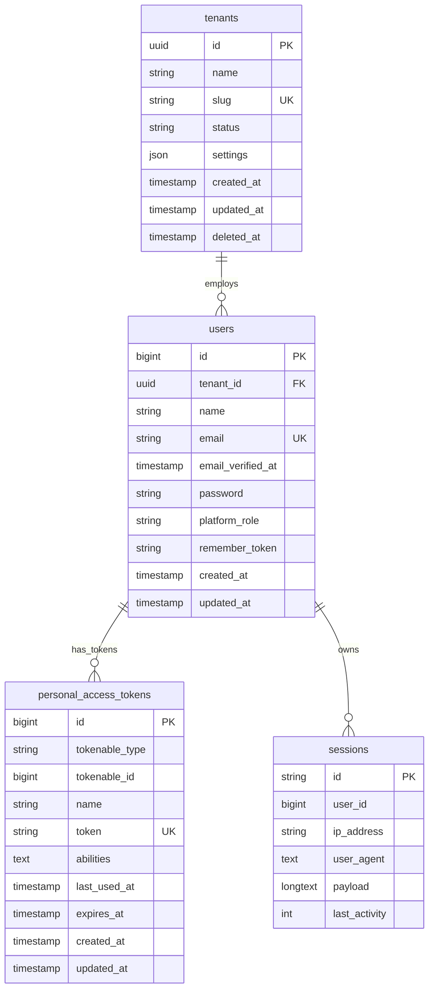
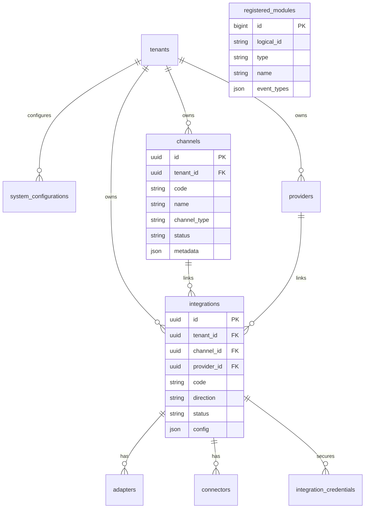
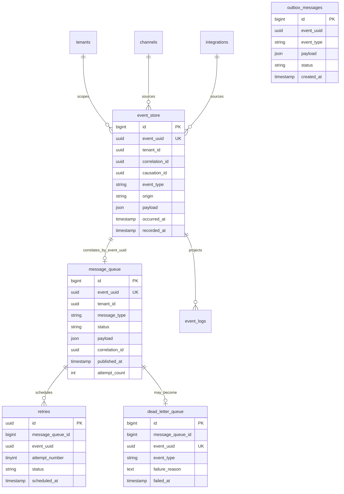
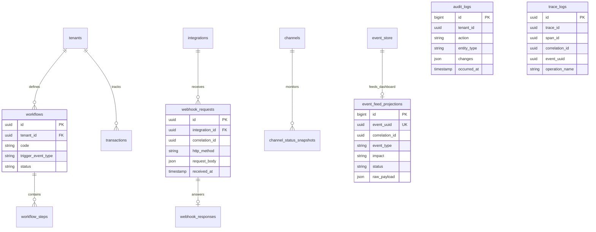
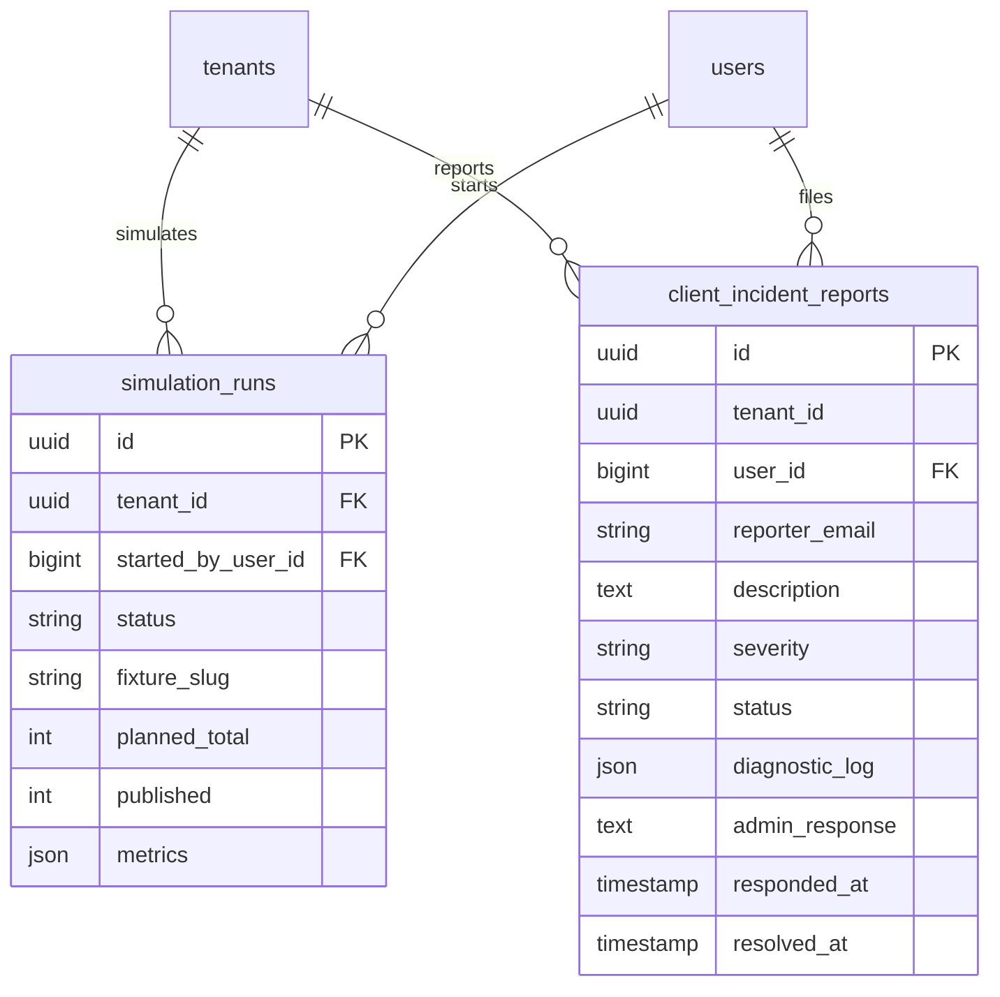
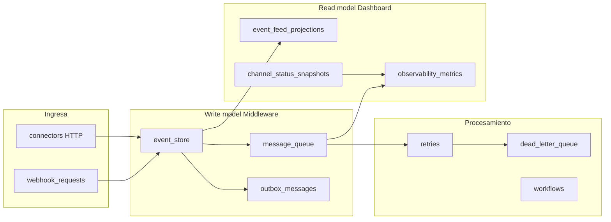

# Diagrama entidad-relación — Plataforma Middleware (EDA)

**Versión:** 2.0  
**Fecha:** 2026-06-24  
**Fuente:** `database/migrations/` (31 migraciones)  
**Motor:** SQLite (dev) / MySQL (prod)  
**Tablas activas:** 38 (+ `migrations` de Laravel)

> El diagrama retail anterior (PRODUCT, ORDER, INVENTORY…) está **obsoleto**. Ver [`data_dictionary.md`](data_dictionary.md).

---

## 1. Inventario de tablas por dominio

| Dominio | Tablas | Cantidad |
|---------|--------|----------|
| Plataforma e identidad | `tenants`, `users`, `personal_access_tokens`, `sessions`, `cache`, `cache_locks`, `jobs`, `failed_jobs` | 8 |
| Configuración e integración | `system_configurations`, `channels`, `providers`, `integrations`, `adapters`, `connectors`, `integration_credentials`, `registered_modules` | 8 |
| Eventos y mensajería | `event_store`, `event_logs`, `message_queue`, `dead_letter_queue`, `retries`, `outbox_messages` | 6 |
| Procesamiento | `processing_jobs`, `workflows`, `workflow_steps`, `transactions` | 4 |
| Webhooks y notificaciones | `webhook_requests`, `webhook_responses`, `notifications` | 3 |
| Observabilidad / Dashboard | `audit_logs`, `trace_logs`, `observability_metrics`, `channel_status_snapshots`, `event_feed_projections` | 5 |
| Control plane | `client_incident_reports`, `simulation_runs` | 2 |
| **Total** | | **38** |

### Tablas legacy eliminadas (migración 2026-05-21)

| Obsoleta | Sucesora |
|----------|----------|
| `bus_queue_entries` | `message_queue` |
| `bus_dead_letters` | `dead_letter_queue` |
| `event_feed_entries` | `event_feed_projections` |
| `bus_metrics_snapshots`, `middleware_bus_metrics` | `observability_metrics` |
| `node_status_snapshots` | `channel_status_snapshots` |
| `middleware_registered_modules` | `registered_modules` |
| `system_metrics_snapshots` | *(eliminada — KPIs retail)* |

---

## 2. Plataforma e identidad

**Infraestructura Laravel (sin FK de negocio):** `cache`, `cache_locks`, `jobs`, `failed_jobs`.

---

## 3. Configuración e integración

---

## 4. Pipeline de eventos

**Correlación lógica:** no hay FK estricta `event_store` → `message_queue`; se une por `event_uuid`.

---

## 5. Procesamiento, webhooks y observabilidad

---

## 6. Control plane

---

## 7. Vista de flujo de datos (EDA)

---

## 8. Referencias

| Documento | Contenido |
|-----------|-----------|
| [`middleware_database_dictionary.md`](middleware_database_dictionary.md) | Definición columna a columna (38 tablas) |
| [`middleware_database_architecture.md`](middleware_database_architecture.md) | Principios DDD/EDA, retención, migración legacy |
| [`data_dictionary.md`](data_dictionary.md) | Modelo retail obsoleto (referencia histórica) |
| `database/migrations/` | Fuente de verdad del esquema |
