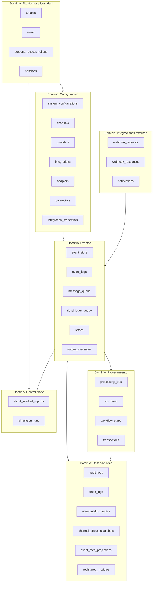

# Arquitectura de Persistencia — Middleware Omnicanal

**Versión:** 2.0  
**Fecha:** 2026-06-24  
**Estado:** Activo  
**Alcance:** Plataforma `platform/event-bus-core` — capa de persistencia del middleware de integración  
**Tablas activas:** 38 (+ `migrations` Laravel)  
**Diagrama ER:** [`er_diagram.md`](er_diagram.md) · **Diccionario:** [`middleware_database_dictionary.md`](middleware_database_dictionary.md)

---

## 1. Resumen ejecutivo

Este documento define la **nueva arquitectura de base de datos** del middleware omnicanal. El sistema deja de modelarse como una aplicación monolítica de retail (productos, pedidos, inventario) y pasa a ser una **plataforma de integración orientada a eventos**, responsable de:

- Ingesta multi-canal (POS, e-commerce, ERP, webhooks, APIs)
- Enrutamiento y publicación de eventos de dominio
- Orquestación de flujos asíncronos
- Trazabilidad end-to-end
- Observabilidad operacional
- Resiliencia ante fallos (reintentos, DLQ)
- Configuración dinámica de integraciones

La persistencia se organiza en **dominios lógicos desacoplados** dentro de una misma instancia de base de datos (monolito modular), preparada para particionamiento futuro por bounded context.

---

## 2. Por qué la base de datos anterior ya no es adecuada

### 2.1 Documentación vs. implementación

El diccionario previo (`data_dictionary.md`) describía un modelo **OLTP de retail** (PRODUCT, ORDER, CUSTOMER, INVENTORY…) que **nunca fue migrado**. Representaba un sistema de negocio, no un middleware.

### 2.2 Tablas operativas fragmentadas

Las tablas existentes (`bus_queue_entries`, `event_feed_entries`, `bus_dead_letters`, `bus_metrics_snapshots`, `middleware_bus_metrics`) cubrían solo observabilidad básica del bus, con los siguientes problemas:

| Problema | Impacto |
|----------|---------|
| Duplicación de payloads en 3 tablas sin FK | Crecimiento descontrolado, posible deriva |
| Métricas duplicadas (`bus_metrics_snapshots` + `middleware_bus_metrics`) | Escrituras dobles, semántica inconsistente |
| Sin modelo de canales ni integraciones | Imposible escalar a multi-proveedor |
| Sin `event_store` append-only | Sin trazabilidad canónica ni replay |
| Sin correlación transaccional | Imposible seguir flujos multi-paso |
| Sin webhooks, workflows ni reintentos explícitos | Integración omnicanal incompleta |
| `event_id` con tipos inconsistentes (UUID vs string) | Fricción en integraciones |
| `system_metrics_snapshots` con KPIs retail huérfanos | Deuda técnica y confusión |
| Sin multi-tenant | Solo viable con instancia por cliente |
| Sin auditoría ni trazas distribuidas | Observabilidad limitada |

### 2.3 Enfoque incorrecto para middleware

Un middleware **no persiste el estado de negocio** (stock, pedidos, clientes). Persiste:

1. **Metadatos de integración** (canales, proveedores, credenciales)
2. **Eventos en tránsito** (cola, store, logs)
3. **Estado de procesamiento** (jobs, workflows, transacciones)
4. **Evidencia operacional** (auditoría, trazas, métricas)
5. **Proyecciones de lectura** (feed del dashboard)

---

## 3. Objetivos de la nueva arquitectura

1. **Alinear persistencia con DDD + EDA** — separación por dominios lógicos, eventos como ciudadanos de primera clase
2. **Desacoplar integraciones** — cada canal/proveedor es configurable sin cambios de esquema
3. **Escalar horizontalmente** — UUIDs, índices estratégicos, tablas append-only, particionamiento lógico por `tenant_id`
4. **Trazabilidad completa** — `correlation_id`, `event_store`, `trace_logs`, `audit_logs`
5. **Resiliencia** — `retries`, `dead_letter_queue`, estados transaccionales explícitos
6. **Observabilidad nativa** — métricas unificadas, snapshots de canal, proyecciones CQRS
7. **Preparar multi-tenant** — columna `tenant_id` opcional en tablas operativas
8. **Mantener compatibilidad de bounded contexts** — Middleware (escritura operativa) y Dashboard (proyecciones de lectura)

---

## 4. Principios de diseño

| Principio | Aplicación |
|-----------|------------|
| **Event-first** | `event_store` es la fuente canónica; demás tablas son proyecciones o estado de procesamiento |
| **Minimal coupling** | FKs solo donde aportan integridad; correlación por UUID en el resto |
| **Append-only donde aplique** | `event_store`, `audit_logs`, `trace_logs` |
| **Soft delete** | Entidades de configuración (`channels`, `integrations`, `providers`) |
| **Versionado** | `system_configurations.version`, `workflows.version`, `event_store.event_version` |
| **UUIDs como identificadores de negocio** | Todos los IDs expuestos a integraciones externas |
| **Timestamps consistentes** | `occurred_at` (dominio), `recorded_at`/`created_at` (infra), `deleted_at` (soft delete) |
| **Separación escritura/lectura** | Dashboard consume proyecciones (`event_feed_projections`, `observability_metrics`) |
| **Configuración sobre código** | Integraciones, adapters y workflows configurables en BD |

---

## 5. Alineación con DDD y EDA

### 5.1 Bounded contexts y persistencia



### 5.2 Flujo EDA de persistencia

```
[Sistema externo] → webhook_requests / connectors
        ↓
   event_store (append-only, canonical)
        ↓
   message_queue (estado de procesamiento)
   outbox_messages (relay transaccional al bus externo)
        ↓
   [Consumidores / workflows]
        ↓
   event_logs + event_feed_projections (proyecciones)
        ↓
   observability_metrics + trace_logs
```

### 5.3 Reglas DDD

- **Middleware BC** escribe en: `event_store`, `message_queue`, `dead_letter_queue`, `retries`, `outbox_messages`, `registered_modules`
- **Dashboard BC** escribe proyecciones en: `event_feed_projections`, `observability_metrics`, `channel_status_snapshots`
- **Control Plane BC** escribe en: `client_incident_reports`, `simulation_runs`
- **Identidad** (`users`, `personal_access_tokens`, `sessions`) soporta portal multi-tenant y API Sanctum
- **Dominios de negocio externos** (Inventario, Pedidos, etc.) mantienen **su propia BD**; el middleware solo registra tránsito

---

## 6. Separación por dominios lógicos

| Dominio | Tablas | Responsabilidad |
|---------|--------|-----------------|
| **Plataforma e identidad** | `tenants`, `users`, `personal_access_tokens`, `sessions`, `cache`, `cache_locks`, `jobs`, `failed_jobs` | Multi-tenant, operadores, API tokens, infra Laravel |
| **Configuración** | `system_configurations` | Settings dinámicos |
| **Canales e integraciones** | `channels`, `providers`, `integrations`, `adapters`, `connectors`, `integration_credentials` | Topología de integración |
| **Eventos** | `event_store`, `event_logs`, `message_queue`, `dead_letter_queue`, `retries`, `outbox_messages` | Ciclo de vida del evento + outbox |
| **Procesamiento** | `processing_jobs`, `workflows`, `workflow_steps`, `transactions` | Orquestación y estado |
| **Webhooks** | `webhook_requests`, `webhook_responses` | Ingesta/respuesta HTTP |
| **Notificaciones** | `notifications` | Alertas outbound |
| **Observabilidad** | `audit_logs`, `trace_logs`, `observability_metrics`, `channel_status_snapshots`, `event_feed_projections`, `registered_modules` | Monitoreo, auditoría, CQRS |
| **Control plane** | `client_incident_reports`, `simulation_runs` | Soporte cliente, simulación de carga |

---

## 7. Estrategia de escalabilidad

### 7.1 Horizontal

- **UUIDs** en todas las entidades expuestas — sin colisiones en sharding futuro
- **`tenant_id` nullable** — particionamiento lógico por cliente cuando se active multi-tenant
- **Tablas append-only** (`event_store`, `audit_logs`) — candidatas a partición por rango temporal
- **Índices compuestos** en consultas frecuentes: `(status, published_at)`, `(event_type, occurred_at)`, `(correlation_id)`

### 7.2 Retención

| Tabla | Política sugerida |
|-------|-------------------|
| `message_queue` | 30 días (configurable en `system_configurations`) |
| `event_store` | 90–365 días según compliance |
| `event_logs` | 30 días |
| `trace_logs` | 7–14 días |
| `audit_logs` | 1–7 años |
| `observability_metrics` | Agregación + purge de granularidad fina |

### 7.3 Crecimiento futuro

- Extracción de `event_store` a almacén dedicado (Event Store DB, Kafka compacted topic)
- Read replicas para Dashboard BC
- Separación física por dominio cuando el volumen lo justifique

---

## 8. Estrategia de observabilidad

### 8.1 Métricas unificadas

La tabla `observability_metrics` reemplaza `bus_metrics_snapshots` y `middleware_bus_metrics`:

- `metric_scope`: `bus | channel | integration | system`
- `metric_key`: identificador semántico (`latency_ms`, `events_per_second`, `queue_size`, `error_rate`)
- `dimensions`: JSON con contexto (channel_id, integration_id)

### 8.2 Trazas distribuidas

`trace_logs` registra spans con `trace_id`, `span_id`, `parent_span_id`, vinculados a `correlation_id` y `event_uuid`.

### 8.3 Proyecciones CQRS

`event_feed_projections` es el read model del Dashboard — desacoplado del write model (`event_store` + `message_queue`). Incluye `correlation_id` desde v2.0 para agrupar flujos en el feed.

### 8.4 Estado de canales

`channel_status_snapshots` reemplaza `node_status_snapshots`, alineado con el modelo de canales omnicanal.

---

## 9. Estrategia de integración

### 9.1 Modelo de integración

```
Provider (ERP, CRM, Payment Gateway)
    └── Integration (conexión lógica)
            ├── Connectors (HTTP, webhook, queue)
            ├── Adapters (transform, validate, enrich)
            └── Integration Credentials (API keys, OAuth)
```

### 9.2 Canales omnicanal

`channels` representa puntos de entrada/salida: POS, e-commerce, WhatsApp, API pública, webhook inbound.

### 9.3 Webhooks

- `webhook_requests`: registro inmutable de cada request recibido
- `webhook_responses`: respuesta enviada, latencia, status HTTP

### 9.4 Registro dinámico

`registered_modules` (antes `middleware_registered_modules`) mantiene el catálogo observado de productores/consumers del bus, complementando la configuración declarativa.

---

## 10. Estrategia de trazabilidad

| Mecanismo | Uso |
|-----------|-----|
| `event_uuid` | Identificador único del evento de dominio |
| `correlation_id` | Agrupa eventos de un mismo flujo de negocio |
| `causation_id` | Evento que causó otro evento |
| `event_store` | Log append-only con payload completo |
| `transactions` | Estado de saga/flujo multi-paso |
| `trace_logs` | Trazas técnicas distribuidas |
| `audit_logs` | Acciones administrativas y cambios de configuración |

---

## 11. Manejo de eventos

### 11.1 Ciclo de vida

```
RECIBIDO → event_store (recorded)
         → message_queue (pending)
         → processing (en curso)
         → completed | failed
         → dead_letter_queue (si agotó reintentos)
```

### 11.2 Idempotencia

- `event_store.event_uuid` UNIQUE — rechaza duplicados en ingesta
- `message_queue.event_uuid` UNIQUE — una fila de cola por evento
- `event_feed_projections.event_uuid` UNIQUE — proyección idempotente

### 11.3 Reintentos

Tabla `retries` registra cada intento programado/ejecutado, vinculado a `message_queue_id`.

### 11.4 Outbox pattern

Tabla `outbox_messages` garantiza publicación transaccional: el evento se persiste en la misma transacción que el write model y un job (`RelayOutboxJob`) lo relaya al bus externo de forma asíncrona.

---

## 12. Resiliencia y tolerancia a fallos

| Mecanismo | Implementación |
|-----------|----------------|
| **Reintentos** | `retries` + `message_queue.attempt_count` / `max_attempts` |
| **Dead Letter Queue** | `dead_letter_queue` con `resolution_action` |
| **Estado transaccional** | `transactions` con estados `started → in_progress → completed/failed/compensating` |
| **Workflows** | `workflows` + `workflow_steps` con `on_failure` configurable |
| **Health checks** | `connectors.health_status` + `channel_status_snapshots` |
| **Soft delete** | Configuración preservada, no eliminada físicamente |

---

## 13. Migración desde esquema anterior

| Tabla anterior | Tabla nueva | Notas |
|----------------|-------------|-------|
| `bus_queue_entries` | `message_queue` | Migración de datos + mapeo de status |
| `bus_dead_letters` | `dead_letter_queue` | Migración directa |
| `event_feed_entries` | `event_feed_projections` | Renombrado + columnas UUID |
| `bus_metrics_snapshots` | `observability_metrics` | scope=`bus` |
| `middleware_bus_metrics` | `observability_metrics` | scope=`bus` |
| `node_status_snapshots` | `channel_status_snapshots` | Migración de nodos |
| `middleware_registered_modules` | `registered_modules` | Renombrado |
| `system_metrics_snapshots` | *(eliminada)* | KPIs retail obsoletos |

---

## 14. Decisiones técnicas clave

1. **SQLite/MySQL compatible** — tipos Laravel estándar, JSON columns, UUID como `char(36)` o native UUID según driver
2. **Monolito modular** — una BD, 38 tablas en 9 dominios lógicos; preparado para split futuro
3. **Sin FK estricta event_store → message_queue** — desacoplamiento; correlación por `event_uuid`
4. **Dashboard BC no escribe en write models** — solo proyecciones
5. **Credenciales encriptadas** — `integration_credentials.encrypted_value` nunca en texto plano
6. **Multi-tenant operativo** — `users.tenant_id` FK + `tenant_id` nullable en tablas operativas
7. **Outbox implementado** — `outbox_messages` para relay transaccional (v2.0)
8. **Control plane persistido** — incidentes de soporte y simulaciones de carga en BD dedicada

---

## 15. Referencias

- [`er_diagram.md`](er_diagram.md) — diagramas ER por dominio (38 tablas)
- [`middleware_database_dictionary.md`](middleware_database_dictionary.md) — diccionario columna a columna
- [`data_dictionary.md`](data_dictionary.md) — modelo retail obsoleto (referencia histórica)
- `database/migrations/` — fuente de verdad del esquema (31 migraciones)
- `docs/Plan_Desarrollo_Servicio_v0.1/Flujo_Middleware.md` — pipeline de 5 etapas
- `docs/Plan_Desarrollo_Servicio_v0.1/DDD_en_la_arquitectura.md` — bounded contexts
- `docs/Modulos/Modulo_Control_Middleware.md` — módulo de control

---

## 16. Evolución planificada

| Fase | Mejora | Estado |
|------|--------|--------|
| v1.1 | Outbox pattern (`outbox_messages`) | **Implementado** (2026-05-21) |
| v1.2 | Identidad multi-tenant (`users.tenant_id`, `platform_role`) | **Implementado** (2026-05-27) |
| v1.3 | Control plane (`client_incident_reports`, `simulation_runs`) | **Implementado** (2026-05-28) |
| v2.0 | Broker externo (Kafka/RabbitMQ) vía outbox relay | Planificado |
| v2.1 | Multi-tenant con RLS o schema-per-tenant | Planificado |
| v2.2 | Particionamiento temporal de `event_store` | Planificado |
| v3.0 | Extracción de dominios a microservicios con BD dedicada | Planificado |
