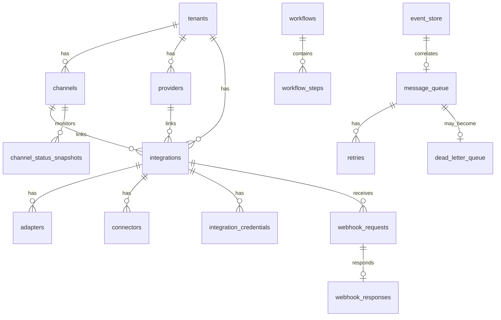

# Diccionario de Datos — Middleware Omnicanal

**Versión:** 1.0  
**Fecha:** 2026-05-21  
**Base de datos:** SQLite (dev) / MySQL (prod)  
**ORM:** Laravel Eloquent  

---

## Índice de dominios

1. [Configuración y multi-tenant](#1-configuración-y-multi-tenant)
2. [Canales e integraciones](#2-canales-e-integraciones)
3. [Eventos y mensajería](#3-eventos-y-mensajería)
4. [Procesamiento y orquestación](#4-procesamiento-y-orquestación)
5. [Webhooks](#5-webhooks)
6. [Notificaciones](#6-notificaciones)
7. [Observabilidad y auditoría](#7-observabilidad-y-auditoría)

---

## Convenciones globales

| Convención | Descripción |
|------------|-------------|
| PK UUID | Identificadores de negocio expuestos (`uuid` column) |
| PK bigint | Tablas append-only de alto volumen (`event_store`, `audit_logs`, `observability_metrics`) |
| `tenant_id` | Nullable; null = instancia single-tenant |
| Timestamps | `created_at`, `updated_at` en entidades mutables; omitidos en append-only |
| Soft delete | `deleted_at` en entidades de configuración |
| Status enums | Valores en minúsculas con guión bajo internamente; mayúsculas en capa legacy del bus |

---

## 1. Configuración y multi-tenant

### 1.1 `tenants`

**Propósito:** Aislamiento lógico multi-tenant. Cada tenant representa un cliente o unidad organizacional.

| Columna | Tipo | Constraints | Descripción |
|---------|------|-------------|-------------|
| `id` | UUID | PK | Identificador del tenant |
| `name` | VARCHAR(120) | NOT NULL | Nombre descriptivo |
| `slug` | VARCHAR(80) | UNIQUE, NOT NULL | Identificador URL-safe |
| `status` | VARCHAR(20) | NOT NULL, DEFAULT `active` | `active`, `suspended`, `archived` |
| `settings` | JSON | NULL | Configuración específica del tenant |
| `created_at` | TIMESTAMP | NOT NULL | |
| `updated_at` | TIMESTAMP | NOT NULL | |
| `deleted_at` | TIMESTAMP | NULL | Soft delete |

**Índices:** `UNIQUE(slug)`, `INDEX(status)`

**Eventos relacionados:** Ninguno directo; contexto para todas las operaciones.

**Flujo:** Creado en onboarding; referenciado por `tenant_id` en tablas operativas.

---

### 1.2 `system_configurations`

**Propósito:** Configuración dinámica del middleware sin redeploy.

| Columna | Tipo | Constraints | Descripción |
|---------|------|-------------|-------------|
| `id` | UUID | PK | |
| `tenant_id` | UUID | FK → tenants, NULL | Null = configuración global |
| `config_key` | VARCHAR(120) | NOT NULL | Clave semántica (`queue.retention_days`) |
| `config_value` | JSON | NOT NULL | Valor tipado |
| `scope` | VARCHAR(30) | NOT NULL | `global`, `tenant`, `integration`, `channel` |
| `version` | INT UNSIGNED | NOT NULL, DEFAULT 1 | Versionado optimista |
| `is_active` | BOOLEAN | NOT NULL, DEFAULT true | |
| `created_at` | TIMESTAMP | NOT NULL | |
| `updated_at` | TIMESTAMP | NOT NULL | |

**Índices:** `UNIQUE(tenant_id, config_key, scope)`, `INDEX(is_active)`

**Eventos:** Cambios generan entradas en `audit_logs`.

---

## 2. Canales e integraciones

### 2.1 `channels`

**Propósito:** Puntos de entrada/salida omnicanal (POS, e-commerce, API, webhook, mobile).

| Columna | Tipo | Constraints | Descripción |
|---------|------|-------------|-------------|
| `id` | UUID | PK | |
| `tenant_id` | UUID | FK → tenants, NULL | |
| `code` | VARCHAR(60) | NOT NULL | Código único por tenant |
| `name` | VARCHAR(120) | NOT NULL | Nombre legible |
| `channel_type` | VARCHAR(30) | NOT NULL | `pos`, `ecommerce`, `mobile`, `social`, `api`, `webhook` |
| `status` | VARCHAR(20) | NOT NULL, DEFAULT `active` | `active`, `inactive`, `maintenance` |
| `metadata` | JSON | NULL | Configuración adicional |
| `created_at` | TIMESTAMP | NOT NULL | |
| `updated_at` | TIMESTAMP | NOT NULL | |
| `deleted_at` | TIMESTAMP | NULL | |

**Índices:** `UNIQUE(tenant_id, code)`, `INDEX(channel_type, status)`

**Eventos:** Eventos publicados incluyen `channel_id` en metadata.

**Flujo:** Configurado en admin → referenciado en ingesta → estado en `channel_status_snapshots`.

---

### 2.2 `providers`

**Propósito:** Sistemas externos con los que el middleware se integra (ERP, CRM, WMS, pasarelas de pago).

| Columna | Tipo | Constraints | Descripción |
|---------|------|-------------|-------------|
| `id` | UUID | PK | |
| `tenant_id` | UUID | FK → tenants, NULL | |
| `code` | VARCHAR(60) | NOT NULL | |
| `name` | VARCHAR(120) | NOT NULL | |
| `provider_type` | VARCHAR(30) | NOT NULL | `erp`, `crm`, `wms`, `payment`, `messaging`, `custom` |
| `base_url` | VARCHAR(500) | NULL | URL base del proveedor |
| `status` | VARCHAR(20) | NOT NULL, DEFAULT `active` | |
| `capabilities` | JSON | NULL | Lista de capacidades soportadas |
| `created_at` | TIMESTAMP | NOT NULL | |
| `updated_at` | TIMESTAMP | NOT NULL | |
| `deleted_at` | TIMESTAMP | NULL | |

**Índices:** `UNIQUE(tenant_id, code)`, `INDEX(provider_type)`

---

### 2.3 `integrations`

**Propósito:** Conexión lógica entre un canal y/o proveedor y el middleware.

| Columna | Tipo | Constraints | Descripción |
|---------|------|-------------|-------------|
| `id` | UUID | PK | |
| `tenant_id` | UUID | FK → tenants, NULL | |
| `channel_id` | UUID | FK → channels, NULL | Canal asociado (opcional) |
| `provider_id` | UUID | FK → providers, NULL | Proveedor asociado (opcional) |
| `code` | VARCHAR(60) | NOT NULL | |
| `name` | VARCHAR(120) | NOT NULL | |
| `direction` | VARCHAR(20) | NOT NULL | `inbound`, `outbound`, `bidirectional` |
| `status` | VARCHAR(20) | NOT NULL, DEFAULT `active` | |
| `config` | JSON | NULL | Configuración de la integración |
| `version` | INT UNSIGNED | NOT NULL, DEFAULT 1 | |
| `created_at` | TIMESTAMP | NOT NULL | |
| `updated_at` | TIMESTAMP | NOT NULL | |
| `deleted_at` | TIMESTAMP | NULL | |

**Índices:** `UNIQUE(tenant_id, code)`, `INDEX(status, direction)`

**Eventos:** `IntegrationConfigured`, `IntegrationActivated` (futuro).

**Flujo:** Integración → connectors + adapters + credentials → procesamiento de eventos.

---

### 2.4 `adapters`

**Propósito:** Componentes de transformación/validación/enriquecimiento en el pipeline.

| Columna | Tipo | Constraints | Descripción |
|---------|------|-------------|-------------|
| `id` | UUID | PK | |
| `integration_id` | UUID | FK → integrations, NOT NULL | |
| `adapter_type` | VARCHAR(30) | NOT NULL | `transform`, `validate`, `enrich`, `route` |
| `handler_class` | VARCHAR(255) | NULL | Clase PHP del handler |
| `config` | JSON | NULL | |
| `priority` | INT | NOT NULL, DEFAULT 0 | Orden de ejecución |
| `is_enabled` | BOOLEAN | NOT NULL, DEFAULT true | |
| `created_at` | TIMESTAMP | NOT NULL | |
| `updated_at` | TIMESTAMP | NOT NULL | |

**Índices:** `INDEX(integration_id, priority)`

---

### 2.5 `connectors`

**Propósito:** Implementación de transporte (HTTP, webhook, cola, archivo).

| Columna | Tipo | Constraints | Descripción |
|---------|------|-------------|-------------|
| `id` | UUID | PK | |
| `integration_id` | UUID | FK → integrations, NOT NULL | |
| `connector_type` | VARCHAR(30) | NOT NULL | `http`, `webhook`, `queue`, `file`, `grpc` |
| `endpoint` | VARCHAR(500) | NULL | URL o identificador del endpoint |
| `config` | JSON | NULL | |
| `health_status` | VARCHAR(20) | NOT NULL, DEFAULT `unknown` | `healthy`, `degraded`, `unhealthy`, `unknown` |
| `last_health_check_at` | TIMESTAMP | NULL | |
| `created_at` | TIMESTAMP | NOT NULL | |
| `updated_at` | TIMESTAMP | NOT NULL | |

**Índices:** `INDEX(integration_id)`, `INDEX(health_status)`

---

### 2.6 `integration_credentials`

**Propósito:** Almacenamiento seguro de credenciales por integración.

| Columna | Tipo | Constraints | Descripción |
|---------|------|-------------|-------------|
| `id` | UUID | PK | |
| `integration_id` | UUID | FK → integrations, NOT NULL | |
| `credential_type` | VARCHAR(30) | NOT NULL | `api_key`, `oauth`, `basic`, `certificate` |
| `encrypted_value` | TEXT | NOT NULL | Valor cifrado (Laravel Crypt) |
| `expires_at` | TIMESTAMP | NULL | |
| `rotated_at` | TIMESTAMP | NULL | |
| `created_at` | TIMESTAMP | NOT NULL | |
| `updated_at` | TIMESTAMP | NOT NULL | |

**Índices:** `INDEX(integration_id, credential_type)`

**Seguridad:** Nunca loguear ni exponer `encrypted_value` en APIs.

---

## 3. Eventos y mensajería

### 3.1 `event_store`

**Propósito:** Log append-only canónico de todos los eventos de dominio. Fuente de verdad para replay y auditoría.

| Columna | Tipo | Constraints | Descripción |
|---------|------|-------------|-------------|
| `id` | BIGINT UNSIGNED | PK, AUTO_INCREMENT | Orden de inserción |
| `event_uuid` | UUID | UNIQUE, NOT NULL | ID del evento de dominio |
| `tenant_id` | UUID | FK → tenants, NULL | |
| `correlation_id` | UUID | NULL, INDEX | ID de flujo de negocio |
| `causation_id` | UUID | NULL | Evento causante |
| `aggregate_type` | VARCHAR(60) | NULL | Tipo de agregado DDD |
| `aggregate_id` | VARCHAR(100) | NULL | ID del agregado |
| `event_type` | VARCHAR(120) | NOT NULL, INDEX | Nombre del evento |
| `event_version` | INT UNSIGNED | NOT NULL, DEFAULT 1 | Versión del schema del evento |
| `origin` | VARCHAR(120) | NOT NULL | Origen (canal, gateway, módulo) |
| `channel_id` | UUID | FK → channels, NULL | |
| `integration_id` | UUID | FK → integrations, NULL | |
| `payload` | JSON | NOT NULL | Payload completo |
| `metadata` | JSON | NULL | Headers, trace context |
| `occurred_at` | TIMESTAMP | NOT NULL, INDEX | Cuándo ocurrió en el dominio |
| `recorded_at` | TIMESTAMP | NOT NULL | Cuándo se persistió |
| `schema_version` | VARCHAR(20) | NULL | Versión del contrato |

**Índices:** `UNIQUE(event_uuid)`, `INDEX(event_type, occurred_at)`, `INDEX(correlation_id)`, `INDEX(aggregate_type, aggregate_id)`

**Eventos:** Todos los eventos de dominio.

**Flujo:** Primer punto de persistencia tras validación → alimenta `message_queue` y proyecciones.

---

### 3.2 `event_logs`

**Propósito:** Log operacional desnormalizado para búsqueda y filtrado rápido.

| Columna | Tipo | Constraints | Descripción |
|---------|------|-------------|-------------|
| `id` | BIGINT UNSIGNED | PK, AUTO_INCREMENT | |
| `event_uuid` | UUID | NOT NULL, INDEX | Referencia lógica a event_store |
| `tenant_id` | UUID | NULL | |
| `event_type` | VARCHAR(120) | NOT NULL, INDEX | |
| `origin` | VARCHAR(120) | NOT NULL | |
| `channel_id` | UUID | NULL | |
| `integration_id` | UUID | NULL | |
| `correlation_id` | UUID | NULL, INDEX | |
| `status` | VARCHAR(20) | NOT NULL | `received`, `processed`, `failed`, `routed` |
| `summary` | VARCHAR(255) | NULL | Resumen legible |
| `payload_hash` | VARCHAR(64) | NULL | SHA-256 para deduplicación |
| `occurred_at` | TIMESTAMP | NOT NULL, INDEX | |
| `logged_at` | TIMESTAMP | NOT NULL | |

**Índices:** `INDEX(event_type, occurred_at)`, `INDEX(status, logged_at)`

---

### 3.3 `message_queue`

**Propósito:** Cola de procesamiento del bus de eventos. Reemplaza `bus_queue_entries`.

| Columna | Tipo | Constraints | Descripción |
|---------|------|-------------|-------------|
| `id` | BIGINT UNSIGNED | PK, AUTO_INCREMENT | |
| `event_uuid` | UUID | UNIQUE, NOT NULL | ID del evento |
| `tenant_id` | UUID | NULL | |
| `message_type` | VARCHAR(120) | NOT NULL, INDEX | Tipo de evento/mensaje |
| `origin` | VARCHAR(120) | NOT NULL, DEFAULT `Unknown` | |
| `channel_id` | UUID | NULL | |
| `integration_id` | UUID | NULL | |
| `target_consumers` | JSON | NULL | Consumidores destino |
| `payload` | JSON | NULL | Referencia al payload (no source of truth) |
| `status` | VARCHAR(20) | NOT NULL, DEFAULT `pending` | `pending`, `processing`, `completed`, `failed`, `dead_lettered` |
| `priority` | INT | NOT NULL, DEFAULT 0 | |
| `correlation_id` | UUID | NULL, INDEX | |
| `published_at` | TIMESTAMP | NULL, INDEX | Entrada al bus |
| `dispatched_at` | TIMESTAMP | NULL | Entrega a consumidores |
| `processing_time_ms` | INT UNSIGNED | NULL | Latencia |
| `attempt_count` | TINYINT UNSIGNED | NOT NULL, DEFAULT 0 | |
| `max_attempts` | TINYINT UNSIGNED | NOT NULL, DEFAULT 3 | |
| `created_at` | TIMESTAMP | NOT NULL | |
| `updated_at` | TIMESTAMP | NOT NULL | |

**Índices:** `UNIQUE(event_uuid)`, `INDEX(status, published_at)`, `INDEX(message_type)`

**Mapeo legacy:** `PROCESADO` → `completed`, `PENDING` → `pending`, `FALLIDO` → `failed`

**Eventos:** Todos los eventos en tránsito por el bus.

**Flujo:** BusTrackingListener escribe → consumidores procesan → status actualizado.

---

### 3.4 `dead_letter_queue`

**Propósito:** Eventos que agotaron reintentos. Reemplaza `bus_dead_letters`.

| Columna | Tipo | Constraints | Descripción |
|---------|------|-------------|-------------|
| `id` | BIGINT UNSIGNED | PK, AUTO_INCREMENT | |
| `message_queue_id` | BIGINT UNSIGNED | NULL | Referencia lógica |
| `event_uuid` | UUID | UNIQUE, NOT NULL | |
| `event_type` | VARCHAR(120) | NOT NULL, INDEX | |
| `origin` | VARCHAR(120) | NOT NULL, DEFAULT `Unknown` | |
| `payload` | JSON | NULL | |
| `failure_reason` | TEXT | NOT NULL | |
| `failure_code` | VARCHAR(60) | NULL | Código de error categorizado |
| `retry_count` | TINYINT UNSIGNED | NOT NULL, DEFAULT 0 | |
| `failed_at` | TIMESTAMP | NOT NULL, INDEX | |
| `resolved_at` | TIMESTAMP | NULL, INDEX | |
| `resolution_action` | VARCHAR(30) | NULL | `requeue`, `discard`, `manual` |
| `created_at` | TIMESTAMP | NOT NULL | |

**Índices:** `UNIQUE(event_uuid)`, `INDEX(failed_at)`, `INDEX(resolved_at)`

**Flujo:** Sync desde `failed_jobs` o tras agotar `retries` → revisión operador → resolve/requeue.

---

### 3.5 `retries`

**Propósito:** Registro explícito de reintentos programados y ejecutados.

| Columna | Tipo | Constraints | Descripción |
|---------|------|-------------|-------------|
| `id` | UUID | PK | |
| `message_queue_id` | BIGINT UNSIGNED | NOT NULL, INDEX | |
| `event_uuid` | UUID | NOT NULL, INDEX | |
| `attempt_number` | TINYINT UNSIGNED | NOT NULL | |
| `scheduled_at` | TIMESTAMP | NOT NULL | |
| `executed_at` | TIMESTAMP | NULL | |
| `status` | VARCHAR(20) | NOT NULL | `scheduled`, `executed`, `skipped`, `exhausted` |
| `error_message` | TEXT | NULL | |
| `created_at` | TIMESTAMP | NOT NULL | |

**Índices:** `INDEX(message_queue_id, attempt_number)`, `INDEX(status, scheduled_at)`

---

## 4. Procesamiento y orquestación

### 4.1 `processing_jobs`

**Propósito:** Tracking de trabajos asíncronos del middleware más allá de Laravel `jobs`.

| Columna | Tipo | Constraints | Descripción |
|---------|------|-------------|-------------|
| `id` | UUID | PK | |
| `tenant_id` | UUID | NULL | |
| `job_type` | VARCHAR(60) | NOT NULL, INDEX | |
| `reference_type` | VARCHAR(60) | NULL | Tipo de entidad referenciada |
| `reference_id` | UUID | NULL | ID de entidad referenciada |
| `payload` | JSON | NOT NULL | |
| `status` | VARCHAR(20) | NOT NULL | `queued`, `running`, `completed`, `failed`, `cancelled` |
| `started_at` | TIMESTAMP | NULL | |
| `completed_at` | TIMESTAMP | NULL | |
| `error` | TEXT | NULL | |
| `created_at` | TIMESTAMP | NOT NULL | |
| `updated_at` | TIMESTAMP | NOT NULL | |

**Índices:** `INDEX(job_type, status)`, `INDEX(reference_type, reference_id)`

---

### 4.2 `workflows`

**Propósito:** Definición de flujos de orquestación multi-paso.

| Columna | Tipo | Constraints | Descripción |
|---------|------|-------------|-------------|
| `id` | UUID | PK | |
| `tenant_id` | UUID | NULL | |
| `code` | VARCHAR(60) | NOT NULL | |
| `name` | VARCHAR(120) | NOT NULL | |
| `description` | TEXT | NULL | |
| `trigger_event_type` | VARCHAR(120) | NULL | Evento que dispara el workflow |
| `status` | VARCHAR(20) | NOT NULL, DEFAULT `draft` | `draft`, `active`, `deprecated` |
| `config` | JSON | NULL | |
| `version` | INT UNSIGNED | NOT NULL, DEFAULT 1 | |
| `created_at` | TIMESTAMP | NOT NULL | |
| `updated_at` | TIMESTAMP | NOT NULL | |
| `deleted_at` | TIMESTAMP | NULL | |

**Índices:** `UNIQUE(tenant_id, code)`, `INDEX(trigger_event_type, status)`

---

### 4.3 `workflow_steps`

**Propósito:** Pasos individuales dentro de un workflow.

| Columna | Tipo | Constraints | Descripción |
|---------|------|-------------|-------------|
| `id` | UUID | PK | |
| `workflow_id` | UUID | FK → workflows, NOT NULL | |
| `step_order` | INT | NOT NULL | Orden secuencial |
| `step_type` | VARCHAR(30) | NOT NULL | `validate`, `transform`, `route`, `notify`, `webhook`, `custom` |
| `name` | VARCHAR(120) | NOT NULL | |
| `config` | JSON | NULL | |
| `on_failure` | VARCHAR(20) | NOT NULL, DEFAULT `retry` | `retry`, `skip`, `abort`, `dlq` |
| `timeout_seconds` | INT UNSIGNED | NULL | |
| `created_at` | TIMESTAMP | NOT NULL | |
| `updated_at` | TIMESTAMP | NOT NULL | |

**Índices:** `UNIQUE(workflow_id, step_order)`

---

### 4.4 `transactions`

**Propósito:** Estado transaccional de flujos multi-evento (sagas, correlación).

| Columna | Tipo | Constraints | Descripción |
|---------|------|-------------|-------------|
| `id` | UUID | PK | |
| `tenant_id` | UUID | NULL | |
| `correlation_id` | UUID | UNIQUE, NOT NULL | ID de correlación del flujo |
| `transaction_type` | VARCHAR(60) | NOT NULL | |
| `status` | VARCHAR(20) | NOT NULL | `started`, `in_progress`, `completed`, `failed`, `compensating` |
| `channel_id` | UUID | NULL | |
| `integration_id` | UUID | NULL | |
| `context` | JSON | NULL | Estado acumulado |
| `started_at` | TIMESTAMP | NOT NULL | |
| `completed_at` | TIMESTAMP | NULL | |
| `created_at` | TIMESTAMP | NOT NULL | |
| `updated_at` | TIMESTAMP | NOT NULL | |

**Índices:** `UNIQUE(correlation_id)`, `INDEX(status, started_at)`

---

## 5. Webhooks

### 5.1 `webhook_requests`

**Propósito:** Registro inmutable de requests HTTP entrantes.

| Columna | Tipo | Constraints | Descripción |
|---------|------|-------------|-------------|
| `id` | UUID | PK | |
| `tenant_id` | UUID | NULL | |
| `integration_id` | UUID | FK → integrations, NULL | |
| `channel_id` | UUID | FK → channels, NULL | |
| `correlation_id` | UUID | NULL, INDEX | |
| `http_method` | VARCHAR(10) | NOT NULL | |
| `request_path` | VARCHAR(500) | NOT NULL | |
| `request_headers` | JSON | NULL | |
| `request_body` | JSON | NULL | |
| `source_ip` | VARCHAR(45) | NULL | |
| `received_at` | TIMESTAMP | NOT NULL, INDEX | |
| `status` | VARCHAR(20) | NOT NULL, DEFAULT `received` | `received`, `processing`, `processed`, `failed` |
| `created_at` | TIMESTAMP | NOT NULL | |

**Índices:** `INDEX(integration_id, received_at)`, `INDEX(status)`

**Flujo:** Request entrante → validación → event_store → webhook_responses.

---

### 5.2 `webhook_responses`

**Propósito:** Respuesta enviada al caller del webhook.

| Columna | Tipo | Constraints | Descripción |
|---------|------|-------------|-------------|
| `id` | UUID | PK | |
| `webhook_request_id` | UUID | FK → webhook_requests, NOT NULL | |
| `http_status` | SMALLINT UNSIGNED | NOT NULL | |
| `response_headers` | JSON | NULL | |
| `response_body` | JSON | NULL | |
| `sent_at` | TIMESTAMP | NOT NULL | |
| `latency_ms` | INT UNSIGNED | NULL | |
| `created_at` | TIMESTAMP | NOT NULL | |

**Índices:** `INDEX(webhook_request_id)`

---

## 6. Notificaciones

### 6.1 `notifications`

**Propósito:** Registro de notificaciones outbound (email, SMS, push, webhook interno).

| Columna | Tipo | Constraints | Descripción |
|---------|------|-------------|-------------|
| `id` | UUID | PK | |
| `tenant_id` | UUID | NULL | |
| `notification_type` | VARCHAR(60) | NOT NULL | |
| `channel` | VARCHAR(30) | NOT NULL | `email`, `sms`, `push`, `webhook`, `internal` |
| `recipient` | VARCHAR(255) | NOT NULL | |
| `subject` | VARCHAR(255) | NULL | |
| `content` | JSON | NOT NULL | |
| `status` | VARCHAR(20) | NOT NULL, DEFAULT `pending` | `pending`, `sent`, `failed` |
| `sent_at` | TIMESTAMP | NULL | |
| `correlation_id` | UUID | NULL, INDEX | |
| `created_at` | TIMESTAMP | NOT NULL | |
| `updated_at` | TIMESTAMP | NOT NULL | |

**Índices:** `INDEX(status, created_at)`, `INDEX(correlation_id)`

---

## 7. Observabilidad y auditoría

### 7.1 `audit_logs`

**Propósito:** Auditoría de acciones administrativas y cambios de configuración.

| Columna | Tipo | Constraints | Descripción |
|---------|------|-------------|-------------|
| `id` | BIGINT UNSIGNED | PK, AUTO_INCREMENT | |
| `tenant_id` | UUID | NULL | |
| `actor_type` | VARCHAR(30) | NULL | `user`, `system`, `api_key` |
| `actor_id` | VARCHAR(100) | NULL | |
| `action` | VARCHAR(60) | NOT NULL, INDEX | |
| `entity_type` | VARCHAR(60) | NOT NULL | |
| `entity_id` | VARCHAR(100) | NOT NULL | |
| `changes` | JSON | NULL | Before/after |
| `ip_address` | VARCHAR(45) | NULL | |
| `user_agent` | VARCHAR(500) | NULL | |
| `occurred_at` | TIMESTAMP | NOT NULL, INDEX | |
| `created_at` | TIMESTAMP | NOT NULL | |

**Índices:** `INDEX(entity_type, entity_id)`, `INDEX(action, occurred_at)`

---

### 7.2 `trace_logs`

**Propósito:** Trazas distribuidas (spans) para observabilidad técnica.

| Columna | Tipo | Constraints | Descripción |
|---------|------|-------------|-------------|
| `id` | UUID | PK | |
| `trace_id` | UUID | NOT NULL, INDEX | |
| `span_id` | UUID | NOT NULL | |
| `parent_span_id` | UUID | NULL | |
| `correlation_id` | UUID | NULL, INDEX | |
| `event_uuid` | UUID | NULL, INDEX | |
| `operation_name` | VARCHAR(120) | NOT NULL | |
| `service_name` | VARCHAR(60) | NOT NULL | |
| `status` | VARCHAR(20) | NOT NULL | `ok`, `error`, `unset` |
| `duration_ms` | INT UNSIGNED | NULL | |
| `attributes` | JSON | NULL | |
| `started_at` | TIMESTAMP | NOT NULL | |
| `ended_at` | TIMESTAMP | NULL | |
| `created_at` | TIMESTAMP | NOT NULL | |

**Índices:** `INDEX(trace_id, span_id)`, `INDEX(correlation_id)`

---

### 7.3 `observability_metrics`

**Propósito:** Métricas unificadas. Reemplaza `bus_metrics_snapshots` y `middleware_bus_metrics`.

| Columna | Tipo | Constraints | Descripción |
|---------|------|-------------|-------------|
| `id` | BIGINT UNSIGNED | PK, AUTO_INCREMENT | |
| `tenant_id` | UUID | NULL | |
| `metric_scope` | VARCHAR(30) | NOT NULL, INDEX | `bus`, `channel`, `integration`, `system` |
| `metric_key` | VARCHAR(60) | NOT NULL, INDEX | `latency_ms`, `events_per_second`, `queue_size`, `error_rate`, `dead_letters_count`, `stream_status` |
| `metric_value` | DECIMAL(15,4) | NOT NULL | Valor numérico |
| `dimensions` | JSON | NULL | Contexto (`channel_id`, `bus_status`, etc.) |
| `recorded_at` | TIMESTAMP | NOT NULL, INDEX | |

**Índices:** `INDEX(metric_scope, metric_key, recorded_at)`

**Mapeo legacy:**

| Origen | metric_scope | metric_key |
|--------|--------------|------------|
| `bus_metrics_snapshots.latency_ms` | `bus` | `latency_ms` |
| `bus_metrics_snapshots.events_per_second` | `bus` | `events_per_second` |
| `bus_metrics_snapshots.error_rate` | `bus` | `error_rate` |
| `bus_metrics_snapshots.dead_letters_count` | `bus` | `dead_letters_count` |
| `bus_metrics_snapshots.bus_status` | `bus` | `stream_status` |
| `middleware_bus_metrics.*` | `bus` | equivalente |

---

### 7.4 `channel_status_snapshots`

**Propósito:** Estado de salud de canales/nodos. Reemplaza `node_status_snapshots`.

| Columna | Tipo | Constraints | Descripción |
|---------|------|-------------|-------------|
| `id` | BIGINT UNSIGNED | PK, AUTO_INCREMENT | |
| `channel_id` | UUID | FK → channels, NULL | |
| `node_code` | VARCHAR(60) | NOT NULL, UNIQUE | Código del nodo (`middleware`, canal code) |
| `status` | VARCHAR(20) | NOT NULL | `ACTIVE`, `DEGRADED`, `STOPPED` |
| `events_enabled` | BOOLEAN | NOT NULL, DEFAULT true | |
| `metadata` | JSON | NULL | |
| `recorded_at` | TIMESTAMP | NOT NULL | |
| `updated_at` | TIMESTAMP | NOT NULL | |

**Índices:** `UNIQUE(node_code)`

---

### 7.5 `event_feed_projections`

**Propósito:** Proyección CQRS del Dashboard. Reemplaza `event_feed_entries`.

| Columna | Tipo | Constraints | Descripción |
|---------|------|-------------|-------------|
| `id` | BIGINT UNSIGNED | PK, AUTO_INCREMENT | |
| `event_uuid` | UUID | UNIQUE, NOT NULL | |
| `event_type` | VARCHAR(120) | NOT NULL, INDEX | |
| `origin` | VARCHAR(120) | NOT NULL | |
| `impact` | VARCHAR(80) | NOT NULL | Resumen legible |
| `status` | VARCHAR(20) | NOT NULL, DEFAULT `SUCCESS` | `SUCCESS`, `PENDING`, `FAILED` |
| `occurred_at` | TIMESTAMP | NOT NULL, INDEX | |
| `received_at` | TIMESTAMP | NOT NULL | |
| `raw_payload` | JSON | NOT NULL | |
| `created_at` | TIMESTAMP | NOT NULL | |

**Índices:** `UNIQUE(event_uuid)`, `INDEX(event_type, occurred_at)`

**Flujo:** UniversalDashboardFeedListener → EventFeedProjector → esta tabla.

---

### 7.6 `registered_modules`

**Propósito:** Catálogo observado de productores/consumers del bus. Reemplaza `middleware_registered_modules`.

| Columna | Tipo | Constraints | Descripción |
|---------|------|-------------|-------------|
| `id` | BIGINT UNSIGNED | PK, AUTO_INCREMENT | |
| `logical_id` | VARCHAR(120) | NOT NULL | |
| `type` | VARCHAR(16) | NOT NULL | `producer`, `consumer` |
| `name` | VARCHAR(120) | NOT NULL | |
| `event_types` | JSON | NOT NULL | Tipos de evento observados |
| `created_at` | TIMESTAMP | NOT NULL | |
| `updated_at` | TIMESTAMP | NOT NULL | |

**Índices:** `UNIQUE(logical_id, type)`

---

## Diagrama de relaciones principales

---

## Tablas de infraestructura Laravel (sin cambios)

| Tabla | Propósito |
|-------|-----------|
| `jobs` | Cola Laravel |
| `failed_jobs` | Jobs fallidos Laravel |
| `cache`, `cache_locks` | Cache |
| `sessions` | Sesiones web |
| `migrations` | Control de migraciones |

---

## Glosario de estados

### message_queue.status

| Valor | Descripción |
|-------|-------------|
| `pending` | En cola, no procesado |
| `processing` | En procesamiento |
| `completed` | Entregado exitosamente |
| `failed` | Falló, puede reintentar |
| `dead_lettered` | Movido a DLQ |

### transactions.status

| Valor | Descripción |
|-------|-------------|
| `started` | Flujo iniciado |
| `in_progress` | En ejecución |
| `completed` | Completado |
| `failed` | Falló |
| `compensating` | Compensación en curso |

---

## Referencias cruzadas

- Arquitectura: `middleware_database_architecture.md`
- Modelo retail obsoleto: `data_dictionary.md` (deprecado)
- Migraciones: `database/migrations/2026_05_21_*`
