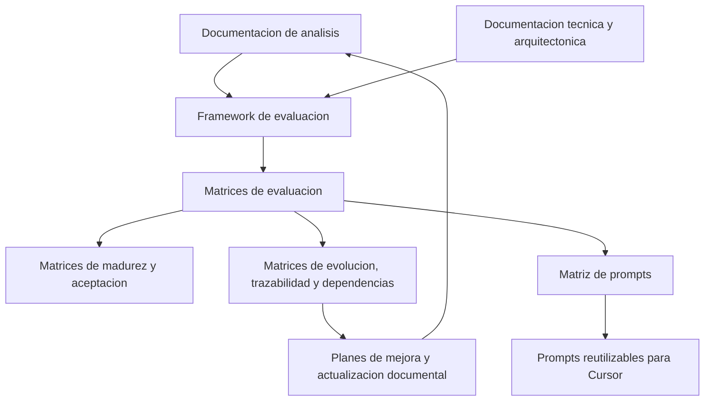
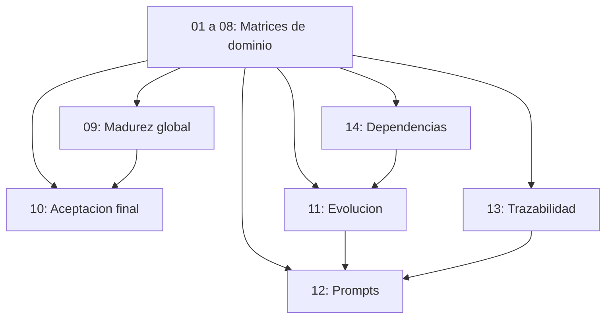

# Guia del Framework de Evaluacion, Gobernanza y Evolucion

## 1. Proposito

Este framework define como evaluar el proyecto de forma reproducible, trazable y accionable.
Su objetivo no es solo puntuar el estado actual, sino convertir cada evaluacion en una ruta de mejora, documentacion y generacion de prompts reutilizables.

El framework se apoya en:

- las matrices de `docs/evaluation`;
- la documentacion tecnica, funcional y arquitectonica de `docs/`;
- el corpus de analisis en `docs/Analisis_v0.1` y `docs/Analisis_v0.2`;
- los planes, ADR, runbooks, guias de despliegue, pruebas y observabilidad del proyecto.

## 2. Filosofia

El framework se rige por seis principios.

### 2.1 Trazabilidad antes que intuicion

Cada criterio debe poder justificar su evaluacion con documentos concretos.
Si una afirmacion no tiene respaldo documental, no debe darse por valida.

### 2.2 Evaluar para actuar

Una evaluacion util no termina en un numero.
Debe producir una brecha, una mejora, un impacto, una prioridad y un plan de accion.

### 2.3 No inventar capacidades

Todo lo que el framework describa debe existir en la documentacion o quedar explicitamente marcado como estructura propuesta.

### 2.4 Separar evidencia, juicio y accion

- La evidencia muestra lo que existe.
- El juicio interpreta la evidencia.
- La accion convierte la brecha en cambios concretos.

### 2.5 Reutilizacion

El framework debe servir para iterar muchas veces sobre el proyecto sin rehacer el analisis desde cero.

### 2.6 Gobernanza continua

Cada evaluacion debe dejar capacidad de auditoria, revision y comparacion historica.

## 3. Arquitectura general del framework

El sistema documental se organiza en cuatro capas.

### 3.1 Capa de conocimiento

Incluye:

- `docs/architecture/`
- `docs/production/`
- `docs/Plan_Desarrollo_*`
- `docs/Analisis_v0.1/`
- `docs/Analisis_v0.2/`
- `docs/testing/`
- `docs/refactorizacion/`

### 3.2 Capa de evaluacion

Incluye las matrices `01` a `08`, que evaluan dominios especificos.

### 3.3 Capa de consolidacion

Incluye `09_Matriz_Madurez_Global.csv` y `10_Matriz_Aceptacion_Final.csv`.

### 3.4 Capa de evolucion

Incluye `11_Matriz_Evolucion.csv`, `12_Matriz_Prompts.csv`, `13_Matriz_Trazabilidad.csv` y `14_Matriz_Dependencias.csv`.

## 4. Flujo de trabajo general

## 5. Organización de carpetas

### 5.1 `docs/evaluation`

Contiene el framework, sus matrices y sus guias operativas.

### 5.2 `docs/architecture`

Contiene la representacion arquitectonica de alto nivel, el diccionario y la arquitectura de persistencia del middleware.

### 5.3 `docs/production`

Contiene planes, ADR, runbooks, guias y documentos operativos.

### 5.4 `docs/Analisis_v0.1` y `docs/Analisis_v0.2`

Contienen la base de conocimiento documental usada para justificar decisiones, conceptos y patrones.

### 5.5 `docs/testing`

Contiene referencias de pruebas, catalogos y guias de validacion que alimentan la parte de instrumentos y planes de prueba.

## 6. Relacion entre matrices

### 6.1 Matrices de dominio

Las matrices de dominio expresan la evaluacion detallada por capacidad.

### 6.2 Matrices de consolidacion

Las matrices de consolidacion convierten el detalle en una lectura ejecutiva.

### 6.3 Matrices de evolucion

Las matrices de evolucion convierten brechas en acciones.

### 6.4 Matriz de prompts

La matriz de prompts convierte la evaluacion en instrucciones reutilizables para Cursor.

### 6.5 Matriz de trazabilidad

La matriz de trazabilidad confirma que cada criterio se apoya en evidencia documental real.

### 6.6 Matriz de dependencias

La matriz de dependencias explica que debe ocurrir antes de poder cerrar una brecha.

## 7. Relacion con la documentacion de analisis

La documentacion de analisis no reemplaza a la documentacion tecnica.
La complementa.

Su papel dentro del framework es:

- justificar por que la arquitectura propuesta tiene sentido;
- respaldar el uso de EDA, DDD, middleware, observabilidad y gobernanza;
- aportar contexto comparativo;
- reforzar decisiones metodologicas;
- servir como fuente de trazabilidad historica.

Cuando un criterio se apoya en analisis, debe indicarse en la columna `Fuentes_Analisis`.
Cuando un criterio se apoya en arquitectura u operacion, debe indicarse en `Documentos_Base`.

## 8. Relacion con futuras implementaciones

El framework tambien sirve como puente hacia la ejecucion tecnica.

Cada brecha debe poder derivar en:

- cambios de codigo;
- cambios de configuracion;
- cambios de pruebas;
- cambios de documentacion;
- cambios de runbooks;
- cambios de observabilidad;
- cambios en prompts reutilizables.

## 9. Lo que el framework no hace

Este framework no sustituye:

- auditorias de seguridad especializadas;
- pruebas funcionales de producto;
- benchmark de produccion;
- analisis financiero;
- discovery de producto.

Si alguna de esas capacidades se necesita, debe incorporarse como instrumento complementario.

## 10. Fuentes documentales principales

- [docs/architecture/Architecture_Blueprint.md](../architecture/Architecture_Blueprint.md)
- [docs/architecture/middleware_database_architecture.md](../architecture/middleware_database_architecture.md)
- [docs/production/Plan_Middleware.md](../production/Plan_Middleware.md)
- [docs/production/Plan_Integraciones.md](../production/Plan_Integraciones.md)
- [docs/production/Plan_Observabilidad.md](../production/Plan_Observabilidad.md)
- [docs/production/Plan_Seguridad.md](../production/Plan_Seguridad.md)
- [docs/production/Plan_Tenants.md](../production/Plan_Tenants.md)
- [docs/production/Plan_Resiliencia.md](../production/Plan_Resiliencia.md)
- [docs/production/Plan_CI_CD.md](../production/Plan_CI_CD.md)
- [docs/production/Plan_Cloud.md](../production/Plan_Cloud.md)
- [docs/production/Plan_APIs.md](../production/Plan_APIs.md)
- [docs/production/Plan_Calidad.md](../production/Plan_Calidad.md)
- [docs/evaluation/Middleware_Acceptance_Evaluation_Framework.md](Middleware_Acceptance_Evaluation_Framework.md)

