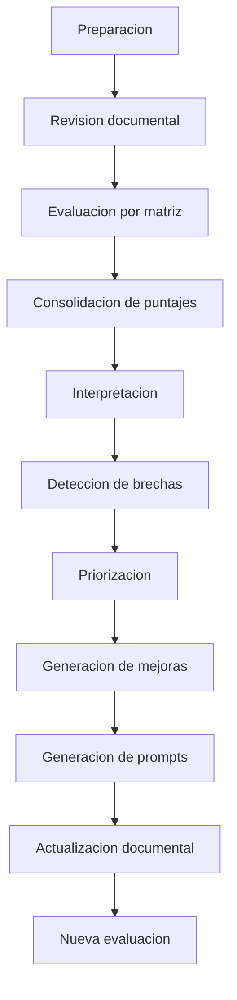

# Guia de Evaluacion de Software

## 1. Proposito

Este documento explica el procedimiento formal para evaluar el proyecto desde cero usando el framework de evaluacion.

La meta es obtener una lectura objetiva del estado del sistema y convertirla en:

- brechas;
- prioridades;
- mejoras;
- prompts;
- actualizaciones documentales;
- nueva iteracion de evaluacion.

## 2. Entradas necesarias

Antes de evaluar, deben estar disponibles:

- las matrices de `docs/evaluation`;
- la documentacion tecnica de `docs/architecture` y `docs/production`;
- la documentacion de analisis en `docs/Analisis_v0.1` y `docs/Analisis_v0.2`;
- la documentacion de pruebas en `docs/testing`;
- los runbooks, ADR y planes relacionados.

## 3. Procedimiento completo

### 3.1 Preparacion

Definir:

- alcance;
- version a evaluar;
- fecha de corte;
- responsable de la evaluacion;
- matrices que se van a utilizar;
- fuentes documentales de referencia.

### 3.2 Revision documental

Leer la documentacion de base antes de puntuar.

La lectura minima debe cubrir:

- arquitectura;
- middleware;
- integracion;
- observabilidad;
- seguridad;
- operacion;
- calidad;
- IA;
- trazabilidad y dependencias.

### 3.3 Evaluacion por matriz

Para cada criterio:

1. leer la definicion;
2. revisar la evidencia;
3. identificar si la capacidad existe;
4. identificar si la capacidad esta documentada pero no implementada;
5. identificar si la capacidad existe parcialmente;
6. registrar la brecha;
7. asignar puntaje.

### 3.4 Consolidacion de puntajes

Calcular el puntaje por dominio y luego el global.

La consolidacion debe considerar:

- peso del criterio;
- criticidad del dominio;
- dependencias;
- riesgo residual.

### 3.5 Interpretacion

La lectura no debe limitarse al promedio.

Debe responder:

- que dominios estan sanos;
- que dominios son fragiles;
- que brechas bloquean otras mejoras;
- que dominios requieren accion inmediata.

### 3.6 Deteccion de brechas

Una brecha es cualquier diferencia entre:

- lo que la documentacion promete;
- lo que el sistema demuestra;
- lo que el framework necesita para considerarlo maduro.

### 3.7 Priorizacion

La prioridad se determina por:

- criticidad del dominio;
- riesgo de falla;
- impacto transversal;
- dependencia de otros criterios;
- costo de no actuar.

### 3.8 Generacion de mejoras

Cada brecha debe convertirse en una mejora concreta.

Ejemplo:

- brecha: `correlation_id` no propagado;
- mejora: introducir middleware de correlacion y escrituras consistentes;
- impacto: trazabilidad y MTTR mejorados.

### 3.9 Generacion de prompts

La mejora debe poder transformarse en un prompt reutilizable.

La matriz de prompts toma:

- contexto;
- restricciones;
- documentacion;
- archivos potenciales;
- dependencias;
- riesgos;
- pruebas;
- documentacion a actualizar.

### 3.10 Actualizacion documental

Si una mejora cambia el criterio o la arquitectura, tambien debe actualizar:

- planes;
- ADR;
- runbooks;
- guias;
- matrices.

### 3.11 Nueva evaluacion

Toda mejora importante debe volver a evaluarse.

La nueva evaluacion confirma:

- si el cambio se implemento;
- si la brecha se redujo;
- si aparecieron nuevas dependencias;
- si el puntaje mejoro.

## 4. Primera iteracion metodologica sobre el proyecto actual

La lectura inicial del proyecto, usando las matrices y la documentacion existente, muestra lo siguiente.

### 4.1 Estado actual

El proyecto tiene una base documental fuerte en:

- arquitectura de integracion;
- middleware orientado a eventos;
- observabilidad;
- seguridad;
- tenants;
- resiliencia;
- APIs;
- calidad;
- IA aplicada a la documentacion y a la arquitectura.

### 4.2 Fortalezas

- Existe un blueprint arquitectonico claro.
- El middleware esta documentado como nucleo de integracion.
- Hay planes especificos para seguridad, observabilidad, integracion, cloud, CI/CD, tenants y resiliencia.
- La matriz de trazabilidad permite conectar analisis con decisiones.
- La matriz de prompts permite convertir brechas en acciones reutilizables.

### 4.3 Debilidades

- El event store canonico aun aparece como pendiente de completitud en la documentacion.
- La correlacion de trazabilidad no esta plenamente consolidada en toda la cadena.
- La autenticacion y el hardening siguen documentados como incompletos en varias superficies.
- El despliegue reproducible y la automatizacion de cloud siguen en evolucion.
- No existe un `Plan_Operacion.md` unificado; la operacion esta distribuida entre tenants, cloud, resiliencia, monitoreo y runbooks.

### 4.4 Brechas principales

- falta cerrar el flujo canonico de eventos;
- falta completar la cadena de observabilidad end to end;
- falta endurecer la superficie de acceso;
- falta consolidar la operacion como experiencia reproducible;
- falta homogeneizar la consistencia documental en toda la plataforma.

### 4.5 Riesgos

- perdida de trazabilidad en incidentes;
- errores operativos por reintentos o DLQ no consolidados;
- exposicion de endpoints;
- despliegues inconsistentes;
- dependencia excesiva de procedimientos manuales.

### 4.6 Oportunidades

- convertir el middleware en un activo de plataforma;
- automatizar la lectura de brechas hacia prompts;
- reforzar la trazabilidad documental;
- mejorar la capacidad de iteracion del equipo;
- reducir el costo de mantenimiento.

### 4.7 Recomendaciones

Prioridad alta para:

- seguridad;
- middleware;
- observabilidad;
- operacion.

Prioridad media para:

- IA gobernada;
- coherencia documental;
- versionado y contratos.

### 4.8 Lectura ejecutiva

El proyecto ya no se ve como un conjunto disperso de matrices.
Ahora tiene una estructura utilizable.

Sin embargo, la madurez ejecutiva depende de cerrar la brecha entre la documentacion y la capacidad operacional real.

## 5. Resultado esperado de una evaluacion

Una evaluacion formal debe producir:

- puntajes por criterio;
- puntajes por dominio;
- puntaje global;
- lista de brechas;
- lista de riesgos;
- lista de mejoras;
- lista de prioridades;
- lista de prompts;
- lista de documentos a actualizar;
- lista de pruebas necesarias.

## 6. Relacion con la iteracion continua

La evaluacion no termina cuando se calcula el puntaje.

Termina cuando la mejora fue:

- implementada;
- documentada;
- probada;
- re-evaluada.

## 7. Fuentes documentales de apoyo

- [docs/evaluation/Middleware_Acceptance_Evaluation_Framework.md](Middleware_Acceptance_Evaluation_Framework.md)
- [docs/evaluation/09_Matriz_Madurez_Global.csv](09_Matriz_Madurez_Global.csv)
- [docs/evaluation/10_Matriz_Aceptacion_Final.csv](10_Matriz_Aceptacion_Final.csv)
- [docs/evaluation/11_Matriz_Evolucion.csv](11_Matriz_Evolucion.csv)
- [docs/production/Plan_Middleware.md](../production/Plan_Middleware.md)
- [docs/production/Plan_Observabilidad.md](../production/Plan_Observabilidad.md)
- [docs/production/Plan_Seguridad.md](../production/Plan_Seguridad.md)
- [docs/production/Plan_Resiliencia.md](../production/Plan_Resiliencia.md)
- [docs/production/Plan_Tenants.md](../production/Plan_Tenants.md)
- [docs/production/Plan_Cloud.md](../production/Plan_Cloud.md)
- [docs/production/Plan_APIs.md](../production/Plan_APIs.md)
- [docs/production/Plan_Calidad.md](../production/Plan_Calidad.md)

