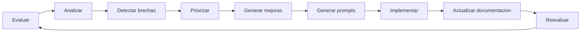

# Guia de Iteracion del Framework

## 1. Proposito

Este documento describe el ciclo completo del framework como un sistema vivo de evaluacion y mejora continua.

El flujo es:

1. evaluar;
2. analizar;
3. detectar brechas;
4. generar mejoras;
5. implementar;
6. actualizar documentacion;
7. volver a evaluar.

## 2. Ciclo metodologico

## 3. Fases del ciclo

### 3.1 Evaluar

Se revisan las matrices y la documentacion base.

Salida:

- puntajes;
- observaciones;
- evidencias;
- brechas iniciales.

### 3.2 Analizar

Se interpretan los puntajes.

Salida:

- dominios debiles;
- dominios fuertes;
- dependencias;
- riesgos;
- oportunidades.

### 3.3 Detectar brechas

Cada hallazgo debe expresarse de forma operativa:

- que falta;
- por que importa;
- que bloquea;
- que documento lo demuestra.

### 3.4 Priorizar

Las brechas se ordenan por:

- criticidad;
- impacto;
- dependencia;
- costo de no actuar;
- urgencia de negocio o arquitectura.

### 3.5 Generar mejoras

Cada brecha debe convertirse en una accion concreta.

La mejora debe incluir:

- cambio tecnico;
- cambio documental;
- pruebas requeridas;
- riesgo;
- resultado esperado.

### 3.6 Generar prompts

La matriz de prompts transforma la mejora en una instruccion reutilizable.

### 3.7 Implementar

La salida de la evaluacion se usa para producir cambios reales.

Esto puede incluir:

- codigo;
- configuracion;
- pruebas;
- documentacion;
- runbooks;
- observabilidad;
- seguridad;
- infraestructura.

### 3.8 Actualizar documentacion

Toda implementacion debe reflejarse en:

- planos;
- ADR;
- runbooks;
- matrices;
- guias;
- changelog.

### 3.9 Reevaluar

Se repite el proceso para confirmar que la brecha disminuyo.

## 4. Rol de cada matriz en la iteracion

| Matriz | Rol |
|---|---|
| `01` a `08` | evaluar capacidades por dominio |
| `09` | consolidar madurez |
| `10` | decidir aceptacion |
| `11` | convertir brechas en plan |
| `12` | generar prompts reutilizables |
| `13` | validar respaldo documental |
| `14` | registrar dependencias y bloqueos |

## 5. Primera iteracion del framework sobre el estado actual del proyecto

La primera lectura metodologica del proyecto, basada en la documentacion y las matrices existentes, deja este panorama:

### 5.1 Estado actual

El proyecto tiene una base documental madura y una estructura de evaluacion ya normalizada.

### 5.2 Fortalezas

- arquitectura claramente documentada;
- middleware definido como nucleo de integracion;
- trazabilidad documental entre analisis y decisiones;
- planes para seguridad, observabilidad, cloud, resiliencia y calidad;
- matriz de prompts como puente entre evaluacion y ejecucion.

### 5.3 Debilidades

- el event store canonico no aparece como totalmente consolidado en la documentacion operativa;
- la observabilidad necesita una cadena completa de correlacion;
- la seguridad todavia tiene superficies documentadas como no protegidas;
- la operacion esta distribuida entre varios documentos y no en un plan unificado;
- la coherencia editorial debe mantenerse con mayor disciplina.

### 5.4 Brechas

- falta completar la trazabilidad end to end;
- falta cerrar reintentos, DLQ y recovery operativo de forma uniforme;
- falta homogeneizar los contratos y la documentacion;
- falta consolidar la operacion como sistema reproducible.

### 5.5 Riesgos

- degradacion sin diagnostico rapido;
- exposicion de endpoints;
- despliegues manuales o inconsistentes;
- brechas entre documentacion y ejecucion;
- prompts generados con contexto incompleto si la trazabilidad no se mantiene.

### 5.6 Oportunidades

- convertir el framework en base de gobierno continuo;
- usar la matriz de prompts como motor de implementacion;
- mejorar la iteracion tecnica sin perder trazabilidad;
- hacer del corpus documental una fuente auditables de decisiones.

### 5.7 Recomendacion inicial

La siguiente iteracion debe priorizar:

1. seguridad;
2. middleware;
3. observabilidad;
4. operacion;
5. calidad documental y versionado;
6. IA gobernada.

## 6. Resultado de cada iteracion

Cada iteracion debe dejar al menos estos artefactos:

- evaluacion actualizada;
- matriz de madurez;
- matriz de aceptacion;
- matriz de evolucion;
- matriz de prompts actualizada;
- trazabilidad actualizada;
- nuevas dependencias si aparecen;
- documentacion sincronizada.

## 7. Regla de cierre

Una iteracion no se considera terminada hasta que:

- la mejora fue implementada o descartada con justificacion;
- la documentacion fue sincronizada;
- la evaluacion fue repetida.

## 8. Referencias

- [docs/evaluation/Middleware_Acceptance_Evaluation_Framework.md](Middleware_Acceptance_Evaluation_Framework.md)
- [docs/evaluation/11_Matriz_Evolucion.csv](11_Matriz_Evolucion.csv)
- [docs/evaluation/12_Matriz_Prompts.csv](12_Matriz_Prompts.csv)
- [docs/evaluation/13_Matriz_Trazabilidad.csv](13_Matriz_Trazabilidad.csv)
- [docs/evaluation/14_Matriz_Dependencias.csv](14_Matriz_Dependencias.csv)
- [docs/production/Plan_Middleware.md](../production/Plan_Middleware.md)
- [docs/production/Plan_Observabilidad.md](../production/Plan_Observabilidad.md)
- [docs/production/Plan_Seguridad.md](../production/Plan_Seguridad.md)
- [docs/production/Plan_Resiliencia.md](../production/Plan_Resiliencia.md)

