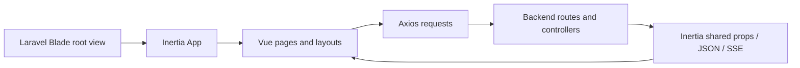
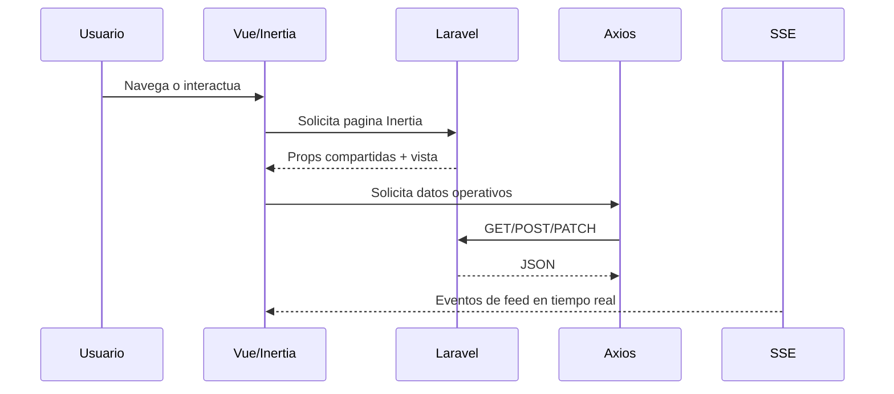

# Capítulo 7. Arquitectura Tecnológica del Sistema

## 7.1 Propósito del capítulo

Este capítulo describe la arquitectura tecnológica empleada para implementar la interfaz del sistema, su organización interna y la forma en que la capa frontend interactúa con el backend.

La documentación se limita a los componentes y tecnologías efectivamente presentes en el repositorio. Cuando un aspecto no cuenta con evidencia documental suficiente, se indica de forma explícita.

---

## 7.2 Contexto tecnológico del frontend

La capa de presentación del sistema está construida sobre una combinación de tecnologías orientadas a aplicaciones web modernas con renderizado server-driven y experiencia interactiva mediante Inertia.

Las tecnologías visibles en el repositorio son:

- **Vue 3** como framework de componentes;
- **Inertia.js** como puente entre Laravel y la experiencia SPA;
- **Vite** como herramienta de bundling y desarrollo;
- **Axios** para consumo HTTP desde el frontend;
- **Tailwind CSS** para estilos utilitarios;
- **PostCSS** como parte de la cadena de estilos;
- **Inter** como tipografía principal;
- **Material Symbols** como sistema de iconografía;
- **Laravel Blade** como plantilla base de montaje.

Esta combinación permite una interfaz modular, con navegación por páginas Inertia, persistencia de contexto entre vistas y comunicación directa con endpoints del backend sin necesidad de un router SPA independiente.



---

## 7.3 Estructura del proyecto frontend

La estructura del frontend se encuentra en `resources/` y se organiza por responsabilidades funcionales.

### 7.3.1 Estructura principal observada

```text
resources/
├─ css/
│  ├─ app.css
│  └─ material-icons.css
├─ js/
│  ├─ app.js
│  ├─ bootstrap.js
│  ├─ csrf.js
│  ├─ platform-node-events.js
│  ├─ composables/
│  │  └─ useDashboardEventStream.js
│  ├─ Components/
│  │  └─ Dashboard/
│  │     ├─ EventFlowTopology.vue
│  │     └─ ModulesTopologyPanel.vue
│  ├─ Layouts/
│  │  ├─ AppLayout.vue
│  │  └─ ControlLayout.vue
│  ├─ lib/
│  │  └─ systemModules.js
│  ├─ services/
│  │  └─ modulesCatalog.js
│  └─ Pages/
│     ├─ Auth/
│     ├─ Control/
│     ├─ Dashboard/
│     ├─ Middleware/
│     └─ Tenant/
└─ views/
   └─ app.blade.php
```

### 7.3.2 Función de cada zona

- `resources/js/app.js`: punto de entrada de Inertia y Vue.
- `resources/js/bootstrap.js`: inicialización de `axios` y cabeceras CSRF.
- `resources/js/Layouts/`: contenedores visuales de navegación y estructura común.
- `resources/js/Pages/`: vistas ruteadas por Inertia.
- `resources/js/Components/`: piezas reutilizables de interfaz.
- `resources/js/composables/`: lógica reactiva reutilizable.
- `resources/js/lib/` y `resources/js/services/`: utilidades de normalización y consumo de datos.
- `resources/css/`: estilos globales y utilidades visuales.
- `resources/views/app.blade.php`: raíz HTML que monta la aplicación.

---

## 7.4 Tecnologías del frontend

### 7.4.1 Vue 3

Vue se usa como capa de composición de interfaz. Los archivos `.vue` contienen:

- plantillas declarativas;
- lógica reactiva;
- componentes visuales;
- consumo de props provenientes de Inertia;
- llamadas HTTP para refresco de datos;
- manejo de estados locales.

### 7.4.2 Inertia.js

Inertia actúa como mecanismo de navegación entre Laravel y Vue sin requerir un router SPA separado.

En el proyecto:

- `resources/js/app.js` crea la app Inertia;
- `resolvePageComponent` carga las páginas desde `resources/js/Pages/**/*.vue`;
- `HandleInertiaRequests` y `InertiaSharedPropsResolver` comparten datos globales;
- `app.blade.php` define la vista raíz y los metadatos del documento.

### 7.4.3 Vite

Vite se usa para el empaquetado y desarrollo local.

La configuración observada:

- usa `resources/js/app.js` como entrada;
- define alias `@` hacia `resources/js`;
- habilita HMR en desarrollo;
- integra el plugin de Laravel para refresco de vistas.

### 7.4.4 Tailwind CSS

Tailwind CSS es la base de estilos utilitarios del frontend.

La configuración observada define:

- colores de superficie y contraste;
- tipografía `Inter`;
- radios y espaciados personalizados;
- soporte para dark mode por clase;
- plugin de formularios.

### 7.4.5 Axios

Axios se utiliza para las llamadas HTTP desde la interfaz hacia el backend.

La inicialización global se realiza en `resources/js/bootstrap.js`, donde se configura:

- `X-Requested-With`;
- `withCredentials`;
- cabecera CSRF inicial;
- interceptor para sincronizar cabeceras CSRF.

### 7.4.6 Iconografía y tipografía

La interfaz usa:

- `@fontsource/inter`;
- `@material-symbols/font-400`;
- clases y utilidades propias para iconos y animaciones.

---

## 7.5 Componentes principales del frontend

### 7.5.1 `resources/js/app.js`

Es el punto de entrada principal.

Su responsabilidad es:

- importar bootstrap y estilos globales;
- crear la aplicación Vue;
- inicializar Inertia;
- sincronizar CSRF después de eventos exitosos;
- resolver páginas desde `resources/js/Pages/`;
- definir el título del documento desde metadatos HTML.

### 7.5.2 `resources/js/Layouts/AppLayout.vue`

Es el layout principal para el portal operativo.

Incluye:

- barra lateral;
- top bar;
- contenedor de contenido;
- panel en vivo de nodos;
- panel de notificaciones y soporte;
- acciones de logout;
- visibilidad condicional según permisos del usuario.

### 7.5.3 `resources/js/Layouts/ControlLayout.vue`

Es el layout del plano de control.

Incluye:

- navegación lateral por secciones;
- cabecera fija;
- indicador de datos en vivo;
- identidad de rol de administración SaaS.

### 7.5.4 `resources/js/Pages/Dashboard/Index.vue`

Representa el dashboard global de la instancia.

Se encarga de:

- mostrar KPI configurables;
- visualizar topología de flujo;
- presentar nodo y bus en tiempo real;
- consumir feed de eventos;
- refrescar métricas y nodos;
- mantener el estado reactivo del panel.

### 7.5.5 `resources/js/Pages/Middleware/Index.vue`

Representa la vista técnica del middleware.

Se encarga de:

- mostrar latencia global;
- mostrar EPS y error rate;
- presentar topología de productores, bus y consumidores;
- visualizar cola FIFO;
- mostrar DLQ;
- sincronizar módulos configurados.

### 7.5.6 `resources/js/Pages/Control/Overview/Index.vue`

Representa la vista de resumen global del plano de control.

Se usa para:

- visualizar tenants;
- ver estado del bus;
- ver profundidad de cola;
- consultar alertas activas.

### 7.5.7 Componentes reutilizables

Los componentes reutilizables identificados incluyen:

- `EventFlowTopology.vue`
- `ModulesTopologyPanel.vue`

Estos componentes encapsulan visualizaciones de topología y distribución de módulos.

### 7.5.8 Lógica compartida y utilidades

El frontend también usa:

- `useDashboardEventStream.js` para SSE;
- `systemModules.js` para normalizar estado de nodos;
- `modulesCatalog.js` para normalizar y consumir catálogo de módulos;
- `csrf.js` para sincronización CSRF;
- `platform-node-events.js` para propagación de cambios entre paneles.

---

## 7.6 Manejo de rutas

El frontend no utiliza un enrutador SPA independiente.
La navegación se apoya en rutas Laravel e Inertia.

### 7.6.1 Enrutamiento general

El archivo `routes/web.php` define:

- login y logout;
- redirección de la raíz a `/dashboard`;
- rutas de dashboard;
- rutas de middleware;
- rutas de soporte;
- rutas del plano de control;
- rutas legacy redirigidas.

### 7.6.2 Separación por contextos

El proyecto separa las rutas en funciones de negocio distintas:

- `routes/web.php`
- `routes/control.php`
- `routes/tenant_portal.php`
- `routes/api.php`

La información disponible muestra además que algunas rutas de API son cargadas por proveedores de servicio por contexto, y que `routes/api.php` funciona como un bootstrap placeholder.

### 7.6.3 Rutas visibles desde el frontend

En las vistas Vue se usan enlaces y llamadas hacia rutas como:

- `/dashboard`
- `/middleware`
- `/control/...`
- `/api/dashboard/...`
- `/api/middleware/...`
- `/support/...`
- `/logout`

### 7.6.4 Modo de navegación

La navegación visible se realiza principalmente con:

- `Link` de Inertia;
- redirecciones Laravel;
- actualización de props y datos compartidos;
- refresco manual o automático por polling / SSE.

### 7.6.5 Control de acceso

Las rutas operativas están protegidas por middleware como:

- `auth.platform.web`
- `instance.web`
- `instance.portal`

Esto limita el acceso a vistas según el contexto de instancia o control plane.

---

## 7.7 Comunicación con el backend

La comunicación frontend-backend se da por tres mecanismos principales:

1. **Propiedades compartidas de Inertia**
2. **Solicitudes HTTP con Axios**
3. **Flujo SSE para eventos en tiempo real**

### 7.7.1 Propiedades compartidas de Inertia

`HandleInertiaRequests` delega en `InertiaSharedPropsResolver`.

Ese resolver comparte:

- usuario autenticado;
- rol de plataforma;
- `tenant_id`;
- flags de acceso a dashboard y middleware;
- contexto de portal;
- datos de instancia;
- datos de simulación;
- conteo de soporte sin leer;
- flash messages;
- token CSRF.

Esto permite que el frontend tenga contexto global sin pedirlo manualmente en cada vista.

### 7.7.2 Comunicación vía Axios

Las páginas consumen endpoints HTTP para refrescar estado operativo y ejecutar acciones.

#### Dashboard

Se observan llamadas a:

- `GET /api/dashboard/nodes/status`
- `GET /api/dashboard/metrics`
- `GET /api/dashboard/events/feed`
- `GET /dashboard/nodes/{node}/refresh`
- `PATCH /dashboard/nodes/{node}/middleware-events`
- `GET /dashboard/metrics/series/{metric}`

#### Middleware

Se observan llamadas a:

- `GET /api/middleware/metrics`
- `GET /api/middleware/queue`
- `GET /api/middleware/topology`
- `GET /api/middleware/simulation-pulse`
- `POST /api/middleware/registry/sync-config`

#### Soporte

Se observan llamadas a:

- `GET /support/notifications`
- `GET /support/reports/{report}`
- `POST /support/reports`
- `POST /support/notifications/read-all`
- `POST /support/notifications/{report}/read`

### 7.7.3 Comunicación en tiempo real mediante SSE

`useDashboardEventStream.js` abre una conexión `EventSource` contra:

- `/api/dashboard/stream`
- o `/api/dashboard/stream?last_id=...`

Esta conexión complementa el polling.
Su función es empujar eventos de feed al dashboard y activar refrescos de actividad.

### 7.7.4 Sincronización CSRF

La sincronización CSRF está gestionada en `resources/js/app.js` y `resources/js/bootstrap.js`.

El frontend:

- lee el token desde metadatos HTML;
- sincroniza el header CSRF;
- mantiene credenciales en solicitudes axios;
- actualiza el token al cambiar la página Inertia.

### 7.7.5 Contrato de datos

La comunicación usa tanto respuestas Inertia como payloads JSON.

En consecuencia, el frontend combina:

- props iniciales de servidor;
- refrescos parciales de datos;
- payloads normalizados;
- eventos push.



---

## 7.8 Organización funcional de la interfaz

La interfaz no está dividida por pantallas genéricas, sino por dominios de operación.

### 7.8.1 Portal operativo

Incluye:

- dashboard global;
- middleware control;
- soporte e incidentes;
- paneles en vivo;
- visibilidad de nodos y eventos.

### 7.8.2 Plano de control

Incluye:

- empresas;
- infraestructura;
- provisioning;
- incidentes;
- simulaciones;
- middleware global.

### 7.8.3 Portal de tenant

Se identifica soporte para estado de tenant suspendido y escenarios de instancia, aunque la documentación frontend visible es más limitada que en dashboard y control.

---

## 7.9 Relación entre frontend y arquitectura general

El frontend no actúa como capa aislada de presentación.
Forma parte de la arquitectura operativa del sistema.

En particular:

- el dashboard consume métricas, topología y feed;
- el middleware control expone estado técnico del bus y la cola;
- el plano de control administra empresas, provisioning e infraestructura;
- el soporte permite reportar incidencias con contexto técnico;
- la visibilidad depende de la propagación de props, rutas y eventos.

Esto significa que el frontend representa una interfaz de gobierno y observabilidad, no solo un conjunto de pantallas de consulta.

---

## 7.10 Evidencia documental utilizada

La redacción de este capítulo se basa en la evidencia observada en:

- `resources/js/app.js`
- `resources/js/bootstrap.js`
- `resources/js/Layouts/AppLayout.vue`
- `resources/js/Layouts/ControlLayout.vue`
- `resources/js/Pages/Dashboard/Index.vue`
- `resources/js/Pages/Middleware/Index.vue`
- `resources/js/Pages/Control/Overview/Index.vue`
- `resources/js/composables/useDashboardEventStream.js`
- `resources/js/lib/systemModules.js`
- `resources/js/services/modulesCatalog.js`
- `resources/views/app.blade.php`
- `routes/web.php`
- `routes/api.php`
- `app/Http/Middleware/HandleInertiaRequests.php`
- `app/Shared/Platform/Services/InertiaSharedPropsResolver.php`
- `tailwind.config.js`
- `resources/css/app.css`
- `package.json`
- `vite.config.js`

---

## 7.11 Observaciones sobre información insuficiente

No se encontró evidencia suficiente en la documentación consultada para afirmar la existencia de:

- un enrutador frontend independiente tipo Vue Router;
- una capa de estado global especializada fuera de Inertia y props compartidas;
- una librería adicional de UI formalmente adoptada más allá de Tailwind, Headless UI y utilidades propias;
- una arquitectura frontend separada por microfrontends.

Por tanto, este capítulo describe una arquitectura frontend monolítica modular, integrada con Laravel e Inertia.

---

## 7.12 Conclusión del capítulo

La arquitectura tecnológica del frontend está compuesta por un ensamblaje coherente de Vue 3, Inertia, Laravel Blade, Vite, Tailwind, Axios y un conjunto de layouts, páginas y composables organizados por dominios funcionales.

El resultado es una interfaz que:

- se monta sobre el backend Laravel;
- recibe contexto mediante props compartidas;
- navega por rutas del servidor;
- consume endpoints JSON;
- recibe eventos por SSE;
- mantiene sincronía CSRF;
- presenta los dominios operativos del sistema de forma diferenciada.

Desde el punto de vista documental, el frontend cumple una función de supervisión, operación y visibilidad del middleware y del plano de control, alineada con la arquitectura general del sistema.

