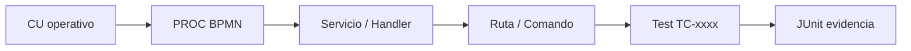

# Matriz de trazabilidad de pruebas — CU → BPMN → Servicio → API → Test

**Versión:** v1.8 | **Fecha:** 2026-06-27 | **CSV:** [Matriz_Trazabilidad_Pruebas.csv](./Matriz_Trazabilidad_Pruebas.csv)  
**IDs tests:** [matriz_maestra_casos.csv](./matriz_maestra_casos.csv)

---

## 1. Objetivo

Proveer trazabilidad **vertical** desde casos de uso operativos hasta evidencia automatizada PHPUnit, alineada a procesos BPMN documentados en `docs/Diagrama_BPMN/`.

## 2. Convenciones

| Columna CSV | Significado |
|-------------|-------------|
| `CU_ID` | Caso de uso operativo (prefijo por dominio) |
| `Proceso_BPMN` | PROC-xxx |
| `Servicio_Clase` | Clase aplicación o test representativo |
| `API_Comando` | Ruta HTTP, artisan o artefacto |
| `Tests_ID` | IDs TC-xxxx en matriz maestra |
| `Documento_Prueba` | Ficha estratégica de testing |

## 3. Trazabilidad Control Plane

| CU | Caso de uso | BPMN | Servicio | API / Comando | Tests |
|----|-------------|------|----------|---------------|-------|
| CU-CP-01 | Gestionar empresas tenant | PROC-007 | `TenantOperatorsScopedTest` | `GET /control/companies` | TC-0031;TC-0032 |
| CU-CP-02 | Provisionar instancia | PROC-008 | `ProvisionNewTenantInputMapper` | `POST /control/companies` | TC-0198;TC-0199;TC-0026 |
| CU-CP-03 | Simular desde CP | PROC-020 | `CompanySimulationAutomationTest` | `POST .../simulate` | TC-0015;TC-0018 |
| CU-CP-04 | Espejar catálogo CP→Silo | PROC-034 | `TenantModuleCatalogService` | `PUT .../catalog` | TC-0028;TC-0029 |
| CU-CP-05 | Gestionar incidentes | PROC-015 | `ClientSupportReportTest` | `POST /portal/support-report` | TC-0012;TC-0013;TC-0014 |
| CU-PRT-01 | Acceder portal tenant | PROC-019 | `TenantPortalRoutingTest` | `GET /t/{slug}/dashboard` | TC-0037;TC-0041 |

Documento: [feature_control_plane.md](./feature_control_plane.md)  
BPMN: [16_Proceso_Gestion_Empresas_Control_Plane.md](../Diagrama_BPMN/16_Proceso_Gestion_Empresas_Control_Plane.md), [34_Proceso_Espejo_Catalogo_CP_Silo.md](../Diagrama_BPMN/34_Proceso_Espejo_Catalogo_CP_Silo.md)

## 4. Trazabilidad Dashboard y Observabilidad

| CU | Caso de uso | BPMN | Servicio | API / Comando | Tests |
|----|-------------|------|----------|---------------|-------|
| CU-DASH-01 | Consultar feed dashboard | PROC-004 | `DashboardEndpointsTest` | `GET /api/dashboard/events/feed` | TC-0054;TC-0047 |
| CU-DASH-02 | Activar módulos LIVE | PROC-004 | `ModuleActivationGateServiceTest` | `PATCH .../middleware-events` | TC-0215;TC-0216 |
| CU-OBS-01 | Exportar Prometheus | PROC-013 | `PrometheusMetricsEndpointTest` | `GET /metrics` | TC-0117;TC-0118 |
| CU-OBS-02 | Evaluar alertas | PROC-013 | `EvaluateMonitoringAlertsCommandTest` | `platform:monitoring-evaluate` | TC-0113;TC-0114 |

Documento: [feature_dashboard_observabilidad.md](./feature_dashboard_observabilidad.md)  
BPMN: [13_Proceso_Observabilidad_Dashboard.md](../Diagrama_BPMN/13_Proceso_Observabilidad_Dashboard.md), [22_Proceso_Monitoreo_Alertas_Plataforma.md](../Diagrama_BPMN/22_Proceso_Monitoreo_Alertas_Plataforma.md)

## 5. Trazabilidad Seguridad

| CU | Caso de uso | BPMN | Servicio | API / Comando | Tests |
|----|-------------|------|----------|---------------|-------|
| CU-SEC-01 | Login operador web | PROC-005 | `OperatorLoginTest` | `POST /login` | TC-0068;**TC-0070** |
| CU-SEC-02 | Autorización por rol | PROC-005 | `RoleBasedAuthorizationTest` | `POST /api/middleware/sync-config` | TC-0076;TC-0078 |
| CU-SEC-03 | Auth API integradores | PROC-006 | `PlatformApiAuthenticationTest` | `POST .../events/publish` | TC-0133;TC-0135 |

Documento: [feature_seguridad_identidad.md](./feature_seguridad_identidad.md)  
BPMN: [14_Proceso_Autenticacion_Operadores_Web.md](../Diagrama_BPMN/14_Proceso_Autenticacion_Operadores_Web.md), [15_Proceso_Autenticacion_API_Integradores.md](../Diagrama_BPMN/15_Proceso_Autenticacion_API_Integradores.md)

> **TC-0070 FALLÓ** — trazabilidad CU-SEC-01 incompleta hasta corrección.

## 6. Trazabilidad Integración

| CU | Caso de uso | BPMN | Servicio | API / Comando | Tests |
|----|-------------|------|----------|---------------|-------|
| CU-INT-01 | Recibir webhook firmado | PROC-011 | `WebhookIngressTest` | `POST /api/integrations/webhooks/{channel}` | TC-0085;TC-0086 |
| CU-INT-02 | Administrar canales | PROC-012 | `IntegrationAdminApiTest` | `POST /api/integrations/channels` | TC-0083 |

Documento: [feature_integracion_webhooks.md](./feature_integracion_webhooks.md)  
BPMN: [20_Proceso_Ingress_Webhooks_Integraciones.md](../Diagrama_BPMN/20_Proceso_Ingress_Webhooks_Integraciones.md), [21_Proceso_Gestion_Canales_Integraciones.md](../Diagrama_BPMN/21_Proceso_Gestion_Canales_Integraciones.md)

## 7. Trazabilidad Plataforma / Simulación

| CU | Caso de uso | BPMN | Servicio | API / Comando | Tests |
|----|-------------|------|----------|---------------|-------|
| CU-PLT-01 | Simular cliente CLI | PROC-009 | `SimulateClientCommandTest` | `platform:simulate-client` | TC-0128;TC-0129 |
| CU-PLT-02 | Gestionar flota local | PROC-009 | `LocalFleetRegistryTest` | `fleet-registry.json` | TC-0324;TC-0349 |
| CU-OPS-01 | Purgar retención | PROC-014 | `PurgePlatformRetentionTest` | `platform:purge-retention` | TC-0121;TC-0122 |

Documento: [feature_plataforma_fleet_simulacion.md](./feature_plataforma_fleet_simulacion.md)

## 8. Trazabilidad Middleware (bus)

| CU | Caso de uso | BPMN | Servicio | API / Comando | Tests |
|----|-------------|------|----------|---------------|-------|
| CU-BUS-01 | Publicar evento | PROC-001 | `MiddlewareControlApiTest` | `POST .../events/publish` | TC-0035+ |
| CU-BUS-02 | Sync registry | PROC-002 | `MiddlewarePipelineEndToEndTest` | `POST .../sync-config` | TC-0037 |
| CU-BUS-03 | Consultar cola | PROC-003 | `MiddlewareControlApiTest` | `GET .../queue` | TC-0003;TC-0010 |
| CU-QLT-01 | Validar catálogo CI | PROC-016 | `ValidatePlatformCatalogTest` | `platform:validate-catalog` | TC-0332;TC-0335 |

Documentos: [feature_api_middleware_control.md](./feature_api_middleware_control.md), [matrix_validacion_middleware.md](./matrix_validacion_middleware.md)

## 9. Casos diferidos / documentales

| CU | Caso de uso | BPMN | Estado | Tests |
|----|-------------|------|--------|-------|
| CU-MT-01 | Multi-tenant lógico | PROC-018 | Diferido | TC-0321 (flag portal) |
| CU-DOC-01 | Flujo 5 etapas | PROC-017 | Documental | Indirecto vía PROC-001 |

Ver [Funcionalidades_Obsoletas.md](./Funcionalidades_Obsoletas.md).

## 10. Diagrama de trazabilidad (extracto)



## 11. CSV completo

24 filas en [Matriz_Trazabilidad_Pruebas.csv](./Matriz_Trazabilidad_Pruebas.csv) — regenerable vía:

```bash
php docs/testing/tools/generate_strategic_matrices.php
```

## 12. Alineación BPMN externa

Matriz procesos patente: `docs/Patente/matriz_generada/procesos.csv`  
Mapa visual: [Matriz_Trazabilidad_BPMN.md](../Diagrama_BPMN/Matriz_Trazabilidad_BPMN.md)
