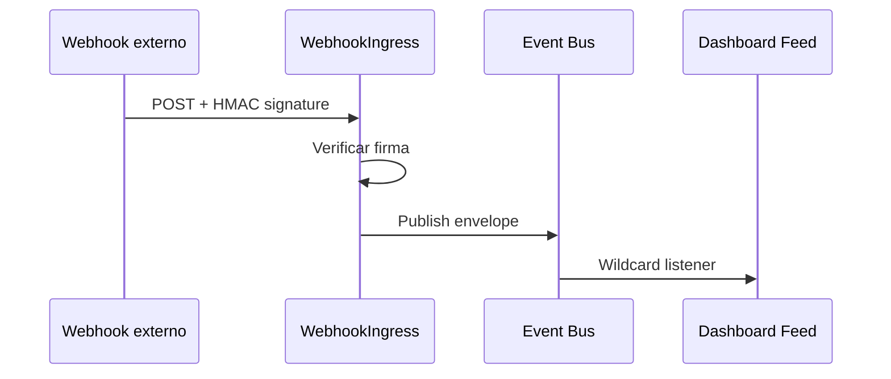

# Feature — Integración Webhooks y Canales

**Versión:** v1.8 | **Fecha:** 2026-06-27 | **CSV:** [feature_integracion_webhooks.csv](./feature_integracion_webhooks.csv)  
**Fuente IDs:** [matriz_maestra_casos.csv](./matriz_maestra_casos.csv)

---

## 1. Objetivo

Documentar pruebas del bounded context **Integration**: ingress de webhooks firmados (transformación a publish PROC-001), administración de canales/integraciones y conectores outbound.

## 2. Alcance BPMN

| Proceso | Documento BPMN | Enfoque |
|---------|----------------|---------|
| PROC-011 | [20_Proceso_Ingress_Webhooks_Integraciones.md](../Diagrama_BPMN/20_Proceso_Ingress_Webhooks_Integraciones.md) | Webhook HMAC → event store |
| PROC-012 | [21_Proceso_Gestion_Canales_Integraciones.md](../Diagrama_BPMN/21_Proceso_Gestion_Canales_Integraciones.md) | CRUD canales e integraciones |

Macroproceso: [08_Macroproceso_Integracion_Omnicanal.md](../Diagrama_BPMN/08_Macroproceso_Integracion_Omnicanal.md).

## 3. Carpetas de tests

| Capa | Ruta |
|------|------|
| Feature | `tests/Feature/Integration/` |
| Unit | `tests/Unit/Integration/` |
| Integration | `tests/Integration/Logging/`, `tests/Integration/Observability/` |

## 4. Clases representativas

### WebhookIngressTest (PROC-011)

| ID | Método | Validación |
|----|--------|------------|
| TC-0085 | `valid_signature_publishes_event_to_event_store` | HMAC válido → publish |
| TC-0086 | `invalid_signature_returns_401` | Firma inválida → 401 |

Servicio: `WebhookIngressProcessor`, `WebhookEventEnvelopeBuilder`, `WebhookSignatureVerifier`.

### IntegrationAdminApiTest (PROC-011/012)

| ID | Método | Validación |
|----|--------|------------|
| TC-0083 | `admin_can_crud_channel_and_integration` | CRUD canal + integración admin API |

### OutboundConnectorTest (PROC-011)

| ID | Método | Validación |
|----|--------|------------|
| TC-0084 | `outbound_dispatch_posts_to_connector_endpoint` | Dispatch HTTP outbound |

### Unit — pipeline adapters

| Clase | IDs | Rol |
|-------|-----|-----|
| `WebhookIngressProcessorTest` | TC-0243 | Procesamiento envelope |
| `WebhookEventEnvelopeBuilderTest` | TC-0246–TC-0248 | Construcción envelope |
| `WebhookSignatureVerifierTest` | TC-0249–TC-0251 | Verificación HMAC |
| `AdapterPipelineTest` | TC-0237 | JSON validate + field map |
| `IntegrationInputValidatorTest` | TC-0244, TC-0245 | Validación admin input |
| `IntegrationHttpPresenterTest` | TC-0238–TC-0240 | Contrato respuestas admin |
| `WebhookIngressHttpPresenterTest` | TC-0241, TC-0242 | Contrato ingress |

### Integración transversal

| Clase | ID | Rol |
|-------|-----|-----|
| `EventAndAuditLogServiceTest` | TC-0145, TC-0146 | Logs evento/audit |
| `TraceLogsPipelineIntegrationTest` | TC-0159 | Trazas post-webhook |
| `InstanceTenantSeedingIntegrationTest` | TC-0160, **TC-0161** | Seeding tenant — **TC-0161 FALLÓ** |

## 5. Flujo validado (PROC-011 → PROC-001)



## 6. Resultado obtenido (2026-06-27)

| Métrica | Valor |
|---------|-------|
| Casos en CSV | 24 |
| Feature WebhookIngress + Admin | 3/3 PASÓ |
| Unit Integration | 15/15 PASÓ |
| Integración seeding | 1/2 PASÓ (**TC-0161 FALLÓ**) |
| PROC-012 cobertura | Parcial — 1 test CRUD admin |

### Fallo relacionado TC-0161

`message_queue_persists_tenant_id_after_seed`: `tenant_id` queda `null` tras seed de instancia. Impacta trazabilidad multi-tenant en cola (PROC-010/011).

## 7. Brechas

- PROC-011 marcado **Parcial** en mapa procesos: faltan tests de rate limiting y replay webhook.
- PROC-012: ampliar escenarios delete/disable canal y rotación secretos.
- Rotación HMAC y webhooks malformados (payload edge cases).

## 8. Ejecución

```bash
php vendor/bin/phpunit tests/Feature/Integration/WebhookIngressTest.php
php vendor/bin/phpunit tests/Feature/Integration/IntegrationAdminApiTest.php
php vendor/bin/phpunit tests/Unit/Integration/
```

## 9. Trazabilidad

CU-INT-01, CU-INT-02 en [Matriz_Trazabilidad_Pruebas.csv](./Matriz_Trazabilidad_Pruebas.csv).
